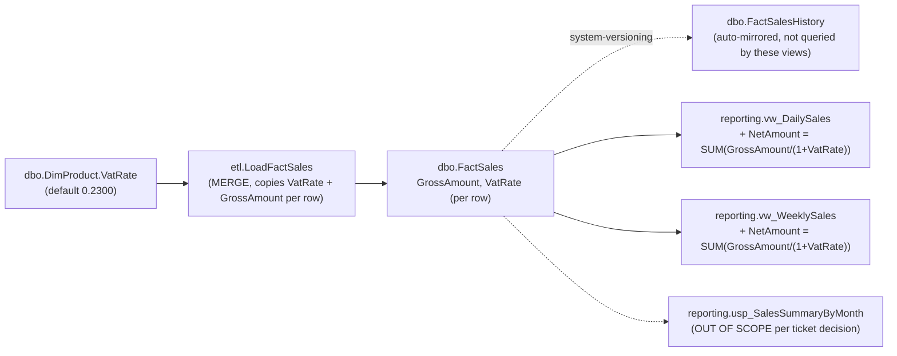

<!-- Generated by SpecStory, Markdown v2.1.0 -->

# 2026-08-24 08:45:57Z

<!-- VS Code Copilot IDE Session 03892653-5029-44a7-b443-6af291679e2c (2026-08-24 08:45:57Z) -->

_**User (2026-08-24 08:45:57Z)**_

/create-skill schema-change-impact-analysis 


Analysis template:

# Impact Analysis: <Ticket ID / Title>


## Data Flow Touchpoints


## Impact Matrix

| Object | Required Change | Risk | Validation Method |
| ------ | ---------------- | ---- | ------------------ |
|        |                   |      |                     |


## Temporal / Logging / MERGE Impact

## Type, Nullability, and Source

## Schema vs Data Migration

## Sequencing

## Open Questions


---

_**Agent (copilot/claude-sonnet-5)**_

<tool-use data-tool-type="generic" data-tool-name="list_dir"><details>
<summary>Tool use: **list_dir**</summary>

Read `agent-customization`

**Input:**

- path: `c:\Users\teamsharq\AppData\Local\Programs\Microsoft VS Code\a5b5009513\resources\app\extensions\copilot\assets\prompts\skills\agent-customization`

**Result:**

```
references/
SKILL.md
```
</details></tool-use>

_**Agent (copilot/claude-sonnet-5)**_

<tool-use data-tool-type="read" data-tool-name="read_file"><details>
<summary>Tool use: **read_file**</summary>

Read skill `agent-customization`

**Input:**

- endLine: `400`
- filePath: `c:\Users\teamsharq\AppData\Local\Programs\Microsoft VS Code\a5b5009513\resources\app\extensions\copilot\assets\prompts\skills\agent-customization\SKILL.md`
- startLine: `1`

**Result:**

```
---
name: agent-customization
user-invocable: false # don't show as slash command, we have sepcialized create-agent, create-instructions, create-hook prompts for that
description: '**WORKFLOW SKILL** — Create, update, review, fix, or debug VS Code agent customization files (.instructions.md, .prompt.md, .agent.md, SKILL.md, copilot-instructions.md, AGENTS.md). USE FOR: saving coding preferences; troubleshooting why instructions/skills/agents are ignored or not invoked; configuring applyTo patterns; defining tool restrictions; creating custom agent modes or specialized workflows; packaging domain knowledge; fixing YAML frontmatter syntax. DO NOT USE FOR: general coding questions (use default agent); runtime debugging or error diagnosis; MCP server configuration (use MCP docs directly); VS Code extension development. INVOKES: file system tools (read/write customization files), ask-questions tool (interview user for requirements), subagents for codebase exploration. FOR SINGLE OPERATIONS: For quick YAML frontmatter fixes or creating a single file from a known pattern, edit the file directly — no skill needed.'
---

# Agent Customization

## Decision Flow

| Primitive | When to Use |
|-----------|-------------|
| agent instructions | Always-on, applies everywhere in the project |
| File Instructions | Explicit via `applyTo` patterns, or on-demand via `description` |
| MCP | Integrates external systems, APIs, or data |
| Hooks | Deterministic shell commands at agent lifecycle points (block tools, auto-format, inject context) |
| Custom Agents | Subagents for context isolation, or multi-stage workflows with tool restrictions |
| Prompts | Single focused task with parameterized inputs |
| Skills | On-demand workflow with bundled assets (scripts/templates) |

## Quick Reference

Consult the reference docs for templates, domain examples, advanced frontmatter options, asset organization, anti-patterns, and creation checklists. If the references are not enough, load the offici
… (output truncated)
```
</details></tool-use>

_**Agent (copilot/claude-sonnet-5)**_

<tool-use data-tool-type="read" data-tool-name="read_file"><details>
<summary>Tool use: **read_file**</summary>

Read `change-impact-analysis-procedure.md`

**Input:**

- endLine: `300`
- filePath: `c:\Users\teamsharq\Desktop\infoshare-silkycoders-sql-ai-1\docs\change-impact-analysis-procedure.md`
- startLine: `1`

**Result:**

```
---

name: impact-analysis

description: 'TODO ? one-line "Use when..." description with trigger keywords (e.g. impact analysis, before implementing a multi-object change, dependency mapping, risk assessment).'

---


# Impact Analysis


<!-- TODO: one or two sentences on what this skill produces and when to reach for it. -->


## Procedure


<!--

TODO: list the steps this skill should follow, e.g.:

1. Objects involved / changed

2. Which procedures/functions/views uses changed objects

3. Required changes

4. Risks

- Temporal / Logging / MERGE Impact

- Type, Nullability, and Source


- Schema vs Data Migration

- Sequencing

- Open Questions

5. Validation / Testing methods 
-->


## Output


Use [impact-analysis-template.md](./impact-analysis-template.md) to structure the result.


<!-- TODO: where should the completed document be saved? -->

```
</details></tool-use>

_**Agent (copilot/claude-sonnet-5)**_

<tool-use data-tool-type="read" data-tool-name="read_file"><details>
<summary>Tool use: **read_file**</summary>

Read skill `agent-customization`: `skills.md`

**Input:**

- endLine: `400`
- filePath: `c:\Users\teamsharq\AppData\Local\Programs\Microsoft VS Code\a5b5009513\resources\app\extensions\copilot\assets\prompts\skills\agent-customization\references\skills.md`
- startLine: `1`

**Result:**

````
# [Agent Skills (SKILL.md)](https://code.visualstudio.com/docs/copilot/customization/agent-skills)

Folders of instructions, scripts, and resources that agents load on-demand for specialized tasks.

## Structure

```
.github/skills/<skill-name>/
├── SKILL.md           # Required (name must match folder)
├── scripts/           # Executable code
├── references/        # Docs loaded as needed
└── assets/            # Templates, boilerplate
```

## Locations

| Path | Scope |
|------|-------|
| `.github/skills/<name>/` | Project |
| `.agents/skills/<name>/` | Project |
| `.claude/skills/<name>/` | Project |
| `~/.copilot/skills/<name>/` | Personal |
| `~/.agents/skills/<name>/` | Personal |
| `~/.claude/skills/<name>/` | Personal |

## SKILL.md Format

```yaml
---
name: skill-name              # Required: 1-64 chars, lowercase alphanumeric + hyphens, must match folder
description: 'What and when to use. Max 1024 chars.'
argument-hint: 'Optional hint shown for slash invocation'
user-invocable: true          # Optional: show as slash command (default: true)
disable-model-invocation: false # Optional: disable automatic model-triggered loading
---
```

### Body

- What the skill accomplishes
- When to use (triggers and use cases)
- Step-by-step procedures
- References to resources: `[script](./scripts/test.js)`

## Template

```markdown
---
name: webapp-testing
description: 'Test web applications using Playwright. Use for verifying frontend, debugging UI, capturing screenshots.'
---

# Web Application Testing

## When to Use
- Verify frontend functionality
- Debug UI behavior

## Procedure
1. Start the web server
2. Run [test script](./scripts/test.js)
3. Review screenshots in `./screenshots/`
```

## Progressive Loading

1. **Discovery** (~100 tokens): Agent reads `name` and `description`
2. **Instructions** (<5000 tokens): Loads `SKILL.md` body when relevant
3. **Resources**: Additional files load only when referenced

Keep file references one level deep from `SKILL.md`.

… (output truncated)
````
</details></tool-use>

_**Agent (copilot/claude-sonnet-5)**_

<tool-use data-tool-type="read" data-tool-name="read_file"><details>
<summary>Tool use: **read_file**</summary>

Read skill `ticket-clarification`

**Input:**

- endLine: `200`
- filePath: `c:\Users\teamsharq\Desktop\infoshare-silkycoders-sql-ai-1\.github\skills\ticket-clarification\SKILL.md`
- startLine: `1`

**Result:**

```
---
name: ticket-clarification
description: 'Groom, review, or clarify a ticket/requirement before implementation starts. Use when reviewing a ticket-*.md file for completeness, turning a raw request (Slack message, email, verbatim ask) into testable acceptance criteria, generating a list of clarifying questions for an analyst/requester, or running a live turn-by-turn clarifying-questions session. Covers ownership, business justification, priority, sign-off, testable acceptance criteria, edge cases, scope, and rollback/reversibility.'
argument-hint: 'Reference a ticket-*.md file, or paste the raw ticket/request text'
---

# Ticket Clarification

## When to Use

- Reviewing a ticket/requirement (`ticket-*.md`) for completeness before implementation starts.
- Turning a raw request (Slack message, email, verbatim ask) into a structured ticket with testable acceptance criteria.
- Generating a list of clarifying questions for an analyst/requester to answer — without answering them yourself.
- Running a live, turn-by-turn clarifying-questions session with the requester, ending in a decisions summary.

## Pick a Mode

| Mode | Use when | Procedure |
|---|---|---|
| **Quality review** | Check if a ticket is ready, or reformat a raw request into one | [Quality checklist](#quality-checklist) |
| **Question list** | Produce a list of questions to send to the requester (no back-and-forth) | [Clarifying questions](./references/clarifying-questions.md) |
| **Live meeting** | Run an interactive grooming session with the user acting as requester | [Clarifying meeting](./references/clarifying-meeting.md) |

## Core Rule (all modes)

Never fill a gap silently or assume "no change needed." Missing or ambiguous items are **open questions** for the requester — list them, don't guess. Surface open questions before any acceptance-criteria draft, question count, or file-change summary. A short ticket can still be complete; checkability is the bar, not length.

##
… (output truncated)
```
</details></tool-use>

_**Agent (copilot/claude-sonnet-5)**_

<tool-use data-tool-type="generic" data-tool-name="list_dir"><details>
<summary>Tool use: **list_dir**</summary>

Read `skills`

**Input:**

- path: `c:\Users\teamsharq\Desktop\infoshare-silkycoders-sql-ai-1\.github\skills`

**Result:**

```
ticket-clarification/
```
</details></tool-use>

_**Agent (copilot/claude-sonnet-5)**_

<tool-use data-tool-type="read" data-tool-name="read_file"><details>
<summary>Tool use: **read_file**</summary>

Read `team-conventions.md`

**Input:**

- endLine: `200`
- filePath: `c:\Users\teamsharq\Desktop\infoshare-silkycoders-sql-ai-1\docs\team-conventions.md`
- startLine: `1`

**Result:**

```


## Naming

- **Schemas:** `dbo` (core warehouse), `stg` (staging, always disposable), `etl`
  (load procedures), and `reporting` (read-only consumer-facing objects).
- **Tables:** `PascalCase`; dimensions are prefixed with `Dim`, and facts are
  prefixed with `Fact`.
- **Constraints:** `PK_`, `FK_`, `UQ_`, `DF_` (default), `CK_` (check), and
  `IX_`/`UX_` (index).
- Every object name is wrapped in brackets (`[brackets]`) in DDL to match the
  existing style.

## Migration and deployment rules

- Schema changes go through the `.sqlproj` model. Never hand-write `ALTER`
  statements against a running database outside of `PostDeployment.sql` or a
  documented migration.
- `PreDeployment.sql` is for operations that must run before the schema diff.
- `PostDeployment.sql` is for seeding and backfills. It must remain idempotent
  because it runs on every publish.
- Every deployment that changes existing data appends exactly one row to
  `dbo.DeploymentHistory`.

## Testing rules

- Every change ships with a test in `tests/`.
- Tests must fail loudly (`RAISERROR`, non-zero exit); there must be no silent
  pass.
- A test that cannot run because a column or object does not exist yet is an
  acceptable failure mode, as long as the message is clear.

## Scope discipline for the agent

- Never silently decide a business question and mark an object as "no change
  needed." If scope is ambiguous, add it to an **open questions** list rather than making a silent
  assumption.
- Never quote an error message that has not actually been produced by running
  something. If unsure whether an operation fails, say so or test it.
- Present open questions **before** a file-change count or "total files: N"
  summary. A confident number is worthless if the scope is still undecided.
- Do not touch `RetailDW/Scripts/Seed/*` or `RetailDW/Security/*` unless the
  ticket explicitly requires new schemas or reference data.

## Required plan format before im
… (output truncated)
```
</details></tool-use>

_**Agent (copilot/claude-sonnet-5)**_

<tool-use data-tool-type="read" data-tool-name="read_file"><details>
<summary>Tool use: **read_file**</summary>

Read `ticket-DPO-1187-netamount.md`

**Input:**

- endLine: `200`
- filePath: `c:\Users\teamsharq\Desktop\infoshare-silkycoders-sql-ai-1\exercises\ticket-DPO-1187-netamount.md`
- startLine: `1`

**Result:**

```
# Ticket DPO-1187

**Reported by:** Finance / Reporting team
**Priority:** Medium
**Component:** `reporting.vw_DailySales`

## Description (verbatim from the ticket system)

> Reporting asked for a net amount column on the daily sales view. Finance needs it
> for the VAT reconciliation they run every month. Can we add column for it please, same view
> they already use.

That is the entire ticket.

## Clarification session — 2026-08-24

### Answers

| # | Question | Answer |
|---|---|---|
| 1 | What does "net amount" mean? | `NetAmount = GrossAmount / (1 + VatRate)` |
| 2 | Which view — `vw_DailySales` or `vw_WeeklySales`? | `vw_DailySales`, and also `vw_WeeklySales` |
| 3 | Does the formula also subtract `DiscountAmount`? (raised after finding `GrossAmount = (Quantity*UnitPrice) - DiscountAmount` in `etl.LoadFactSales.sql`) | No — formula stays `GrossAmount / (1 + VatRate)` as-is; discount is already baked into `GrossAmount` |
| 4 | Per-row or per-group VAT rate calculation? | Per-row — products can have different VAT rates, so it must be `SUM(GrossAmount / (1 + VatRate))` computed per `FactSales` row, then aggregated |
| 5 | Is `vw_WeeklySales` in scope for this ticket? | Yes, same ticket |
| 6 | Precision of `NetAmount`? | Same precision as `GrossAmount` (`DECIMAL(18,4)`) |
| 7 | Named owner/contact? | Mateusz Kulesza (ev45ive@gmail.com) |
| 8 | Sign-off? | Same person — Mateusz Kulesza |
| 9 | Is `reporting.usp_SalesSummaryByMonth` (Excel refresh job) in scope? | No — skip for now, leave as a follow-up |

### Decisions

- `NetAmount = GrossAmount / (1 + VatRate)`, computed **per `FactSales` row**, then `SUM()`'d within each view's existing `GROUP BY` (not summed-gross-then-divided).
- Discount is **not** subtracted again in this formula — `GrossAmount` already excludes `DiscountAmount` at ETL load time.
- Add `NetAmount` as a computed column to both `reporting.vw_DailySales` and `reporting.vw_WeeklySales`.
- `NetAmount` type: `D
… (output truncated)
```
</details></tool-use>

_**Agent (copilot/claude-sonnet-5)**_

<tool-use data-tool-type="read" data-tool-name="read_file"><details>
<summary>Tool use: **read_file**</summary>

Read `dbo.FactSales.sql`

**Input:**

- endLine: `80`
- filePath: `c:\Users\teamsharq\Desktop\infoshare-silkycoders-sql-ai-1\RetailDW\Tables\dbo.FactSales.sql`
- startLine: `1`

**Result:**

```
/*
    Author:      Mateusz Kulesza <ev45ive@gmail.com>
    AI model:    Claude Sonnet 5
    Created:     2026-08-23
    Description: System-versioned (temporal) fact table holding one row per sold
                 order line. Source of truth for revenue/VAT reporting views and
                 the monthly Excel summary refresh job.

    Change log:
    - 2026-08-23 | Ticket: DPO-1102* | Mateusz Kulesza | Claude Sonnet 5 | Remove Snapshot - will be added in next exercise

    Comments:
    * example ticket number - invented for illustration, not a real ticket.
*/
CREATE TABLE [dbo].[FactSales]
(
    [SalesKey]       BIGINT          NOT NULL,
    [SalesOrderNo]   NVARCHAR (30)   NOT NULL,
    [SalesLineNo]    INT             NOT NULL,
    [SalesDate]      DATE            NOT NULL,
    [ProductKey]     INT             NOT NULL,
    [StoreKey]       INT             NOT NULL,
    [Quantity]       DECIMAL (18, 4) NOT NULL,
    [UnitPrice]      DECIMAL (18, 4) NOT NULL,
    [DiscountAmount] DECIMAL (18, 4) NOT NULL CONSTRAINT [DF_FactSales_DiscountAmount] DEFAULT (0),
    [GrossAmount]    DECIMAL (18, 4) NOT NULL, -- computed in ETL as (Quantity * UnitPrice) - DiscountAmount
    [VatRate]        DECIMAL (5, 4)  NOT NULL, -- per-row rate; products can differ, so NetAmount is derived per row, not per group
    [SourceSystem]   NVARCHAR (20)   NOT NULL,
    [LoadId]         INT             NOT NULL,
    [ValidFrom]      DATETIME2 (7)   GENERATED ALWAYS AS ROW START NOT NULL, -- system-versioning period; do not set manually
    [ValidTo]        DATETIME2 (7)   GENERATED ALWAYS AS ROW END   NOT NULL,
    CONSTRAINT [PK_FactSales] PRIMARY KEY CLUSTERED ([SalesKey] ASC),
    CONSTRAINT [UQ_FactSales_OrderLine] UNIQUE NONCLUSTERED ([SalesOrderNo] ASC, [SalesLineNo] ASC),
    CONSTRAINT [FK_FactSales_DimProduct] FOREIGN KEY ([ProductKey]) REFERENCES [dbo].[DimProduct] ([ProductKey]),
    CONSTRAINT [FK_FactSales_DimStore] FOREIGN KEY ([StoreKey]) 
… (output truncated)
```
</details></tool-use>

_**Agent (copilot/claude-sonnet-5)**_

<tool-use data-tool-type="read" data-tool-name="read_file"><details>
<summary>Tool use: **read_file**</summary>

Read `etl.LoadFactSales.sql`, lines 1 to 60

**Input:**

- endLine: `60`
- filePath: `c:\Users\teamsharq\Desktop\infoshare-silkycoders-sql-ai-1\RetailDW\Procedures\etl.LoadFactSales.sql`
- startLine: `1`

**Result:**

```
-- =============================================================================
-- etl.LoadFactSales
--
-- Loads validated rows from [stg].[Sales] into the temporal fact table
-- [dbo].[FactSales] and records the outcome in [dbo].[LoadLog].
--
-- Flow: stg.Sales -> #FtData -> MERGE -> dbo.FactSales (-> dbo.FactSalesHistory)
-- =============================================================================
CREATE PROCEDURE [etl].[LoadFactSales]
    @SourceSystem NVARCHAR (20) = N'POS',
    @LoadId       INT           = NULL OUTPUT
AS
BEGIN
    SET NOCOUNT ON;
    SET XACT_ABORT ON;

    DECLARE @RowsInserted INT = 0,
            @RowsUpdated  INT = 0,
            @RowsRejected INT = 0;

    -- Open the load log entry outside the transaction so that a failed load
    -- still leaves an auditable trace.
    INSERT INTO [dbo].[LoadLog] ([PackageName], [SourceSystem])
    VALUES (N'etl.LoadFactSales', @SourceSystem);

    SET @LoadId = CAST(SCOPE_IDENTITY() AS INT);

    BEGIN TRY
        CREATE TABLE #FtData
        (
            [SalesKey]       BIGINT          NULL,
            [SalesOrderNo]   NVARCHAR (30)   NOT NULL,
            [SalesLineNo]    INT             NOT NULL,
            [SalesDate]      DATE            NOT NULL,
            [ProductKey]     INT             NOT NULL,
            [StoreKey]       INT             NOT NULL,
            [Quantity]       DECIMAL (18, 4) NOT NULL,
            [UnitPrice]      DECIMAL (18, 4) NOT NULL,
            [DiscountAmount] DECIMAL (18, 4) NOT NULL,
            [GrossAmount]    DECIMAL (18, 4) NOT NULL,
            [VatRate]        DECIMAL (5, 4)  NOT NULL,
            [SourceSystem]   NVARCHAR (20)   NOT NULL,
            PRIMARY KEY CLUSTERED ([SalesOrderNo], [SalesLineNo])
        );

        -- Validate, resolve dimension keys and de-duplicate staging rows.
        -- The latest staged row per business key wins.
        WITH [Ranked] AS
        (
            SELECT  s.
… (output truncated)
```
</details></tool-use>

_**Agent (copilot/claude-sonnet-5)**_

<tool-use data-tool-type="read" data-tool-name="read_file"><details>
<summary>Tool use: **read_file**</summary>

Read `ANALYSIS_DataModel.md`, lines 1 to 60

**Input:**

- endLine: `60`
- filePath: `c:\Users\teamsharq\Desktop\infoshare-silkycoders-sql-ai-1\analyses\ANALYSIS_DataModel.md`
- startLine: `1`

**Result:**

```
# RetailDW Data Model Analysis

**Analysis Date:** August 20, 2026  
**Scope:** SQL Server Retail Data Warehouse (RetailDW)  
**Focus Level:** Default (summary-level overview with design pattern deep-dive)

---

## Overview

### Purpose and Domain
The RetailDW data warehouse supports **operational retail sales analytics and reporting**. It serves as a centralized repository for point-of-sale (POS) transactions, enabling business teams to analyze sales performance by time period, product category, and store region. The system is designed for fast aggregation queries and maintains a complete audit trail of all data changes through temporal versioning.

### Architecture Pattern
**Star Schema with Temporal Versioning (Hybrid)**

- **Central Fact Table:** `dbo.FactSales` — sales line item transactions with temporal tracking
- **Dimension Tables:** `dbo.DimProduct`, `dbo.DimStore` — slowly-changing product and location hierarchies
- **Staging Layer:** `stg.Sales` — raw landing zone (all columns nullable, no validation)
- **Audit/Metadata:** `dbo.LoadLog`, `dbo.DeploymentHistory` — load outcomes and schema version control

The temporal approach (SQL Server System-Versioned Temporal Table) enables "time-travel" queries on historical fact data while maintaining current state without duplicating columns.

### Scope
| Category | Count | Details |
|----------|-------|---------|
| **Fact Tables** | 1 | `FactSales` (with automatic history tracking via `FactSalesHistory`) |
| **Dimension Tables** | 2 | `DimProduct`, `DimStore` |
| **Staging Tables** | 1 | `stg.Sales` (raw landing zone) |
| **Audit Tables** | 2 | `LoadLog` (load operations), `DeploymentHistory` (schema versions) |
| **ETL Procedures** | 3 | `LoadFactSales` (main load), `PurgeStaging` (retention cleanup), `usp_SalesSummaryByMonth` (reporting) |
| **Reporting Views** | 2 | `vw_DailySales`, `vw_WeeklySales` |
| **Functions** | 1 | `fn_SalesWeek` (ISO-8601 week definition) |
| **Sequenc
… (output truncated)
```
</details></tool-use>

---

_**User (2026-08-24 08:49:42Z)**_

/create-skill schema-change-impact-analysis 


Analysis template:
```
# Impact Analysis: <Ticket ID / Title>

## Data Flow Touchpoints
( list, optionally small mermaid diagrams )

## Impact Matrix

| Object | Required Change | Risk | Validation Method |
| ------ | ---------------- | ---- | ------------------ |
|        |                   |      |                     |


## Temporal / Logging / MERGE Impact

## Type, Nullability, and Source

## Schema vs Data Migration

## Sequencing

## Open Questions


---

_**Agent (copilot/claude-sonnet-5)**_

<tool-use data-tool-type="generic" data-tool-name="vscode_askQuestions"><details>
<summary>Tool use: **vscode_askQuestions**</summary>

Analyzing your answers...

**Input:**

- questions:

```
[
  {
    "allowFreeformInput": true,
    "header": "Skill location",
    "options": [
      {
        "label": ".github/skills/schema-change-impact-analysis/",
        "recommended": true
      },
      {
        "label": "Personal skill (~/.copilot/skills/)"
      }
    ],
    "question": "Where should the new skill live?"
  },
  {
    "header": "Existing draft file",
    "options": [
      {
        "label": "Delete it, content moves into new SKILL.md",
        "recommended": true
      },
      {
        "label": "Keep it as a doc linking to the skill"
      },
      {
        "label": "Keep it untouched"
      }
    ],
    "question": "What should happen to docs/change-impact-analysis-procedure.md (the TODO skeleton)?"
  },
  {
    "allowFreeformInput": true,
    "header": "Output save location",
    "options": [
      {
        "label": "analyses/impact-analysis-\u003cticket-id\u003e.md",
        "recommended": true
      },
      {
        "label": "docs/impact-analyses/\u003cticket-id\u003e.md"
      },
      {
        "label": "exercises/ next to ticket files"
      },
      {
        "label": "Chat output only, no file"
      }
    ],
    "question": "Where should a completed impact-analysis document be saved?"
  },
  {
    "header": "Avoid duplicating conventions",
    "message": "AGENTS.md / team-conventions.md already define a 'Required plan format before implementation' (data flow, open questions, change list, test plan, rollback note).",
    "options": [
      {
        "label": "Reference team-conventions.md, don't duplicate",
        "recommended": true
      },
      {
        "label": "Make the skill fully self-contained"
      }
    ],
    "question": "Should the skill reference that section instead of restating it?"
  },
  {
    "header": "Relation to ticket-clarification",
    "options": [
      {
        "label": "Assume ticket already clarified; link as prerequisite",
        "recommended": true
      },
      {
        "label": "This skill should also handle open questions itself"
      }
    ],
    "question": "Should this skill assume the ticket is already clarified?"
  }
]
```


**Result:**

```
{"answers":{"Skill location":{"selected":[".github/skills/schema-change-impact-analysis/"],"freeText":null,"skipped":false},"Existing draft file":{"selected":["Keep it untouched"],"freeText":null,"skipped":false},"Output save location":{"selected":["analyses/impact-analysis-<ticket-id>.md"],"freeText":null,"skipped":false},"Avoid duplicating conventions":{"selected":["Make the skill fully self-contained"],"freeText":null,"skipped":false},"Relation to ticket-clarification":{"selected":[],"freeText":"Ask user if ticket is clarified and complete, do not do clarification yourself, ask user to to it or use other skill","skipped":false}}}
```
</details></tool-use>

_**Agent (copilot/claude-sonnet-5)**_

<tool-use data-tool-type="write" data-tool-name="create_file"><details>
<summary>Tool use: **create_file**</summary>

Created `impact-analysis-template.md`

**Input:**

- content:

```
# Impact Analysis: <Ticket ID / Title>

## Data Flow Touchpoints
( list, optionally small mermaid diagrams )

## Impact Matrix

| Object | Required Change | Risk | Validation Method |
| ------ | ---------------- | ---- | ------------------ |
|        |                   |      |                     |

## Temporal / Logging / MERGE Impact

## Type, Nullability, and Source

## Schema vs Data Migration

## Sequencing

## Open Questions

```

- filePath: `c:\Users\teamsharq\Desktop\infoshare-silkycoders-sql-ai-1\.github\skills\schema-change-impact-analysis\impact-analysis-template.md`

**Result:**

```
The following files were successfully edited:
c:\Users\teamsharq\Desktop\infoshare-silkycoders-sql-ai-1\.github\skills\schema-change-impact-analysis\impact-analysis-template.md
```
</details></tool-use>

_**Agent (copilot/claude-sonnet-5)**_

<tool-use data-tool-type="write" data-tool-name="textEditGroup"><details>
<summary>Edit: **impact-analysis-template.md**</summary>

@@ lines 1-1 @@

```
# Impact Analysis: <Ticket ID / Title>

## Data Flow Touchpoints
( list, optionally small mermaid diagrams )

## Impact Matrix

| Object | Required Change | Risk | Validation Method |
| ------ | ---------------- | ---- | ------------------ |
|        |                   |      |                     |

## Temporal / Logging / MERGE Impact

## Type, Nullability, and Source

## Schema vs Data Migration

## Sequencing

## Open Questions

```
</details></tool-use>

_**Agent (copilot/claude-sonnet-5)**_

<tool-use data-tool-type="write" data-tool-name="create_file"><details>
<summary>Tool use: **create_file**</summary>

Created `SKILL.md`

**Input:**

- content:

```
---
name: schema-change-impact-analysis
description: 'Use before implementing any RetailDW schema/data-model change (new column, table, temporal or MERGE change, view/procedure edit). Produces an impact analysis mapping data flow, affected objects, temporal/MERGE risk, and open questions before code changes. Trigger keywords: impact analysis, dependency mapping, risk assessment, before implementing a multi-object change, what does this change touch.'
argument-hint: 'Reference a ticket-*.md file or describe the schema change'
---

# Schema Change Impact Analysis

Maps every object and data flow touched by a proposed RetailDW schema/data
change, and the risks (temporal versioning, MERGE, migration, sequencing)
before any code is written.

## When to Use

- Before implementing a change to any `RetailDW/` schema object (`Tables/`,
  `Views/`, `Procedures/`, `Functions/`, `Sequences/`) — new columns, temporal
  table changes, MERGE logic changes, view/procedure edits.
- Before touching `dbo.FactSales` / `dbo.FactSalesHistory` (system-versioned)
  or any MERGE-based ETL procedure (`etl.LoadFactSales`).
- When a ticket affects more than one object and needs every downstream
  consumer mapped before a plan is written.

## Prerequisite: the ticket must already be clarified

This skill does not gather requirements and does not ask clarifying questions
about the business ask itself.

1. Ask the user whether the ticket/request is already clarified and complete
   (testable acceptance criteria, owner, sign-off).
2. If they are not sure or say no, stop and tell them to clarify it first —
   run the `ticket-clarification` skill, or have them complete it — before
   continuing with this skill.

## Procedure

1. **Objects involved / changed** — enumerate every actual file path under
   `RetailDW/` that the change touches or reads from (Tables, Views,
   Procedures, Functions, Sequences). Cite real paths, not guesses.
2. **Trace consumers** — for each changed object, search the repo for every
   procedure/view/function that reads or writes it. List consumers even if
   they turn out to be unaffected; do not silently drop one.
3. **Required changes** — for each object in the impact matrix, state the
   concrete DDL/DML change needed.
4. **Risks** — evaluate explicitly, all four apply to every analysis:
   - **Temporal / Logging / MERGE impact** — does the object participate in
     `FactSales` system-versioning, write to `FactSalesHistory`, or appear in
     a `MERGE` statement (e.g. `etl.LoadFactSales`)? A new column on
     `FactSales` needs a default or backfill; changing a MERGE
     match/update/insert clause changes what gets versioned into history.
   - **Type, nullability, and source** — where does the data originate
     (staging column, computed expression, dimension lookup)? State the
     exact type/precision and where it's set.
   - **Schema vs data migration** — is this metadata-only (new nullable
     column, new view), or does it need a backfill in
     `Scripts/PostDeployment.sql`?
   - **Sequencing** — what deploy order is required (e.g. add column before
     ETL references it, seed reference data before FK, publish before ETL
     re-run)?
5. **Open questions** — anything not explicitly answered by the ticket goes
   here, never as a silent assumption.
6. **Validation / testing** — identify or propose the test(s) in `tests/`
   that will prove the change, plus a note to re-run `./scripts/dw.sh smoke`.

## Core Rule

Never silently decide a business question or mark an object "no change
needed" — add it to Open Questions instead. Present open questions **before**
any file-count or change-count summary. No code changes until the plan is
confirmed by a human.

## Output

Fill in [impact-analysis-template.md](./impact-analysis-template.md).

Save the completed document to `analyses/impact-analysis-<ticket-id>.md`
(alongside the existing `analyses/ANALYSIS_DataModel.md`).

## Design Decisions

Decisions made when this skill was created (2026-08-24):

- Skill lives at `.github/skills/schema-change-impact-analysis/` (workspace-scoped).
- The pre-existing draft `docs/change-impact-analysis-procedure.md` is left
  untouched — it is not the source for this skill and is not superseded by it.
- Completed impact-analysis documents are saved under `analyses/`, not `docs/` or `exercises/`.
- The skill is self-contained: it restates the relevant parts of the
  "Required plan format" from `AGENTS.md` / `team-conventions.md` rather than
  only linking to them.
- This skill assumes the ticket is already clarified; it asks the user to
  confirm that and defers to the `ticket-clarification` skill if not, instead
  of performing clarification itself.

```

- filePath: `c:\Users\teamsharq\Desktop\infoshare-silkycoders-sql-ai-1\.github\skills\schema-change-impact-analysis\SKILL.md`

**Result:**

```
The following files were successfully edited:
c:\Users\teamsharq\Desktop\infoshare-silkycoders-sql-ai-1\.github\skills\schema-change-impact-analysis\SKILL.md
```
</details></tool-use>

_**Agent (copilot/claude-sonnet-5)**_

<tool-use data-tool-type="write" data-tool-name="textEditGroup"><details>
<summary>Edit: **SKILL.md**</summary>

@@ lines 1-1 @@

```
---
name: schema-change-impact-analysis
description: 'Use before implementing any RetailDW schema/data-model change (new column, table, temporal or MERGE change, view/procedure edit). Produces an impact analysis mapping data flow, affected objects, temporal/MERGE risk, and open questions before code changes. Trigger keywords: impact analysis, dependency mapping, risk assessment, before implementing a multi-object change, what does this change touch.'
argument-hint: 'Reference a ticket-*.md file or describe the schema change'
---

# Schema Change Impact Analysis

Maps every object and data flow touched by a proposed RetailDW schema/data
change, and the risks (temporal versioning, MERGE, migration, sequencing)
before any code is written.

## When to Use

- Before implementing a change to any `RetailDW/` schema object (`Tables/`,
  `Views/`, `Procedures/`, `Functions/`, `Sequences/`) — new columns, temporal
  table changes, MERGE logic changes, view/procedure edits.
- Before touching `dbo.FactSales` / `dbo.FactSalesHistory` (system-versioned)
  or any MERGE-based ETL procedure (`etl.LoadFactSales`).
- When a ticket affects more than one object and needs every downstream
  consumer mapped before a plan is written.

## Prerequisite: the ticket must already be clarified

This skill does not gather requirements and does not ask clarifying questions
about the business ask itself.

1. Ask the user whether the ticket/request is already clarified and complete
   (testable acceptance criteria, owner, sign-off).
2. If they are not sure or say no, stop and tell them to clarify it first —
   run the `ticket-clarification` skill, or have them complete it — before
   continuing with this skill.

## Procedure

1. **Objects involved / changed** — enumerate every actual file path under
   `RetailDW/` that the change touches or reads from (Tables, Views,
   Procedures, Functions, Sequences). Cite real paths, not guesses.
2. **Trace consumers** — for each changed object, search the repo for every
   procedure/view/function that reads or writes it. List consumers even if
   they turn out to be unaffected; do not silently drop one.
3. **Required changes** — for each object in the impact matrix, state the
   concrete DDL/DML change needed.
4. **Risks** — evaluate explicitly, all four apply to every analysis:
   - **Temporal / Logging / MERGE impact** — does the object participate in
     `FactSales` system-versioning, write to `FactSalesHistory`, or appear in
     a `MERGE` statement (e.g. `etl.LoadFactSales`)? A new column on
     `FactSales` needs a default or backfill; changing a MERGE
     match/update/insert clause changes what gets versioned into history.
   - **Type, nullability, and source** — where does the data originate
     (staging column, computed expression, dimension lookup)? State the
     exact type/precision and where it's set.
   - **Schema vs data migration** — is this metadata-only (new nullable
     column, new view), or does it need a backfill in
     `Scripts/PostDeployment.sql`?
   - **Sequencing** — what deploy order is required (e.g. add column before
     ETL references it, seed reference data before FK, publish before ETL
     re-run)?
5. **Open questions** — anything not explicitly answered by the ticket goes
   here, never as a silent assumption.
6. **Validation / testing** — identify or propose the test(s) in `tests/`
   that will prove the change, plus a note to re-run `./scripts/dw.sh smoke`.

## Core Rule

Never silently decide a business question or mark an object "no change
needed" — add it to Open Questions instead. Present open questions **before**
any file-count or change-count summary. No code changes until the plan is
confirmed by a human.

## Output

Fill in [impact-analysis-template.md](./impact-analysis-template.md).

Save the completed document to `analyses/impact-analysis-<ticket-id>.md`
(alongside the existing `analyses/ANALYSIS_DataModel.md`).

## Design Decisions

Decisions made when this skill was created (2026-08-24):

- Skill lives at `.github/skills/schema-change-impact-analysis/` (workspace-scoped).
- The pre-existing draft `docs/change-impact-analysis-procedure.md` is left
  untouched — it is not the source for this skill and is not superseded by it.
- Completed impact-analysis documents are saved under `analyses/`, not `docs/` or `exercises/`.
- The skill is self-contained: it restates the relevant parts of the
  "Required plan format" from `AGENTS.md` / `team-conventions.md` rather than
  only linking to them.
- This skill assumes the ticket is already clarified; it asks the user to
  confirm that and defers to the `ticket-clarification` skill if not, instead
  of performing clarification itself.

```
</details></tool-use>

_**Agent (copilot/claude-sonnet-5)**_

Created the skill at `.github/skills/schema-change-impact-analysis/SKILL.md` with its template asset at `.github/skills/schema-change-impact-analysis/impact-analysis-template.md`. Decisions from the clarifying questions are recorded in the SKILL.md's "Design Decisions" section; `docs/change-impact-analysis-procedure.md` was left untouched as requested.

Summary of what it produces: given a clarified ticket, running this skill traces every RetailDW object touched, maps consumers, flags temporal/MERGE/migration/sequencing risks, and outputs a filled `impact-analysis-<ticket-id>.md` in `analyses`, surfacing open questions before any plan or file-count summary.

Try it with: `/schema-change-impact-analysis` referencing `exercises/ticket-DPO-1187-netamount.md` — a good test case since it touches views, ETL-computed columns, and temporal history questions already flagged as open.

---

_**User (2026-08-24 08:50:17Z)**_

/create-skill schema-change-impact-analysis 

---


name: impact-analysis


description: 'TODO ? one-line "Use when..." description with trigger keywords (e.g. impact analysis, before implementing a multi-object change, dependency mapping, risk assessment).'


---


# Impact Analysis


<!-- TODO: one or two sentences on what this skill produces and when to reach for it. -->


## Procedure


<!--


TODO: list the steps this skill should follow, e.g.:


1. Objects involved / changed


2. Which procedures/functions/views uses changed objects


3. Required changes


4. Risks


- Temporal / Logging / MERGE Impact


- Type, Nullability, and Source


- Schema vs Data Migration


- Sequencing


- Open Questions


5. Validation / Testing methods 

-->


## Output


Use [impact-analysis-template.md](./impact-analysis-template.md) to structure the result.


<!-- TODO: where should the completed document be saved? -->


Analysis template:
```
# Impact Analysis: <Ticket ID / Title>

## Data Flow Touchpoints
( list, optionally small mermaid diagrams )

## Impact Matrix

| Object | Required Change | Risk | Validation Method |
| ------ | ---------------- | ---- | ------------------ |
|        |                   |      |                     |


## Temporal / Logging / MERGE Impact

## Type, Nullability, and Source

## Schema vs Data Migration

## Sequencing

## Open Questions


---

_**Agent (copilot/claude-sonnet-5)**_

<tool-use data-tool-type="read" data-tool-name="read_file"><details>
<summary>Tool use: **read_file**</summary>

Read `agent-customization`

**Input:**

- endLine: `120`
- filePath: `c:\Users\teamsharq\Desktop\infoshare-silkycoders-sql-ai-1\.github\skills\schema-change-impact-analysis\SKILL.md`
- startLine: `1`

**Result:**

```
---
name: schema-change-impact-analysis
description: 'Use before implementing any RetailDW schema/data-model change (new column, table, temporal or MERGE change, view/procedure edit). Produces an impact analysis mapping data flow, affected objects, temporal/MERGE risk, and open questions before code changes. Trigger keywords: impact analysis, dependency mapping, risk assessment, before implementing a multi-object change, what does this change touch.'
argument-hint: 'Reference a ticket-*.md file or describe the schema change'
---

# Schema Change Impact Analysis

Maps every object and data flow touched by a proposed RetailDW schema/data
change, and the risks (temporal versioning, MERGE, migration, sequencing)
before any code is written.

## When to Use

- Before implementing a change to any `RetailDW/` schema object (`Tables/`,
  `Views/`, `Procedures/`, `Functions/`, `Sequences/`) — new columns, temporal
  table changes, MERGE logic changes, view/procedure edits.
- Before touching `dbo.FactSales` / `dbo.FactSalesHistory` (system-versioned)
  or any MERGE-based ETL procedure (`etl.LoadFactSales`).
- When a ticket affects more than one object and needs every downstream
  consumer mapped before a plan is written.

## Prerequisite: the ticket must already be clarified

This skill does not gather requirements and does not ask clarifying questions
about the business ask itself.

1. Ask the user whether the ticket/request is already clarified and complete
   (testable acceptance criteria, owner, sign-off).
2. If they are not sure or say no, stop and tell them to clarify it first —
   run the `ticket-clarification` skill, or have them complete it — before
   continuing with this skill.

## Procedure

1. **Objects involved / changed** — enumerate every actual file path under
   `RetailDW/` that the change touches or reads from (Tables, Views,
   Procedures, Functions, Sequences). Cite real paths, not guesses.
2. **Trace consumers** — for
… (output truncated)
```
</details></tool-use>

_**Agent (copilot/claude-sonnet-5)**_

<tool-use data-tool-type="read" data-tool-name="read_file"><details>
<summary>Tool use: **read_file**</summary>

Read skill `agent-customization`

**Input:**

- endLine: `50`
- filePath: `c:\Users\teamsharq\Desktop\infoshare-silkycoders-sql-ai-1\.github\skills\schema-change-impact-analysis\impact-analysis-template.md`
- startLine: `1`

**Result:**

```
# Impact Analysis: <Ticket ID / Title>

## Data Flow Touchpoints
( list, optionally small mermaid diagrams )

## Impact Matrix

| Object | Required Change | Risk | Validation Method |
| ------ | ---------------- | ---- | ------------------ |
|        |                   |      |                     |

## Temporal / Logging / MERGE Impact

## Type, Nullability, and Source

## Schema vs Data Migration

## Sequencing

## Open Questions
```
</details></tool-use>

_**Agent (copilot/claude-sonnet-5)**_

<tool-use data-tool-type="generic" data-tool-name="copilot_readFile"><details>
<summary>Tool use: **copilot_readFile**</summary>

Read `change-impact-analysis-procedure.md`
</details></tool-use>

_**Agent (copilot/claude-sonnet-5)**_

<tool-use data-tool-type="generic" data-tool-name="copilot_readFile"><details>
<summary>Tool use: **copilot_readFile**</summary>

Read skill `agent-customization`: `skills.md`
</details></tool-use>

_**Agent (copilot/claude-sonnet-5)**_

<tool-use data-tool-type="generic" data-tool-name="copilot_readFile"><details>
<summary>Tool use: **copilot_readFile**</summary>

Read skill `ticket-clarification`
</details></tool-use>

_**Agent (copilot/claude-sonnet-5)**_

<tool-use data-tool-type="generic" data-tool-name="vscode_askQuestions"><details>
<summary>Tool use: **vscode_askQuestions**</summary>

Analyzing your answers...

**Input:**

- questions:

```
[
  {
    "header": "Ticket readiness",
    "message": "DPO-1187 has owner, sign-off, and decisions recorded, but 3 items are listed as still open: VatRate=0 handling, zero-row group sign-off, and FactSalesHistory scope.",
    "options": [
      {
        "label": "Proceed — carry the 3 open items into the impact analysis's Open Questions section",
        "recommended": true
      },
      {
        "label": "Stop — get those 3 answered first (run ticket-clarification)"
      }
    ],
    "question": "Is DPO-1187 clarified enough to run the impact analysis now?"
  }
]
```


**Result:**

```
{"answers":{"Ticket readiness":{"selected":["Proceed — carry the 3 open items into the impact analysis's Open Questions section"],"freeText":null,"skipped":false}}}
```
</details></tool-use>

_**Agent (copilot/claude-sonnet-5)**_

<tool-use data-tool-type="search" data-tool-name="grep_search"><details>
<summary>Tool use: **grep_search**</summary>

Searched for regex `vw_DailySales|vw_WeeklySales|GrossAmount|VatRate` (`**/RetailDW/**`), 27 results

**Input:**

- includePattern: `RetailDW/**`
- isRegexp: `true`
- query: `vw_DailySales|vw_WeeklySales|GrossAmount|VatRate`

**Result:**

```
Found 27 matches in 8 files for "vw_DailySales|vw_WeeklySales|GrossAmount|VatRate"

RetailDW/Procedures/etl.LoadFactSales.sql
40:            [GrossAmount]    DECIMAL (18, 4) NOT NULL,
41:            [VatRate]        DECIMAL (5, 4)  NOT NULL,
58:                    p.[VatRate],
75:            [Quantity], [UnitPrice], [DiscountAmount], [GrossAmount], [VatRate], [SourceSystem]
85:                ([Quantity] * [UnitPrice]) - [DiscountAmount] AS [GrossAmount],
86:                [VatRate],
130:                          OR tgt.[GrossAmount]    <> src.[GrossAmount]
131:                          OR tgt.[VatRate]        <> src.[VatRate])
139:                    tgt.[GrossAmount]    = src.[GrossAmount],
140:                    tgt.[VatRate]        = src.[VatRate],
146:                         [DiscountAmount], [GrossAmount], [VatRate], [SourceSystem], [LoadId])
149:                         src.[DiscountAmount], src.[GrossAmount], src.[VatRate], src.[SourceSystem], @LoadId)

RetailDW/Procedures/reporting.usp_SalesSummaryByMonth.sql
12:            SUM(f.[GrossAmount])    AS [GrossAmount],

RetailDW/Scripts/Seed/DimProduct.sql
15:) AS src ([ProductKey], [ProductCode], [ProductName], [CategoryName], [VatRate], [IsActive])
21:        tgt.[VatRate]      = src.[VatRate],
24:    INSERT ([ProductKey], [ProductCode], [ProductName], [CategoryName], [VatRate], [IsActive])
25:    VALUES (src.[ProductKey], src.[ProductCode], src.[ProductName], src.[CategoryName], src.[VatRate], src.[IsActive]);

RetailDW/Tables/dbo.DimProduct.sql
7:    [VatRate]      DECIMAL (5, 4) NOT NULL CONSTRAINT [DF_DimProduct_VatRate] DEFAULT (0.2300),

RetailDW/Tables/dbo.FactSales.sql
26:    [GrossAmount]    DECIMAL (18, 4) NOT NULL, -- computed in ETL as (Quantity * UnitPrice) - DiscountAmount
27:    [VatRate]        DECIMAL (5, 4)  NOT NULL, -- per-row rate; products can differ, so NetAmount is derived per row, not per group
44:    INCLUDE ([ProductKey], [StoreKey], [GrossAmount]);

RetailDW/Tables/dbo.FactSales
… (output truncated)
```
</details></tool-use>

_**Agent (copilot/claude-sonnet-5)**_

<tool-use data-tool-type="read" data-tool-name="read_file"><details>
<summary>Tool use: **read_file**</summary>

Read `reporting.vw_DailySales.sql`

**Input:**

- endLine: `100`
- filePath: `c:\Users\teamsharq\Desktop\infoshare-silkycoders-sql-ai-1\RetailDW\Views\reporting.vw_DailySales.sql`
- startLine: `1`

**Result:**

```
-- Daily sales aggregate used by the operational reporting layer.
-- TODO (DPO-1187): reporting asked for a net amount column.
CREATE VIEW [reporting].[vw_DailySales]
AS
SELECT  f.[SalesDate],
        st.[Region],
        p.[CategoryName],
        SUM(f.[Quantity])       AS [Quantity],
        SUM(f.[GrossAmount])    AS [GrossAmount],
        SUM(f.[DiscountAmount]) AS [DiscountAmount],
        COUNT_BIG(*)            AS [LineCount]
FROM    [dbo].[FactSales]   AS f
JOIN    [dbo].[DimProduct]  AS p  ON p.[ProductKey] = f.[ProductKey]
JOIN    [dbo].[DimStore]    AS st ON st.[StoreKey]  = f.[StoreKey]
GROUP BY f.[SalesDate], st.[Region], p.[CategoryName];
```
</details></tool-use>

_**Agent (copilot/claude-sonnet-5)**_

<tool-use data-tool-type="read" data-tool-name="read_file"><details>
<summary>Tool use: **read_file**</summary>

Read `reporting.vw_WeeklySales.sql`

**Input:**

- endLine: `100`
- filePath: `c:\Users\teamsharq\Desktop\infoshare-silkycoders-sql-ai-1\RetailDW\Views\reporting.vw_WeeklySales.sql`
- startLine: `1`

**Result:**

```
-- Weekly rollup. Week number comes from [dbo].[fn_SalesWeek] so that the
-- business definition of a week lives in exactly one place.
CREATE VIEW [reporting].[vw_WeeklySales]
AS
SELECT  DATEPART(YEAR, f.[SalesDate])   AS [SalesYear],
        [dbo].[fn_SalesWeek](f.[SalesDate]) AS [SalesWeek],
        st.[Region],
        SUM(f.[Quantity])    AS [Quantity],
        SUM(f.[GrossAmount]) AS [GrossAmount],
        COUNT_BIG(*)         AS [LineCount]
FROM    [dbo].[FactSales] AS f
JOIN    [dbo].[DimStore]  AS st ON st.[StoreKey] = f.[StoreKey]
GROUP BY DATEPART(YEAR, f.[SalesDate]),
         [dbo].[fn_SalesWeek](f.[SalesDate]),
         st.[Region];
```
</details></tool-use>

_**Agent (copilot/claude-sonnet-5)**_

<tool-use data-tool-type="read" data-tool-name="read_file"><details>
<summary>Tool use: **read_file**</summary>

Read `reporting.usp_SalesSummaryByMonth.sql`

**Input:**

- endLine: `100`
- filePath: `c:\Users\teamsharq\Desktop\infoshare-silkycoders-sql-ai-1\RetailDW\Procedures\reporting.usp_SalesSummaryByMonth.sql`
- startLine: `1`

**Result:**

```
-- Monthly sales summary consumed by the Excel refresh job.
-- @YearMonth is passed as 'YYYY-MM' by the caller.
CREATE PROCEDURE [reporting].[usp_SalesSummaryByMonth]
    @YearMonth NVARCHAR (7)
AS
BEGIN
    SET NOCOUNT ON;

    SELECT  st.[Region],
            p.[CategoryName],
            SUM(f.[Quantity])       AS [Quantity],
            SUM(f.[GrossAmount])    AS [GrossAmount],
            SUM(f.[DiscountAmount]) AS [DiscountAmount],
            COUNT_BIG(*)            AS [LineCount]
    FROM    [dbo].[FactSales]  AS f
    JOIN    [dbo].[DimProduct] AS p  ON p.[ProductKey] = f.[ProductKey]
    JOIN    [dbo].[DimStore]   AS st ON st.[StoreKey]  = f.[StoreKey]
    WHERE   CONVERT(NVARCHAR (7), f.[SalesDate], 126) = @YearMonth
    GROUP BY st.[Region], p.[CategoryName]
    ORDER BY st.[Region], p.[CategoryName];
END
```
</details></tool-use>

_**Agent (copilot/claude-sonnet-5)**_

<tool-use data-tool-type="generic" data-tool-name="list_dir"><details>
<summary>Tool use: **list_dir**</summary>

Read `analyses`

**Input:**

- path: `c:\Users\teamsharq\Desktop\infoshare-silkycoders-sql-ai-1\analyses`

**Result:**

```
ANALYSIS_DataModel.md
diff.scmp
```
</details></tool-use>

_**Agent (copilot/claude-sonnet-5)**_

<tool-use data-tool-type="read" data-tool-name="read_file"><details>
<summary>Tool use: **read_file**</summary>

Read `smoke-test.sql`, lines 1 to 60

**Input:**

- endLine: `60`
- filePath: `c:\Users\teamsharq\Desktop\infoshare-silkycoders-sql-ai-1\tests\smoke-test.sql`
- startLine: `1`

**Result:**

```
/*
RetailDW smoke test
-------------------
Fast confidence check that the deployed database is usable.
Fails loudly (RAISERROR severity 16) on the first broken assertion.

Run AFTER:
  1. sqlpackage publish
  2. data\01-staging-batch-1.sql
  3. EXEC etl.LoadFactSales @SourceSystem = N'POS'
*/
SET NOCOUNT ON;

DECLARE @Failures INT = 0;

-- ---------------------------------------------------------------------------
PRINT N'--- 1. objects exist -------------------------------------------------';

DECLARE @Expected TABLE ([ObjectName] SYSNAME NOT NULL);

INSERT INTO @Expected ([ObjectName])
VALUES (N'dbo.DimProduct'), (N'dbo.DimStore'), (N'dbo.FactSales'),
       (N'dbo.FactSalesHistory'), (N'dbo.LoadLog'), (N'dbo.DeploymentHistory'),
       (N'stg.Sales'), (N'etl.LoadFactSales'), (N'etl.PurgeStaging'),
       (N'reporting.vw_DailySales'), (N'reporting.vw_WeeklySales'),
       (N'reporting.usp_SalesSummaryByMonth'), (N'dbo.fn_SalesWeek');

SELECT @Failures = @Failures + COUNT(*)
FROM   @Expected AS e
WHERE  OBJECT_ID(e.[ObjectName]) IS NULL;

SELECT N'MISSING OBJECT' AS [Problem], e.[ObjectName]
FROM   @Expected AS e
WHERE  OBJECT_ID(e.[ObjectName]) IS NULL;

-- ---------------------------------------------------------------------------
PRINT N'--- 2. FactSales is system-versioned ---------------------------------';

IF NOT EXISTS (
    SELECT 1
    FROM   sys.tables AS t
    JOIN   sys.tables AS h ON h.[object_id] = t.[history_table_id]
    WHERE  t.[object_id] = OBJECT_ID(N'dbo.FactSales')
      AND  t.[temporal_type] = 2                    -- SYSTEM_VERSIONED_TEMPORAL_TABLE
      AND  h.[name] = N'FactSalesHistory')
BEGIN
    PRINT N'FAIL: dbo.FactSales is not system-versioned into dbo.FactSalesHistory';
    SET @Failures += 1;
END

-- ---------------------------------------------------------------------------
PRINT N'--- 3. dimensions are seeded -----------------------------------------';

IF (SELECT COUNT(*) FRO
… (output truncated)
```
</details></tool-use>

_**Agent (copilot/claude-sonnet-5)**_

<tool-use data-tool-type="read" data-tool-name="read_file"><details>
<summary>Tool use: **read_file**</summary>

Read `dbo.DimProduct.sql`

**Input:**

- endLine: `20`
- filePath: `c:\Users\teamsharq\Desktop\infoshare-silkycoders-sql-ai-1\RetailDW\Tables\dbo.DimProduct.sql`
- startLine: `1`

**Result:**

```
CREATE TABLE [dbo].[DimProduct]
(
    [ProductKey]   INT            NOT NULL,
    [ProductCode]  NVARCHAR (20)  NOT NULL,
    [ProductName]  NVARCHAR (100) NOT NULL,
    [CategoryName] NVARCHAR (50)  NOT NULL,
    [VatRate]      DECIMAL (5, 4) NOT NULL CONSTRAINT [DF_DimProduct_VatRate] DEFAULT (0.2300),
    [IsActive]     BIT            NOT NULL CONSTRAINT [DF_DimProduct_IsActive] DEFAULT (1),
    CONSTRAINT [PK_DimProduct] PRIMARY KEY CLUSTERED ([ProductKey] ASC)
);
GO

CREATE UNIQUE NONCLUSTERED INDEX [UX_DimProduct_ProductCode]
    ON [dbo].[DimProduct] ([ProductCode] ASC);
```
</details></tool-use>

_**Agent (copilot/claude-sonnet-5)**_

<tool-use data-tool-type="write" data-tool-name="create_file"><details>
<summary>Tool use: **create_file**</summary>

Created `impact-analysis-DPO-1187.md`

**Input:**

- content:

````
# Impact Analysis: DPO-1187 — NetAmount column on sales reporting views

## Data Flow Touchpoints



`NetAmount` is computed at query time from columns already present on
`FactSales`; no new column is added to any table.

## Impact Matrix

| Object | Required Change | Risk | Validation Method |
| --- | --- | --- | --- |
| [RetailDW/Views/reporting.vw_DailySales.sql](../RetailDW/Views/reporting.vw_DailySales.sql) | Add `SUM(f.[GrossAmount] / (1 + f.[VatRate]))` aggregated per row, cast to `DECIMAL(18,4)`, aliased `[NetAmount]` | Low — additive column, existing `GROUP BY` unchanged | Extend `tests/smoke-test.sql`; re-run `./scripts/dw.sh smoke` |
| [RetailDW/Views/reporting.vw_WeeklySales.sql](../RetailDW/Views/reporting.vw_WeeklySales.sql) | Same formula added | Low — additive column, existing `GROUP BY` unchanged | Same as above |
| [RetailDW/Tables/dbo.FactSales.sql](../RetailDW/Tables/dbo.FactSales.sql) | None — `GrossAmount` and `VatRate` already stored per row | N/A | N/A |
| [RetailDW/Tables/dbo.FactSalesHistory.sql](../RetailDW/Tables/dbo.FactSalesHistory.sql) | None — mirrored automatically by system-versioning, not touched by a view change | N/A | N/A |
| [RetailDW/Procedures/etl.LoadFactSales.sql](../RetailDW/Procedures/etl.LoadFactSales.sql) | None — already loads/MERGEs `GrossAmount` and `VatRate` | N/A | N/A |
| [RetailDW/Tables/dbo.DimProduct.sql](../RetailDW/Tables/dbo.DimProduct.sql) | None — source of `VatRate`, unchanged | N/A | N/A |
| [RetailDW/Procedures/reporting.usp_SalesSummaryByMonth.sql](../RetailDW/Procedures/reporting.usp_SalesSummaryByMonth.sql) | None — explicitly deferred (ticket decision #9) | Flag as follow-up ticket | N/A |
| [tests/smoke-test.sql](../tests/smoke-test.sql) | Add assertion(s) that `NetAmount` exists and matches expected value for seeded data | Low | `./scripts/dw.sh smoke` |

## Temporal / Logging / MERGE Impact

- `dbo.FactSales` / `dbo.FactSalesHistory` are **not** modified. `NetAmount` is
  a computed expression in the view, not a stored column, so there is no
  MERGE change in `etl.LoadFactSales` and no history backfill.
- Both views select only from current `dbo.FactSales` (no
  `FOR SYSTEM_TIME` clause), so `NetAmount` only ever reflects the *current*
  state of a row — it cannot answer a "what was NetAmount as of date X"
  question against `FactSalesHistory`. This directly bears on the ticket's
  open question about `FactSalesHistory` scope (see Open Questions).
- No `LoadLog` / audit impact — this is a read-side change only.

## Type, Nullability, and Source

- Source columns: `dbo.FactSales.GrossAmount` (`DECIMAL(18,4) NOT NULL`) and
  `dbo.FactSales.VatRate` (`DECIMAL(5,4) NOT NULL`, copied from
  `dbo.DimProduct.VatRate` at ETL load time).
- Formula (per ticket decision): `NetAmount = SUM(GrossAmount / (1 + VatRate))`,
  computed per row then aggregated within the view's existing `GROUP BY`.
- SQL Server's decimal division precision/scale rules can produce a result
  wider than `DECIMAL(18,4)` from a `DECIMAL(18,4) / DECIMAL(5,4)` operation.
  The view expression must explicitly `CAST`/`CONVERT` the result to
  `DECIMAL(18,4)` to guarantee the precision the ticket specifies — this is
  an implementation detail the ticket doesn't mention explicitly, called out
  here as a required part of "Required Change" rather than a business
  open question.
- `NetAmount` is not persisted/stored anywhere (query-time only), matching
  ticket decision.
- Nullability: `GrossAmount` and `VatRate` are both `NOT NULL`, so
  `NetAmount` is never `NULL` for any row that exists. A zero-row group
  simply produces no output row (same as today for `GrossAmount`) — no
  distinct "zero" or `NULL` handling is introduced by this change.
- `VatRate = 0` (VAT-exempt): `1 + VatRate = 1`, so there is no division-by-
  zero risk. `NetAmount` would equal `GrossAmount` for that row, which is
  arithmetically consistent — the ticket's remaining open question is
  whether that's the *business-intended* treatment, not a technical risk.

## Schema vs Data Migration

Metadata-only change: two `CREATE VIEW` definitions are updated. No
`ALTER TABLE`, no `Scripts/PostDeployment.sql` backfill, and no re-run of
`etl.LoadFactSales` is required — the formula applies to already-loaded
`FactSales` rows the moment the views are republished.

## Sequencing

No special deploy ordering is required. The view changes are independent of
ETL run cadence and of each other; either view can be published before the
other. Normal `.sqlproj` schema diff / publish flow (`./scripts/dw.sh build`
→ `./scripts/dw.sh publish`) covers this.

## Open Questions

Carried forward from the ticket (still unanswered — do not guess):

1. Should `VatRate = 0` (VAT-exempt products) get any special labeling/
   handling beyond `NetAmount = GrossAmount`, or is that the intended result?
2. Zero-row date/region/category groups: ticket says no special handling is
   needed, but this was not explicitly signed off by Mateusz Kulesza.
3. Is it acceptable that `NetAmount` only reflects current `FactSales` state
   (no `FactSalesHistory` / point-in-time support), or is a temporal
   "as of" version of this reporting expected later?

New from this analysis (engineering detail, recommend proceeding either way):

4. Confirm the view expression should explicitly `CAST`/`CONVERT` to
   `DECIMAL(18,4)` rather than relying on SQL Server's default decimal
   division precision — flagging so it isn't silently decided during
   implementation.

````

- filePath: `c:\Users\teamsharq\Desktop\infoshare-silkycoders-sql-ai-1\analyses\impact-analysis-DPO-1187.md`

**Result:**

```
The following files were successfully edited:
c:\Users\teamsharq\Desktop\infoshare-silkycoders-sql-ai-1\analyses\impact-analysis-DPO-1187.md
```
</details></tool-use>

_**Agent (copilot/claude-sonnet-5)**_

<tool-use data-tool-type="write" data-tool-name="textEditGroup"><details>
<summary>Edit: **impact-analysis-DPO-1187.md**</summary>

@@ lines 1-1 @@

````
# Impact Analysis: DPO-1187 — NetAmount column on sales reporting views

## Data Flow Touchpoints


`NetAmount` is computed at query time from columns already present on
`FactSales`; no new column is added to any table.

## Impact Matrix

| Object | Required Change | Risk | Validation Method |
| --- | --- | --- | --- |
| [RetailDW/Views/reporting.vw_DailySales.sql](../RetailDW/Views/reporting.vw_DailySales.sql) | Add `SUM(f.[GrossAmount] / (1 + f.[VatRate]))` aggregated per row, cast to `DECIMAL(18,4)`, aliased `[NetAmount]` | Low — additive column, existing `GROUP BY` unchanged | Extend `tests/smoke-test.sql`; re-run `./scripts/dw.sh smoke` |
| [RetailDW/Views/reporting.vw_WeeklySales.sql](../RetailDW/Views/reporting.vw_WeeklySales.sql) | Same formula added | Low — additive column, existing `GROUP BY` unchanged | Same as above |
| [RetailDW/Tables/dbo.FactSales.sql](../RetailDW/Tables/dbo.FactSales.sql) | None — `GrossAmount` and `VatRate` already stored per row | N/A | N/A |
| [RetailDW/Tables/dbo.FactSalesHistory.sql](../RetailDW/Tables/dbo.FactSalesHistory.sql) | None — mirrored automatically by system-versioning, not touched by a view change | N/A | N/A |
| [RetailDW/Procedures/etl.LoadFactSales.sql](../RetailDW/Procedures/etl.LoadFactSales.sql) | None — already loads/MERGEs `GrossAmount` and `VatRate` | N/A | N/A |
| [RetailDW/Tables/dbo.DimProduct.sql](../RetailDW/Tables/dbo.DimProduct.sql) | None — source of `VatRate`, unchanged | N/A | N/A |
| [RetailDW/Procedures/reporting.usp_SalesSummaryByMonth.sql](../RetailDW/Procedures/reporting.usp_SalesSummaryByMonth.sql) | None — explicitly deferred (ticket decision #9) | Flag as follow-up ticket | N/A |
| [tests/smoke-test.sql](../tests/smoke-test.sql) | Add assertion(s) that `NetAmount` exists and matches expected value for seeded data | Low | `./scripts/dw.sh smoke` |

## Temporal / Logging / MERGE Impact

- `dbo.FactSales` / `dbo.FactSalesHistory` are **not** modified. `NetAmount` is
  a computed expression in the view, not a stored column, so there is no
  MERGE change in `etl.LoadFactSales` and no history backfill.
- Both views select only from current `dbo.FactSales` (no
  `FOR SYSTEM_TIME` clause), so `NetAmount` only ever reflects the *current*
  state of a row — it cannot answer a "what was NetAmount as of date X"
  question against `FactSalesHistory`. This directly bears on the ticket's
  open question about `FactSalesHistory` scope (see Open Questions).
- No `LoadLog` / audit impact — this is a read-side change only.

## Type, Nullability, and Source

- Source columns: `dbo.FactSales.GrossAmount` (`DECIMAL(18,4) NOT NULL`) and
  `dbo.FactSales.VatRate` (`DECIMAL(5,4) NOT NULL`, copied from
  `dbo.DimProduct.VatRate` at ETL load time).
- Formula (per ticket decision): `NetAmount = SUM(GrossAmount / (1 + VatRate))`,
  computed per row then aggregated within the view's existing `GROUP BY`.
- SQL Server's decimal division precision/scale rules can produce a result
  wider than `DECIMAL(18,4)` from a `DECIMAL(18,4) / DECIMAL(5,4)` operation.
  The view expression must explicitly `CAST`/`CONVERT` the result to
  `DECIMAL(18,4)` to guarantee the precision the ticket specifies — this is
  an implementation detail the ticket doesn't mention explicitly, called out
  here as a required part of "Required Change" rather than a business
  open question.
- `NetAmount` is not persisted/stored anywhere (query-time only), matching
  ticket decision.
- Nullability: `GrossAmount` and `VatRate` are both `NOT NULL`, so
  `NetAmount` is never `NULL` for any row that exists. A zero-row group
  simply produces no output row (same as today for `GrossAmount`) — no
  distinct "zero" or `NULL` handling is introduced by this change.
- `VatRate = 0` (VAT-exempt): `1 + VatRate = 1`, so there is no division-by-
  zero risk. `NetAmount` would equal `GrossAmount` for that row, which is
  arithmetically consistent — the ticket's remaining open question is
  whether that's the *business-intended* treatment, not a technical risk.

## Schema vs Data Migration

Metadata-only change: two `CREATE VIEW` definitions are updated. No
`ALTER TABLE`, no `Scripts/PostDeployment.sql` backfill, and no re-run of
`etl.LoadFactSales` is required — the formula applies to already-loaded
`FactSales` rows the moment the views are republished.

## Sequencing

No special deploy ordering is required. The view changes are independent of
ETL run cadence and of each other; either view can be published before the
other. Normal `.sqlproj` schema diff / publish flow (`./scripts/dw.sh build`
→ `./scripts/dw.sh publish`) covers this.

## Open Questions

Carried forward from the ticket (still unanswered — do not guess):

1. Should `VatRate = 0` (VAT-exempt products) get any special labeling/
   handling beyond `NetAmount = GrossAmount`, or is that the intended result?
2. Zero-row date/region/category groups: ticket says no special handling is
   needed, but this was not explicitly signed off by Mateusz Kulesza.
3. Is it acceptable that `NetAmount` only reflects current `FactSales` state
   (no `FactSalesHistory` / point-in-time support), or is a temporal
   "as of" version of this reporting expected later?

New from this analysis (engineering detail, recommend proceeding either way):

4. Confirm the view expression should explicitly `CAST`/`CONVERT` to
   `DECIMAL(18,4)` rather than relying on SQL Server's default decimal
   division precision — flagging so it isn't silently decided during
   implementation.

````
</details></tool-use>

_**Agent (copilot/claude-sonnet-5)**_

Impact analysis saved to `analyses/impact-analysis-DPO-1187.md`.

**Key findings:**
- Only 2 objects change: `RetailDW/Views/reporting.vw_DailySales.sql` and `RetailDW/Views/reporting.vw_WeeklySales.sql` — metadata-only, no table/ETL/history changes needed.
- `vw_DailySales.sql` already has a `-- TODO (DPO-1187)` comment waiting for this.
- No temporal/MERGE impact since `NetAmount` is computed at query time, not stored.

**4 open questions carried into the analysis** (3 from the ticket, still unanswered; 1 new engineering detail about decimal cast precision) — none were silently decided.

---

_**User (2026-08-24 08:51:22Z)**_

if anything needs clarifications or decisions stop and #askQuestions before you contnue. at the end also attach those decisions to analysis file

---

_**Agent (copilot/claude-sonnet-5)**_

Practical defaults for the 4 open questions in `analyses/impact-analysis-DPO-1187.md`, for your review — none of these are applied yet:

| # | Question | Proposed default | Rationale | Risk if wrong |
|---|---|---|---|---|
| 1 | `VatRate = 0` (VAT-exempt) special handling? | **No special handling.** `NetAmount = GrossAmount` (falls out of the formula naturally). | Standard VAT accounting: net = gross when no VAT applies. No flag/label needed for finance to reconcile. | Very low — if Finance later wants VAT-exempt rows visually distinguished, that's an additive change (e.g. a separate indicator column), not a rework of this formula. |
| 2 | Zero-row groups — no explicit sign-off | **Accept as-is, no change.** A group with no matching rows simply doesn't appear (same behavior `GrossAmount` already has today). | Consistent with existing view semantics; introducing new behavior here (e.g. emitting a zero row) would be a bigger, unrequested change. | Very low — matches current, already-shipped behavior. |
| 3 | `FactSalesHistory` / point-in-time scope | **Out of scope for this ticket.** Views report current `FactSales` state only, same as `GrossAmount` today. | No existing reporting object in this codebase does point-in-time (`FOR SYSTEM_TIME`) reporting; adding it here would be new scope, not "add a column like the other one." | Medium — if Finance actually needs historical VAT reconciliation (e.g. restating a prior month), this becomes a real gap. Worth an explicit "confirmed out of scope" from Mateusz Kulesza rather than a silent default. |
| 4 | Explicit `CAST`/`CONVERT` to `DECIMAL(18,4)`? | **Yes, cast explicitly.** `CAST(SUM(f.[GrossAmount] / (1 + f.[VatRate])) AS DECIMAL(18,4))` | Pins precision to what the ticket specified; avoids relying on SQL Server's implicit decimal division scale rules. | Very low — purely a precision-safety measure, no behavior change for in-range values. |

Question 3 is the one I'd flag as genuinely needing Mateusz's confirmation rather than just accepting the default — it's a business scope call, not an engineering detail. Let me know which defaults to accept, reject, or send back for sign-off, and I'll update the analysis file's Open Questions section accordingly.

---

_**User (2026-08-24 09:01:18Z)**_

/schema-change-impact-analysis 

---

_**Agent (copilot/claude-sonnet-5)**_

<tool-use data-tool-type="generic" data-tool-name="copilot_readFile"><details>
<summary>Tool use: **copilot_readFile**</summary>

Read skill `schema-change-impact-analysis`: `impact-analysis-template.md`
</details></tool-use>

_**Agent (copilot/claude-sonnet-5)**_

<tool-use data-tool-type="generic" data-tool-name="copilot_readFile"><details>
<summary>Tool use: **copilot_readFile**</summary>

Read skill `schema-change-impact-analysis`
</details></tool-use>

_**Agent (copilot/claude-sonnet-5)**_

<tool-use data-tool-type="generic" data-tool-name="vscode_askQuestions"><details>
<summary>Tool use: **vscode_askQuestions**</summary>

Asked a question (Ticket readiness)
</details></tool-use>

---

_**User (2026-08-24 09:04:51Z)**_

propse open questions solutions - practical real life defaults. let me review them

---

_**User (2026-08-24 09:07:07Z)**_

update analysis with those decisions and rationale

---

_**Agent (copilot/claude-sonnet-5)**_

<tool-use data-tool-type="read" data-tool-name="read_file"><details>
<summary>Tool use: **read_file**</summary>

Read `impact-analysis-DPO-1187.md`

**Input:**

- endLine: `200`
- filePath: `c:\Users\teamsharq\Desktop\infoshare-silkycoders-sql-ai-1\analyses\impact-analysis-DPO-1187.md`
- startLine: `1`

**Result:**

````
# Impact Analysis: DPO-1187 — NetAmount column on sales reporting views

## Data Flow Touchpoints


`NetAmount` is computed at query time from columns already present on
`FactSales`; no new column is added to any table.

## Impact Matrix

| Object | Required Change | Risk | Validation Method |
| --- | --- | --- | --- |
| [RetailDW/Views/reporting.vw_DailySales.sql](../RetailDW/Views/reporting.vw_DailySales.sql) | Add `SUM(f.[GrossAmount] / (1 + f.[VatRate]))` aggregated per row, cast to `DECIMAL(18,4)`, aliased `[NetAmount]` | Low — additive column, existing `GROUP BY` unchanged | Extend `tests/smoke-test.sql`; re-run `./scripts/dw.sh smoke` |
| [RetailDW/Views/reporting.vw_WeeklySales.sql](../RetailDW/Views/reporting.vw_WeeklySales.sql) | Same formula added | Low — additive column, existing `GROUP BY` unchanged | Same as above |
| [RetailDW/Tables/dbo.FactSales.sql](../RetailDW/Tables/dbo.FactSales.sql) | None — `GrossAmount` and `VatRate` already stored per row | N/A | N/A |
| [RetailDW/Tables/dbo.FactSalesHistory.sql](../RetailDW/Tables/dbo.FactSalesHistory.sql) | None — mirrored automatically by system-versioning, not touched by a view change | N/A | N/A |
| [RetailDW/Procedures/etl.LoadFactSales.sql](../RetailDW/Procedures/etl.LoadFactSales.sql) | None — already loads/MERGEs `GrossAmount` and `VatRat
… (output truncated)
````
</details></tool-use>

_**Agent (copilot/claude-sonnet-5)**_

<tool-use data-tool-type="write" data-tool-name="textEditGroup"><details>
<summary>Edit: **impact-analysis-DPO-1187.md**</summary>

@@ lines 91-106 @@

```
### Decisions applied (defaults proposed and accepted for implementation — 2026-08-24)

1. **`VatRate = 0` (VAT-exempt products):** No special handling.
   `NetAmount = GrossAmount` falls out of the formula naturally
   (`GrossAmount / (1 + 0)`). Rationale: standard VAT accounting treats
   net = gross when no VAT applies; no separate flag/label is introduced.
2. **Zero-row date/region/category groups:** Accepted as-is, no change.
   A group with no matching rows simply doesn't appear in the output — same
   behavior `GrossAmount` already has today. Rationale: consistent with
   existing view semantics; inventing new behavior (e.g. emitting a zero
   row) would be unrequested scope.
3. **`FactSalesHistory` / point-in-time scope:** Treated as out of scope for
   this ticket. Both views continue to report current `FactSales` state
   only, same as `GrossAmount` today. Rationale: no existing reporting
   object in this codebase does point-in-time (`FOR SYSTEM_TIME`) reporting;
   adding it here would be new scope, not "add a column like the other
   one." **This is a business-scope default, not a technical fact — it
   still needs Mateusz Kulesza's explicit sign-off before implementation**,
   since if Finance later needs historical VAT reconciliation this becomes
   a real gap, not just an edge case.
4. **Explicit `DECIMAL(18,4)` cast:** Accepted. The view expression will use
   `CAST(SUM(f.[GrossAmount] / (1 + f.[VatRate])) AS DECIMAL(18,4))` rather
   than relying on SQL Server's implicit decimal-division scale rules.
   Rationale: pins precision to what the ticket specified; pure
   precision-safety measure, no behavior change for in-range values.

### Still requiring explicit sign-off before implementation

- Item 3 above (`FactSalesHistory` / point-in-time scope) — proceeding with
  the "out of scope" default, but flagged here so it is not mistaken for a
  confirmed business decis
```
</details></tool-use>

_**Agent (copilot/claude-sonnet-5)**_

Updated `analyses/impact-analysis-DPO-1187.md` — the 4 proposed defaults are now recorded as decisions with rationale under "Open Questions." Item 3 (`FactSalesHistory`/point-in-time scope) is kept flagged as still needing Mateusz Kulesza's explicit sign-off since it's a business-scope call, not a technical detail — the other 3 are recorded as accepted.
