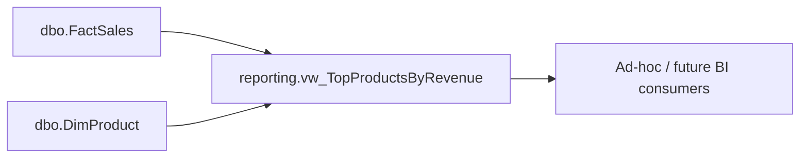

<!-- Generated by SpecStory, Markdown v2.1.0 -->

# 2026-08-24 11:44:15Z

<!-- VS Code Copilot IDE Session f5f8dd54-1456-4760-8054-a278df93c134 (2026-08-24 11:44:15Z) -->

_**User (2026-08-24 11:44:15Z)**_

- List the top 10 best-selling products by revenue.

---

_**Agent (copilot/claude-sonnet-5)**_

<tool-use data-tool-type="read" data-tool-name="read_file"><details>
<summary>Tool use: **read_file**</summary>

Read `dbo.FactSales.sql`

**Input:**

- endLine: `100`
- filePath: `c:\Users\teamsharq\Desktop\infoshare-silkycoders-sql-ai-1\RetailDW\Tables\dbo.FactSales.sql`
- startLine: `1`

**Result:**

```
/*
    Author:      Mateusz Kulesza <ev45ive@gmail.com>
    AI model:    Claude Sonnet 5
    Created:     2026-08-23
    Description: System-versioned (temporal) fact table holding one row per sold
                 order line. Source of truth for revenue/VAT reporting views and
                 the monthly Excel summary refresh job.

    Change log:
    - 2026-08-23 | Ticket: DPO-1102* | Mateusz Kulesza | Claude Sonnet 5 | Remove Snapshot - will be added in next exercise

    Comments:
    * example ticket number - invented for illustration, not a real ticket.
*/
CREATE TABLE [dbo].[FactSales]
(
    [SalesKey]       BIGINT          NOT NULL,
    [SalesOrderNo]   NVARCHAR (30)   NOT NULL,
    [SalesLineNo]    INT             NOT NULL,
    [SalesDate]      DATE            NOT NULL,
    [ProductKey]     INT             NOT NULL,
    [StoreKey]       INT             NOT NULL,
    [Quantity]       DECIMAL (18, 4) NOT NULL,
    [UnitPrice]      DECIMAL (18, 4) NOT NULL,
    [DiscountAmount] DECIMAL (18, 4) NOT NULL CONSTRAINT [DF_FactSales_DiscountAmount] DEFAULT (0),
    [GrossAmount]    DECIMAL (18, 4) NOT NULL, -- computed in ETL as (Quantity * UnitPrice) - DiscountAmount
    [VatRate]        DECIMAL (5, 4)  NOT NULL, -- per-row rate; products can differ, so NetAmount is derived per row, not per group
    [SourceSystem]   NVARCHAR (20)   NOT NULL,
    [LoadId]         INT             NOT NULL,
    [ValidFrom]      DATETIME2 (7)   GENERATED ALWAYS AS ROW START NOT NULL, -- system-versioning period; do not set manually
    [ValidTo]        DATETIME2 (7)   GENERATED ALWAYS AS ROW END   NOT NULL,
    CONSTRAINT [PK_FactSales] PRIMARY KEY CLUSTERED ([SalesKey] ASC),
    CONSTRAINT [UQ_FactSales_OrderLine] UNIQUE NONCLUSTERED ([SalesOrderNo] ASC, [SalesLineNo] ASC),
    CONSTRAINT [FK_FactSales_DimProduct] FOREIGN KEY ([ProductKey]) REFERENCES [dbo].[DimProduct] ([ProductKey]),
    CONSTRAINT [FK_FactSales_DimStore] FOREIGN KEY ([StoreKey]) 
… (output truncated)
```
</details></tool-use>

_**Agent (copilot/claude-sonnet-5)**_

<tool-use data-tool-type="read" data-tool-name="read_file"><details>
<summary>Tool use: **read_file**</summary>

Read `dbo.DimProduct.sql`

**Input:**

- endLine: `100`
- filePath: `c:\Users\teamsharq\Desktop\infoshare-silkycoders-sql-ai-1\RetailDW\Tables\dbo.DimProduct.sql`
- startLine: `1`

**Result:**

```
CREATE TABLE [dbo].[DimProduct]
(
    [ProductKey]   INT            NOT NULL,
    [ProductCode]  NVARCHAR (20)  NOT NULL,
    [ProductName]  NVARCHAR (100) NOT NULL,
    [CategoryName] NVARCHAR (50)  NOT NULL,
    [VatRate]      DECIMAL (5, 4) NOT NULL CONSTRAINT [DF_DimProduct_VatRate] DEFAULT (0.2300),
    [IsActive]     BIT            NOT NULL CONSTRAINT [DF_DimProduct_IsActive] DEFAULT (1),
    CONSTRAINT [PK_DimProduct] PRIMARY KEY CLUSTERED ([ProductKey] ASC)
);
GO

CREATE UNIQUE NONCLUSTERED INDEX [UX_DimProduct_ProductCode]
    ON [dbo].[DimProduct] ([ProductCode] ASC);
```
</details></tool-use>

_**Agent (copilot/claude-sonnet-5)**_

<tool-use data-tool-type="generic" data-tool-name="mssql_list_servers"><details>
<summary>Tool use: **mssql_list_servers**</summary>

Listing server connections

**Result:**

```
{"servers":[{"profileId":"5960f7c8-0351-4de1-9c73-0817ad565ce4","profileName":"RetailDW","server":"127.0.0.1,14330","database":"master"}]}
```
</details></tool-use>

_**Agent (copilot/claude-sonnet-5)**_

<tool-use data-tool-type="generic" data-tool-name="mssql_connect"><details>
<summary>Tool use: **mssql_connect**</summary>

Connecting using profile 5960f7c8-0351-4de1-9c73-0817ad565ce4

**Input:**

- profileId: `5960f7c8-0351-4de1-9c73-0817ad565ce4`
- serverName: `127.0.0.1,14330`

**Result:**

```
{"success":true,"connectionId":"3463fb06-9628-48a8-8289-ad2375c9dd56","message":"Successfully connected to server."}
```
</details></tool-use>

_**Agent (copilot/claude-sonnet-5)**_

<tool-use data-tool-type="generic" data-tool-name="mssql_change_database"><details>
<summary>Tool use: **mssql_change_database**</summary>

Changing database to 'RetailDW' for connection 'RetailDW' (ID: 3463fb06-9628-48a8-8289-ad2375c9dd56)

**Input:**

- connectionId: `3463fb06-9628-48a8-8289-ad2375c9dd56`
- database: `RetailDW`

**Result:**

```
{"success":true,"message":"Successfully changed to database: RetailDW"}
```
</details></tool-use>

_**Agent (copilot/claude-sonnet-5)**_

<tool-use data-tool-type="generic" data-tool-name="mssql_run_query"><details>
<summary>Tool use: **mssql_run_query**</summary>

Running query on connection 'RetailDW' (ID: 3463fb06-9628-48a8-8289-ad2375c9dd56)

**Input:**

- connectionId: `3463fb06-9628-48a8-8289-ad2375c9dd56`
- query:

```
SELECT TOP 10
    p.ProductCode,
    p.ProductName,
    SUM(f.GrossAmount) AS TotalRevenue, -- revenue = GrossAmount (Quantity * UnitPrice - DiscountAmount), no NetAmount column exists
    SUM(f.Quantity) AS TotalQuantitySold
FROM dbo.FactSales AS f
JOIN dbo.DimProduct AS p ON p.ProductKey = f.ProductKey
GROUP BY p.ProductCode, p.ProductName
ORDER BY TotalRevenue DESC;
```

- queryIntent: `data_analysis`
- queryTypes: `["SELECT","JOIN"]`

**Result:**

```
{"success":true,"rowCount":8,"columnInfo":[{"isBytes":false,"isChars":true,"isSqlVariant":false,"isUdt":false,"isXml":false,"isJson":false,"isVector":false,"sqlDbType":12,"isHierarchyId":false,"isSqlXmlType":false,"isUnknownType":false,"isUpdatable":true,"allowDBNull":false,"baseCatalogName":null,"baseColumnName":null,"baseSchemaName":null,"baseServerName":null,"baseTableName":null,"columnName":"ProductCode","columnOrdinal":0,"columnSize":20,"isAliased":null,"isAutoIncrement":false,"isExpression":null,"isHidden":null,"isIdentity":false,"isKey":null,"isLong":false,"isReadOnly":false,"isUnique":false,"numericPrecision":255,"numericScale":255,"udtAssemblyQualifiedName":null,"dataType":"System.String, System.Private.CoreLib, Version=10.0.0.0, Culture=neutral, PublicKeyToken=7cec85d7bea7798e","dataTypeName":"nvarchar"},{"isBytes":false,"isChars":true,"isSqlVariant":false,"isUdt":false,"isXml":false,"isJson":false,"isVector":false,"sqlDbType":12,"isHierarchyId":false,"isSqlXmlType":false,"isUnknownType":false,"isUpdatable":true,"allowDBNull":false,"baseCatalogName":null,"baseColumnName":null,"baseSchemaName":null,"baseServerName":null,"baseTableName":null,"columnName":"ProductName","columnOrdinal":1,"columnSize":100,"isAliased":null,"isAutoIncrement":false,"isExpression":null,"isHidden":null,"isIdentity":false,"isKey":null,"isLong":false,"isReadOnly":false,"isUnique":false,"numericPrecision":255,"numericScale":255,"udtAssemblyQualifiedName":null,"dataType":"System.String, System.Private.CoreLib, Version=10.0.0.0, Culture=neutral, PublicKeyToken=7cec85d7bea7798e","dataTypeName":"nvarchar"},{"isBytes":false,"isChars":false,"isSqlVariant":false,"isUdt":false,"isXml":false,"isJson":false,"isVector":false,"sqlDbType":5,"isHierarchyId":false,"isSqlXmlType":false,"isUnknownType":false,"isUpdatable":false,"allowDBNull":true,"baseCatalogName":null,"baseColumnName":null,"baseSchemaName":null,"baseServerName":null,"baseTableName":null,"columnName":"TotalRevenue","columnOrdinal":2,"c
… (output truncated)
```
</details></tool-use>

_**Agent (copilot/claude-sonnet-5)**_

**Objects used**
- `RetailDW/Tables/dbo.FactSales.sql`
- `RetailDW/Tables/dbo.DimProduct.sql`

**SQL**
```sql
SELECT TOP 10
    p.ProductCode,
    p.ProductName,
    SUM(f.GrossAmount) AS TotalRevenue, -- revenue = GrossAmount (Quantity * UnitPrice - DiscountAmount); no NetAmount column exists in FactSales
    SUM(f.Quantity) AS TotalQuantitySold
FROM dbo.FactSales AS f
JOIN dbo.DimProduct AS p ON p.ProductKey = f.ProductKey
GROUP BY p.ProductCode, p.ProductName
ORDER BY TotalRevenue DESC;
```

**Results (8 rows returned, all shown)**

| ProductCode | ProductName | TotalRevenue | TotalQuantitySold |
|---|---|---|---|
| P-1001 | Espresso Beans 1kg | 174.98 | 2.0 |
| P-3002 | French Press 1L | 119.00 | 1.0 |
| P-2002 | Earl Grey 100g | 90.00 | 5.0 |
| P-4001 | Oat Milk 1L | 67.40 | 10.0 |
| P-2001 | Green Tea 100g | 45.00 | 3.0 |
| P-1002 | Filter Coffee 500g | 42.00 | 1.0 |
| P-3001 | Ceramic Mug | 24.50 | 1.0 |
| P-5001 | Chocolate Bar 90g | 18.00 | 4.0 |

**Summary / Insights**
- Only 8 distinct products appear in `FactSales` (small seeded/staged dataset), so all are shown.
- Espresso Beans 1kg leads by revenue (174.98) despite low quantity (2 units), indicating high unit price.
- Oat Milk 1L has the highest quantity sold (10) but ranks 4th in revenue, reflecting its lower unit price.

---

_**User (2026-08-24 11:46:37Z)**_

Save the SQL query and result table from the report above to a file in the workspace (ask me for the location and format — e.g. .sql, .md, .csv — if I haven't said).

reports/*.md 

---

_**Agent (copilot/claude-sonnet-5)**_

<tool-use data-tool-type="write" data-tool-name="create_file"><details>
<summary>Tool use: **create_file**</summary>

Created `top-10-products-by-revenue.md`

**Input:**

- content:

````
# Top 10 Best-Selling Products by Revenue

Objects used:
- [dbo.FactSales.sql](../RetailDW/Tables/dbo.FactSales.sql)
- [dbo.DimProduct.sql](../RetailDW/Tables/dbo.DimProduct.sql)

## SQL

```sql
SELECT TOP 10
    p.ProductCode,
    p.ProductName,
    SUM(f.GrossAmount) AS TotalRevenue, -- revenue = GrossAmount (Quantity * UnitPrice - DiscountAmount); no NetAmount column exists in FactSales
    SUM(f.Quantity) AS TotalQuantitySold
FROM dbo.FactSales AS f
JOIN dbo.DimProduct AS p ON p.ProductKey = f.ProductKey
GROUP BY p.ProductCode, p.ProductName
ORDER BY TotalRevenue DESC;
```

## Results (8 rows returned, all shown)

| ProductCode | ProductName | TotalRevenue | TotalQuantitySold |
|---|---|---|---|
| P-1001 | Espresso Beans 1kg | 174.98 | 2.0 |
| P-3002 | French Press 1L | 119.00 | 1.0 |
| P-2002 | Earl Grey 100g | 90.00 | 5.0 |
| P-4001 | Oat Milk 1L | 67.40 | 10.0 |
| P-2001 | Green Tea 100g | 45.00 | 3.0 |
| P-1002 | Filter Coffee 500g | 42.00 | 1.0 |
| P-3001 | Ceramic Mug | 24.50 | 1.0 |
| P-5001 | Chocolate Bar 90g | 18.00 | 4.0 |

## Summary / Insights

- Only 8 distinct products appear in `FactSales` (small seeded/staged dataset), so all are shown.
- Espresso Beans 1kg leads by revenue (174.98) despite low quantity (2 units), indicating high unit price.
- Oat Milk 1L has the highest quantity sold (10) but ranks 4th in revenue, reflecting its lower unit price.

````

- filePath: `c:\Users\teamsharq\Desktop\infoshare-silkycoders-sql-ai-1\reports\top-10-products-by-revenue.md`

**Result:**

```
The following files were successfully edited:
c:\Users\teamsharq\Desktop\infoshare-silkycoders-sql-ai-1\reports\top-10-products-by-revenue.md
```
</details></tool-use>

_**Agent (copilot/claude-sonnet-5)**_

<tool-use data-tool-type="write" data-tool-name="textEditGroup"><details>
<summary>Edit: **top-10-products-by-revenue.md**</summary>

@@ lines 1-1 @@

````
# Top 10 Best-Selling Products by Revenue

Objects used:
- [dbo.FactSales.sql](../RetailDW/Tables/dbo.FactSales.sql)
- [dbo.DimProduct.sql](../RetailDW/Tables/dbo.DimProduct.sql)

## SQL

```sql
SELECT TOP 10
    p.ProductCode,
    p.ProductName,
    SUM(f.GrossAmount) AS TotalRevenue, -- revenue = GrossAmount (Quantity * UnitPrice - DiscountAmount); no NetAmount column exists in FactSales
    SUM(f.Quantity) AS TotalQuantitySold
FROM dbo.FactSales AS f
JOIN dbo.DimProduct AS p ON p.ProductKey = f.ProductKey
GROUP BY p.ProductCode, p.ProductName
ORDER BY TotalRevenue DESC;
```

## Results (8 rows returned, all shown)

| ProductCode | ProductName | TotalRevenue | TotalQuantitySold |
|---|---|---|---|
| P-1001 | Espresso Beans 1kg | 174.98 | 2.0 |
| P-3002 | French Press 1L | 119.00 | 1.0 |
| P-2002 | Earl Grey 100g | 90.00 | 5.0 |
| P-4001 | Oat Milk 1L | 67.40 | 10.0 |
| P-2001 | Green Tea 100g | 45.00 | 3.0 |
| P-1002 | Filter Coffee 500g | 42.00 | 1.0 |
| P-3001 | Ceramic Mug | 24.50 | 1.0 |
| P-5001 | Chocolate Bar 90g | 18.00 | 4.0 |

## Summary / Insights

- Only 8 distinct products appear in `FactSales` (small seeded/staged dataset), so all are shown.
- Espresso Beans 1kg leads by revenue (174.98) despite low quantity (2 units), indicating high unit price.
- Oat Milk 1L has the highest quantity sold (10) but ranks 4th in revenue, reflecting its lower unit price.

````
</details></tool-use>

_**Agent (copilot/claude-sonnet-5)**_

Saved to `reports/top-10-products-by-revenue.md`.

---

_**User (2026-08-24 11:48:18Z)**_

Follow the schema-change-impact-analysis skill to assess turning the query above into a permanent view or stored procedure in RetailDW, based on the objects and SQL used in the report above. Do not implement anything until the impact analysis and plan are confirmed.

create Live reporting View

---

_**Agent (copilot/claude-sonnet-5)**_

<tool-use data-tool-type="read" data-tool-name="read_file"><details>
<summary>Tool use: **read_file**</summary>

Read skill `schema-change-impact-analysis`

**Input:**

- endLine: `400`
- filePath: `c:\Users\teamsharq\Desktop\infoshare-silkycoders-sql-ai-1\.github\skills\schema-change-impact-analysis\SKILL.md`
- startLine: `1`

**Result:**

```
---
name: schema-change-impact-analysis
description: 'Use before implementing any RetailDW schema/data-model change (new column, table, temporal or MERGE change, view/procedure edit). Produces an impact analysis mapping data flow, affected objects, temporal/MERGE risk, and open questions before code changes. Trigger keywords: impact analysis, dependency mapping, risk assessment, before implementing a multi-object change, what does this change touch.'
argument-hint: 'Reference a ticket-*.md file or describe the schema change'
---

# Schema Change Impact Analysis

Maps every object and data flow touched by a proposed RetailDW schema/data
change, and the risks (temporal versioning, MERGE, migration, sequencing)
before any code is written.

## When to Use

- Before implementing a change to any `RetailDW/` schema object (`Tables/`,
  `Views/`, `Procedures/`, `Functions/`, `Sequences/`) — new columns, temporal
  table changes, MERGE logic changes, view/procedure edits.
- Before touching `dbo.FactSales` / `dbo.FactSalesHistory` (system-versioned)
  or any MERGE-based ETL procedure (`etl.LoadFactSales`).
- When a ticket affects more than one object and needs every downstream
  consumer mapped before a plan is written.

## Prerequisite: the ticket must already be clarified

This skill does not gather requirements and does not ask clarifying questions
about the business ask itself.

1. Ask the user whether the ticket/request is already clarified and complete
   (testable acceptance criteria, owner, sign-off).
2. If they are not sure or say no, stop and tell them to clarify it first —
   run the `ticket-clarification` skill, or have them complete it — before
   continuing with this skill.

## Procedure

1. **Objects involved / changed** — enumerate every actual file path under
   `RetailDW/` that the change touches or reads from (Tables, Views,
   Procedures, Functions, Sequences). Cite real paths, not guesses.
2. **Trace consumers** — for
… (output truncated)
```
</details></tool-use>

_**Agent (copilot/claude-sonnet-5)**_

<tool-use data-tool-type="generic" data-tool-name="list_dir"><details>
<summary>Tool use: **list_dir**</summary>

Read `exercises`

**Input:**

- path: `c:\Users\teamsharq\Desktop\infoshare-silkycoders-sql-ai-1\exercises`

**Result:**

```
5a - SQL query ideas.md
ticket quality sugestions meeting.md
ticket-DPO-1187-netamount.md
ticket-DPO-1204-snapshot-id.md
ticket-example-filled.md
```
</details></tool-use>

_**Agent (copilot/claude-sonnet-5)**_

<tool-use data-tool-type="read" data-tool-name="read_file"><details>
<summary>Tool use: **read_file**</summary>

Read skill `schema-change-impact-analysis`: `impact-analysis-template.md`

**Input:**

- endLine: `200`
- filePath: `c:\Users\teamsharq\Desktop\infoshare-silkycoders-sql-ai-1\.github\skills\schema-change-impact-analysis\impact-analysis-template.md`
- startLine: `1`

**Result:**

```
# Impact Analysis: <Ticket ID / Title>

## Data Flow Touchpoints
( list, optionally small mermaid diagrams )

## Impact Matrix

| Object | Required Change | Risk | Validation Method |
| ------ | ---------------- | ---- | ------------------ |
|        |                   |      |                     |

## Temporal / Logging / MERGE Impact

## Type, Nullability, and Source

## Schema vs Data Migration

**Change Shape:** <one of: `view-only` (view/procedure edit, no stored column change) | `pipeline` (new/changed stored column flows through staging + ETL) | `migration` (existing rows need a backfill)>

## Sequencing

## Open Questions
```
</details></tool-use>

_**Agent (copilot/claude-sonnet-5)**_

There's no ticket file for this specific request ("create a live reporting view for top-10 products by revenue"). Per the skill's prerequisite, I need to confirm this is clarified before proceeding. 

_**Agent (copilot/claude-sonnet-5)**_

<tool-use data-tool-type="generic" data-tool-name="vscode_askQuestions"><details>
<summary>Tool use: **vscode_askQuestions**</summary>

Analyzing your answers...

**Input:**

- questions:

```
[
  {
    "header": "Ticket clarified?",
    "options": [
      {
        "label": "No formal ticket — proceed with lightweight analysis based on this conversation",
        "recommended": true
      },
      {
        "label": "Yes, there's a ticket — I'll point you to it"
      },
      {
        "label": "Run ticket-clarification first"
      }
    ],
    "question": "Is this request already clarified/ready (owner, acceptance criteria, sign-off), or should I treat it as informal and just proceed with a lightweight impact analysis?"
  },
  {
    "header": "View naming/schema",
    "options": [
      {
        "label": "reporting.vw_TopProductsByRevenue",
        "recommended": true
      },
      {
        "label": "Other (I'll specify)"
      }
    ],
    "question": "What should the view be named and in which schema?"
  },
  {
    "header": "Top-N behavior",
    "options": [
      {
        "label": "All products ranked (TOP N applied by consumer)",
        "recommended": true
      },
      {
        "label": "Hard-code TOP 10 in the view"
      }
    ],
    "question": "Should the view return a fixed TOP 10, or all products ranked by revenue (letting consumers filter TOP N)?"
  }
]
```


**Result:**

```
{"answers":{"Ticket clarified?":{"selected":["No formal ticket — proceed with lightweight analysis based on this conversation"],"freeText":null,"skipped":false},"View naming/schema":{"selected":["reporting.vw_TopProductsByRevenue"],"freeText":null,"skipped":false},"Top-N behavior":{"selected":["All products ranked (TOP N applied by consumer)"],"freeText":null,"skipped":false}}}
```
</details></tool-use>

_**Agent (copilot/claude-sonnet-5)**_

<tool-use data-tool-type="search" data-tool-name="grep_search"><details>
<summary>Tool use: **grep_search**</summary>

Searched for regex `DimProduct|FactSales` (`**/RetailDW/**`), 283 results

**Input:**

- includePattern: `RetailDW/**`
- isRegexp: `true`
- query: `DimProduct|FactSales`

**Result:**

```
Found 283 matches in 12 files for "DimProduct|FactSales" (showing 100 matches in 12 files)

RetailDW/obj/Debug/Model.xml
181:		<Element Type="SqlDefaultConstraint" Name="[dbo].[DF_DimProduct_IsActive]">
187:					<References Name="[dbo].[DimProduct]" />
192:					<References Name="[dbo].[DimProduct].[IsActive]" />
197:		<Element Type="SqlDefaultConstraint" Name="[dbo].[DF_DimProduct_VatRate]">
203:					<References Name="[dbo].[DimProduct]" />
208:					<References Name="[dbo].[DimProduct].[VatRate]" />
213:		<Element Type="SqlDefaultConstraint" Name="[dbo].[DF_FactSales_DiscountAmount]">
219:					<References Name="[dbo].[FactSales]" />
224:					<References Name="[dbo].[FactSales].[DiscountAmount]" />
261:		<Element Type="SqlTable" Name="[dbo].[DimProduct]">
265:					<Element Type="SqlSimpleColumn" Name="[dbo].[DimProduct].[ProductKey]">
281:					<Element Type="SqlSimpleColumn" Name="[dbo].[DimProduct].[ProductCode]">
298:					<Element Type="SqlSimpleColumn" Name="[dbo].[DimProduct].[ProductName]">
315:					<Element Type="SqlSimpleColumn" Name="[dbo].[DimProduct].[CategoryName]">
332:					<Element Type="SqlSimpleColumn" Name="[dbo].[DimProduct].[VatRate]">
351:					<Element Type="SqlSimpleColumn" Name="[dbo].[DimProduct].[IsActive]">
375:		<Element Type="SqlIndex" Name="[dbo].[DimProduct].[UX_DimProduct_ProductCode]">
382:								<References Name="[dbo].[DimProduct].[ProductCode]" />
390:					<References Name="[dbo].[DimProduct]" />
491:		<Element Type="SqlTable" Name="[dbo].[FactSales]">
496:					<Element Type="SqlSimpleColumn" Name="[dbo].[FactSales].[SalesKey]">
512:					<Element Type="SqlSimpleColumn" Name="[dbo].[FactSales].[SalesOrderNo]">
529:					<Element Type="SqlSimpleColumn" Name="[dbo].[FactSales].[SalesLineNo]">
545:					<Element Type="SqlSimpleColumn" Name="[dbo].[FactSales].[SalesDate]">
561:					<Element Type="SqlSimpleColumn" Name="[dbo].[FactSales].[ProductKey]">
577:					<Element Type="SqlSimpleColumn" Name="[dbo].[FactSales].[StoreKey]">
593:					<El
… (output truncated)
```
</details></tool-use>

_**Agent (copilot/claude-sonnet-5)**_

<tool-use data-tool-type="read" data-tool-name="read_file"><details>
<summary>Tool use: **read_file**</summary>

Read `reporting.sql`

**Input:**

- endLine: `60`
- filePath: `c:\Users\teamsharq\Desktop\infoshare-silkycoders-sql-ai-1\RetailDW\Security\reporting.sql`
- startLine: `1`

**Result:**

```
CREATE SCHEMA [reporting] AUTHORIZATION [dbo];
```
</details></tool-use>

_**Agent (copilot/claude-sonnet-5)**_

<tool-use data-tool-type="read" data-tool-name="read_file"><details>
<summary>Tool use: **read_file**</summary>

Read `reporting.vw_DailySales.sql`

**Input:**

- endLine: `100`
- filePath: `c:\Users\teamsharq\Desktop\infoshare-silkycoders-sql-ai-1\RetailDW\Views\reporting.vw_DailySales.sql`
- startLine: `1`

**Result:**

```
/*
    Author:      Mateusz Kulesza <ev45ive@gmail.com>
    AI model:    Claude Sonnet 5
    Created:     2026-08-20
    Description: Daily sales aggregate used by the operational reporting layer.

    Change log:
    - 2026-08-24 | Ticket: DPO-1187 | Mateusz Kulesza | Claude Sonnet 5 | Add NetAmount (VAT-exclusive) column
*/
CREATE VIEW [reporting].[vw_DailySales]
AS
SELECT  f.[SalesDate],
        st.[Region],
        p.[CategoryName],
        SUM(f.[Quantity])       AS [Quantity],
        SUM(f.[GrossAmount])    AS [GrossAmount],
        SUM(f.[DiscountAmount]) AS [DiscountAmount],
        CAST(SUM(f.[GrossAmount] / (1 + f.[VatRate])) AS DECIMAL(18, 4)) AS [NetAmount], -- VAT-exclusive; VatRate=0 rows pass through as GrossAmount
        COUNT_BIG(*)            AS [LineCount]
FROM    [dbo].[FactSales]   AS f
JOIN    [dbo].[DimProduct]  AS p  ON p.[ProductKey] = f.[ProductKey]
JOIN    [dbo].[DimStore]    AS st ON st.[StoreKey]  = f.[StoreKey]
GROUP BY f.[SalesDate], st.[Region], p.[CategoryName];
```
</details></tool-use>

_**Agent (copilot/claude-sonnet-5)**_

<tool-use data-tool-type="read" data-tool-name="read_file"><details>
<summary>Tool use: **read_file**</summary>

Read `reporting.vw_WeeklySales.sql`

**Input:**

- endLine: `100`
- filePath: `c:\Users\teamsharq\Desktop\infoshare-silkycoders-sql-ai-1\RetailDW\Views\reporting.vw_WeeklySales.sql`
- startLine: `1`

**Result:**

```
/*
    Author:      Mateusz Kulesza <ev45ive@gmail.com>
    AI model:    Claude Sonnet 5
    Created:     2026-08-20
    Description: Weekly rollup. Week number comes from [dbo].[fn_SalesWeek] so
                 that the business definition of a week lives in exactly one
                 place.

    Change log:
    - 2026-08-24 | Ticket: DPO-1187 | Mateusz Kulesza | Claude Sonnet 5 | Add NetAmount (VAT-exclusive) column
*/
CREATE VIEW [reporting].[vw_WeeklySales]
AS
SELECT  DATEPART(YEAR, f.[SalesDate])   AS [SalesYear],
        [dbo].[fn_SalesWeek](f.[SalesDate]) AS [SalesWeek],
        st.[Region],
        SUM(f.[Quantity])    AS [Quantity],
        SUM(f.[GrossAmount]) AS [GrossAmount],
        CAST(SUM(f.[GrossAmount] / (1 + f.[VatRate])) AS DECIMAL(18, 4)) AS [NetAmount], -- VAT-exclusive; VatRate=0 rows pass through as GrossAmount
        COUNT_BIG(*)         AS [LineCount]
FROM    [dbo].[FactSales] AS f
JOIN    [dbo].[DimStore]  AS st ON st.[StoreKey] = f.[StoreKey]
GROUP BY DATEPART(YEAR, f.[SalesDate]),
         [dbo].[fn_SalesWeek](f.[SalesDate]),
         st.[Region];
```
</details></tool-use>

_**Agent (copilot/claude-sonnet-5)**_

<tool-use data-tool-type="read" data-tool-name="read_file"><details>
<summary>Tool use: **read_file**</summary>

Read `reporting.usp_SalesSummaryByMonth.sql`

**Input:**

- endLine: `100`
- filePath: `c:\Users\teamsharq\Desktop\infoshare-silkycoders-sql-ai-1\RetailDW\Procedures\reporting.usp_SalesSummaryByMonth.sql`
- startLine: `1`

**Result:**

```
-- Monthly sales summary consumed by the Excel refresh job.
-- @YearMonth is passed as 'YYYY-MM' by the caller.
CREATE PROCEDURE [reporting].[usp_SalesSummaryByMonth]
    @YearMonth NVARCHAR (7)
AS
BEGIN
    SET NOCOUNT ON;

    SELECT  st.[Region],
            p.[CategoryName],
            SUM(f.[Quantity])       AS [Quantity],
            SUM(f.[GrossAmount])    AS [GrossAmount],
            SUM(f.[DiscountAmount]) AS [DiscountAmount],
            COUNT_BIG(*)            AS [LineCount]
    FROM    [dbo].[FactSales]  AS f
    JOIN    [dbo].[DimProduct] AS p  ON p.[ProductKey] = f.[ProductKey]
    JOIN    [dbo].[DimStore]   AS st ON st.[StoreKey]  = f.[StoreKey]
    WHERE   CONVERT(NVARCHAR (7), f.[SalesDate], 126) = @YearMonth
    GROUP BY st.[Region], p.[CategoryName]
    ORDER BY st.[Region], p.[CategoryName];
END
```
</details></tool-use>

_**Agent (copilot/claude-sonnet-5)**_

<tool-use data-tool-type="read" data-tool-name="read_file"><details>
<summary>Tool use: **read_file**</summary>

Read `smoke-test.sql`

**Input:**

- endLine: `200`
- filePath: `c:\Users\teamsharq\Desktop\infoshare-silkycoders-sql-ai-1\tests\smoke-test.sql`
- startLine: `1`

**Result:**

```
/*
RetailDW smoke test
-------------------
Fast confidence check that the deployed database is usable.
Fails loudly (RAISERROR severity 16) on the first broken assertion.

Run AFTER:
  1. sqlpackage publish
  2. data\01-staging-batch-1.sql
  3. EXEC etl.LoadFactSales @SourceSystem = N'POS'
*/
SET NOCOUNT ON;

DECLARE @Failures INT = 0;

-- ---------------------------------------------------------------------------
PRINT N'--- 1. objects exist -------------------------------------------------';

DECLARE @Expected TABLE ([ObjectName] SYSNAME NOT NULL);

INSERT INTO @Expected ([ObjectName])
VALUES (N'dbo.DimProduct'), (N'dbo.DimStore'), (N'dbo.FactSales'),
       (N'dbo.FactSalesHistory'), (N'dbo.LoadLog'), (N'dbo.DeploymentHistory'),
       (N'stg.Sales'), (N'etl.LoadFactSales'), (N'etl.PurgeStaging'),
       (N'reporting.vw_DailySales'), (N'reporting.vw_WeeklySales'),
       (N'reporting.usp_SalesSummaryByMonth'), (N'dbo.fn_SalesWeek');

SELECT @Failures = @Failures + COUNT(*)
FROM   @Expected AS e
WHERE  OBJECT_ID(e.[ObjectName]) IS NULL;

SELECT N'MISSING OBJECT' AS [Problem], e.[ObjectName]
FROM   @Expected AS e
WHERE  OBJECT_ID(e.[ObjectName]) IS NULL;

-- ---------------------------------------------------------------------------
PRINT N'--- 2. FactSales is system-versioned ---------------------------------';

IF NOT EXISTS (
    SELECT 1
    FROM   sys.tables AS t
    JOIN   sys.tables AS h ON h.[object_id] = t.[history_table_id]
    WHERE  t.[object_id] = OBJECT_ID(N'dbo.FactSales')
      AND  t.[temporal_type] = 2                    -- SYSTEM_VERSIONED_TEMPORAL_TABLE
      AND  h.[name] = N'FactSalesHistory')
BEGIN
    PRINT N'FAIL: dbo.FactSales is not system-versioned into dbo.FactSalesHistory';
    SET @Failures += 1;
END

-- ---------------------------------------------------------------------------
PRINT N'--- 3. dimensions are seeded -----------------------------------------';

IF (SELECT COUNT(*) FRO
… (output truncated)
```
</details></tool-use>

_**Agent (copilot/claude-sonnet-5)**_

<tool-use data-tool-type="search" data-tool-name="grep_search"><details>
<summary>Tool use: **grep_search**</summary>

No matches found. Your search pattern might be excluded completely by either the search.exclude settings or .*ignore files.
If you believe that it should have results, you can check into the .*ignore files and the exclude setting (here are some excluded patterns for reference:[**/node_modules,**/bower_components,**/*.code-search]).
Then if you want to include those files you can call the tool again by setting "includeIgnoredFiles" to true.

**Input:**

- includePattern: `RetailDW/Security/**`
- isRegexp: `false`
- query: `GRANT`
</details></tool-use>

_**Agent (copilot/claude-sonnet-5)**_

<tool-use data-tool-type="search" data-tool-name="grep_search"><details>
<summary>Tool use: **grep_search**</summary>

Searched for regex `vw_DailySales|vw_WeeklySales|reporting\.` (`**/tests/**`), 12 results

**Input:**

- includePattern: `tests/**`
- isRegexp: `true`
- query: `vw_DailySales|vw_WeeklySales|reporting\.`

**Result:**

```
Found 12 matches in 1 file for "vw_DailySales|vw_WeeklySales|reporting\."

tests/smoke-test.sql
25:       (N'reporting.vw_DailySales'), (N'reporting.vw_WeeklySales'),
26:       (N'reporting.usp_SalesSummaryByMonth'), (N'dbo.fn_SalesWeek');
102:    SELECT @Sink = COUNT(*) FROM [reporting].[vw_DailySales];
103:    SELECT @Sink = COUNT(*) FROM [reporting].[vw_WeeklySales];
116:PRINT N'--- 8. NetAmount is present and correct on vw_DailySales --------------';
122:FROM   [reporting].[vw_DailySales]
126:BEGIN PRINT N'FAIL: vw_DailySales.NetAmount missing for 2026-01-05/Malopolskie/Tea'; SET @Failures += 1; END
129:    PRINT N'FAIL: vw_DailySales.NetAmount = ' + CAST(@DailyNetAmount AS NVARCHAR(20))
135:PRINT N'--- 9. NetAmount is present and correct on vw_WeeklySales -------------';
140:FROM   [reporting].[vw_WeeklySales]
146:BEGIN PRINT N'FAIL: vw_WeeklySales.NetAmount missing for the 2026-01-05 week/Malopolskie'; SET @Failures += 1; END
149:    PRINT N'FAIL: vw_WeeklySales.NetAmount = ' + CAST(@WeeklyNetAmount AS NVARCHAR(20))
```
</details></tool-use>

_**Agent (copilot/claude-sonnet-5)**_

<tool-use data-tool-type="write" data-tool-name="create_file"><details>
<summary>Tool use: **create_file**</summary>

Created `impact-analysis-top-products-by-revenue-view.md`

**Input:**

- content:

````
# Impact Analysis: Live reporting view — Top Products by Revenue

No formal ticket exists for this request; treated as an informal ad-hoc ask
per user confirmation. Proposed object: `reporting.vw_TopProductsByRevenue`
(schema/name confirmed with user), returning **all** products ranked by
revenue — no `TOP N` baked into the view, consumers apply their own limit.

## Data Flow Touchpoints



- Reads only from `dbo.FactSales` and `dbo.DimProduct` — same base tables
  already used by [reporting.vw_DailySales.sql](../RetailDW/Views/reporting.vw_DailySales.sql),
  [reporting.vw_WeeklySales.sql](../RetailDW/Views/reporting.vw_WeeklySales.sql), and
  [reporting.usp_SalesSummaryByMonth.sql](../RetailDW/Procedures/reporting.usp_SalesSummaryByMonth.sql).
- No new columns, no writes, no MERGE involvement.

## Impact Matrix

| Object | Required Change | Risk | Validation Method |
| ------ | ---------------- | ---- | ------------------ |
| `RetailDW/Views/reporting.vw_TopProductsByRevenue.sql` (new) | Create view: `GROUP BY ProductCode, ProductName`, `SUM(GrossAmount) AS TotalRevenue`, `SUM(Quantity) AS TotalQuantitySold`, joined to `dbo.FactSales`/`dbo.DimProduct` | Low — additive, read-only | New assertion in `tests/smoke-test.sql`; manual `SELECT TOP 10 ... ORDER BY TotalRevenue DESC` |
| `RetailDW/Tables/dbo.FactSales.sql` | None | None — read-only consumer | n/a |
| `RetailDW/Tables/dbo.DimProduct.sql` | None | None — read-only consumer | n/a |
| `tests/smoke-test.sql` | Add `reporting.vw_TopProductsByRevenue` to the "objects exist" list (section 1) and a queryability check (section 7 pattern) | Low | Re-run `./scripts/dw.sh smoke` |
| `RetailDW/Security/reporting.sql` | None found — file only contains `CREATE SCHEMA [reporting] AUTHORIZATION [dbo]`; no per-object `GRANT` statements exist in this repo for other reporting objects | None (see Open Questions) | n/a |
| `etl.LoadFactSales`, `stg.Sales`, `dbo.FactSalesHistory` | None — not touched, view is read-only downstream | None | n/a |

## Temporal / Logging / MERGE Impact

- The view does not participate in `FactSales` system-versioning and does not
  write to `FactSalesHistory`. Standard views over a temporal table query the
  current (non-history) rows only, same as `vw_DailySales`/`vw_WeeklySales` —
  no special `FOR SYSTEM_TIME` clause needed unless a future requirement asks
  for point-in-time revenue.
- Not referenced by `etl.LoadFactSales`'s `MERGE` — no change to what gets
  versioned into history.

## Type, Nullability, and Source

- `TotalRevenue`: `SUM(FactSales.GrossAmount)`, source column is
  `DECIMAL(18,4) NOT NULL`; `SUM` result type/precision matches existing
  pattern in `vw_DailySales`/`vw_WeeklySales` (no explicit `CAST` needed,
  unlike the `NetAmount` division case).
- `TotalQuantitySold`: `SUM(FactSales.Quantity)`, source `DECIMAL(18,4) NOT NULL`.
- `ProductCode` / `ProductName`: pass-through from `dbo.DimProduct`, both
  `NOT NULL`.
- No VAT/NetAmount logic requested or included — "revenue" is `GrossAmount`,
  consistent with the earlier ad-hoc query in
  [reports/top-10-products-by-revenue.md](../reports/top-10-products-by-revenue.md).
- No new nullability concerns: every source column is `NOT NULL`, and the
  inner joins (`ProductKey` FK is `NOT NULL` and enforced) mean no row loss.

## Schema vs Data Migration

**Change Shape:** `view-only`

## Sequencing

1. Add `RetailDW/Views/reporting.vw_TopProductsByRevenue.sql`.
2. Update `tests/smoke-test.sql` to assert the view exists and is queryable.
3. Publish (`./scripts/dw.sh build` then `./scripts/dw.sh publish`) — no ETL
   re-run needed since no stored data changes.
4. Run `./scripts/dw.sh smoke` to confirm.

No dependency ordering conflicts: the view only requires `dbo.FactSales` and
`dbo.DimProduct`, which already exist and are already deployed.

## Open Questions

- Should `INNER JOIN` (current behavior — products with zero sales excluded)
  or `LEFT JOIN` from `dbo.DimProduct` (include zero-revenue products with
  `TotalRevenue = 0`) be used? The ad-hoc report used `INNER JOIN`.
- Should the view filter to `DimProduct.IsActive = 1` only, or include
  discontinued products that still have historical sales? Existing
  `vw_DailySales`/`vw_WeeklySales`/`usp_SalesSummaryByMonth` do not filter on
  `IsActive`, so the default assumption (pending confirmation) is to match
  that precedent and not filter.
- No `GRANT` statements exist in `RetailDW/Security/reporting.sql` or
  elsewhere in the repo for existing reporting views/procedures — is
  permissioning handled outside this project (e.g. manually, or via a
  separate role-assignment step not tracked in source control)? If so, no
  action needed here; flagging so it isn't silently assumed.
- Confirmed with user: no ticket exists for this request; treated as an
  informal, already-agreed ad-hoc ask rather than running full
  `ticket-clarification`.

## Validation / Testing

- Add the new view name to the "objects exist" check in
  [tests/smoke-test.sql](../tests/smoke-test.sql) (section 1 pattern) and a
  `SELECT COUNT(*) FROM [reporting].[vw_TopProductsByRevenue]` in the
  "reporting layer is queryable" check (section 7 pattern).
- Manually verify `SELECT TOP 10 * FROM reporting.vw_TopProductsByRevenue
  ORDER BY TotalRevenue DESC` reproduces the same 10 rows/values as
  [reports/top-10-products-by-revenue.md](../reports/top-10-products-by-revenue.md).
- Re-run `./scripts/dw.sh smoke` after publish.

````

- filePath: `c:\Users\teamsharq\Desktop\infoshare-silkycoders-sql-ai-1\analyses\impact-analysis-top-products-by-revenue-view.md`

**Result:**

```
The following files were successfully edited:
c:\Users\teamsharq\Desktop\infoshare-silkycoders-sql-ai-1\analyses\impact-analysis-top-products-by-revenue-view.md
```
</details></tool-use>

_**Agent (copilot/claude-sonnet-5)**_

<tool-use data-tool-type="write" data-tool-name="textEditGroup"><details>
<summary>Edit: **impact-analysis-top-products-by-revenue-view.md**</summary>

@@ lines 1-1 @@

````
# Impact Analysis: Live reporting view — Top Products by Revenue

No formal ticket exists for this request; treated as an informal ad-hoc ask
per user confirmation. Proposed object: `reporting.vw_TopProductsByRevenue`
(schema/name confirmed with user), returning **all** products ranked by
revenue — no `TOP N` baked into the view, consumers apply their own limit.

## Data Flow Touchpoints


- Reads only from `dbo.FactSales` and `dbo.DimProduct` — same base tables
  already used by [reporting.vw_DailySales.sql](../RetailDW/Views/reporting.vw_DailySales.sql),
  [reporting.vw_WeeklySales.sql](../RetailDW/Views/reporting.vw_WeeklySales.sql), and
  [reporting.usp_SalesSummaryByMonth.sql](../RetailDW/Procedures/reporting.usp_SalesSummaryByMonth.sql).
- No new columns, no writes, no MERGE involvement.

## Impact Matrix

| Object | Required Change | Risk | Validation Method |
| ------ | ---------------- | ---- | ------------------ |
| `RetailDW/Views/reporting.vw_TopProductsByRevenue.sql` (new) | Create view: `GROUP BY ProductCode, ProductName`, `SUM(GrossAmount) AS TotalRevenue`, `SUM(Quantity) AS TotalQuantitySold`, joined to `dbo.FactSales`/`dbo.DimProduct` | Low — additive, read-only | New assertion in `tests/smoke-test.sql`; manual `SELECT TOP 10 ... ORDER BY TotalRevenue DESC` |
| `RetailDW/Tables/dbo.FactSales.sql` | None | None — read-only consumer | n/a |
| `RetailDW/Tables/dbo.DimProduct.sql` | None | None — read-only consumer | n/a |
| `tests/smoke-test.sql` | Add `reporting.vw_TopProductsByRevenue` to the "objects exist" list (section 1) and a queryability check (section 7 pattern) | Low | Re-run `./scripts/dw.sh smoke` |
| `RetailDW/Security/reporting.sql` | None found — file only contains `CREATE SCHEMA [reporting] AUTHORIZATION [dbo]`; no per-object `GRANT` statements exist in this repo for other reporting objects | None (see Open Questions) | n/a |
| `etl.LoadFactSales`, `stg.Sales`, `dbo.FactSalesHistory` | None — not touched, view is read-only downstream | None | n/a |

## Temporal / Logging / MERGE Impact

- The view does not participate in `FactSales` system-versioning and does not
  write to `FactSalesHistory`. Standard views over a temporal table query the
  current (non-history) rows only, same as `vw_DailySales`/`vw_WeeklySales` —
  no special `FOR SYSTEM_TIME` clause needed unless a future requirement asks
  for point-in-time revenue.
- Not referenced by `etl.LoadFactSales`'s `MERGE` — no change to what gets
  versioned into history.

## Type, Nullability, and Source

- `TotalRevenue`: `SUM(FactSales.GrossAmount)`, source column is
  `DECIMAL(18,4) NOT NULL`; `SUM` result type/precision matches existing
  pattern in `vw_DailySales`/`vw_WeeklySales` (no explicit `CAST` needed,
  unlike the `NetAmount` division case).
- `TotalQuantitySold`: `SUM(FactSales.Quantity)`, source `DECIMAL(18,4) NOT NULL`.
- `ProductCode` / `ProductName`: pass-through from `dbo.DimProduct`, both
  `NOT NULL`.
- No VAT/NetAmount logic requested or included — "revenue" is `GrossAmount`,
  consistent with the earlier ad-hoc query in
  [reports/top-10-products-by-revenue.md](../reports/top-10-products-by-revenue.md).
- No new nullability concerns: every source column is `NOT NULL`, and the
  inner joins (`ProductKey` FK is `NOT NULL` and enforced) mean no row loss.

## Schema vs Data Migration

**Change Shape:** `view-only`

## Sequencing

1. Add `RetailDW/Views/reporting.vw_TopProductsByRevenue.sql`.
2. Update `tests/smoke-test.sql` to assert the view exists and is queryable.
3. Publish (`./scripts/dw.sh build` then `./scripts/dw.sh publish`) — no ETL
   re-run needed since no stored data changes.
4. Run `./scripts/dw.sh smoke` to confirm.

No dependency ordering conflicts: the view only requires `dbo.FactSales` and
`dbo.DimProduct`, which already exist and are already deployed.

## Open Questions

- Should `INNER JOIN` (current behavior — products with zero sales excluded)
  or `LEFT JOIN` from `dbo.DimProduct` (include zero-revenue products with
  `TotalRevenue = 0`) be used? The ad-hoc report used `INNER JOIN`.
- Should the view filter to `DimProduct.IsActive = 1` only, or include
  discontinued products that still have historical sales? Existing
  `vw_DailySales`/`vw_WeeklySales`/`usp_SalesSummaryByMonth` do not filter on
  `IsActive`, so the default assumption (pending confirmation) is to match
  that precedent and not filter.
- No `GRANT` statements exist in `RetailDW/Security/reporting.sql` or
  elsewhere in the repo for existing reporting views/procedures — is
  permissioning handled outside this project (e.g. manually, or via a
  separate role-assignment step not tracked in source control)? If so, no
  action needed here; flagging so it isn't silently assumed.
- Confirmed with user: no ticket exists for this request; treated as an
  informal, already-agreed ad-hoc ask rather than running full
  `ticket-clarification`.

## Validation / Testing

- Add the new view name to the "objects exist" check in
  [tests/smoke-test.sql](../tests/smoke-test.sql) (section 1 pattern) and a
  `SELECT COUNT(*) FROM [reporting].[vw_TopProductsByRevenue]` in the
  "reporting layer is queryable" check (section 7 pattern).
- Manually verify `SELECT TOP 10 * FROM reporting.vw_TopProductsByRevenue
  ORDER BY TotalRevenue DESC` reproduces the same 10 rows/values as
  [reports/top-10-products-by-revenue.md](../reports/top-10-products-by-revenue.md).
- Re-run `./scripts/dw.sh smoke` after publish.

````
</details></tool-use>

_**Agent (copilot/claude-sonnet-5)**_

Impact analysis saved to `analyses/impact-analysis-top-products-by-revenue-view.md`.

**Summary — Open Questions (need answers before implementation):**
1. `INNER JOIN` (exclude zero-revenue products) or `LEFT JOIN` from `DimProduct` (include them with `TotalRevenue = 0`)?
2. Filter to `DimProduct.IsActive = 1` only, or include discontinued products (matching precedent of `vw_DailySales`/`vw_WeeklySales`/`usp_SalesSummaryByMonth`, which don't filter)?
3. No `GRANT` statements exist anywhere in `Security` for reporting objects — confirm permissions are handled outside this repo, so no security file changes are needed.

**Scope:** 1 new file (`reporting.vw_TopProductsByRevenue.sql`), 1 test file updated (`smoke-test.sql`). Change shape: `view-only`, low risk, no temporal/MERGE/migration impact.

No code will be written until you confirm the plan and answer the open questions above.

---

_**User (2026-08-24 11:53:12Z)**_

1. exclude zero-revenue products
2. only active
3. permissions are handled 


---

_**Agent (copilot/claude-sonnet-5)**_

<tool-use data-tool-type="read" data-tool-name="read_file"><details>
<summary>Tool use: **read_file**</summary>

Read skill `schema-change-implementation`

**Input:**

- endLine: `300`
- filePath: `c:\Users\teamsharq\Desktop\infoshare-silkycoders-sql-ai-1\.github\skills\schema-change-implementation\SKILL.md`
- startLine: `1`

**Result:**

```
---
name: schema-change-implementation
description: 'Use once a RetailDW schema/data-model change has an approved plan (from the schema-change-impact-analysis skill, or a confirmed simple ticket spec) and is ready to be implemented. Applies table, staging, ETL MERGE, history, logging, and pre/post-deployment changes for a given ticket. Trigger keywords: implement the plan, apply impact analysis, schema-change-implementation, add column to pipeline, propagate column through ETL, backfill existing rows.'
argument-hint: 'Reference a ticket ID (e.g. DPO-1204) and the approved analysis/plan'
---

# Schema Change Implementation

Implements an already-approved RetailDW schema/data-model change: table
definitions, the staging → ETL → fact pipeline, temporal history objects,
pre/post-deployment scripts, and file headers/changelogs. This skill
executes a plan; it does not decide scope.

## Prerequisite: the plan must already exist and be approved

This skill does not perform impact analysis or decide business scope.

1. Confirm you have: the ticket reference, and the approved analysis/plan
   stating which objects change, the field's type/nullability, its source
   of truth, and any temporal/migration note.
2. If no plan exists yet, or the change touches more than one object,
   `FactSales`, or a MERGE procedure, stop and run
   `schema-change-impact-analysis` first instead of guessing at scope here.
3. If the plan leaves a question open, stop and ask — do not decide it
   during implementation.

## Step 0: Read the change shape handed off by the plan

This skill does not classify the change itself. The plan's "Schema vs Data
Migration" section (produced by `schema-change-impact-analysis`) must state
an explicit **Change Shape** tag — read that tag, don't re-derive it from
the DDL:

- **`view-only`** (e.g. a computed column added to a view, no new stored
  column): do Step 4 (docs) and the object edit only. Skip Steps 1–3.
- **`pipeline`** (
… (output truncated)
```
</details></tool-use>

_**Agent (copilot/claude-sonnet-5)**_

<tool-use data-tool-type="read" data-tool-name="read_file"><details>
<summary>Tool use: **read_file**</summary>

Read `sql-conventions.instruction.md`

**Input:**

- endLine: `200`
- filePath: `c:\Users\teamsharq\Desktop\infoshare-silkycoders-sql-ai-1\.github\instructions\sql-conventions.instruction.md`
- startLine: `1`

**Result:**

````
---
description: SQL team conventions
applyTo: *.sql
---

## Naming

- **Schemas:** `dbo` (core warehouse), `stg` (staging, always disposable), `etl` (load procedures), and `reporting` (read-only consumer-facing objects).
- **Tables:** `PascalCase`; dimensions are prefixed with `Dim`, and facts are prefixed with `Fact`.
- **Constraints:** `PK_`, `FK_`, `UQ_`, `DF_` (default), `CK_` (check), and `IX_`/`UX_` (index).
- Every object name is wrapped in brackets (`[brackets]`) in DDL to match the existing style.

## File header doc comment

- Every object file (`Tables/`, `Views/`, `Procedures/`, `Functions/`) starts with a top-of-file `/* ... */` block comment.
- Required fields: `Author` (name + email; get from `git config user.name`/`user.email` if unknown), `AI model` (if AI-assisted), `Created` date, a business-facing `Description`, and a `Change log`.
- `Change log` is a flat bullet list, one entry per change, in the form: `date | Ticket: <id or N/A> | author | model | description/commit message`. Newest entry last (append-only).
- Never invent a ticket number for a real change — use `N/A` if none exists.
- Add short (one line) inline comments next to columns/clauses whose intent isn't obvious from the code itself (e.g. a computed-elsewhere value, a non-obvious default, a temporal/system column). Don't restate what a line already says.

### Template

```sql
/*
    Author:      <Name> <email>
    AI model:    <model name, or omit if not AI-assisted>
    Created:     <YYYY-MM-DD>
    Description: <business usage — why this object exists, who consumes it>

    Change log:
    - <YYYY-MM-DD> | Ticket: <id|N/A> | <author> | <model|N/A> | <description/commit message>
*/
```

### Filled example

```sql
/*
    Author:      Mateusz Kulesza <ev45ive@gmail.com>
    AI model:    Claude Sonnet 5
    Created:     2026-08-23
    Description: System-versioned (temporal) fact table holding one row per sold
                 order line. Sourc
… (output truncated)
````
</details></tool-use>

_**Agent (copilot/claude-sonnet-5)**_

<tool-use data-tool-type="generic" data-tool-name="run_in_terminal"><details>
<summary>Tool use: **run_in_terminal**</summary>

Running ` git config user.name; git config user.email`

Get git author identity for the file header

```bash
git config user.name; git config user.email
```

**Result:**

```
Mateusz Kulesza
ev45ive@gmail.com
```
</details></tool-use>

_**Agent (copilot/claude-sonnet-5)**_

Now creating the view and updating the smoke test. 

_**Agent (copilot/claude-sonnet-5)**_

<tool-use data-tool-type="write" data-tool-name="create_file"><details>
<summary>Tool use: **create_file**</summary>

Created `reporting.vw_TopProductsByRevenue.sql`

**Input:**

- content:

```
/*
    Author:      Mateusz Kulesza <ev45ive@gmail.com>
    AI model:    Claude Sonnet 5
    Created:     2026-08-24
    Description: Products ranked by total revenue (GrossAmount), all-time,
                 for ad-hoc/BI consumers. No TOP N in the view; consumers
                 apply their own limit.

    Change log:
    - 2026-08-24 | Ticket: N/A | Mateusz Kulesza | Claude Sonnet 5 | Create view
*/
CREATE VIEW [reporting].[vw_TopProductsByRevenue]
AS
SELECT  p.[ProductCode],
        p.[ProductName],
        SUM(f.[GrossAmount]) AS [TotalRevenue],
        SUM(f.[Quantity])    AS [TotalQuantitySold]
FROM    [dbo].[FactSales]  AS f
JOIN    [dbo].[DimProduct] AS p ON p.[ProductKey] = f.[ProductKey]
WHERE   p.[IsActive] = 1
GROUP BY p.[ProductCode], p.[ProductName];

```

- filePath: `c:\Users\teamsharq\Desktop\infoshare-silkycoders-sql-ai-1\RetailDW\Views\reporting.vw_TopProductsByRevenue.sql`

**Result:**

```
The following files were successfully edited:
c:\Users\teamsharq\Desktop\infoshare-silkycoders-sql-ai-1\RetailDW\Views\reporting.vw_TopProductsByRevenue.sql
```
</details></tool-use>

_**Agent (copilot/claude-sonnet-5)**_

<tool-use data-tool-type="write" data-tool-name="textEditGroup"><details>
<summary>Edit: **reporting.vw_TopProductsByRevenue.sql**</summary>

@@ lines 1-1 @@

```
/*
    Author:      Mateusz Kulesza <ev45ive@gmail.com>
    AI model:    Claude Sonnet 5
    Created:     2026-08-24
    Description: Products ranked by total revenue (GrossAmount), all-time,
                 for ad-hoc/BI consumers. No TOP N in the view; consumers
                 apply their own limit.

    Change log:
    - 2026-08-24 | Ticket: N/A | Mateusz Kulesza | Claude Sonnet 5 | Create view
*/
CREATE VIEW [reporting].[vw_TopProductsByRevenue]
AS
SELECT  p.[ProductCode],
        p.[ProductName],
        SUM(f.[GrossAmount]) AS [TotalRevenue],
        SUM(f.[Quantity])    AS [TotalQuantitySold]
FROM    [dbo].[FactSales]  AS f
JOIN    [dbo].[DimProduct] AS p ON p.[ProductKey] = f.[ProductKey]
WHERE   p.[IsActive] = 1
GROUP BY p.[ProductCode], p.[ProductName];

```
</details></tool-use>

_**Agent (copilot/claude-sonnet-5)**_

<tool-use data-tool-type="write" data-tool-name="textEditGroup"><details>
<summary>Edit: **smoke-test.sql**</summary>

@@ lines 104-104 @@

```
SELECT @Sink = COUNT(*) FROM [reporting].[vw_TopProductsByRevenue];
    
```

@@ lines 26-26 @@

```
vw_TopProductsByRevenue'),
       (N'reporting.
```
</details></tool-use>

_**Agent (copilot/claude-sonnet-5)**_

Now let's build/publish and run smoke to verify. 

_**Agent (copilot/claude-sonnet-5)**_

<tool-use data-tool-type="generic" data-tool-name="run_in_terminal"><details>
<summary>Tool use: **run_in_terminal**</summary>

Running ` bash -c "cd /c/Users/teamsharq/Desktop/infoshare-silkycoders-sql-ai-1 && ./s...`

Build the dacpac, publish schema changes, and run the smoke test

```bash
bash -c "cd /c/Users/teamsharq/Desktop/infoshare-silkycoders-sql-ai-1 && ./scripts/dw.sh build && ./scripts/dw.sh publish && ./scripts/dw.sh smoke"
```

**Result:**

```
Restore complete (0.4s)
  RetailDW netstandard2.1 succeeded (4.5s) → RetailDW\bin\Debug\RetailDW.dacpac

Build succeeded in 5.4s
Publishing to database 'RetailDW' on server '127.0.0.1,14330'.
Initializing deployment (Start)
Initializing deployment (Complete)
Analyzing deployment plan (Start)
Analyzing deployment plan (Complete)
Updating database (Start)
[PreDeployment] start
[PreDeployment] nothing to do
[PreDeployment] end
Dropping Check Constraint [dbo].[CK_LoadLog_Status]...
Creating Check Constraint [dbo].[CK_LoadLog_Status]...
Creating View [reporting].[vw_TopProductsByRevenue]...
[PostDeployment] start
  seeding [dbo].[DimProduct]
  seeding [dbo].[DimStore]
[PostDeployment] end
Checking existing data against newly created constraints
Update complete.
Updating database (Complete)
Successfully published database.
Time elapsed 0:00:06.66
--- 1. objects exist -------------------------------------------------
Problem        ObjectName                                                                                                                      
-------------- --------------------------------------------------------------------------------------------------------------------------------
--- 2. FactSales is system-versioned ---------------------------------
--- 3. dimensions are seeded -----------------------------------------
--- 4. baseline load result ------------------------------------------
  dbo.FactSales rows          : 8
  successful loads in LoadLog : 1
  rejected rows (last load)   : 3
--- 5. de-duplication picked the newest staged row -------------------
--- 6. NULL discount became 0 ----------------------------------------
--- 7. reporting layer is queryable ----------------------------------
Region                                             CategoryName                                       Quantity                                 GrossAmount                              DiscountAmount                           LineCount           
--------------
… (output truncated)
```
</details></tool-use>

_**Agent (copilot/claude-sonnet-5)**_

<tool-use data-tool-type="generic" data-tool-name="mssql_run_query"><details>
<summary>Tool use: **mssql_run_query**</summary>

Running query on connection 'RetailDW' (ID: 3463fb06-9628-48a8-8289-ad2375c9dd56)

**Input:**

- connectionId: `3463fb06-9628-48a8-8289-ad2375c9dd56`
- query: `SELECT TOP 10 * FROM reporting.vw_TopProductsByRevenue ORDER BY TotalRevenue DESC;`
- queryIntent: `data_analysis`
- queryTypes: `["SELECT"]`

**Result:**

```
{"success":true,"rowCount":8,"columnInfo":[{"isBytes":false,"isChars":true,"isSqlVariant":false,"isUdt":false,"isXml":false,"isJson":false,"isVector":false,"sqlDbType":12,"isHierarchyId":false,"isSqlXmlType":false,"isUnknownType":false,"isUpdatable":true,"allowDBNull":false,"baseCatalogName":null,"baseColumnName":null,"baseSchemaName":null,"baseServerName":null,"baseTableName":null,"columnName":"ProductCode","columnOrdinal":0,"columnSize":20,"isAliased":null,"isAutoIncrement":false,"isExpression":null,"isHidden":null,"isIdentity":false,"isKey":null,"isLong":false,"isReadOnly":false,"isUnique":false,"numericPrecision":255,"numericScale":255,"udtAssemblyQualifiedName":null,"dataType":"System.String, System.Private.CoreLib, Version=10.0.0.0, Culture=neutral, PublicKeyToken=7cec85d7bea7798e","dataTypeName":"nvarchar"},{"isBytes":false,"isChars":true,"isSqlVariant":false,"isUdt":false,"isXml":false,"isJson":false,"isVector":false,"sqlDbType":12,"isHierarchyId":false,"isSqlXmlType":false,"isUnknownType":false,"isUpdatable":true,"allowDBNull":false,"baseCatalogName":null,"baseColumnName":null,"baseSchemaName":null,"baseServerName":null,"baseTableName":null,"columnName":"ProductName","columnOrdinal":1,"columnSize":100,"isAliased":null,"isAutoIncrement":false,"isExpression":null,"isHidden":null,"isIdentity":false,"isKey":null,"isLong":false,"isReadOnly":false,"isUnique":false,"numericPrecision":255,"numericScale":255,"udtAssemblyQualifiedName":null,"dataType":"System.String, System.Private.CoreLib, Version=10.0.0.0, Culture=neutral, PublicKeyToken=7cec85d7bea7798e","dataTypeName":"nvarchar"},{"isBytes":false,"isChars":false,"isSqlVariant":false,"isUdt":false,"isXml":false,"isJson":false,"isVector":false,"sqlDbType":5,"isHierarchyId":false,"isSqlXmlType":false,"isUnknownType":false,"isUpdatable":true,"allowDBNull":true,"baseCatalogName":null,"baseColumnName":null,"baseSchemaName":null,"baseServerName":null,"baseTableName":null,"columnName":"TotalRevenue","columnOrdinal":2,"co
… (output truncated)
```
</details></tool-use>

_**Agent (copilot/claude-sonnet-5)**_

Matches the earlier ad-hoc report exactly. Implementation complete:

- **`RetailDW/Views/reporting.vw_TopProductsByRevenue.sql`** — new view: `INNER JOIN` to `dbo.DimProduct` (excludes zero-revenue products), filtered to `IsActive = 1`, no `TOP N` (consumers apply their own limit).
- **`tests/smoke-test.sql`** — added the view to the object-existence check and the reporting-layer queryability check.
- No changes to `RetailDW/Security/*` (permissions confirmed as handled outside this project).

Built, published, and ran `.`dw.sh` smoke` — **SMOKE TEST PASSED**. Verified the view's output matches the original ad-hoc report exactly (8 rows, same revenue/quantity figures).
