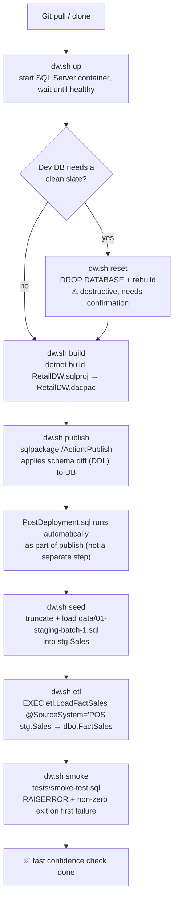
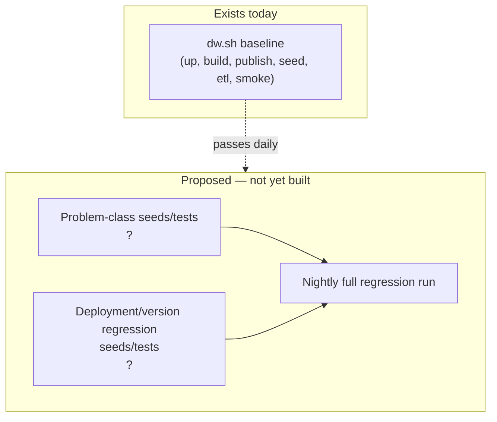
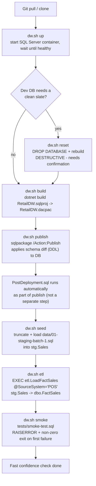
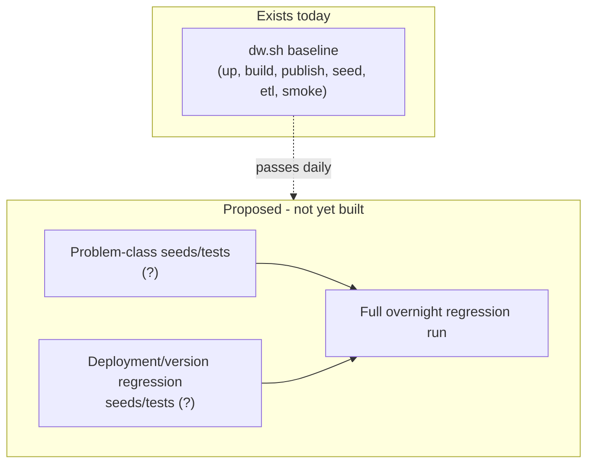
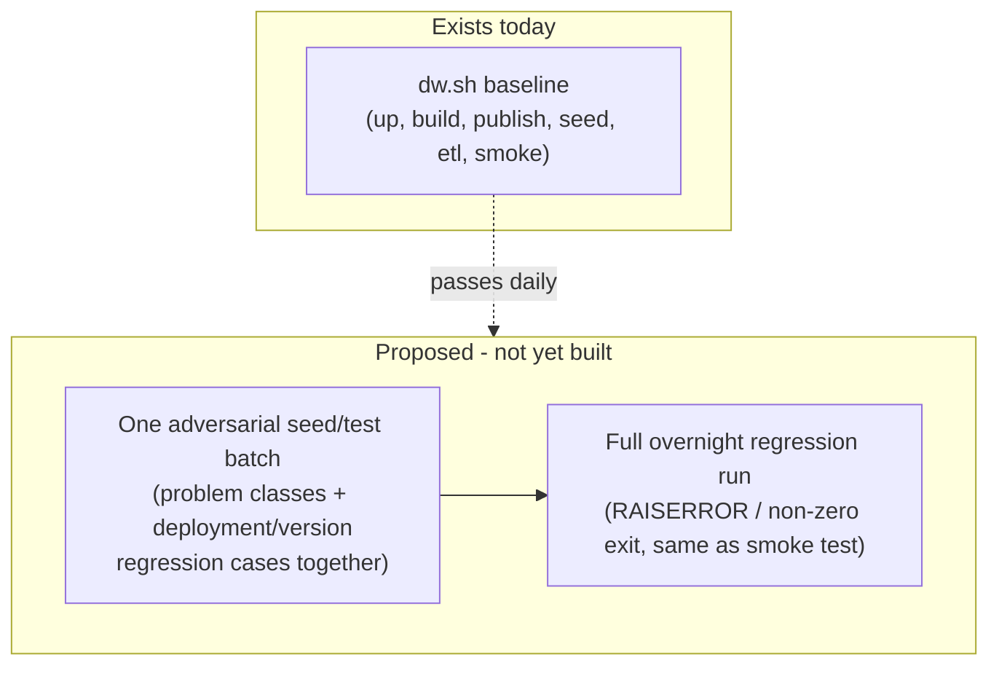

<!-- Generated by SpecStory, Markdown v2.1.0 -->

# 2026-08-24 13:10:52Z

<!-- VS Code Copilot IDE Session 2193a3b9-aee4-478e-898a-7c1ff9d81c32 (2026-08-24 13:10:52Z) -->

_**User (2026-08-24 13:10:52Z)**_

expland, explain, clarify, add diagrams, etc:


Baseline: 

- Git pull/clone 

- sql up / connect dev db

- reset / drop table (dev db)

- sqlpackage build dacpac

- deploy:

 - sqlpackage publish DDL -> DB

 - posdeployment migrations

 - seed (test synthetic data)

 - smoke test ( are things there - fast, run many times)


- Test driven ( full regession test suite - long, overnight)

    - problem class seed / tests

    - deployment/version regression seeds / test

 

---

_**Agent (copilot/claude-sonnet-5)**_

<tool-use data-tool-type="read" data-tool-name="read_file"><details>
<summary>Tool use: **read_file**</summary>

Read `deployment-publish-test-steps.md`

**Input:**

- endLine: `300`
- filePath: `c:\Users\teamsharq\Desktop\infoshare-silkycoders-sql-ai-1\docs\deployment-publish-test-steps.md`
- startLine: `1`

**Result:**

```
# Deployment / publish / test steps

Reference for the RetailDW project lifecycle. All steps are wrapped by
[scripts/dw.sh](../scripts/dw.sh); run them in order, or run
`./scripts/dw.sh baseline` to do all of them at once.

1. **`up`** — starts the SQL Server container (`docker compose up -d`), polls
   with `sqlcmd -Q "SELECT 1"` until ready.
2. **`build`** — `dotnet build RetailDW/RetailDW.sqlproj` → produces
   [RetailDW.dacpac](../RetailDW/bin/Debug/RetailDW.dacpac).
3. **`publish`** — `sqlpackage /Action:Publish` deploys the dacpac to the
   `RetailDW` database on the local container (`127.0.0.1,14330`).
4. **`seed`** — truncates + loads staging batch 1 via
   [data/01-staging-batch-1.sql](../data/01-staging-batch-1.sql) into
   `stg.Sales`.
5. **`etl`** — runs `EXEC etl.LoadFactSales @SourceSystem = N'POS'`, prints the
   resulting [dbo.LoadLog](../RetailDW/Tables/dbo.LoadLog.sql) row.
6. **`smoke`** — runs [tests/smoke-test.sql](../tests/smoke-test.sql), which
   `RAISERROR`s and exits non-zero on the first failed assertion. It checks:
   - all expected objects exist (tables, procs, views, function)
   - `dbo.FactSales` is system-versioned into `dbo.FactSalesHistory`
   - dimensions are seeded (`DimProduct` ≥10 rows, `DimStore` ≥5 rows)
   - baseline load result (exactly 8 rows in `FactSales`, ≥1 succeeded load,
     `RowsRejected = 3` on last load)
   - de-duplication logic picked the newest staged row
   - NULL discounts coerced to 0
   - reporting views/proc are queryable

## Other related commands

- **`diff`** — dacpac-vs-target script, no changes applied.
- **`reset`** — drop + rebuild the database from scratch. Destructive, needs
  confirmation per [AGENTS.md](../AGENTS.md).
- **`sql "..."`** — run an ad-hoc query against the `RetailDW` database.
- **`wsl-memory [GB]`** — ensure WSL2 has enough memory for SQL Server
  (default 3GB).
```
</details></tool-use>

_**Agent (copilot/claude-sonnet-5)**_

<tool-use data-tool-type="read" data-tool-name="read_file"><details>
<summary>Tool use: **read_file**</summary>

Read `team-conventions.md`

**Input:**

- endLine: `300`
- filePath: `c:\Users\teamsharq\Desktop\infoshare-silkycoders-sql-ai-1\docs\team-conventions.md`
- startLine: `1`

**Result:**

```


## Naming

- **Schemas:** `dbo` (core warehouse), `stg` (staging, always disposable), `etl`
  (load procedures), and `reporting` (read-only consumer-facing objects).
- **Tables:** `PascalCase`; dimensions are prefixed with `Dim`, and facts are
  prefixed with `Fact`.
- **Constraints:** `PK_`, `FK_`, `UQ_`, `DF_` (default), `CK_` (check), and
  `IX_`/`UX_` (index).
- Every object name is wrapped in brackets (`[brackets]`) in DDL to match the
  existing style.

## Migration and deployment rules

- Schema changes go through the `.sqlproj` model. Never hand-write `ALTER`
  statements against a running database outside of `PostDeployment.sql` or a
  documented migration.
- `PreDeployment.sql` is for operations that must run before the schema diff.
- `PostDeployment.sql` is for seeding and backfills. It must remain idempotent
  because it runs on every publish.
- Every deployment that changes existing data appends exactly one row to
  `dbo.DeploymentHistory`.

## Testing rules

- Every change ships with a test in `tests/`.
- Tests must fail loudly (`RAISERROR`, non-zero exit); there must be no silent
  pass.
- A test that cannot run because a column or object does not exist yet is an
  acceptable failure mode, as long as the message is clear.

## Scope discipline for the agent

- Never silently decide a business question and mark an object as "no change
  needed." If scope is ambiguous, add it to an **open questions** list rather than making a silent
  assumption.
- Never quote an error message that has not actually been produced by running
  something. If unsure whether an operation fails, say so or test it.
- Present open questions **before** a file-change count or "total files: N"
  summary. A confident number is worthless if the scope is still undecided.
- Do not touch `RetailDW/Scripts/Seed/*` or `RetailDW/Security/*` unless the
  ticket explicitly requires new schemas or reference data.

## Required plan format before im
… (output truncated)
```
</details></tool-use>

_**Agent (copilot/claude-sonnet-5)**_

<tool-use data-tool-type="read" data-tool-name="read_file"><details>
<summary>Tool use: **read_file**</summary>

Read `dw.sh`

**Input:**

- endLine: `200`
- filePath: `c:\Users\teamsharq\Desktop\infoshare-silkycoders-sql-ai-1\scripts\dw.sh`
- startLine: `1`

**Result:**

```
#!/usr/bin/env bash
#
# RetailDW workshop helper.
#
#   ./scripts/dw.sh up        start the SQL Server container
#   ./scripts/dw.sh build     build the database project (produces the dacpac)
#   ./scripts/dw.sh publish   publish the dacpac to the local container
#   ./scripts/dw.sh seed      truncate + load staging batch 1
#   ./scripts/dw.sh etl       run etl.LoadFactSales for the POS source system
#   ./scripts/dw.sh smoke     run the smoke test
#   ./scripts/dw.sh reset     drop and rebuild the database from scratch
#   ./scripts/dw.sh diff      generate a deploy diff script from the dacpac vs the target database
#   ./scripts/dw.sh sql "..." run an ad-hoc query
#   ./scripts/dw.sh baseline  up + build + publish + seed + etl + smoke
#   ./scripts/dw.sh wsl-memory [GB]  ensure WSL2 has enough memory for SQL Server (default 3GB)
#
set -euo pipefail
set +H 2>/dev/null || true

ROOT="$(cd "$(dirname "${BASH_SOURCE[0]}")/.." && pwd)"
SERVER="127.0.0.1,14330"
DB="RetailDW"
WSL_MIN_MEMORY_GB=3
SA_USER="sa"
SA_PASS="${MSSQL_SA_PASSWORD:-Workshop_Dev2026#}"

export PATH="$PATH:$HOME/.dotnet/tools"

winpath() { # winpath <path> - sqlcmd/sqlpackage are Windows binaries
  if command -v cygpath >/dev/null 2>&1; then cygpath -w "$1"; else printf '%s' "$1"; fi
}

q() { # q <database> <query>
  sqlcmd -S "$SERVER" -U "$SA_USER" -P "$SA_PASS" -C -b -d "$1" -Q "$2"
}

f() { # f <database> <file>
  sqlcmd -S "$SERVER" -U "$SA_USER" -P "$SA_PASS" -C -b -d "$1" -i "$(winpath "$2")"
}

cmd_wsl_memory() { # cmd_wsl_memory [GB] - ensure .wslconfig grants WSL2 enough RAM for sqlservr (>=2000MB required)
  local target_gb="${1:-$WSL_MIN_MEMORY_GB}"
  local target="${target_gb}GB"
  local winhome="${USERPROFILE:-}"
  if [ -z "$winhome" ]; then
    echo "USERPROFILE is not set - cannot locate .wslconfig" >&2
    return 1
  fi

  local cfg
  if command -v cygpath >/dev/null 2>&1; then
    cfg="$(cygpath -u "$winhome")/.wslconfig"
  else
 
… (output truncated)
```
</details></tool-use>

_**Agent (copilot/claude-sonnet-5)**_

<tool-use data-tool-type="read" data-tool-name="read_file"><details>
<summary>Tool use: **read_file**</summary>

Read `smoke-test.sql`, lines 1 to 100

**Input:**

- endLine: `100`
- filePath: `c:\Users\teamsharq\Desktop\infoshare-silkycoders-sql-ai-1\tests\smoke-test.sql`
- startLine: `1`

**Result:**

```
/*
RetailDW smoke test
-------------------
Fast confidence check that the deployed database is usable.
Fails loudly (RAISERROR severity 16) on the first broken assertion.

Run AFTER:
  1. sqlpackage publish
  2. data\01-staging-batch-1.sql
  3. EXEC etl.LoadFactSales @SourceSystem = N'POS'
*/
SET NOCOUNT ON;

DECLARE @Failures INT = 0;

-- ---------------------------------------------------------------------------
PRINT N'--- 1. objects exist -------------------------------------------------';

DECLARE @Expected TABLE ([ObjectName] SYSNAME NOT NULL);

INSERT INTO @Expected ([ObjectName])
VALUES (N'dbo.DimProduct'), (N'dbo.DimStore'), (N'dbo.FactSales'),
       (N'dbo.FactSalesHistory'), (N'dbo.LoadLog'), (N'dbo.DeploymentHistory'),
       (N'stg.Sales'), (N'etl.LoadFactSales'), (N'etl.PurgeStaging'),
       (N'reporting.vw_DailySales'), (N'reporting.vw_WeeklySales'),
       (N'reporting.vw_TopProductsByRevenue'),
       (N'reporting.usp_SalesSummaryByMonth'), (N'dbo.fn_SalesWeek');

SELECT @Failures = @Failures + COUNT(*)
FROM   @Expected AS e
WHERE  OBJECT_ID(e.[ObjectName]) IS NULL;

SELECT N'MISSING OBJECT' AS [Problem], e.[ObjectName]
FROM   @Expected AS e
WHERE  OBJECT_ID(e.[ObjectName]) IS NULL;

-- ---------------------------------------------------------------------------
PRINT N'--- 2. FactSales is system-versioned ---------------------------------';

IF NOT EXISTS (
    SELECT 1
    FROM   sys.tables AS t
    JOIN   sys.tables AS h ON h.[object_id] = t.[history_table_id]
    WHERE  t.[object_id] = OBJECT_ID(N'dbo.FactSales')
      AND  t.[temporal_type] = 2                    -- SYSTEM_VERSIONED_TEMPORAL_TABLE
      AND  h.[name] = N'FactSalesHistory')
BEGIN
    PRINT N'FAIL: dbo.FactSales is not system-versioned into dbo.FactSalesHistory';
    SET @Failures += 1;
END

-- ---------------------------------------------------------------------------
PRINT N'--- 3. dimensions are seeded ----------------------
… (output truncated)
```
</details></tool-use>

_**Agent (copilot/claude-sonnet-5)**_

<tool-use data-tool-type="search" data-tool-name="grep_search"><details>
<summary>Tool use: **grep_search**</summary>

Searched for regex `regression|problem class|overnight|version regression`, 6 results

**Input:**

- isRegexp: `true`
- query: `regression|problem class|overnight|version regression`

**Result:**

```
Found 6 matches in 2 files for "regression|problem class|overnight|version regression"

.specstory/history/2026-08-24_13-10-12Z-git-and-sql-deployment.md
39:- Test driven ( full regession test suite - long, overnight)
41:    - problem class seed / tests
43:    - deployment/version regression seeds / test

untitled:Untitled-1
15:- Test driven ( full regession test suite - long, overnight)
16:    - problem class seed / tests
17:    - deployment/version regression seeds / test
```
</details></tool-use>

_**Agent (copilot/claude-sonnet-5)**_

<tool-use data-tool-type="generic" data-tool-name="list_dir"><details>
<summary>Tool use: **list_dir**</summary>

Read `data`

**Input:**

- path: `c:\Users\teamsharq\Desktop\infoshare-silkycoders-sql-ai-1\data`

**Result:**

```
01-staging-batch-1.sql
```
</details></tool-use>

_**Agent (copilot/claude-sonnet-5)**_

Here's the expanded version, grounded in what actually exists in this repo today (`dw.sh`, `docs/deployment-publish-test-steps.md`, `tests/smoke-test.sql`) — with the gaps between your notes and reality called out explicitly rather than papered over.

## 1. Baseline pipeline (fast, run many times)

This is exactly what `.`dw.sh` baseline` already automates as one command, chaining `up → build → publish → seed → etl → smoke`.



### Clarifications / corrections to your notes

| Your note | What actually happens in this repo |
|---|---|
| "sql up / connect dev db" | `dw.sh up` starts the Docker container and polls with `sqlcmd -Q "SELECT 1"` until ready — no separate manual "connect" step needed. |
| "reset / drop table (dev db)" | `dw.sh reset` drops the **whole database**, not a table, then rebuilds it. It's marked destructive in `AGENTS.md` and needs explicit confirmation before running. |
| "sqlpackage build dacpac" | Build is `dotnet build` (`dw.sh build`), which is what produces `RetailDW/bin/Debug/RetailDW.dacpac`. `sqlpackage` itself is only used for **publish** and **diff**, not build. |
| "posdeployment migrations" (separate step) | **Not a separate CLI step.** Scripts/PostDeployment.sql runs automatically inside `sqlpackage /Action:Publish`, right after the schema diff. It must be idempotent since it runs on every publish. |
| "seed (test synthetic data)" | `dw.sh seed` only loads `data/01-staging-batch-1.sql` into `stg.Sales` — raw/dirty staging rows, not yet in the warehouse. |
| *(missing)* | Your notes jump straight from seed to smoke test, but the smoke test asserts on `dbo.FactSales` row counts and load-log status. That data only exists after **`dw.sh etl`** runs (`EXEC etl.LoadFactSales`) to move staged rows into the fact table. I added it back in — flag if you intended it to be a separate, optional step instead of implicit. |
| "smoke test (fast, run many times)" | Confirmed accurate — `tests/smoke-test.sql` does 7 quick assertion blocks (objects exist, temporal versioning wired up, dimension seed counts, fact row/reject counts, dedup logic, NULL-discount coercion, reporting layer queryable). |

## 2. Test-driven / full regression tier (long, overnight)

⚠️ **Open question, not an assumption to silently resolve:** this tier does not exist in the repo yet. Today there is exactly:
- one staging fixture (`data/01-staging-batch-1.sql`)
- one test script (`tests/smoke-test.sql`), described in `docs/deployment-publish-test-steps.md` as the fast check

There is no "problem class" seed/test set and no "deployment/version regression" seed/test set anywhere in `data`, `tests`, or `docs`. I'm not going to invent what these should contain — that needs your input:



Questions that change how this tier should be built:
1. **"Problem class" seed/tests** — does this mean one staging batch per known edge case (e.g., duplicate sales lines, NULL discounts, out-of-range dates, currency mismatches), each with its own assertions? Or a single larger adversarial dataset covering all classes at once?
2. **"Deployment/version regression"** — is this about re-publishing across a chain of historical dacpac versions to confirm upgrade paths don't break data (e.g., temporal history integrity across schema changes), or about comparing ETL output between old vs. new code on the same seed?
3. **Trigger/cadence** — "overnight" implies a scheduled job. Is there a CI/CD system (e.g., GitHub Actions) this should hook into, or is it meant to run manually via a new `dw.sh regression` command?
4. **Pass/fail contract** — should it follow the same convention as `smoke-test.sql` (`RAISERROR`, non-zero exit, print diagnostics), per the testing rules in `docs/team-conventions.md`?
5. **Data volume** — does "long, overnight" imply significantly larger synthetic datasets than the current tiny staging batch, to catch performance regressions too, or is length driven by the *number* of scenarios rather than row counts?

I'd suggest turning this into a proper ticket (via the ticket-clarification workflow) once you've answered the above, since "regression suite" as a class of work has real scope/ownership/rollback questions that shouldn't be assumed.

---

_**User (2026-08-24 13:12:07Z)**_

add final steps


- Write / Update documentation


- Prepare Pull/Merge Git Request, branch, commit, push 


save to ./docs as schema dev  workflow .md 

---

_**Agent (copilot/claude-sonnet-5)**_

<tool-use data-tool-type="search" data-tool-name="grep_search"><details>
<summary>Tool use: **grep_search**</summary>

Searched for regex `branch|commit|pull request|merge request|PR title` (`**/docs/**`), 1 result

**Input:**

- includePattern: `docs/**`
- isRegexp: `true`
- query: `branch|commit|pull request|merge request|PR title`

**Result:**

```
Found 1 match in 1 file for "branch|commit|pull request|merge request|PR title"

docs/ai-sessions/2026-08-20_13-20-57Z-procedure-explanation-steps.md
47:- `COMMIT TRANSACTION`.
```
</details></tool-use>

_**Agent (copilot/claude-sonnet-5)**_

<tool-use data-tool-type="read" data-tool-name="read_file"><details>
<summary>Tool use: **read_file**</summary>

Read `change-impact-analysis-procedure.md`, lines 1 to 60

**Input:**

- endLine: `60`
- filePath: `c:\Users\teamsharq\Desktop\infoshare-silkycoders-sql-ai-1\docs\change-impact-analysis-procedure.md`
- startLine: `1`

**Result:**

```
---

name: impact-analysis

description: 'TODO ? one-line "Use when..." description with trigger keywords (e.g. impact analysis, before implementing a multi-object change, dependency mapping, risk assessment).'

---


# Impact Analysis


<!-- TODO: one or two sentences on what this skill produces and when to reach for it. -->


## Procedure


<!--

TODO: list the steps this skill should follow, e.g.:

1. Objects involved / changed

2. Which procedures/functions/views uses changed objects

3. Required changes

4. Risks

- Temporal / Logging / MERGE Impact

- Type, Nullability, and Source


- Schema vs Data Migration

- Sequencing

- Open Questions

5. Validation / Testing methods 
-->


## Output


Use [impact-analysis-template.md](./impact-analysis-template.md) to structure the result.


<!-- TODO: where should the completed document be saved? -->
```
</details></tool-use>

_**Agent (copilot/claude-sonnet-5)**_

<tool-use data-tool-type="write" data-tool-name="create_file"><details>
<summary>Tool use: **create_file**</summary>

Created `schema-dev-workflow.md`

**Input:**

- content:

````
# Schema dev workflow

End-to-end workflow for making a schema/data change in `RetailDW`, from pulling
latest code to opening a pull/merge request. Two tiers of verification are
involved: a fast **baseline** loop you run constantly while developing, and a
slower **regression** tier intended to run less often (e.g. overnight / in CI).

## 1. Baseline (fast, run many times)

Everything in this tier is already automated by
[scripts/dw.sh](../scripts/dw.sh); `./scripts/dw.sh baseline` chains
`up → build → publish → seed → etl → smoke` in one command. See
[docs/deployment-publish-test-steps.md](./deployment-publish-test-steps.md)
for the authoritative step-by-step reference.



| Step | Command | What it does |
|---|---|---|
| Get code | `git pull` / `git clone` | Latest source. |
| Start dev DB | `./scripts/dw.sh up` | Starts the Docker container, polls with `sqlcmd -Q "SELECT 1"` until ready. |
| Reset (optional) | `./scripts/dw.sh reset` | Drops the **whole database** and rebuilds it. Destructive — needs explicit confirmation per [AGENTS.md](../AGENTS.md). |
| Build | `./scripts/dw.sh build` | `dotnet build RetailDW.sqlproj` → produces [RetailDW.dacpac](../RetailDW/bin/Debug/RetailDW.dacpac). `sqlpackage` is not used at this step. |
| Publish (DDL) | `./scripts/dw.sh publish` | `sqlpackage /Action:Publish` applies the schema diff to the database. [Scripts/PostDeployment.sql](../RetailDW/Scripts/PostDeployment.sql) runs automatically as part of this — it is not a separate CLI step, and it must stay idempotent since it runs on every publish. |
| Seed | `./scripts/dw.sh seed` | Truncates and loads [data/01-staging-batch-1.sql](../data/01-staging-batch-1.sql) into `stg.Sales` (raw/dirty staging rows, not yet in the warehouse). |
| ETL | `./scripts/dw.sh etl` | `EXEC etl.LoadFactSales @SourceSystem = N'POS'` moves staged rows into `dbo.FactSales`. Required before the smoke test, since it asserts on fact-table row counts and load status. |
| Smoke test | `./scripts/dw.sh smoke` | Runs [tests/smoke-test.sql](../tests/smoke-test.sql): objects exist, `FactSales` is system-versioned, dimensions are seeded, baseline load counts match, dedup picked the newest row, NULL discounts coerced to 0, reporting layer is queryable. Fails loudly (`RAISERROR`, non-zero exit) on first failure. |

## 2. Test-driven / full regression suite (long, overnight)

**Not yet implemented in this repo.** Today there is exactly one staging
fixture ([data/01-staging-batch-1.sql](../data/01-staging-batch-1.sql)) and one
test script ([tests/smoke-test.sql](../tests/smoke-test.sql)) — no
"problem class" seed/test set and no "deployment/version regression" seed/test
set exist yet anywhere in `data/`, `tests/`, or `docs/`.



Open questions to resolve before building this tier (do not assume answers):

1. **Problem-class seed/tests** — one staging batch per known edge case
   (duplicate lines, NULL discounts, out-of-range dates, currency mismatches),
   each with its own assertions? Or one larger adversarial dataset covering
   all classes at once?
2. **Deployment/version regression** — re-publishing across a chain of
   historical dacpac versions to confirm upgrade paths don't break data (e.g.
   temporal history integrity across schema changes), or comparing ETL output
   between old vs. new code against the same seed?
3. **Trigger/cadence** — is "overnight" a scheduled CI job, or a manual
   `dw.sh regression` command?
4. **Pass/fail contract** — same convention as `smoke-test.sql` (`RAISERROR`,
   non-zero exit, printed diagnostics), per the testing rules in
   [docs/team-conventions.md](./team-conventions.md)?
5. **Data volume** — does "long, overnight" imply much larger synthetic
   datasets (to catch performance regressions), or is length driven by number
   of scenarios rather than row counts?

This tier should go through the ticket-clarification workflow before
implementation, since it has its own scope/ownership/rollback questions.

## 3. Write / update documentation

- Update any doc affected by the change: object-level comments, entries in
  [docs/team-conventions.md](./team-conventions.md), the relevant
  `analyses/impact-analysis-*.md` file, and this workflow doc if the process
  itself changed.
- If the change affects existing data or is a temporal/MERGE change, confirm
  the rollback/backfill note was captured (per the required plan format in
  [AGENTS.md](../AGENTS.md)).
- Do not create new markdown docs unless the change genuinely needs one —
  prefer updating existing docs in place.

## 4. Prepare pull/merge request

- **Branch**: create a feature branch off the latest `main`/default branch
  before committing (no repo-specific branch-naming convention is documented
  yet — confirm with the team if one exists before inventing a scheme).
- **Commit**: commit schema/project files, tests, and doc updates together so
  the PR is self-contained and reviewable as one unit.
- **Push**: push the branch and open the pull/merge request.
- **PR description** should reference: the ticket, the objects touched, the
  test plan that was run (baseline pass/fail, regression tier if applicable),
  and any rollback/backfill notes — mirroring the required plan format in
  [AGENTS.md](../AGENTS.md).
- No destructive git operations (force-push, history rewrite on shared
  branches) without explicit confirmation, per [AGENTS.md](../AGENTS.md).

````

- filePath: `c:\Users\teamsharq\Desktop\infoshare-silkycoders-sql-ai-1\docs\schema-dev-workflow.md`

**Result:**

```
The following files were successfully edited:
c:\Users\teamsharq\Desktop\infoshare-silkycoders-sql-ai-1\docs\schema-dev-workflow.md
```
</details></tool-use>

_**Agent (copilot/claude-sonnet-5)**_

<tool-use data-tool-type="write" data-tool-name="textEditGroup"><details>
<summary>Edit: **schema-dev-workflow.md**</summary>

@@ lines 1-1 @@

````
# Schema dev workflow

End-to-end workflow for making a schema/data change in `RetailDW`, from pulling
latest code to opening a pull/merge request. Two tiers of verification are
involved: a fast **baseline** loop you run constantly while developing, and a
slower **regression** tier intended to run less often (e.g. overnight / in CI).

## 1. Baseline (fast, run many times)

Everything in this tier is already automated by
[scripts/dw.sh](../scripts/dw.sh); `./scripts/dw.sh baseline` chains
`up → build → publish → seed → etl → smoke` in one command. See
[docs/deployment-publish-test-steps.md](./deployment-publish-test-steps.md)
for the authoritative step-by-step reference.


| Step | Command | What it does |
|---|---|---|
| Get code | `git pull` / `git clone` | Latest source. |
| Start dev DB | `./scripts/dw.sh up` | Starts the Docker container, polls with `sqlcmd -Q "SELECT 1"` until ready. |
| Reset (optional) | `./scripts/dw.sh reset` | Drops the **whole database** and rebuilds it. Destructive — needs explicit confirmation per [AGENTS.md](../AGENTS.md). |
| Build | `./scripts/dw.sh build` | `dotnet build RetailDW.sqlproj` → produces [RetailDW.dacpac](../RetailDW/bin/Debug/RetailDW.dacpac). `sqlpackage` is not used at this step. |
| Publish (DDL) | `./scripts/dw.sh publish` | `sqlpackage /Action:Publish` applies the schema diff to the database. [Scripts/PostDeployment.sql](../RetailDW/Scripts/PostDeployment.sql) runs automatically as part of this — it is not a separate CLI step, and it must stay idempotent since it runs on every publish. |
| Seed | `./scripts/dw.sh seed` | Truncates and loads [data/01-staging-batch-1.sql](../data/01-staging-batch-1.sql) into `stg.Sales` (raw/dirty staging rows, not yet in the warehouse). |
| ETL | `./scripts/dw.sh etl` | `EXEC etl.LoadFactSales @SourceSystem = N'POS'` moves staged rows into `dbo.FactSales`. Required before the smoke test, since it asserts on fact-table row counts and load status. |
| Smoke test | `./scripts/dw.sh smoke` | Runs [tests/smoke-test.sql](../tests/smoke-test.sql): objects exist, `FactSales` is system-versioned, dimensions are seeded, baseline load counts match, dedup picked the newest row, NULL discounts coerced to 0, reporting layer is queryable. Fails loudly (`RAISERROR`, non-zero exit) on first failure. |

## 2. Test-driven / full regression suite (long, overnight)

**Not yet implemented in this repo.** Today there is exactly one staging
fixture ([data/01-staging-batch-1.sql](../data/01-staging-batch-1.sql)) and one
test script ([tests/smoke-test.sql](../tests/smoke-test.sql)) — no
"problem class" seed/test set and no "deployment/version regression" seed/test
set exist yet anywhere in `data/`, `tests/`, or `docs/`.


Open questions to resolve before building this tier (do not assume answers):

1. **Problem-class seed/tests** — one staging batch per known edge case
   (duplicate lines, NULL discounts, out-of-range dates, currency mismatches),
   each with its own assertions? Or one larger adversarial dataset covering
   all classes at once?
2. **Deployment/version regression** — re-publishing across a chain of
   historical dacpac versions to confirm upgrade paths don't break data (e.g.
   temporal history integrity across schema changes), or comparing ETL output
   between old vs. new code against the same seed?
3. **Trigger/cadence** — is "overnight" a scheduled CI job, or a manual
   `dw.sh regression` command?
4. **Pass/fail contract** — same convention as `smoke-test.sql` (`RAISERROR`,
   non-zero exit, printed diagnostics), per the testing rules in
   [docs/team-conventions.md](./team-conventions.md)?
5. **Data volume** — does "long, overnight" imply much larger synthetic
   datasets (to catch performance regressions), or is length driven by number
   of scenarios rather than row counts?

This tier should go through the ticket-clarification workflow before
implementation, since it has its own scope/ownership/rollback questions.

## 3. Write / update documentation

- Update any doc affected by the change: object-level comments, entries in
  [docs/team-conventions.md](./team-conventions.md), the relevant
  `analyses/impact-analysis-*.md` file, and this workflow doc if the process
  itself changed.
- If the change affects existing data or is a temporal/MERGE change, confirm
  the rollback/backfill note was captured (per the required plan format in
  [AGENTS.md](../AGENTS.md)).
- Do not create new markdown docs unless the change genuinely needs one —
  prefer updating existing docs in place.

## 4. Prepare pull/merge request

- **Branch**: create a feature branch off the latest `main`/default branch
  before committing (no repo-specific branch-naming convention is documented
  yet — confirm with the team if one exists before inventing a scheme).
- **Commit**: commit schema/project files, tests, and doc updates together so
  the PR is self-contained and reviewable as one unit.
- **Push**: push the branch and open the pull/merge request.
- **PR description** should reference: the ticket, the objects touched, the
  test plan that was run (baseline pass/fail, regression tier if applicable),
  and any rollback/backfill notes — mirroring the required plan format in
  [AGENTS.md](../AGENTS.md).
- No destructive git operations (force-push, history rewrite on shared
  branches) without explicit confirmation, per [AGENTS.md](../AGENTS.md).

````
</details></tool-use>

_**Agent (copilot/claude-sonnet-5)**_

Saved to `docs/schema-dev-workflow.md`.

Notes on what I added/flagged rather than assumed:
- Section 3–4 (docs, branch/commit/PR) added as requested — I did **not** invent a branch-naming or PR-template convention since none exists in the repo; flagged that explicitly for the team to confirm.
- Kept the "test-driven / regression" tier marked as **not yet implemented**, with open questions, since nothing in `data`, `tests`, or `docs` supports inventing its contents.

---

_**User (2026-08-24 13:15:44Z)**_

a single larger adversarial dataset covering all classes at once?
Deployment/version regression tests in same seed / test batch for testing each new schema version deplyoment
ci/cd - out of scope (is setup elswere)
4. same as smoketest

5. not bigger seed, just more test cases more deeper checks and special cases beyound happy path

---

_**Agent (copilot/claude-sonnet-5)**_

<tool-use data-tool-type="read" data-tool-name="read_file"><details>
<summary>Tool use: **read_file**</summary>

Read `schema-dev-workflow.md`, lines 40 to 75

**Input:**

- endLine: `75`
- filePath: `c:\Users\teamsharq\Desktop\infoshare-silkycoders-sql-ai-1\docs\schema-dev-workflow.md`
- startLine: `40`

**Result:**

````
| Smoke test | `./scripts/dw.sh smoke` | Runs [tests/smoke-test.sql](../tests/smoke-test.sql): objects exist, `FactSales` is system-versioned, dimensions are seeded, baseline load counts match, dedup picked the newest row, NULL discounts coerced to 0, reporting layer is queryable. Fails loudly (`RAISERROR`, non-zero exit) on first failure. |

## 2. Test-driven / full regression suite (long, overnight)

**Not yet implemented in this repo.** Today there is exactly one staging
fixture ([data/01-staging-batch-1.sql](../data/01-staging-batch-1.sql)) and one
test script ([tests/smoke-test.sql](../tests/smoke-test.sql)) — no
"problem class" seed/test set and no "deployment/version regression" seed/test
set exist yet anywhere in `data/`, `tests/`, or `docs/`.


Open questions to resolve before building this tier (do not assume answers):

1. **Problem-class seed/tests** — one staging batch per known edge case
   (duplicate lines, NULL discounts, out-of-range dates, currency mismatches),
   each with its own assertions? Or one larger adversarial dataset covering
   all classes at once?
2. **Deployment/version regression** — re-publishing across a chain of
   historical dacpac versions to confirm upgrade paths don't break data (e.g.
   temporal history integrity across schema changes), or comparing ETL output
   between old vs. new code against the same seed?
3. **Trigger/cadence** — is "overnight" a scheduled CI job, or a manual
````
</details></tool-use>

_**Agent (copilot/claude-sonnet-5)**_

Now updating section 2 to reflect the decisions instead of open questions: 

_**Agent (copilot/claude-sonnet-5)**_

<tool-use data-tool-type="write" data-tool-name="textEditGroup"><details>
<summary>Edit: **schema-dev-workflow.md**</summary>

@@ lines 46-85 @@

````
the
"problem class" and "deployment/version regression" seed/test set below does
not exist yet anywhere in `data/`, `tests/`, or `docs/`. Design decisions have
been confirmed (below); building it is still future work.



Confirmed design decisions:

1. **Problem-class coverage** — a single larger adversarial dataset covering
   all problem classes at once (duplicate lines, NULL discounts,
   out-of-range dates, currency mismatches, etc.), not one staging batch per
   case.
2. **Deployment/version regression** — regression cases for validating each
   new schema-version deployment live in the **same** seed/test batch as the
   problem-class tests (one combined dataset + test suite), not a separate
   chain of historical dacpacs.
3. **Trigger/cadence (CI/CD)** — **out of scope for this repo/doc.** CI/CD
   wiring (e.g. scheduling the overnight run) is set up elsewhere.
4. **Pass/fail contract** — same convention as
   [tests/smoke-test.sql](../tests/smoke-test.sql): `RAISERROR`, non-zero
   exit, printed diagnostics, per the testing rules in
   [docs/team-conventions.md](./team-conventions.md).
5. **Data volume** — not a bigger seed. Same scale of data, but more test
   cases with deeper checks and special/edge cases beyond the happy path
   (this is what makes the run longer, not row counts).

Still open before implementation: where this combined seed/test batch lives
(e.g. `data/` + `tests/` naming), and whether it's invoked via a new
`dw.sh regression`-style command. This should go through the
ticket-clarification workflow before implementation
````
</details></tool-use>

_**Agent (copilot/claude-sonnet-5)**_

Updated `docs/schema-dev-workflow.md` section 2 with your answers as confirmed decisions instead of open questions, and narrowed the remaining open item to just *where* the combined seed/test batch lives and how it's invoked.
