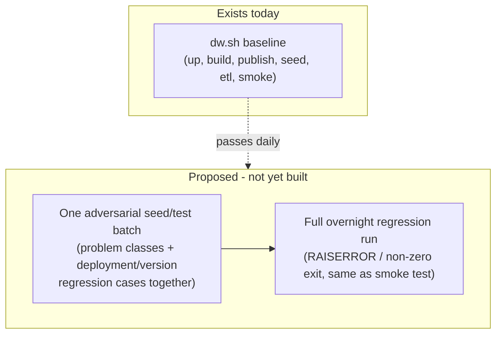
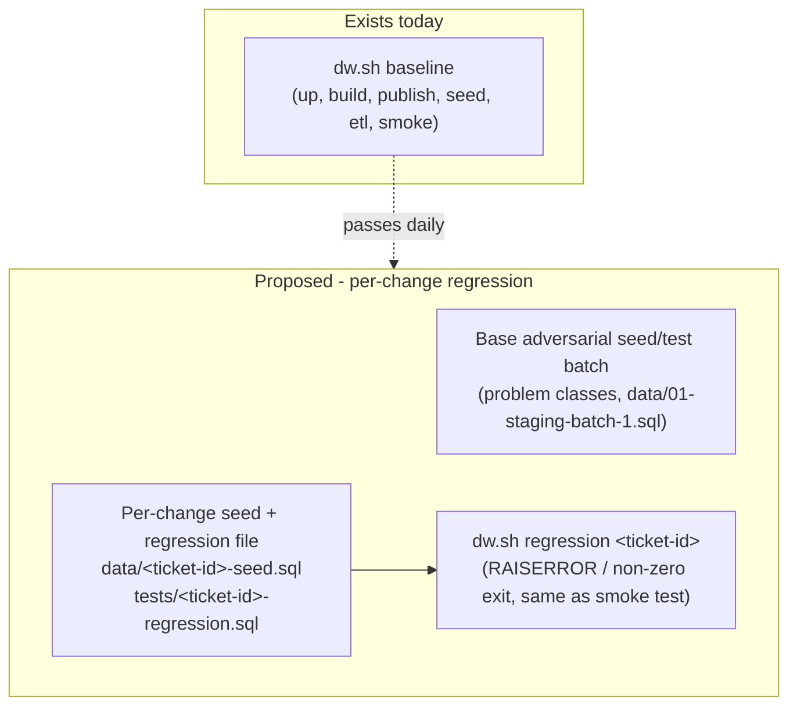

<!-- Generated by SpecStory, Markdown v2.1.0 -->

# 2026-08-24 13:25:15Z

<!-- VS Code Copilot IDE Session 3539c3f4-1f57-4809-825f-ceb3a41d4084 (2026-08-24 13:25:15Z) -->

_**User (2026-08-24 13:25:15Z)**_

/create-skill schema-change-tests-suite

after change is implemented we want to:
- analysis, plan or ticket exists with business rationale, any pitfalls, risks mentioned
- verify tests exists - at least smoketest for this change
- help discover/clarify other non-happy-path scenarios (null, types, conversions, rules, etc..)
- design what seed data will cover those cases ( examples in #attachment:01-staging-batch-1.sql )
- for each deployment/schema change create separate seed and regression tests beyoud smoketests and seed
- does base batches seeds need to be updated also - verify and update

---

_**Agent (copilot/claude-sonnet-5)**_

<tool-use data-tool-type="read" data-tool-name="read_file"><details>
<summary>Tool use: **read_file**</summary>

Read skill `agent-customization`

**Input:**

- endLine: `400`
- filePath: `c:\Users\teamsharq\AppData\Local\Programs\Microsoft VS Code\a5b5009513\resources\app\extensions\copilot\assets\prompts\skills\agent-customization\SKILL.md`
- startLine: `1`

**Result:**

```
---
name: agent-customization
user-invocable: false # don't show as slash command, we have sepcialized create-agent, create-instructions, create-hook prompts for that
description: '**WORKFLOW SKILL** — Create, update, review, fix, or debug VS Code agent customization files (.instructions.md, .prompt.md, .agent.md, SKILL.md, copilot-instructions.md, AGENTS.md). USE FOR: saving coding preferences; troubleshooting why instructions/skills/agents are ignored or not invoked; configuring applyTo patterns; defining tool restrictions; creating custom agent modes or specialized workflows; packaging domain knowledge; fixing YAML frontmatter syntax. DO NOT USE FOR: general coding questions (use default agent); runtime debugging or error diagnosis; MCP server configuration (use MCP docs directly); VS Code extension development. INVOKES: file system tools (read/write customization files), ask-questions tool (interview user for requirements), subagents for codebase exploration. FOR SINGLE OPERATIONS: For quick YAML frontmatter fixes or creating a single file from a known pattern, edit the file directly — no skill needed.'
---

# Agent Customization

## Decision Flow

| Primitive | When to Use |
|-----------|-------------|
| agent instructions | Always-on, applies everywhere in the project |
| File Instructions | Explicit via `applyTo` patterns, or on-demand via `description` |
| MCP | Integrates external systems, APIs, or data |
| Hooks | Deterministic shell commands at agent lifecycle points (block tools, auto-format, inject context) |
| Custom Agents | Subagents for context isolation, or multi-stage workflows with tool restrictions |
| Prompts | Single focused task with parameterized inputs |
| Skills | On-demand workflow with bundled assets (scripts/templates) |

## Quick Reference

Consult the reference docs for templates, domain examples, advanced frontmatter options, asset organization, anti-patterns, and creation checklists. If the references are not enough, load the offici
… (output truncated)
```
</details></tool-use>

_**Agent (copilot/claude-sonnet-5)**_

<tool-use data-tool-type="generic" data-tool-name="fetch_webpage"><details>
<summary>Tool use: **fetch_webpage**</summary>

Fetched resource, but the following was an invalid URL:

c:\Users\teamsharq\AppData\Local\Programs\Microsoft VS Code\a5b5009513\resources\app\extensions\copilot\assets\prompts\skills\agent-customization\references\skills.md


**Input:**

- query: `skills reference template`
- urls:

```
[
  "c:\\Users\\teamsharq\\AppData\\Local\\Programs\\Microsoft VS Code\\a5b5009513\\resources\\app\\extensions\\copilot\\assets\\prompts\\skills\\agent-customization\\references\\skills.md"
]
```


**Result:**

```
Here is some relevant context from the web page c:%5CUsers%5Cteamsharq%5CAppData%5CLocal%5CPrograms%5CMicrosoft%20VS%20Code%5Ca5b5009513%5Cresources%5Capp%5Cextensions%5Ccopilot%5Cassets%5Cprompts%5Cskills%5Cagent-customization%5Creferences%5Cskills.md:
Invalid URL
```
</details></tool-use>

_**Agent (copilot/claude-sonnet-5)**_

<tool-use data-tool-type="read" data-tool-name="read_file"><details>
<summary>Tool use: **read_file**</summary>

Read skill `agent-customization`: `skills.md`

**Input:**

- endLine: `400`
- filePath: `c:\Users\teamsharq\AppData\Local\Programs\Microsoft VS Code\a5b5009513\resources\app\extensions\copilot\assets\prompts\skills\agent-customization\references\skills.md`
- startLine: `1`

**Result:**

````
# [Agent Skills (SKILL.md)](https://code.visualstudio.com/docs/copilot/customization/agent-skills)

Folders of instructions, scripts, and resources that agents load on-demand for specialized tasks.

## Structure

```
.github/skills/<skill-name>/
├── SKILL.md           # Required (name must match folder)
├── scripts/           # Executable code
├── references/        # Docs loaded as needed
└── assets/            # Templates, boilerplate
```

## Locations

| Path | Scope |
|------|-------|
| `.github/skills/<name>/` | Project |
| `.agents/skills/<name>/` | Project |
| `.claude/skills/<name>/` | Project |
| `~/.copilot/skills/<name>/` | Personal |
| `~/.agents/skills/<name>/` | Personal |
| `~/.claude/skills/<name>/` | Personal |

## SKILL.md Format

```yaml
---
name: skill-name              # Required: 1-64 chars, lowercase alphanumeric + hyphens, must match folder
description: 'What and when to use. Max 1024 chars.'
argument-hint: 'Optional hint shown for slash invocation'
user-invocable: true          # Optional: show as slash command (default: true)
disable-model-invocation: false # Optional: disable automatic model-triggered loading
---
```

### Body

- What the skill accomplishes
- When to use (triggers and use cases)
- Step-by-step procedures
- References to resources: `[script](./scripts/test.js)`

## Template

```markdown
---
name: webapp-testing
description: 'Test web applications using Playwright. Use for verifying frontend, debugging UI, capturing screenshots.'
---

# Web Application Testing

## When to Use
- Verify frontend functionality
- Debug UI behavior

## Procedure
1. Start the web server
2. Run [test script](./scripts/test.js)
3. Review screenshots in `./screenshots/`
```

## Progressive Loading

1. **Discovery** (~100 tokens): Agent reads `name` and `description`
2. **Instructions** (<5000 tokens): Loads `SKILL.md` body when relevant
3. **Resources**: Additional files load only when referenced

Keep file references one level deep from `SKILL.md`.

… (output truncated)
````
</details></tool-use>

_**Agent (copilot/claude-sonnet-5)**_

<tool-use data-tool-type="read" data-tool-name="read_file"><details>
<summary>Tool use: **read_file**</summary>

Read skill `schema-change-impact-analysis`

**Input:**

- endLine: `400`
- filePath: `c:\Users\teamsharq\Desktop\infoshare-silkycoders-sql-ai-1\.github\skills\schema-change-impact-analysis\SKILL.md`
- startLine: `1`

**Result:**

```
---
name: schema-change-impact-analysis
description: 'Use before implementing any RetailDW schema/data-model change (new column, table, temporal or MERGE change, view/procedure edit). Produces an impact analysis mapping data flow, affected objects, temporal/MERGE risk, and open questions before code changes. Trigger keywords: impact analysis, dependency mapping, risk assessment, before implementing a multi-object change, what does this change touch.'
argument-hint: 'Reference a ticket-*.md file or describe the schema change'
---

# Schema Change Impact Analysis

Maps every object and data flow touched by a proposed RetailDW schema/data
change, and the risks (temporal versioning, MERGE, migration, sequencing)
before any code is written.

## When to Use

- Before implementing a change to any `RetailDW/` schema object (`Tables/`,
  `Views/`, `Procedures/`, `Functions/`, `Sequences/`) — new columns, temporal
  table changes, MERGE logic changes, view/procedure edits.
- Before touching `dbo.FactSales` / `dbo.FactSalesHistory` (system-versioned)
  or any MERGE-based ETL procedure (`etl.LoadFactSales`).
- When a ticket affects more than one object and needs every downstream
  consumer mapped before a plan is written.

## Prerequisite: the ticket must already be clarified

This skill does not gather requirements and does not ask clarifying questions
about the business ask itself.

1. Ask the user whether the ticket/request is already clarified and complete
   (testable acceptance criteria, owner, sign-off).
2. If they are not sure or say no, stop and tell them to clarify it first —
   run the `ticket-clarification` skill, or have them complete it — before
   continuing with this skill.

## Procedure

1. **Objects involved / changed** — enumerate every actual file path under
   `RetailDW/` that the change touches or reads from (Tables, Views,
   Procedures, Functions, Sequences). Cite real paths, not guesses.
2. **Trace consumers** — for
… (output truncated)
```
</details></tool-use>

_**Agent (copilot/claude-sonnet-5)**_

<tool-use data-tool-type="read" data-tool-name="read_file"><details>
<summary>Tool use: **read_file**</summary>

Read skill `schema-change-implementation`

**Input:**

- endLine: `400`
- filePath: `c:\Users\teamsharq\Desktop\infoshare-silkycoders-sql-ai-1\.github\skills\schema-change-implementation\SKILL.md`
- startLine: `1`

**Result:**

```
---
name: schema-change-implementation
description: 'Use once a RetailDW schema/data-model change has an approved plan (from the schema-change-impact-analysis skill, or a confirmed simple ticket spec) and is ready to be implemented. Applies table, staging, ETL MERGE, history, logging, and pre/post-deployment changes for a given ticket. Trigger keywords: implement the plan, apply impact analysis, schema-change-implementation, add column to pipeline, propagate column through ETL, backfill existing rows.'
argument-hint: 'Reference a ticket ID (e.g. DPO-1204) and the approved analysis/plan'
---

# Schema Change Implementation

Implements an already-approved RetailDW schema/data-model change: table
definitions, the staging → ETL → fact pipeline, temporal history objects,
pre/post-deployment scripts, and file headers/changelogs. This skill
executes a plan; it does not decide scope.

## Prerequisite: the plan must already exist and be approved

This skill does not perform impact analysis or decide business scope.

1. Confirm you have: the ticket reference, and the approved analysis/plan
   stating which objects change, the field's type/nullability, its source
   of truth, and any temporal/migration note.
2. If no plan exists yet, or the change touches more than one object,
   `FactSales`, or a MERGE procedure, stop and run
   `schema-change-impact-analysis` first instead of guessing at scope here.
3. If the plan leaves a question open, stop and ask — do not decide it
   during implementation.

## Step 0: Read the change shape handed off by the plan

This skill does not classify the change itself. The plan's "Schema vs Data
Migration" section (produced by `schema-change-impact-analysis`) must state
an explicit **Change Shape** tag — read that tag, don't re-derive it from
the DDL:

- **`view-only`** (e.g. a computed column added to a view, no new stored
  column): do Step 4 (docs) and the object edit only. Skip Steps 1–3.
- **`pipeline`** (
… (output truncated)
```
</details></tool-use>

_**Agent (copilot/claude-sonnet-5)**_

<tool-use data-tool-type="read" data-tool-name="read_file"><details>
<summary>Tool use: **read_file**</summary>

Read `smoke-test.sql`

**Input:**

- endLine: `200`
- filePath: `c:\Users\teamsharq\Desktop\infoshare-silkycoders-sql-ai-1\tests\smoke-test.sql`
- startLine: `1`

**Result:**

```
/*
RetailDW smoke test
-------------------
Fast confidence check that the deployed database is usable.
Fails loudly (RAISERROR severity 16) on the first broken assertion.

Run AFTER:
  1. sqlpackage publish
  2. data\01-staging-batch-1.sql
  3. EXEC etl.LoadFactSales @SourceSystem = N'POS'
*/
SET NOCOUNT ON;

DECLARE @Failures INT = 0;

-- ---------------------------------------------------------------------------
PRINT N'--- 1. objects exist -------------------------------------------------';

DECLARE @Expected TABLE ([ObjectName] SYSNAME NOT NULL);

INSERT INTO @Expected ([ObjectName])
VALUES (N'dbo.DimProduct'), (N'dbo.DimStore'), (N'dbo.FactSales'),
       (N'dbo.FactSalesHistory'), (N'dbo.LoadLog'), (N'dbo.DeploymentHistory'),
       (N'stg.Sales'), (N'etl.LoadFactSales'), (N'etl.PurgeStaging'),
       (N'reporting.vw_DailySales'), (N'reporting.vw_WeeklySales'),
       (N'reporting.vw_TopProductsByRevenue'),
       (N'reporting.usp_SalesSummaryByMonth'), (N'dbo.fn_SalesWeek');

SELECT @Failures = @Failures + COUNT(*)
FROM   @Expected AS e
WHERE  OBJECT_ID(e.[ObjectName]) IS NULL;

SELECT N'MISSING OBJECT' AS [Problem], e.[ObjectName]
FROM   @Expected AS e
WHERE  OBJECT_ID(e.[ObjectName]) IS NULL;

-- ---------------------------------------------------------------------------
PRINT N'--- 2. FactSales is system-versioned ---------------------------------';

IF NOT EXISTS (
    SELECT 1
    FROM   sys.tables AS t
    JOIN   sys.tables AS h ON h.[object_id] = t.[history_table_id]
    WHERE  t.[object_id] = OBJECT_ID(N'dbo.FactSales')
      AND  t.[temporal_type] = 2                    -- SYSTEM_VERSIONED_TEMPORAL_TABLE
      AND  h.[name] = N'FactSalesHistory')
BEGIN
    PRINT N'FAIL: dbo.FactSales is not system-versioned into dbo.FactSalesHistory';
    SET @Failures += 1;
END

-- ---------------------------------------------------------------------------
PRINT N'--- 3. dimensions are seeded ----------------------
… (output truncated)
```
</details></tool-use>

_**Agent (copilot/claude-sonnet-5)**_

<tool-use data-tool-type="read" data-tool-name="read_file"><details>
<summary>Tool use: **read_file**</summary>

Read `team-conventions.md`

**Input:**

- endLine: `200`
- filePath: `c:\Users\teamsharq\Desktop\infoshare-silkycoders-sql-ai-1\docs\team-conventions.md`
- startLine: `1`

**Result:**

```


## Naming

- **Schemas:** `dbo` (core warehouse), `stg` (staging, always disposable), `etl`
  (load procedures), and `reporting` (read-only consumer-facing objects).
- **Tables:** `PascalCase`; dimensions are prefixed with `Dim`, and facts are
  prefixed with `Fact`.
- **Constraints:** `PK_`, `FK_`, `UQ_`, `DF_` (default), `CK_` (check), and
  `IX_`/`UX_` (index).
- Every object name is wrapped in brackets (`[brackets]`) in DDL to match the
  existing style.

## Migration and deployment rules

- Schema changes go through the `.sqlproj` model. Never hand-write `ALTER`
  statements against a running database outside of `PostDeployment.sql` or a
  documented migration.
- `PreDeployment.sql` is for operations that must run before the schema diff.
- `PostDeployment.sql` is for seeding and backfills. It must remain idempotent
  because it runs on every publish.
- Every deployment that changes existing data appends exactly one row to
  `dbo.DeploymentHistory`.

## Testing rules

- Every change ships with a test in `tests/`.
- Tests must fail loudly (`RAISERROR`, non-zero exit); there must be no silent
  pass.
- A test that cannot run because a column or object does not exist yet is an
  acceptable failure mode, as long as the message is clear.

## Scope discipline for the agent

- Never silently decide a business question and mark an object as "no change
  needed." If scope is ambiguous, add it to an **open questions** list rather than making a silent
  assumption.
- Never quote an error message that has not actually been produced by running
  something. If unsure whether an operation fails, say so or test it.
- Present open questions **before** a file-change count or "total files: N"
  summary. A confident number is worthless if the scope is still undecided.
- Do not touch `RetailDW/Scripts/Seed/*` or `RetailDW/Security/*` unless the
  ticket explicitly requires new schemas or reference data.

## Required plan format before im
… (output truncated)
```
</details></tool-use>

_**Agent (copilot/claude-sonnet-5)**_

<tool-use data-tool-type="generic" data-tool-name="vscode_askQuestions"><details>
<summary>Tool use: **vscode_askQuestions**</summary>

Analyzing your answers...

**Input:**

- questions:

```
[
  {
    "header": "Per-change vs combined regression",
    "message": "docs/schema-dev-workflow.md already documents: regression cases for each new deployment live in the SAME combined seed/test batch as problem-class tests, not separate per-change files. Your request asks for a separate seed + regression test per schema change. These conflict — which should the new skill follow?",
    "options": [
      {
        "description": "One dedicated seed + regression file per ticket/change (as requested). Requires updating docs/schema-dev-workflow.md to reverse its documented decision.",
        "label": "Separate per-change files",
        "recommended": true
      },
      {
        "description": "One adversarial dataset + test suite, extended each time a new deployment needs regression coverage.",
        "label": "Combined batch (keep documented decision)"
      },
      {
        "description": "Small per-change file created right after each change, later folded into the combined regression batch.",
        "label": "Both"
      }
    ],
    "question": "Separate per-change seed/regression files, or the already-documented combined batch?"
  },
  {
    "header": "File naming convention",
    "message": "No naming convention exists yet for per-change seed/regression files.",
    "options": [
      {
        "description": "Mirrors the existing analyses/impact-analysis-\u003cticket-id\u003e.md pattern.",
        "label": "data/\u003cticket-id\u003e-seed.sql + tests/\u003cticket-id\u003e-regression.sql",
        "recommended": true
      },
      {
        "description": "Specify in freeform.",
        "label": "Different convention"
      }
    ],
    "question": "Adopt data/\u003cticket-id\u003e-seed.sql and tests/\u003cticket-id\u003e-regression.sql as the naming convention?"
  },
  {
    "header": "dw.sh regression command",
    "message": "docs/schema-dev-workflow.md notes it's still open whether a new dw.sh regression-style command is added.",
    "options": [
      {
        "description": "Skill only produces seed + regression SQL files; running them is a separate task.",
        "label": "Leave dw.sh wiring out of scope",
        "recommended": true
      },
      {
        "description": "Skill also proposes/adds a dw.sh command/target to run the new regression test(s).",
        "label": "Include a dw.sh step"
      }
    ],
    "question": "Should the skill also add/update a dw.sh command to run the new regression test(s)?"
  }
]
```


**Result:**

```
{"answers":{"Per-change vs combined regression":{"selected":["Separate per-change files"],"freeText":null,"skipped":false},"File naming convention":{"selected":["data/<ticket-id>-seed.sql + tests/<ticket-id>-regression.sql"],"freeText":null,"skipped":false},"dw.sh regression command":{"selected":["Include a dw.sh step"],"freeText":null,"skipped":false}}}
```
</details></tool-use>

_**Agent (copilot/claude-sonnet-5)**_

<tool-use data-tool-type="read" data-tool-name="read_file"><details>
<summary>Tool use: **read_file**</summary>

Read `dw.sh`

**Input:**

- endLine: `250`
- filePath: `c:\Users\teamsharq\Desktop\infoshare-silkycoders-sql-ai-1\scripts\dw.sh`
- startLine: `1`

**Result:**

```
#!/usr/bin/env bash
#
# RetailDW workshop helper.
#
#   ./scripts/dw.sh up        start the SQL Server container
#   ./scripts/dw.sh build     build the database project (produces the dacpac)
#   ./scripts/dw.sh publish   publish the dacpac to the local container
#   ./scripts/dw.sh seed      truncate + load staging batch 1
#   ./scripts/dw.sh etl       run etl.LoadFactSales for the POS source system
#   ./scripts/dw.sh smoke     run the smoke test
#   ./scripts/dw.sh reset     drop and rebuild the database from scratch
#   ./scripts/dw.sh diff      generate a deploy diff script from the dacpac vs the target database
#   ./scripts/dw.sh sql "..." run an ad-hoc query
#   ./scripts/dw.sh baseline  up + build + publish + seed + etl + smoke
#   ./scripts/dw.sh wsl-memory [GB]  ensure WSL2 has enough memory for SQL Server (default 3GB)
#
set -euo pipefail
set +H 2>/dev/null || true

ROOT="$(cd "$(dirname "${BASH_SOURCE[0]}")/.." && pwd)"
SERVER="127.0.0.1,14330"
DB="RetailDW"
WSL_MIN_MEMORY_GB=3
SA_USER="sa"
SA_PASS="${MSSQL_SA_PASSWORD:-Workshop_Dev2026#}"

export PATH="$PATH:$HOME/.dotnet/tools"

winpath() { # winpath <path> - sqlcmd/sqlpackage are Windows binaries
  if command -v cygpath >/dev/null 2>&1; then cygpath -w "$1"; else printf '%s' "$1"; fi
}

q() { # q <database> <query>
  sqlcmd -S "$SERVER" -U "$SA_USER" -P "$SA_PASS" -C -b -d "$1" -Q "$2"
}

f() { # f <database> <file>
  sqlcmd -S "$SERVER" -U "$SA_USER" -P "$SA_PASS" -C -b -d "$1" -i "$(winpath "$2")"
}

cmd_wsl_memory() { # cmd_wsl_memory [GB] - ensure .wslconfig grants WSL2 enough RAM for sqlservr (>=2000MB required)
  local target_gb="${1:-$WSL_MIN_MEMORY_GB}"
  local target="${target_gb}GB"
  local winhome="${USERPROFILE:-}"
  if [ -z "$winhome" ]; then
    echo "USERPROFILE is not set - cannot locate .wslconfig" >&2
    return 1
  fi

  local cfg
  if command -v cygpath >/dev/null 2>&1; then
    cfg="$(cygpath -u "$winhome")/.wslconfig"
  else
 
… (output truncated)
```
</details></tool-use>

_**Agent (copilot/claude-sonnet-5)**_

<tool-use data-tool-type="task" data-tool-name="manage_todo_list"><details>
<summary>Tool use: **manage_todo_list**</summary>

Created 4 todos

- [ ] Add dw.sh regression command _(in progress)_
- [ ] Update schema-dev-workflow.md decision on per-change regression
- [ ] Draft schema-change-tests-suite SKILL.md
- [ ] Review draft, ask about weak/ambiguous parts

**Result:**

```
Successfully wrote todo list

Warning: Did you mean to update so many todos at the same time? Consider working on them one by one.
```
</details></tool-use>

_**Agent (copilot/claude-sonnet-5)**_

<tool-use data-tool-type="write" data-tool-name="textEditGroup"><details>
<summary>Edit: **dw.sh**</summary>

@@ lines 170-170 @@

```
gression) cmd_regression "${2:-}" ;;
  re
```

@@ lines 139-139 @@

```


cmd_regression() { # cmd_regression <ticket-id> - load data/<ticket-id>-seed.sql, then run tests/<ticket-id>-regression.sql
  local ticket="${1:?usage: dw.sh regression <ticket-id>}"
  local seed="$ROOT/data/${ticket}-seed.sql"
  local test="$ROOT/tests/${ticket}-regression.sql"
  [ -f "$seed" ] || { echo "missing $seed" >&2; return 1; }
  [ -f "$test" ] || { echo "missing $test" >&2; return 1; }
  f "$DB" "$seed"
  f "$DB" "$test"
}
```

@@ lines 11-11 @@

```
gression <ticket-id>  load data/<ticket-id>-seed.sql, run tests/<ticket-id>-regression.sql
#   ./scripts/dw.sh re
```
</details></tool-use>

_**Agent (copilot/claude-sonnet-5)**_

<tool-use data-tool-type="task" data-tool-name="manage_todo_list"><details>
<summary>Tool use: **manage_todo_list**</summary>

Starting: *Update schema-dev-workflow.md decision on per-change regression* (2/4)

- [x] Add dw.sh regression command
- [ ] Update schema-dev-workflow.md decision on per-change regression _(in progress)_
- [ ] Draft schema-change-tests-suite SKILL.md
- [ ] Review draft, ask about weak/ambiguous parts

**Result:**

```
Successfully wrote todo list
```
</details></tool-use>

_**Agent (copilot/claude-sonnet-5)**_

Now updating the doc to reflect the reversed decision: 

_**Agent (copilot/claude-sonnet-5)**_

<tool-use data-tool-type="read" data-tool-name="read_file"><details>
<summary>Tool use: **read_file**</summary>

Read `schema-dev-workflow.md`, lines 50 to 82

**Input:**

- endLine: `82`
- filePath: `c:\Users\teamsharq\Desktop\infoshare-silkycoders-sql-ai-1\docs\schema-dev-workflow.md`
- startLine: `50`

**Result:**

````



Confirmed design decisions:

1. **Problem-class coverage** — a single larger adversarial dataset covering
   all problem classes at once (duplicate lines, NULL discounts,
   out-of-range dates, currency mismatches, etc.), not one staging batch per
   case.
2. **Deployment/version regression** — regression cases for validating each
   new schema-version deployment live in the **same** seed/test batch as the
   problem-class tests (one combined dataset + test suite), not a separate
   chain of historical dacpacs.
3. **Trigger/cadence (CI/CD)** — **out of scope for this repo/doc.** CI/CD
   wiring (e.g. scheduling the overnight run) is set up elsewhere.
4. **Pass/fail contract** — same convention as
   [tests/smoke-test.sql](../tests/smoke-test.sql): `RAISERROR`, non-zero
   exit, printed diagnostics, per the testing rules in
   [docs/team-conventions.md](./team-conventions.md).
5. **Data volume** — not a bigger seed. Same scale of data, but more test
   cases with deeper checks and special/edge cases beyond the happy path
   (this is what makes the run longer, not row counts).
````
</details></tool-use>

_**Agent (copilot/claude-sonnet-5)**_

<tool-use data-tool-type="read" data-tool-name="read_file"><details>
<summary>Tool use: **read_file**</summary>

Read `schema-dev-workflow.md`, lines 82 to 98

**Input:**

- endLine: `98`
- filePath: `c:\Users\teamsharq\Desktop\infoshare-silkycoders-sql-ai-1\docs\schema-dev-workflow.md`
- startLine: `82`

**Result:**

```
   (this is what makes the run longer, not row counts).

Still open before implementation: where this combined seed/test batch lives
(e.g. `data/` + `tests/` naming), and whether it's invoked via a new
`dw.sh regression`-style command. This should go through the
ticket-clarification workflow before implementation.

## 3. Write / update documentation

- Update any doc affected by the change: object-level comments, entries in
  [docs/team-conventions.md](./team-conventions.md), the relevant
  `analyses/impact-analysis-*.md` file, and this workflow doc if the process
  itself changed.
- If the change affects existing data or is a temporal/MERGE change, confirm
  the rollback/backfill note was captured (per the required plan format in
  [AGENTS.md](../AGENTS.md)).
- Do not create new markdown docs unless the change genuinely needs one —
```
</details></tool-use>

_**Agent (copilot/claude-sonnet-5)**_

<tool-use data-tool-type="write" data-tool-name="textEditGroup"><details>
<summary>Edit: **schema-dev-workflow.md**</summary>

@@ lines 56-87 @@

````
per-change regression"]
        D["Base adversarial seed/test batch<br/>(problem classes, data/01-staging-batch-1.sql)"]
        P["Per-change seed + regression file<br/>data/&lt;ticket-id&gt;-seed.sql<br/>tests/&lt;ticket-id&gt;-regression.sql"]
        R["dw.sh regression &lt;ticket-id&gt;<br/>(RAISERROR / non-zero exit, same as smoke test)"]
        P --> R
    end
    S -.->|"passes daily"| Proposed
```

Confirmed design decisions:

1. **Problem-class coverage** — the base seed batch
   ([data/01-staging-batch-1.sql](../data/01-staging-batch-1.sql)) stays a
   single larger adversarial dataset covering all problem classes at once
   (duplicate lines, NULL discounts, out-of-range dates, currency
   mismatches, etc.), not one staging batch per case.
2. **Deployment/version regression** — **superseded 2026-08-24 by the
   `schema-change-tests-suite` skill.** Regression cases for validating
   each new schema-version deployment now live in their **own** seed +
   test file per ticket/change (`data/<ticket-id>-seed.sql` +
   `tests/<ticket-id>-regression.sql`), separate from both the base
   problem-class batch and `tests/smoke-test.sql` — not folded into one
   combined dataset as previously decided here. Still not a separate chain
   of historical dacpacs.
3. **Trigger/cadence (CI/CD)** — **out of scope for this repo/doc.** CI/CD
   wiring (e.g. scheduling an overnight run across all per-change
   regression files) is set up elsewhere.
4. **Pass/fail contract** — same convention as
   [tests/smoke-test.sql](../tests/smoke-test.sql): `RAISERROR`, non-zero
   exit, printed diagnostics, per the testing rules in
   [docs/team-conventions.md](./team-conventions.md).
5. **Data volume** — not a bigger seed. Same scale of data, but more test
   cases with deeper checks and special/edge cases beyond the happy path
   per change.

Resolved: naming is `data/<ticket-id>-seed.sql` + a matching
`tests/<ticket-id>-regression.sql`, run together via
`./scripts/dw.sh regression <ticket-id>` (loads the seed file, then runs the
test file). See the `schema-change-tests-suite` skill for the full
procedure — discovering non-happy-path scenarios, designing the seed rows,
and deciding whether the base batch also needs updating
````
</details></tool-use>

_**Agent (copilot/claude-sonnet-5)**_

<tool-use data-tool-type="read" data-tool-name="read_file"><details>
<summary>Tool use: **read_file**</summary>

Read `schema-dev-workflow.md`, lines 33 to 50

**Input:**

- endLine: `50`
- filePath: `c:\Users\teamsharq\Desktop\infoshare-silkycoders-sql-ai-1\docs\schema-dev-workflow.md`
- startLine: `33`

**Result:**

```
| Get code | `git pull` / `git clone` | Latest source. |
| Start dev DB | `./scripts/dw.sh up` | Starts the Docker container, polls with `sqlcmd -Q "SELECT 1"` until ready. |
| Reset (optional) | `./scripts/dw.sh reset` | Drops the **whole database** and rebuilds it. Destructive — needs explicit confirmation per [AGENTS.md](../AGENTS.md). |
| Build | `./scripts/dw.sh build` | `dotnet build RetailDW.sqlproj` → produces [RetailDW.dacpac](../RetailDW/bin/Debug/RetailDW.dacpac). `sqlpackage` is not used at this step. |
| Publish (DDL) | `./scripts/dw.sh publish` | `sqlpackage /Action:Publish` applies the schema diff to the database. [Scripts/PostDeployment.sql](../RetailDW/Scripts/PostDeployment.sql) runs automatically as part of this — it is not a separate CLI step, and it must stay idempotent since it runs on every publish. |
| Seed | `./scripts/dw.sh seed` | Truncates and loads [data/01-staging-batch-1.sql](../data/01-staging-batch-1.sql) into `stg.Sales` (raw/dirty staging rows, not yet in the warehouse). |
| ETL | `./scripts/dw.sh etl` | `EXEC etl.LoadFactSales @SourceSystem = N'POS'` moves staged rows into `dbo.FactSales`. Required before the smoke test, since it asserts on fact-table row counts and load status. |
| Smoke test | `./scripts/dw.sh smoke` | Runs [tests/smoke-test.sql](../tests/smoke-test.sql): objects exist, `FactSales` is system-versioned, dimensions are seeded, baseline load counts match, dedup picked the newest row, NULL discounts coerced to 0, reporting layer is queryable. Fails loudly (`RAISERROR`, non-zero exit) on first failure. |

## 2. Test-driven / full regression suite (long, overnight)

**Not yet implemented in this repo.** Today there is exactly one staging
fixture ([data/01-staging-batch-1.sql](../data/01-staging-batch-1.sql)) and one
test script ([tests/smoke-test.sql](../tests/smoke-test.sql)) — the
"problem class" and "deployment/version regression" seed/test set below does
not exist yet anywhere in `data/`, `tests/`, 
… (output truncated)
```
</details></tool-use>

_**Agent (copilot/claude-sonnet-5)**_

<tool-use data-tool-type="write" data-tool-name="textEditGroup"><details>
<summary>Edit: **schema-dev-workflow.md**</summary>

@@ lines 42-49 @@

```
Per-change regression tests (run after each schema change)

The `dw.sh regression` command and naming convention exist; the per-change
files themselves are created on demand, one pair per ticket, by the
`schema-change-tests-suite` skill. Today the only files that exist are the
base fixture ([data/01-staging-batch-1.sql](../data/01-staging-batch-1.sql))
and [tests/smoke-test.sql](../tests/smoke-test.sql) — no
`data/<ticket-id>-seed.sql` / `tests/<ticket-id>-regression.sql` pair has been
created yet
```
</details></tool-use>

_**Agent (copilot/claude-sonnet-5)**_

<tool-use data-tool-type="read" data-tool-name="read_file"><details>
<summary>Tool use: **read_file**</summary>

Read `schema-dev-workflow.md`, lines 42 to 100

**Input:**

- endLine: `100`
- filePath: `c:\Users\teamsharq\Desktop\infoshare-silkycoders-sql-ai-1\docs\schema-dev-workflow.md`
- startLine: `42`

**Result:**

````
## 2. Per-change regression tests (run after each schema change)

The `dw.sh regression` command and naming convention exist; the per-change
files themselves are created on demand, one pair per ticket, by the
`schema-change-tests-suite` skill. Today the only files that exist are the
base fixture ([data/01-staging-batch-1.sql](../data/01-staging-batch-1.sql))
and [tests/smoke-test.sql](../tests/smoke-test.sql) — no
`data/<ticket-id>-seed.sql` / `tests/<ticket-id>-regression.sql` pair has been
created yet.



Confirmed design decisions:

1. **Problem-class coverage** — the base seed batch
   ([data/01-staging-batch-1.sql](../data/01-staging-batch-1.sql)) stays a
   single larger adversarial dataset covering all problem classes at once
   (duplicate lines, NULL discounts, out-of-range dates, currency
   mismatches, etc.), not one staging batch per case.
2. **Deployment/version regression** — **superseded 2026-08-24 by the
   `schema-change-tests-suite` skill.** Regression cases for validating
   each new schema-version deployment now live in their **own** seed +
   test file per ticket/change (`data/<ticket-id>-seed.sql` +
   `tests/<ticket-id>-regression.sql`), separate from both the base
   problem-class batch and `tests/smoke-test.sql` — not folded into one
   combined dataset as previously decided here. Still not a separate chain
   of historical dacpacs
… (output truncated)
````
</details></tool-use>

_**Agent (copilot/claude-sonnet-5)**_

Good, that reads coherently. Now draft the skill itself. 

_**Agent (copilot/claude-sonnet-5)**_

<tool-use data-tool-type="task" data-tool-name="manage_todo_list"><details>
<summary>Tool use: **manage_todo_list**</summary>

Starting: *Draft schema-change-tests-suite SKILL.md* (3/4)

- [x] Add dw.sh regression command
- [x] Update schema-dev-workflow.md decision on per-change regression
- [ ] Draft schema-change-tests-suite SKILL.md _(in progress)_
- [ ] Review draft, ask about weak/ambiguous parts

**Result:**

```
Successfully wrote todo list
```
</details></tool-use>

_**Agent (copilot/claude-sonnet-5)**_

<tool-use data-tool-type="write" data-tool-name="create_file"><details>
<summary>Tool use: **create_file**</summary>

Created `SKILL.md`

**Input:**

- content:

```
---
name: schema-change-tests-suite
description: 'Use after a RetailDW schema/data-model change has been implemented, to verify and build out its test coverage. Confirms an analysis/ticket with business rationale and risks exists, confirms at least a smoke-test assertion covers the change, helps discover non-happy-path scenarios (NULL, type/precision, conversion, business-rule violations), designs seed data for those cases, and creates a dedicated per-change seed + regression test beyond the smoke test. Also checks whether the base data/01-staging-batch-1.sql seed needs updating. Trigger keywords: test coverage, regression test, seed data design, non-happy-path, edge cases, smoke test verification, schema-change-tests-suite.'
argument-hint: 'Reference the ticket ID / implemented change to build test coverage for'
---

# Schema Change Test Suite

Verifies and builds out test coverage for a RetailDW schema/data-model change
**after** it has been implemented: confirms the business case is documented,
confirms the smoke test actually asserts on the change, elicits non-happy-path
scenarios from the human, designs seed rows for them, and produces a
dedicated per-change seed + regression test. This skill does not implement
schema changes — see `schema-change-impact-analysis` and
`schema-change-implementation` for that.

## When to Use

- Right after `schema-change-implementation` finishes applying a change, as
  the last step before the change is considered done.
- When a ticket/PR is missing test coverage beyond "it builds and publishes."
- When someone asks to add edge-case/regression coverage for an existing
  change that only has a smoke test today.

## Prerequisite: the change must already be implemented

This skill does not design or implement schema changes. If the change hasn't
landed yet, stop and point to `schema-change-impact-analysis` (plan) and
`schema-change-implementation` (apply) first.

## Procedure

### 1. Confirm the business case is documented

Find the ticket, plan, or analysis for this change (`exercises/ticket-*.md`,
`analyses/impact-analysis-*.md`, or equivalent) and confirm it states:

- the business rationale (why the change exists),
- any pitfalls/risks already called out (temporal/MERGE impact, type
  conversions, migration/backfill).

If none exists, stop and say so — do not write tests for an undocumented
change. Point back to `ticket-clarification` or
`schema-change-impact-analysis` instead of inventing a rationale.

### 2. Verify smoke-test coverage exists

Check [tests/smoke-test.sql](../../../tests/smoke-test.sql) for an assertion
that actually exercises the new/changed behavior — not just "the object
exists," a concrete check tied to the change (e.g. a new column has a
non-NULL/expected value on a known row, a new view returns the right
computed result). If the change added a column/object with no matching
assertion, add one here before moving on — a smoke test is the minimum bar,
not optional.

### 3. Discover non-happy-path scenarios

Walk the human through a checklist scoped to what actually changed (columns,
types, new business rules) — do not assume which apply, ask:

- **NULL / missing values** — is the new/changed column nullable? What
  should happen if the source sends NULL?
- **Type, precision, rounding** — does a cast/conversion risk truncation,
  overflow, or a rounding difference (e.g. `DECIMAL` precision, VAT/rate
  math)?
- **Unit / currency / format conversion** — any conversion between the
  staging representation and the warehouse representation?
- **Referential integrity** — can the value reference a dimension row that
  doesn't exist yet (unknown product/store code, like the existing
  rejected-row cases in
  [data/01-staging-batch-1.sql](../../../data/01-staging-batch-1.sql))?
- **Duplicates / dedup** — does the change affect which row wins on a
  duplicate business key?
- **Out-of-range / business-rule violations** — negative quantity, discount
  greater than price, out-of-range dates, disallowed source systems.
- **Source-system filtering** — should the new behavior apply to every
  `SourceSystem`, or only some (mirrors the existing `WEB` row ignored by a
  `POS` load)?

Record which scenarios the human confirms apply. Anything not explicitly
confirmed goes to **open questions**, never a silent assumption.

### 4. Design seed rows for the confirmed scenarios

Follow the manifest style of
[data/01-staging-batch-1.sql](../../../data/01-staging-batch-1.sql): a
top-of-file comment block enumerating each case in one line (e.g. "1 NULL
`<NewColumn>` -> rejected/coerced to X"), then one INSERT row per case with
an inline comment stating exactly what it exercises. One row (or the minimal
set) per confirmed scenario — don't pad with unrelated rows.

### 5. Create a dedicated per-change seed + regression test

Per-change regression files are separate from both the base batch and
`tests/smoke-test.sql` (see
[docs/schema-dev-workflow.md](../../../docs/schema-dev-workflow.md) §2).
Naming convention:

- `data/<ticket-id>-seed.sql` — the seed rows from step 4, following the
  `01-staging-batch-1.sql` header/comment style.
- `tests/<ticket-id>-regression.sql` — assertions for each scenario,
  following the `smoke-test.sql` style (`RAISERROR`, non-zero exit, numbered
  `PRINT` sections, no silent pass).

Run it with `./scripts/dw.sh regression <ticket-id>` (loads the seed file,
then runs the regression test file against the current database state).

### 6. Check whether the base batch also needs updating

Explicitly verify — don't skip silently — whether
[data/01-staging-batch-1.sql](../../../data/01-staging-batch-1.sql) and/or
[tests/smoke-test.sql](../../../tests/smoke-test.sql) need a matching update
because of this change, e.g.:

- a new `NOT NULL` column breaks the existing `INSERT` column list,
- a new computed/reporting column changes an existing row-count or
  value assertion in the smoke test,
- the change alters shared reference/dimension data
  (`RetailDW/Scripts/Seed/*`) — per `AGENTS.md`, do not touch that folder
  unless the ticket explicitly requires new reference data; if it does, say
  so as an open question rather than deciding it here.

State the answer (yes/no) and the reason either way; do not leave it
unaddressed.

## Core Rule

Never silently decide which non-happy-path scenarios matter or whether the
base seed needs updating — ask, and list anything unresolved as an open
question before any file-count summary. This skill verifies and extends test
coverage; it does not change business logic.

## Design Decisions

Decisions made when this skill was created (2026-08-24), which reverse an
earlier decision recorded in
[docs/schema-dev-workflow.md](../../../docs/schema-dev-workflow.md):

- Each schema change gets its **own** seed + regression test file
  (`data/<ticket-id>-seed.sql` + `tests/<ticket-id>-regression.sql`), not one
  combined adversarial batch shared across all changes.
- `./scripts/dw.sh regression <ticket-id>` runs that pair; wiring it into any
  CI/CD schedule is out of scope for this skill.

```

- filePath: `c:\Users\teamsharq\Desktop\infoshare-silkycoders-sql-ai-1\.github\skills\schema-change-tests-suite\SKILL.md`

**Result:**

```
The following files were successfully edited:
c:\Users\teamsharq\Desktop\infoshare-silkycoders-sql-ai-1\.github\skills\schema-change-tests-suite\SKILL.md
```
</details></tool-use>

_**Agent (copilot/claude-sonnet-5)**_

<tool-use data-tool-type="write" data-tool-name="textEditGroup"><details>
<summary>Edit: **SKILL.md**</summary>

@@ lines 1-1 @@

```
---
name: schema-change-tests-suite
description: 'Use after a RetailDW schema/data-model change has been implemented, to verify and build out its test coverage. Confirms an analysis/ticket with business rationale and risks exists, confirms at least a smoke-test assertion covers the change, helps discover non-happy-path scenarios (NULL, type/precision, conversion, business-rule violations), designs seed data for those cases, and creates a dedicated per-change seed + regression test beyond the smoke test. Also checks whether the base data/01-staging-batch-1.sql seed needs updating. Trigger keywords: test coverage, regression test, seed data design, non-happy-path, edge cases, smoke test verification, schema-change-tests-suite.'
argument-hint: 'Reference the ticket ID / implemented change to build test coverage for'
---

# Schema Change Test Suite

Verifies and builds out test coverage for a RetailDW schema/data-model change
**after** it has been implemented: confirms the business case is documented,
confirms the smoke test actually asserts on the change, elicits non-happy-path
scenarios from the human, designs seed rows for them, and produces a
dedicated per-change seed + regression test. This skill does not implement
schema changes — see `schema-change-impact-analysis` and
`schema-change-implementation` for that.

## When to Use

- Right after `schema-change-implementation` finishes applying a change, as
  the last step before the change is considered done.
- When a ticket/PR is missing test coverage beyond "it builds and publishes."
- When someone asks to add edge-case/regression coverage for an existing
  change that only has a smoke test today.

## Prerequisite: the change must already be implemented

This skill does not design or implement schema changes. If the change hasn't
landed yet, stop and point to `schema-change-impact-analysis` (plan) and
`schema-change-implementation` (apply) first.

## Procedure

### 1. Confirm the business case is documented

Find the ticket, plan, or analysis for this change (`exercises/ticket-*.md`,
`analyses/impact-analysis-*.md`, or equivalent) and confirm it states:

- the business rationale (why the change exists),
- any pitfalls/risks already called out (temporal/MERGE impact, type
  conversions, migration/backfill).

If none exists, stop and say so — do not write tests for an undocumented
change. Point back to `ticket-clarification` or
`schema-change-impact-analysis` instead of inventing a rationale.

### 2. Verify smoke-test coverage exists

Check [tests/smoke-test.sql](../../../tests/smoke-test.sql) for an assertion
that actually exercises the new/changed behavior — not just "the object
exists," a concrete check tied to the change (e.g. a new column has a
non-NULL/expected value on a known row, a new view returns the right
computed result). If the change added a column/object with no matching
assertion, add one here before moving on — a smoke test is the minimum bar,
not optional.

### 3. Discover non-happy-path scenarios

Walk the human through a checklist scoped to what actually changed (columns,
types, new business rules) — do not assume which apply, ask:

- **NULL / missing values** — is the new/changed column nullable? What
  should happen if the source sends NULL?
- **Type, precision, rounding** — does a cast/conversion risk truncation,
  overflow, or a rounding difference (e.g. `DECIMAL` precision, VAT/rate
  math)?
- **Unit / currency / format conversion** — any conversion between the
  staging representation and the warehouse representation?
- **Referential integrity** — can the value reference a dimension row that
  doesn't exist yet (unknown product/store code, like the existing
  rejected-row cases in
  [data/01-staging-batch-1.sql](../../../data/01-staging-batch-1.sql))?
- **Duplicates / dedup** — does the change affect which row wins on a
  duplicate business key?
- **Out-of-range / business-rule violations** — negative quantity, discount
  greater than price, out-of-range dates, disallowed source systems.
- **Source-system filtering** — should the new behavior apply to every
  `SourceSystem`, or only some (mirrors the existing `WEB` row ignored by a
  `POS` load)?

Record which scenarios the human confirms apply. Anything not explicitly
confirmed goes to **open questions**, never a silent assumption.

### 4. Design seed rows for the confirmed scenarios

Follow the manifest style of
[data/01-staging-batch-1.sql](../../../data/01-staging-batch-1.sql): a
top-of-file comment block enumerating each case in one line (e.g. "1 NULL
`<NewColumn>` -> rejected/coerced to X"), then one INSERT row per case with
an inline comment stating exactly what it exercises. One row (or the minimal
set) per confirmed scenario — don't pad with unrelated rows.

### 5. Create a dedicated per-change seed + regression test

Per-change regression files are separate from both the base batch and
`tests/smoke-test.sql` (see
[docs/schema-dev-workflow.md](../../../docs/schema-dev-workflow.md) §2).
Naming convention:

- `data/<ticket-id>-seed.sql` — the seed rows from step 4, following the
  `01-staging-batch-1.sql` header/comment style.
- `tests/<ticket-id>-regression.sql` — assertions for each scenario,
  following the `smoke-test.sql` style (`RAISERROR`, non-zero exit, numbered
  `PRINT` sections, no silent pass).

Run it with `./scripts/dw.sh regression <ticket-id>` (loads the seed file,
then runs the regression test file against the current database state).

### 6. Check whether the base batch also needs updating

Explicitly verify — don't skip silently — whether
[data/01-staging-batch-1.sql](../../../data/01-staging-batch-1.sql) and/or
[tests/smoke-test.sql](../../../tests/smoke-test.sql) need a matching update
because of this change, e.g.:

- a new `NOT NULL` column breaks the existing `INSERT` column list,
- a new computed/reporting column changes an existing row-count or
  value assertion in the smoke test,
- the change alters shared reference/dimension data
  (`RetailDW/Scripts/Seed/*`) — per `AGENTS.md`, do not touch that folder
  unless the ticket explicitly requires new reference data; if it does, say
  so as an open question rather than deciding it here.

State the answer (yes/no) and the reason either way; do not leave it
unaddressed.

## Core Rule

Never silently decide which non-happy-path scenarios matter or whether the
base seed needs updating — ask, and list anything unresolved as an open
question before any file-count summary. This skill verifies and extends test
coverage; it does not change business logic.

## Design Decisions

Decisions made when this skill was created (2026-08-24), which reverse an
earlier decision recorded in
[docs/schema-dev-workflow.md](../../../docs/schema-dev-workflow.md):

- Each schema change gets its **own** seed + regression test file
  (`data/<ticket-id>-seed.sql` + `tests/<ticket-id>-regression.sql`), not one
  combined adversarial batch shared across all changes.
- `./scripts/dw.sh regression <ticket-id>` runs that pair; wiring it into any
  CI/CD schedule is out of scope for this skill.

```
</details></tool-use>

_**Agent (copilot/claude-sonnet-5)**_

<tool-use data-tool-type="write" data-tool-name="textEditGroup"><details>
<summary>Edit: **SKILL.md**</summary>

@@ lines 1-1 @@

```
---
name: schema-change-tests-suite
description: 'Use after a RetailDW schema/data-model change has been implemented, to verify and build out its test coverage. Confirms an analysis/ticket with business rationale and risks exists, confirms at least a smoke-test assertion covers the change, helps discover non-happy-path scenarios (NULL, type/precision, conversion, business-rule violations), designs seed data for those cases, and creates a dedicated per-change seed + regression test beyond the smoke test. Also checks whether the base data/01-staging-batch-1.sql seed needs updating. Trigger keywords: test coverage, regression test, seed data design, non-happy-path, edge cases, smoke test verification, schema-change-tests-suite.'
argument-hint: 'Reference the ticket ID / implemented change to build test coverage for'
---

# Schema Change Test Suite

Verifies and builds out test coverage for a RetailDW schema/data-model change
**after** it has been implemented: confirms the business case is documented,
confirms the smoke test actually asserts on the change, elicits non-happy-path
scenarios from the human, designs seed rows for them, and produces a
dedicated per-change seed + regression test. This skill does not implement
schema changes — see `schema-change-impact-analysis` and
`schema-change-implementation` for that.

## When to Use

- Right after `schema-change-implementation` finishes applying a change, as
  the last step before the change is considered done.
- When a ticket/PR is missing test coverage beyond "it builds and publishes."
- When someone asks to add edge-case/regression coverage for an existing
  change that only has a smoke test today.

## Prerequisite: the change must already be implemented

This skill does not design or implement schema changes. If the change hasn't
landed yet, stop and point to `schema-change-impact-analysis` (plan) and
`schema-change-implementation` (apply) first.

## Procedure

### 1. Confirm the business case is documented

Find the ticket, plan, or analysis for this change (`exercises/ticket-*.md`,
`analyses/impact-analysis-*.md`, or equivalent) and confirm it states:

- the business rationale (why the change exists),
- any pitfalls/risks already called out (temporal/MERGE impact, type
  conversions, migration/backfill).

If none exists, stop and say so — do not write tests for an undocumented
change. Point back to `ticket-clarification` or
`schema-change-impact-analysis` instead of inventing a rationale.

### 2. Verify smoke-test coverage exists

Check [tests/smoke-test.sql](../../../tests/smoke-test.sql) for an assertion
that actually exercises the new/changed behavior — not just "the object
exists," a concrete check tied to the change (e.g. a new column has a
non-NULL/expected value on a known row, a new view returns the right
computed result). If the change added a column/object with no matching
assertion, add one here before moving on — a smoke test is the minimum bar,
not optional.

### 3. Discover non-happy-path scenarios

Walk the human through a checklist scoped to what actually changed (columns,
types, new business rules) — do not assume which apply, ask:

- **NULL / missing values** — is the new/changed column nullable? What
  should happen if the source sends NULL?
- **Type, precision, rounding** — does a cast/conversion risk truncation,
  overflow, or a rounding difference (e.g. `DECIMAL` precision, VAT/rate
  math)?
- **Unit / currency / format conversion** — any conversion between the
  staging representation and the warehouse representation?
- **Referential integrity** — can the value reference a dimension row that
  doesn't exist yet (unknown product/store code, like the existing
  rejected-row cases in
  [data/01-staging-batch-1.sql](../../../data/01-staging-batch-1.sql))?
- **Duplicates / dedup** — does the change affect which row wins on a
  duplicate business key?
- **Out-of-range / business-rule violations** — negative quantity, discount
  greater than price, out-of-range dates, disallowed source systems.
- **Source-system filtering** — should the new behavior apply to every
  `SourceSystem`, or only some (mirrors the existing `WEB` row ignored by a
  `POS` load)?

Record which scenarios the human confirms apply. Anything not explicitly
confirmed goes to **open questions**, never a silent assumption.

### 4. Design seed rows for the confirmed scenarios

Follow the manifest style of
[data/01-staging-batch-1.sql](../../../data/01-staging-batch-1.sql): a
top-of-file comment block enumerating each case in one line (e.g. "1 NULL
`<NewColumn>` -> rejected/coerced to X"), then one INSERT row per case with
an inline comment stating exactly what it exercises. One row (or the minimal
set) per confirmed scenario — don't pad with unrelated rows.

### 5. Create a dedicated per-change seed + regression test

Per-change regression files are separate from both the base batch and
`tests/smoke-test.sql` (see
[docs/schema-dev-workflow.md](../../../docs/schema-dev-workflow.md) §2).
Naming convention:

- `data/<ticket-id>-seed.sql` — the seed rows from step 4, following the
  `01-staging-batch-1.sql` header/comment style.
- `tests/<ticket-id>-regression.sql` — assertions for each scenario,
  following the `smoke-test.sql` style (`RAISERROR`, non-zero exit, numbered
  `PRINT` sections, no silent pass).

Run it with `./scripts/dw.sh regression <ticket-id>` (loads the seed file,
then runs the regression test file against the current database state).

### 6. Check whether the base batch also needs updating

Explicitly verify — don't skip silently — whether
[data/01-staging-batch-1.sql](../../../data/01-staging-batch-1.sql) and/or
[tests/smoke-test.sql](../../../tests/smoke-test.sql) need a matching update
because of this change, e.g.:

- a new `NOT NULL` column breaks the existing `INSERT` column list,
- a new computed/reporting column changes an existing row-count or
  value assertion in the smoke test,
- the change alters shared reference/dimension data
  (`RetailDW/Scripts/Seed/*`) — per `AGENTS.md`, do not touch that folder
  unless the ticket explicitly requires new reference data; if it does, say
  so as an open question rather than deciding it here.

State the answer (yes/no) and the reason either way; do not leave it
unaddressed.

## Core Rule

Never silently decide which non-happy-path scenarios matter or whether the
base seed needs updating — ask, and list anything unresolved as an open
question before any file-count summary. This skill verifies and extends test
coverage; it does not change business logic.

## Design Decisions

Decisions made when this skill was created (2026-08-24), which reverse an
earlier decision recorded in
[docs/schema-dev-workflow.md](../../../docs/schema-dev-workflow.md):

- Each schema change gets its **own** seed + regression test file
  (`data/<ticket-id>-seed.sql` + `tests/<ticket-id>-regression.sql`), not one
  combined adversarial batch shared across all changes.
- `./scripts/dw.sh regression <ticket-id>` runs that pair; wiring it into any
  CI/CD schedule is out of scope for this skill.

```
</details></tool-use>

_**Agent (copilot/claude-sonnet-5)**_

<tool-use data-tool-type="generic" data-tool-name="get_errors"><details>
<summary>Tool use: **get_errors**</summary>

Checked `SKILL.md`, `dw.sh`, `schema-dev-workflow.md`, no problems found

**Input:**

- filePaths:

```
[
  "c:\\Users\\teamsharq\\Desktop\\infoshare-silkycoders-sql-ai-1\\.github\\skills\\schema-change-tests-suite\\SKILL.md",
  "c:\\Users\\teamsharq\\Desktop\\infoshare-silkycoders-sql-ai-1\\scripts\\dw.sh",
  "c:\\Users\\teamsharq\\Desktop\\infoshare-silkycoders-sql-ai-1\\docs\\schema-dev-workflow.md"
]
```


**Result:**

```
<errors path="c:\\Users\\teamsharq\\Desktop\\infoshare-silkycoders-sql-ai-1\\.github\\skills\\schema-change-tests-suite\\SKILL.md">
No errors found
</errors>
<errors path="c:\\Users\\teamsharq\\Desktop\\infoshare-silkycoders-sql-ai-1\\scripts\\dw.sh">
No errors found
</errors>
<errors path="c:\\Users\\teamsharq\\Desktop\\infoshare-silkycoders-sql-ai-1\\docs\\schema-dev-workflow.md">
No errors found
</errors>
```
</details></tool-use>

_**Agent (copilot/claude-sonnet-5)**_

<tool-use data-tool-type="write" data-tool-name="textEditGroup"><details>
<summary>Edit: **dw.sh**</summary>

@@ lines 142-148 @@

```
run etl, then run tests/<ticket-id>-regression.sql
  local ticket="${1:?usage: dw.sh regression <ticket-id>}"
  local seed="$ROOT/data/${ticket}-seed.sql"
  local test="$ROOT/tests/${ticket}-regression.sql"
  [ -f "$seed" ] || { echo "missing $seed" >&2; return 1; }
  [ -f "$test" ] || { echo "missing $test" >&2; return 1; }
  f "$DB" "$seed"
  cmd_etl
```
</details></tool-use>

_**Agent (copilot/claude-sonnet-5)**_

Now update the SKILL.md step 5 to reflect the seed file being self-contained (truncates stg.Sales like the base batch), and fix the usage-header comment consistency: 

_**Agent (copilot/claude-sonnet-5)**_

<tool-use data-tool-type="write" data-tool-name="textEditGroup"><details>
<summary>Edit: **SKILL.md**</summary>

@@ lines 100-106 @@

```
 Self-contained: it truncates
  `stg.Sales` itself (like the base batch does) so the ETL run that follows
  it only sees this ticket's rows.
- `tests/<ticket-id>-regression.sql` — assertions for each scenario,
  following the `smoke-test.sql` style (`RAISERROR`, non-zero exit, numbered
  `PRINT` sections, no silent pass). Assumes ETL has already run against the
  seed above (rows land in `dbo.FactSales` / get rejected per `dbo.LoadLog`).

Run it with `./scripts/dw.sh regression <ticket-id>` (loads the seed file,
runs `etl.LoadFactSales`, then runs the regression test fil
```
</details></tool-use>

_**Agent (copilot/claude-sonnet-5)**_

<tool-use data-tool-type="write" data-tool-name="textEditGroup"><details>
<summary>Edit: **schema-dev-workflow.md**</summary>

@@ lines 94-97 @@

```
runs
`etl.LoadFactSales`, then runs the test file). See the
`schema-change-tests-suite` skill for the full procedure — discovering
non-happy-path scenarios, designing the seed rows, and deciding whether the

```
</details></tool-use>

_**Agent (copilot/claude-sonnet-5)**_

Now let's ask about the one remaining genuinely ambiguous point before calling this finalized: whether the smoke test itself gets edited for coverage, or only the per-change regression file carries new assertions. 

_**Agent (copilot/claude-sonnet-5)**_

<tool-use data-tool-type="generic" data-tool-name="vscode_askQuestions"><details>
<summary>Tool use: **vscode_askQuestions**</summary>

Analyzing your answers...

**Input:**

- questions:

```
[
  {
    "header": "Where new assertions live",
    "message": "Step 2 of the draft skill says: if the change added behavior with no matching check, add an assertion to the shared tests/smoke-test.sql. But per-change regression files (step 5) are meant to hold the detailed edge-case assertions. Where should a basic 'this new column/behavior exists and has a sane value' check live?",
    "options": [
      {
        "description": "Keep one lightweight assertion in the shared smoke test (proves the change didn't break baseline); detailed edge cases go in the per-change regression file.",
        "label": "Smoke test gets one basic check",
        "recommended": true
      },
      {
        "description": "Never edit the shared smoke test for a specific change; all new assertions, basic or edge-case, go in the per-change regression file only.",
        "label": "Smoke test stays untouched"
      }
    ],
    "question": "Should the shared smoke test gain one basic check per change, or stay untouched with all new assertions (basic + edge-case) only in the per-change regression file?"
  }
]
```


**Result:**

```
{"answers":{"Where new assertions live":{"selected":["Smoke test gets one basic check"],"freeText":null,"skipped":false}}}
```
</details></tool-use>

_**Agent (copilot/claude-sonnet-5)**_

<tool-use data-tool-type="read" data-tool-name="read_file"><details>
<summary>Tool use: **read_file**</summary>

Read skill `schema-change-tests-suite`, lines 30 to 40

**Input:**

- endLine: `40`
- filePath: `c:\Users\teamsharq\Desktop\infoshare-silkycoders-sql-ai-1\.github\skills\schema-change-tests-suite\SKILL.md`
- startLine: `30`

**Result:**

```

## Procedure

### 1. Confirm the business case is documented

Find the ticket, plan, or analysis for this change (`exercises/ticket-*.md`,
`analyses/impact-analysis-*.md`, or equivalent) and confirm it states:

- the business rationale (why the change exists),
- any pitfalls/risks already called out (temporal/MERGE impact, type
  conversions, migration/backfill).
```
</details></tool-use>

_**Agent (copilot/claude-sonnet-5)**_

<tool-use data-tool-type="search" data-tool-name="grep_search"><details>
<summary>Tool use: **grep_search**</summary>

Searched for text `add one here before moving on` (`**/.github/skills/schema-change-tests-suite/SKILL.md`), 1 result

**Input:**

- includePattern: `.github/skills/schema-change-tests-suite/SKILL.md`
- isRegexp: `false`
- query: `add one here before moving on`

**Result:**

```
Found 1 match in 1 file for "add one here before moving on"

.github/skills/schema-change-tests-suite/SKILL.md
53:assertion, add one here before moving on — a smoke test is the minimum bar,
```
</details></tool-use>

_**Agent (copilot/claude-sonnet-5)**_

<tool-use data-tool-type="read" data-tool-name="read_file"><details>
<summary>Tool use: **read_file**</summary>

Read skill `schema-change-tests-suite`, lines 45 to 55

**Input:**

- endLine: `55`
- filePath: `c:\Users\teamsharq\Desktop\infoshare-silkycoders-sql-ai-1\.github\skills\schema-change-tests-suite\SKILL.md`
- startLine: `45`

**Result:**

```

### 2. Verify smoke-test coverage exists

Check [tests/smoke-test.sql](../../../tests/smoke-test.sql) for an assertion
that actually exercises the new/changed behavior — not just "the object
exists," a concrete check tied to the change (e.g. a new column has a
non-NULL/expected value on a known row, a new view returns the right
computed result). If the change added a column/object with no matching
assertion, add one here before moving on — a smoke test is the minimum bar,
not optional.
```
</details></tool-use>

_**Agent (copilot/claude-sonnet-5)**_

<tool-use data-tool-type="write" data-tool-name="textEditGroup"><details>
<summary>Edit: **SKILL.md**</summary>

@@ lines 53-54 @@

```
**one basic** check here (proves the change didn't break the
baseline load/report) — a smoke test is the minimum bar, not optional. Keep
it lightweight: detailed edge-case assertions belong in the per-change
regression test from step 5, not here
```
</details></tool-use>

_**Agent (copilot/claude-sonnet-5)**_

<tool-use data-tool-type="task" data-tool-name="manage_todo_list"><details>
<summary>Tool use: **manage_todo_list**</summary>

Completed: *Draft schema-change-tests-suite SKILL.md* (3/4)

- [x] Add dw.sh regression command
- [x] Update schema-dev-workflow.md decision on per-change regression
- [x] Draft schema-change-tests-suite SKILL.md
- [x] Review draft, ask about weak/ambiguous parts

**Result:**

```
Successfully wrote todo list
```
</details></tool-use>

_**Agent (copilot/claude-sonnet-5)**_

<tool-use data-tool-type="write" data-tool-name="textEditGroup"><details>
<summary>Edit: **SKILL.md**</summary>

@@ lines 53-54 @@

```
**one basic** check here (proves the change didn't break the
baseline load/report) — a smoke test is the minimum bar, not optional. Keep
it lightweight: detailed edge-case assertions belong in the per-change
regression test from step 5, not here
```
</details></tool-use>

_**Agent (copilot/claude-sonnet-5)**_

## Summary

Created **`SKILL.md`** — used after `schema-change-implementation` finishes, to:

1. Confirm business rationale/risks are documented (ticket/analysis exists).
2. Verify `smoke-test.sql` has at least one basic assertion for the change.
3. Elicit non-happy-path scenarios (NULL, type/precision, conversion, FK, dedup, business rules, source-system filtering) — asking, never assuming.
4. Design seed rows for confirmed scenarios, in the `01-staging-batch-1.sql` manifest style.
5. Produce a **dedicated per-change** seed + regression file (`data/<ticket-id>-seed.sql` + `tests/<ticket-id>-regression.sql`), run via a new `.`dw.sh` regression <ticket-id>` command.
6. Explicitly check (not skip) whether the base batch/smoke test also needs updating.

Supporting changes made:
- `scripts/dw.sh`: added `cmd_regression` (loads the ticket seed → runs ETL → runs the ticket regression test) and the `regression` case/usage line.
- `docs/schema-dev-workflow.md`: reversed the previously documented decision (§2) that regression cases must live in one combined batch — now records that per-change files are the confirmed design, since your request explicitly overrides it. Flagged this as a superseded decision rather than silently rewriting history.

Try it with: `/schema-change-tests-suite` after implementing a change, or reference a ticket ID directly, e.g. "build test coverage for DPO-1187."

Related skills you may want next: nothing required immediately, but if `dw.sh regression` needs CI wiring later, that's explicitly out of scope here per your answer and would need a new customization.

---

_**User (2026-08-24 13:35:20Z)**_

generated seeds/tests should include doc comment block like this

---

_**Agent (copilot/claude-sonnet-5)**_

<tool-use data-tool-type="read" data-tool-name="read_file"><details>
<summary>Tool use: **read_file**</summary>

Read skill `schema-change-tests-suite`, lines 1 to 120

**Input:**

- endLine: `120`
- filePath: `c:\Users\teamsharq\Desktop\infoshare-silkycoders-sql-ai-1\.github\skills\schema-change-tests-suite\SKILL.md`
- startLine: `1`

**Result:**

```
---
name: schema-change-tests-suite
description: 'Use after a RetailDW schema/data-model change has been implemented, to verify and build out its test coverage. Confirms an analysis/ticket with business rationale and risks exists, confirms at least a smoke-test assertion covers the change, helps discover non-happy-path scenarios (NULL, type/precision, conversion, business-rule violations), designs seed data for those cases, and creates a dedicated per-change seed + regression test beyond the smoke test. Also checks whether the base data/01-staging-batch-1.sql seed needs updating. Trigger keywords: test coverage, regression test, seed data design, non-happy-path, edge cases, smoke test verification, schema-change-tests-suite.'
argument-hint: 'Reference the ticket ID / implemented change to build test coverage for'
---

# Schema Change Test Suite

Verifies and builds out test coverage for a RetailDW schema/data-model change
**after** it has been implemented: confirms the business case is documented,
confirms the smoke test actually asserts on the change, elicits non-happy-path
scenarios from the human, designs seed rows for them, and produces a
dedicated per-change seed + regression test. This skill does not implement
schema changes — see `schema-change-impact-analysis` and
`schema-change-implementation` for that.

## When to Use

- Right after `schema-change-implementation` finishes applying a change, as
  the last step before the change is considered done.
- When a ticket/PR is missing test coverage beyond "it builds and publishes."
- When someone asks to add edge-case/regression coverage for an existing
  change that only has a smoke test today.

## Prerequisite: the change must already be implemented

This skill does not design or implement schema changes. If the change hasn't
landed yet, stop and point to `schema-change-impact-analysis` (plan) and
`schema-change-implementation` (apply) first.

## Procedure

### 1. Confirm the busin
… (output truncated)
```
</details></tool-use>

_**Agent (copilot/claude-sonnet-5)**_

<tool-use data-tool-type="write" data-tool-name="textEditGroup"><details>
<summary>Edit: **SKILL.md**</summary>

@@ lines 110-110 @@

```
Both files start with the standard doc-comment header from
[sql-conventions.instruction.md](../../instructions/sql-conventions.instruction.md)
(`Author`, `AI model`, `Created`, `Description`, `Change log`) — same as any
other `.sql` file in the repo, with `Description` stating which scenarios the
file covers and `Change log`'s `Ticket:` field set to the real ticket id
(never `N/A` for a generated file tied to a specific change).


```
</details></tool-use>

_**Agent (copilot/claude-sonnet-5)**_

<tool-use data-tool-type="generic" data-tool-name="get_errors"><details>
<summary>Tool use: **get_errors**</summary>

Checked `SKILL.md`, no problems found

**Input:**

- filePaths:

```
[
  "c:\\Users\\teamsharq\\Desktop\\infoshare-silkycoders-sql-ai-1\\.github\\skills\\schema-change-tests-suite\\SKILL.md"
]
```


**Result:**

```
<errors path="c:\\Users\\teamsharq\\Desktop\\infoshare-silkycoders-sql-ai-1\\.github\\skills\\schema-change-tests-suite\\SKILL.md">
No errors found
</errors>
```
</details></tool-use>

_**Agent (copilot/claude-sonnet-5)**_

Added a requirement to step 5: both generated files (`data/<ticket-id>-seed.sql` and `tests/<ticket-id>-regression.sql`) must start with the standard `sql-conventions.instruction.md` doc header (Author, AI model, Created, Description, Change log), with the `Ticket:` field set to the real ticket id rather than `N/A`.

---

_**User (2026-08-24 13:36:55Z)**_

update AGENTS.md with new script command
#   ./scripts/dw.sh regression <ticket-id>  load data/<ticket-id>-seed.sql, run tests/<ticket-id>-regression.sql


---

_**Agent (copilot/claude-sonnet-5)**_

<tool-use data-tool-type="search" data-tool-name="grep_search"><details>
<summary>Tool use: **grep_search**</summary>

Searched for text `dw.sh baseline` (`**/AGENTS.md`), 1 result

**Input:**

- includePattern: `AGENTS.md`
- isRegexp: `false`
- query: `dw.sh baseline`

**Result:**

```
Found 1 match in 1 file for "dw.sh baseline"

AGENTS.md
83:  ./scripts/dw.sh baseline  up + build + publish + seed + etl + smoke
```
</details></tool-use>

_**Agent (copilot/claude-sonnet-5)**_

<tool-use data-tool-type="read" data-tool-name="read_file"><details>
<summary>Tool use: **read_file**</summary>

Read `AGENTS.md`, lines 70 to 88

**Input:**

- endLine: `88`
- filePath: `c:\Users\teamsharq\Desktop\infoshare-silkycoders-sql-ai-1\AGENTS.md`
- startLine: `70`

**Result:**

````
> Use git bash for those commands. Do not use cmd or powershell.

```
# RetailDW workshop helper `./scripts/dw.sh`:
  ./scripts/dw.sh up        start the SQL Server container
  ./scripts/dw.sh build     build the database project (produces the dacpac)
  ./scripts/dw.sh publish   publish the dacpac to the local container
  ./scripts/dw.sh seed      truncate + load staging batch 1
  ./scripts/dw.sh etl       run etl.LoadFactSales for the POS source system
  ./scripts/dw.sh smoke     run the smoke test
  ./scripts/dw.sh reset     drop and rebuild the database from scratch [DANGER -  Needs confirmation]
  ./scripts/dw.sh diff      generate a deploy diff script from the dacpac vs the target database
  ./scripts/dw.sh sql "..." run an ad-hoc query
  ./scripts/dw.sh baseline  up + build + publish + seed + etl + smoke
  ./scripts/dw.sh wsl-memory [GB]  ensure WSL2 has enough memory for SQL Server (default 3GB)
```

# Conditionally loaded Instructions 
- When creating, editing, validating ANY .sql files load instrucitons from  [SQL Conventions](.github\instructions\sql-conventions.instruction.md)
````
</details></tool-use>

_**Agent (copilot/claude-sonnet-5)**_

<tool-use data-tool-type="write" data-tool-name="textEditGroup"><details>
<summary>Edit: **AGENTS.md**</summary>

@@ lines 80-80 @@

```
gression <ticket-id>  load data/<ticket-id>-seed.sql, run tests/<ticket-id>-regression.sql
  ./scripts/dw.sh re
```
</details></tool-use>

_**Agent (copilot/claude-sonnet-5)**_

Added the `regression` command line to `AGENTS.md#L77` matching the existing `dw.sh` usage list.
