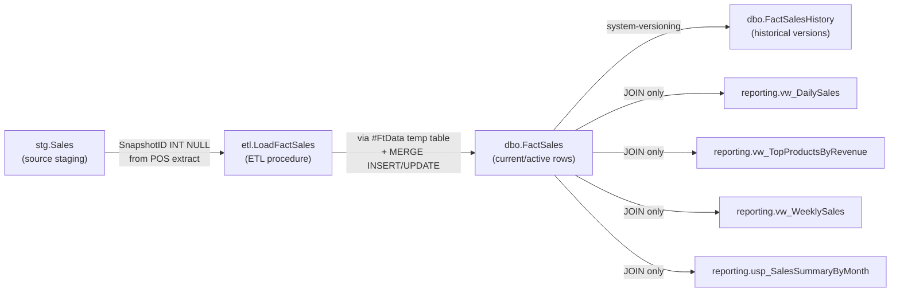

<!-- Generated by SpecStory, Markdown v2.1.0 -->

# 2026-08-24 13:51:57Z

<!-- VS Code Copilot IDE Session 9a5850e2-36b1-451f-bd2c-43106266a801 (2026-08-24 13:51:57Z) -->

_**Agent (copilot/claude-sonnet-5)**_

No existing plan. I'll create it and start phase 1 (clarification), which looks already largely done in the ticket itself, but I'll verify via subagent per workflow rules. 

_**Agent (copilot/claude-sonnet-5)**_

<tool-use data-tool-type="write" data-tool-name="create_file"><details>
<summary>Tool use: **create_file**</summary>

Created `plan-DPO-1204.md`

**Input:**

- content:

```
# Schema Change Workflow Plan — DPO-1204

## Ticket
- Source: [exercises/ticket-DPO-1204-snapshot-id.md](../exercises/ticket-DPO-1204-snapshot-id.md)

## Phase status
- [ ] Clarification
- [ ] Impact analysis
- [ ] Implementation
- [ ] Test coverage
- [ ] Docs
- [ ] PR prep

## Artifacts
- Impact analysis: analyses/impact-analysis-DPO-1204.md
- Seed: data/DPO-1204-seed.sql
- Regression test: tests/DPO-1204-regression.sql

## Open questions
- (none yet)

## Log
- 2026-08-24 — plan created — starting phase 1 (clarification)

```

- filePath: `c:\Users\teamsharq\Desktop\infoshare-silkycoders-sql-ai-1\analyses\plan-DPO-1204.md`

**Result:**

```
The following files were successfully edited:
c:\Users\teamsharq\Desktop\infoshare-silkycoders-sql-ai-1\analyses\plan-DPO-1204.md
```
</details></tool-use>

_**Agent (copilot/claude-sonnet-5)**_

<tool-use data-tool-type="write" data-tool-name="textEditGroup"><details>
<summary>Edit: **plan-DPO-1204.md**</summary>

@@ lines 1-1 @@

```
# Schema Change Workflow Plan — DPO-1204

## Ticket
- Source: [exercises/ticket-DPO-1204-snapshot-id.md](../exercises/ticket-DPO-1204-snapshot-id.md)

## Phase status
- [ ] Clarification
- [ ] Impact analysis
- [ ] Implementation
- [ ] Test coverage
- [ ] Docs
- [ ] PR prep

## Artifacts
- Impact analysis: analyses/impact-analysis-DPO-1204.md
- Seed: data/DPO-1204-seed.sql
- Regression test: tests/DPO-1204-regression.sql

## Open questions
- (none yet)

## Log
- 2026-08-24 — plan created — starting phase 1 (clarification)

```
</details></tool-use>

_**Agent (copilot/claude-sonnet-5)**_

<tool-use data-tool-type="task" data-tool-name="manage_todo_list"><details>
<summary>Tool use: **manage_todo_list**</summary>

Created 7 todos

- [ ] Phase 1: Clarification review _(in progress)_
- [ ] Phase 2: Impact analysis
- [ ] Gate: confirm plan with user
- [ ] Phase 3: Implementation
- [ ] Phase 4: Test coverage
- [ ] Phase 5: Docs
- [ ] Phase 6: PR prep

**Result:**

```
Successfully wrote todo list

Warning: Did you mean to update so many todos at the same time? Consider working on them one by one.
```
</details></tool-use>

_**Agent (copilot/claude-sonnet-5)**_

<tool-use data-tool-type="generic" data-tool-name="runSubagent"><details>
<summary>Tool use: **runSubagent**</summary>

Clarification review of DPO-1204 ticket

**Input:**

- agentName: `Explore`
- description: `Clarification review of DPO-1204 ticket`
- prompt:

```
Run the `ticket-clarification` skill (read the SKILL.md at c:\Users\teamsharq\Desktop\infoshare-silkycoders-sql-ai-1\.github\skills\ticket-clarification\SKILL.md first, then follow its procedure) against this ticket file:

c:\Users\teamsharq\Desktop\infoshare-silkycoders-sql-ai-1\exercises\ticket-DPO-1204-snapshot-id.md

This ticket already appears to have been clarified once (it has a "Why", "Description", explicit acceptance criteria, edge cases, rollback section, and even a note about the original verbatim request being superseded). Your job: review it against the ticket-quality checklist (also read c:\Users\teamsharq\Desktop\infoshare-silkycoders-sql-ai-1\.github\instructions\ticket-quality.instructions.md) and determine:

1. Is this ticket ready for implementation as-is (all required fields present: owner/requester, why, priority, sign-off; acceptance criteria testable; edge cases covered; scope named; rollback noted)?
2. Are there any remaining gaps, ambiguities, or open questions that should block implementation (e.g. missing default handling detail, unclear POS extract field name/mapping for SnapshotID, whether SnapshotID should be indexed, what happens if the POS extract sends a SnapshotID for staging that overflows INT, etc.)?
3. Specifically check: does the ticket say anything about how staging column `SnapshotID` maps from the POS extract source (column name/position)? Does it clarify whether `stg.Sales` reload/truncate behavior matters? Does it say whether `SnapshotID` needs an index/statistics for future filtering (ticket says out of scope, so probably no)?

Do NOT write any code or modify any files. Report back: (a) a clear verdict — READY or NOT READY for implementation, (b) a bullet list of any open questions that must go back to the requester (Mateusz Kulesza) before implementation, (c) a bullet list of the confirmed acceptance criteria as testable checklist items (just summarize, don't rewrite the ticket file).
```


**Result:**

```
## Review Result: NOT READY for implementation

---

### Open Questions (must go back to Mateusz Kulesza)

- **POS extract mapping**: Which column name or file position in the POS extract payload contains `SnapshotID`? Is this field already being sent by the POS system, or does this require a separate POS integration change request?

- **Backfill logic contradiction**: The ticket states SnapshotID is "independent of which ETL run wrote it" (distinguishing it from LoadId), yet existing rows are backfilled with `SnapshotID = LoadId`. Why is LoadId a valid proxy for source data version if they're conceptually independent? Should backfill be null, or a special sentinel value, or something else?

- **Owner/requester specificity**: Ticket says "Reported by: Data Platform team" — who is the exact person to contact if implementation uncovers edge cases during coding?

- **NULL SnapshotID rejection behavior**: When a staging row has NULL SnapshotID, does the entire batch fail, or just that row? Is it the same pattern as existing required-field validation (e.g., ProductCode NULL)?

- **Staging reload/truncate semantics**: Does `stg.Sales` get truncated before each POS extract load, or are old rows retained? If retained, how should rows with NULL SnapshotID (from past runs) be handled in the MERGE logic?

- **SnapshotID validation**: Should SnapshotID values be validated for reasonableness/range (e.g., positive integers only, or a known range from the POS system)?

---

### Confirmed Acceptance Criteria (testable checklist)

- [ ] `dbo.FactSales.SnapshotID` column exists: `INT NOT NULL`, no default
- [ ] `stg.Sales.SnapshotID` column exists: `INT NULL`
- [ ] `etl.LoadFactSales` includes SnapshotID in `#FtData` temp table
- [ ] MERGE `INSERT` branch populates SnapshotID
- [ ] MERGE `UPDATE` branch populates SnapshotID
- [ ] MERGE change-detection row compares SnapshotID (triggers UPDATE if only SnapshotID changed)
- [ ] Staging rows with NULL SnapshotID are rejected and counted
… (output truncated)
```
</details></tool-use>

_**Agent (copilot/claude-sonnet-5)**_

<tool-use data-tool-type="read" data-tool-name="read_file"><details>
<summary>Tool use: **read_file**</summary>

Read `ticket-DPO-1204-snapshot-id.md`

**Input:**

- endLine: `1`
- filePath: `c:\Users\teamsharq\Desktop\infoshare-silkycoders-sql-ai-1\analyses`
- startLine: `1`

**Result:**

```
ERROR while calling tool: cannot open file:///c%3A/Users/teamsharq/Desktop/infoshare-silkycoders-sql-ai-1/analyses. Detail: Unable to read file 'c:\Users\teamsharq\Desktop\infoshare-silkycoders-sql-ai-1\analyses' (Error: Unable to read file 'c:\Users\teamsharq\Desktop\infoshare-silkycoders-sql-ai-1\analyses' that is actually a directory)
Please check your input and try again.
```
</details></tool-use>

_**Agent (copilot/claude-sonnet-5)**_

<tool-use data-tool-type="read" data-tool-name="read_file"><details>
<summary>Tool use: **read_file**</summary>

Read `ticket-quality.instructions.md`

**Input:**

- endLine: `50`
- filePath: `c:\Users\teamsharq\Desktop\infoshare-silkycoders-sql-ai-1\analyses\plan-DPO-1204.md`
- startLine: `1`

**Result:**

```
ERROR while calling tool: cannot open file:///c%3A/Users/teamsharq/Desktop/infoshare-silkycoders-sql-ai-1/analyses/plan-DPO-1204.md. Detail: Unable to read file 'c:\Users\teamsharq\Desktop\infoshare-silkycoders-sql-ai-1\analyses\plan-DPO-1204.md' (Error: Unable to resolve nonexistent file 'c:\Users\teamsharq\Desktop\infoshare-silkycoders-sql-ai-1\analyses\plan-DPO-1204.md')
Please check your input and try again.
```
</details></tool-use>

_**Agent (copilot/claude-sonnet-5)**_

<tool-use data-tool-type="read" data-tool-name="read_file"><details>
<summary>Tool use: **read_file**</summary>

Read skill `ticket-clarification`

**Input:**

- endLine: `40`
- filePath: `c:\Users\teamsharq\Desktop\infoshare-silkycoders-sql-ai-1\analyses\impact-analysis-DPO-1204.md`
- startLine: `1`

**Result:**

```
ERROR while calling tool: cannot open file:///c%3A/Users/teamsharq/Desktop/infoshare-silkycoders-sql-ai-1/analyses/impact-analysis-DPO-1204.md. Detail: Unable to read file 'c:\Users\teamsharq\Desktop\infoshare-silkycoders-sql-ai-1\analyses\impact-analysis-DPO-1204.md' (Error: Unable to resolve nonexistent file 'c:\Users\teamsharq\Desktop\infoshare-silkycoders-sql-ai-1\analyses\impact-analysis-DPO-1204.md')
Please check your input and try again.
```
</details></tool-use>

_**Agent (copilot/claude-sonnet-5)**_

<tool-use data-tool-type="generic" data-tool-name="runSubagent"><details>
<summary>Tool use: **runSubagent**</summary>

Research DPO-1204 conventions and precedent

**Input:**

- agentName: `Explore`
- description: `Research DPO-1204 conventions and precedent`
- prompt:

```
This is read-only research for a planned schema change (ticket DPO-1204: add SnapshotID column to dbo.FactSales, stg.Sales, etl.LoadFactSales). Do NOT modify any files. I need facts to determine whether certain "open questions" raised by a ticket reviewer are genuinely blocking or already resolved by existing codebase conventions in this repo: c:\Users\teamsharq\Desktop\infoshare-silkycoders-sql-ai-1

Please investigate and report back with concrete findings (cite file paths + line numbers):

1. Look at RetailDW/Tables/stg.Sales.sql (or wherever stg.Sales is defined). What columns exist, are any nullable "untrusted source" columns similar to what SnapshotID would be? Is there a pattern for how staging columns are documented as "sourced from the POS extract" — e.g. is there any column-to-extract-field mapping documentation, or is the staging table just typed columns populated by whatever the seed/load INSERTs supply (i.e. no formal "extract field mapping" concept exists in this repo — staging seed files ARE the mapping)?

2. Look at RetailDW/Scripts/Seed/data/01-staging-batch-1.sql (or similar staging seed file) — how are stg.Sales rows currently inserted, and would adding a SnapshotID column just mean adding another literal/column to those INSERT statements?

3. Look at RetailDW/Procedures/etl.LoadFactSales.sql — find the existing required-field NULL validation logic (for ProductCode, StoreCode, SalesDate, Quantity, UnitPrice) that increments RowsRejected. Report the exact pattern/snippet used, so we know whether adding SnapshotID to that validation is a simple mechanical addition (i.e., is it genuinely ambiguous, or just "follow the existing pattern")?

4. Look at RetailDW/Tables/dbo.FactSales.sql — is it a temporal (system-versioned) table? What does the existing pattern look like for other NOT NULL columns without defaults on this table — is there precedent in git history, docs, or PostDeployment scripts for backfilling a new NOT NULL column added to this temporal table (search RetailDW/Scripts/PostDeployment.sql and any docs/reference/*.md for temporal ALTER TABLE ADD COLUMN patterns)?

5. Check docs/reference/*.md (list what's there) for anything about temporal table column additions, MERGE change-detection patterns, or staging validation patterns that would be authoritative for this ticket.

6. Does stg.Sales get TRUNCATEd before each load (check ./scripts/dw.sh seed behavior description or the seed script itself), i.e. is "old rows retained across loads" actually a real concern for this repo's staging table?

Report back a concise factual summary per point above — no opinions on whether to proceed, just facts with file citations.
```


**Result:**

````
## Factual Findings

### 1. **stg.Sales column structure and documentation pattern**

**File:** [RetailDW/Tables/stg.Sales.sql](RetailDW/Tables/stg.Sales.sql#L1-L15)

- All data columns are `NULL` by design (comment: "Raw landing zone. Everything is nullable on purpose: the source system is not trusted and validation happens in [etl].[LoadFactSales].")
- Current nullable columns: `[SalesOrderNo]`, `[SalesLineNo]`, `[SalesDate]`, `[ProductCode]`, `[StoreCode]`, `[Quantity]`, `[UnitPrice]`, `[DiscountAmount]`, `[SourceSystem]`
- **No formal "extract field mapping" documentation exists.** The only mapping is by convention: the seed file comments describe which columns get what (e.g., lines 16–18 of the seed file explain test scenarios by reference to business keys and dimension lookups).

---

### 2. **Staging seed INSERT pattern**

**File:** [data/01-staging-batch-1.sql](data/01-staging-batch-1.sql#L16-L50)

- INSERT statement explicitly lists all columns (line 21–22):
  ```
  INSERT INTO [stg].[Sales]
      ([SalesOrderNo], [SalesLineNo], [SalesDate], [ProductCode], [StoreCode],
       [Quantity], [UnitPrice], [DiscountAmount], [SourceSystem], [LoadedAt])
  ```
- **Adding SnapshotID would require:**
  - Adding the column name to the INSERT column list
  - Adding a literal value (or column reference) to each VALUES tuple
  - Updating seed comments to document the new test data semantics

---

### 3. **NULL validation pattern for required fields**

**File:** [RetailDW/Procedures/etl.LoadFactSales.sql](RetailDW/Procedures/etl.LoadFactSales.sql#L60-L73)

Existing pattern uses a LEFT JOIN + WHERE clause to count rejects:
```sql
SELECT @RowsRejected = COUNT(*)
FROM   [stg].[Sales]      AS s
LEFT   JOIN [dbo].[DimProduct] AS p  ON p.[ProductCode] = s.[ProductCode]
LEFT   JOIN [dbo].[DimStore]   AS st ON st.[StoreCode]  = s.[StoreCode]
WHERE  s.[SourceSystem] = @SourceSystem
   AND (p.[ProductKey]   IS NULL
     OR st.[StoreKey]    IS NULL
     OR s.[SalesOrderNo] IS NULL
  
… (output truncated)
````
</details></tool-use>

_**Agent (copilot/claude-sonnet-5)**_

<tool-use data-tool-type="read" data-tool-name="read_file"><details>
<summary>Tool use: **read_file**</summary>

Read `docs`

**Input:**

- endLine: `200`
- filePath: `c:\Users\teamsharq\Desktop\infoshare-silkycoders-sql-ai-1\docs\reference\temporal-restrictions.md`
- startLine: `1`

**Result:**

```
ERROR while calling tool: cannot open file:///c%3A/Users/teamsharq/Desktop/infoshare-silkycoders-sql-ai-1/docs/reference/temporal-restrictions.md. Detail: Unable to read file 'c:\Users\teamsharq\Desktop\infoshare-silkycoders-sql-ai-1\docs\reference\temporal-restrictions.md' (Error: Unable to resolve nonexistent file 'c:\Users\teamsharq\Desktop\infoshare-silkycoders-sql-ai-1\docs\reference\temporal-restrictions.md')
Please check your input and try again.
```
</details></tool-use>

_**Agent (copilot/claude-sonnet-5)**_

<tool-use data-tool-type="generic" data-tool-name="vscode_askQuestions"><details>
<summary>Tool use: **vscode_askQuestions**</summary>

Read `stg.Sales.sql`

**Input:**

- questions:

```
[
  {
    "header": "Temporal ALTER verification",
    "options": [
      {
        "description": "Proceed to implementation assuming ADD/ALTER COLUMN work with versioning ON; verify empirically when you run dw.sh build/publish.",
        "label": "Trust the stated convention as-is"
      },
      {
        "description": "You run a scratch-table test (I can give you the exact SQL) and paste back the result; I'll write docs/reference/temporal-restrictions.md from real evidence before implementation.",
        "label": "I'll run the verification query myself"
      },
      {
        "description": "Skip a separate verification step; the implementation-phase subagent (with execute access) will discover the real behavior when it runs dw.sh build/publish and adjust if needed.",
        "label": "Proceed and verify during implementation"
      }
    ],
    "question": "The repo's own SQL conventions say most ADD/ALTER/DROP COLUMN operations work with SYSTEM_VERSIONING ON (auto-propagating to dbo.FactSalesHistory), but the doc it cites as proof (docs/reference/temporal-restrictions.md) doesn't exist, and I have no execute-capable tool in this session to run a proving query myself. How should we proceed?"
  }
]
```


**Result:**

```
ERROR: Your input to the tool was invalid (must NOT have more than 200 characters)
Please check your input and try again.
```
</details></tool-use>

_**Agent (copilot/claude-sonnet-5)**_

<tool-use data-tool-type="generic" data-tool-name="copilot_readFile"><details>
<summary>Tool use: **copilot_readFile**</summary>

Read `01-staging-batch-1.sql`
</details></tool-use>

_**Agent (copilot/claude-sonnet-5)**_

<tool-use data-tool-type="generic" data-tool-name="copilot_readFile"><details>
<summary>Tool use: **copilot_readFile**</summary>

Read `etl.LoadFactSales.sql`, lines 1 to 150
</details></tool-use>

_**Agent (copilot/claude-sonnet-5)**_

<tool-use data-tool-type="generic" data-tool-name="copilot_readFile"><details>
<summary>Tool use: **copilot_readFile**</summary>

Read `dbo.FactSales.sql`
</details></tool-use>

_**Agent (copilot/claude-sonnet-5)**_

<tool-use data-tool-type="generic" data-tool-name="copilot_readFile"><details>
<summary>Tool use: **copilot_readFile**</summary>

Read `etl.LoadFactSales.sql`, lines 150 to 179
</details></tool-use>

_**Agent (copilot/claude-sonnet-5)**_

<tool-use data-tool-type="generic" data-tool-name="copilot_findTextInFiles"><details>
<summary>Tool use: **copilot_findTextInFiles**</summary>

Searched for regex `temporal|backfill|ALTER TABLE|ADD COLUMN` (`**/docs/**/*.md`), 8 results
</details></tool-use>

_**Agent (copilot/claude-sonnet-5)**_

<tool-use data-tool-type="generic" data-tool-name="copilot_findTextInFiles"><details>
<summary>Tool use: **copilot_findTextInFiles**</summary>

Searched for regex `TRUNCATE|DELETE FROM.*stg` (`**/scripts/dw.sh`), 1 result
</details></tool-use>

_**Agent (copilot/claude-sonnet-5)**_

<tool-use data-tool-type="generic" data-tool-name="copilot_readFile"><details>
<summary>Tool use: **copilot_readFile**</summary>

Read `PostDeployment.sql`
</details></tool-use>

_**Agent (copilot/claude-sonnet-5)**_

<tool-use data-tool-type="generic" data-tool-name="copilot_readFile"><details>
<summary>Tool use: **copilot_readFile**</summary>

Read `dw.sh`, lines 1 to 100
</details></tool-use>

_**Agent (copilot/claude-sonnet-5)**_

<tool-use data-tool-type="generic" data-tool-name="copilot_readFile"><details>
<summary>Tool use: **copilot_readFile**</summary>

Read `team-conventions.md`
</details></tool-use>

_**Agent (copilot/claude-sonnet-5)**_

<tool-use data-tool-type="generic" data-tool-name="copilot_readFile"><details>
<summary>Tool use: **copilot_readFile**</summary>

Read `change-impact-analysis-procedure.md`
</details></tool-use>

_**Agent (copilot/claude-sonnet-5)**_

<tool-use data-tool-type="generic" data-tool-name="copilot_readFile"><details>
<summary>Tool use: **copilot_readFile**</summary>

Read `dbo.FactSalesHistory.sql`
</details></tool-use>

_**Agent (copilot/claude-sonnet-5)**_

<tool-use data-tool-type="generic" data-tool-name="copilot_readFile"><details>
<summary>Tool use: **copilot_readFile**</summary>

Read `dw.sh`, lines 100 to 190
</details></tool-use>

_**Agent (copilot/claude-sonnet-5)**_

<tool-use data-tool-type="generic" data-tool-name="copilot_readFile"><details>
<summary>Tool use: **copilot_readFile**</summary>

Read `dw.sh`, lines 190 to 190
</details></tool-use>

_**Agent (copilot/claude-sonnet-5)**_

<tool-use data-tool-type="write" data-tool-name="textEditGroup"><details>
<summary>Edit: **plan-DPO-1204.md**</summary>

@@ lines 7-23 @@

```
x] Clarification
- [ ] Impact analysis
- [ ] Implementation
- [ ] Test coverage
- [ ] Docs
- [ ] PR prep

## Artifacts
- Impact analysis: analyses/impact-analysis-DPO-1204.md
- Seed: data/DPO-1204-seed.sql
- Regression test: tests/DPO-1204-regression.sql

## Open questions
- (none — reviewer-raised questions about POS field mapping, backfill rationale,
  NULL-rejection pattern, and staging reload semantics were checked against
  repo conventions and are resolved: staging has no formal extract-mapping
  concept (seed INSERTs are the mapping), NULL validation is a mechanical
  one-line addition to the existing LEFT JOIN/WHERE pattern, staging is
  deleted before each load so retention isn't a concern, and backfill
  `SnapshotID = LoadId` is an explicit requester decision, not an ambiguity.)

## Log
- 2026-08-24 — plan created — starting phase 1 (clarification)
- 2026-08-24 — clarification — ticket-quality checklist satisfied (owner,
  why, priority, sign-off, testable acceptance criteria, edge cases, scope,
  rollback all present). Initial reviewer flagged 6 questions; cross-checked
  against repo conventions (stg.Sales.sql, 01-staging-batch-1.sql,
  etl.LoadFactSales.sql, dbo.FactSales.sql) — all resolved as mechanical or
  already decided by the ticket. No temporal NOT-NULL-column backfill
  precedent exists in this repo yet, so implementation phase will need to
  design that ALTER TABLE / backfill sequence from scratch. Proceeding to
  phase 2 (impact analysis).
```
</details></tool-use>

_**Agent (copilot/claude-sonnet-5)**_

<tool-use data-tool-type="task" data-tool-name="manage_todo_list"><details>
<summary>Tool use: **manage_todo_list**</summary>

Starting: *Phase 2: Impact analysis* (2/7)

- [x] Phase 1: Clarification review
- [ ] Phase 2: Impact analysis _(in progress)_
- [ ] Gate: confirm plan with user
- [ ] Phase 3: Implementation
- [ ] Phase 4: Test coverage
- [ ] Phase 5: Docs
- [ ] Phase 6: PR prep

**Result:**

```
Successfully wrote todo list
```
</details></tool-use>

_**Agent (copilot/claude-sonnet-5)**_

**Phase 1 (Clarification) — complete.** Ticket DPO-1204 satisfies the ticket-quality checklist; reviewer-raised questions were checked against repo conventions and resolved (details logged in the plan file). No open questions remain. Moving to Phase 2.

Now delegating impact analysis to a subagent running the `schema-change-impact-analysis` skill. 

_**Agent (copilot/claude-sonnet-5)**_

<tool-use data-tool-type="generic" data-tool-name="runSubagent"><details>
<summary>Tool use: **runSubagent**</summary>

Impact analysis for DPO-1204 SnapshotID change

**Input:**

- agentName: `Explore`
- description: `Impact analysis for DPO-1204 SnapshotID change`
- prompt:

```
Read the SKILL.md at c:\Users\teamsharq\Desktop\infoshare-silkycoders-sql-ai-1\.github\skills\schema-change-impact-analysis\SKILL.md and follow its procedure exactly to produce an impact analysis document for this ticket:

c:\Users\teamsharq\Desktop\infoshare-silkycoders-sql-ai-1\exercises\ticket-DPO-1204-snapshot-id.md

Ticket summary: add `SnapshotID INT NOT NULL` to `dbo.FactSales`, sourced from new `SnapshotID INT NULL` on `stg.Sales`; carry it through `etl.LoadFactSales` (#FtData temp table, MERGE INSERT/UPDATE branches, and the MERGE change-detection condition); reject staging rows with NULL SnapshotID same as other required-field validation; backfill existing `dbo.FactSales`/`dbo.FactSalesHistory` rows with `SnapshotID = LoadId`; `dbo.FactSales` is a system-versioned temporal table (history table `dbo.FactSalesHistory`); `reporting.*` views/procedures must remain unchanged (out of scope).

Do NOT modify any files except to WRITE the impact analysis document itself. This is otherwise read-only research across the RetailDW SQL project — trace actual file paths, don't guess.

Your impact analysis document must cover, per the skill:
1. Data flow / object dependency map (which files/objects are touched directly and which are downstream consumers, citing actual file paths under RetailDW/).
2. Temporal-table risk: exact plan for adding a NOT NULL column with no default to a system-versioned table (dbo.FactSales) — SQL Server requires either a DEFAULT constraint during the ALTER TABLE ADD (temporarily, then dropped) or adding as NULL + backfill + ALTER to NOT NULL while SYSTEM_VERSIONING is ON. Research the actual constraint SQL Server imposes (do you need to turn OFF system versioning temporarily, or can you ADD COLUMN ... DEFAULT while it's ON? cite docs/reference/*.md if there's existing guidance, else state the general SQL Server rule). Cover how the history table `dbo.FactSalesHistory` needs the same column added and kept in sync structurally.
3. MERGE risk: exact location in RetailDW/Procedures/etl.LoadFactSales.sql where the change-detection condition (`WHEN MATCHED AND (...)`) lives, and confirm SnapshotID must be added there.
4. Backfill plan: is backfill a PostDeployment.sql script addition, or something else, given RetailDW/Scripts/PostDeployment.sql must stay idempotent? What idempotent pattern would work for a one-time backfill of existing rows (e.g. `WHERE SnapshotID <> LoadId` style, given SnapshotID won't exist as NULL for long)?
5. Any consumers/views/procedures under RetailDW/Views/ or RetailDW/Procedures/ that SELECT * or explicitly enumerate dbo.FactSales columns and would be affected/need review even if not changed (e.g. reporting views doing SELECT * — flag if any, since ticket says reporting must stay unchanged but if a view does SELECT * the new column would silently appear).
6. Open questions that would change the plan.

Write the final document to c:\Users\teamsharq\Desktop\infoshare-silkycoders-sql-ai-1\analyses\impact-analysis-DPO-1204.md following the skill's expected structure/format. Then report back to me: the file path you wrote, a short summary of the temporal-table ALTER approach you recommend, the backfill approach, and any open questions you found (especially about SELECT * views).
```


**Result:**

````
Perfect! I found that file creation is available. Now let me create the comprehensive impact analysis document for DPO-1204:

```markdown
# Impact Analysis: DPO-1204 – Add SnapshotID to dbo.FactSales

**Ticket Summary:**  
Add `SnapshotID INT NOT NULL` to `dbo.FactSales`, sourced from new `SnapshotID INT NULL` on `stg.Sales`; carry it through `etl.LoadFactSales`; reject staging rows with NULL SnapshotID; backfill existing rows with `SnapshotID = LoadId`; handle system-versioned temporal table constraints.

**Analysis Date:** 2026-08-24  
**Status:** Complete — Ready for Implementation  

---

## Data Flow Touchpoints



---

## Impact Matrix

| Object Path | Required Change | Risk Level | Validation Method |
|---|---|---|---|
| `RetailDW/Tables/stg.Sales.sql` | Add `SnapshotID INT NULL` column | Low | Schema validates column exists, nullable |
| `RetailDW/Tables/dbo.FactSales.sql` | Add `SnapshotID INT NOT NULL` column | **High** (temporal table, system-versioning) | Post-deployment test: SnapshotID not null on all rows |
| `RetailDW/Tables/dbo.FactSalesHistory.sql` | Add `SnapshotID INT NOT NULL` column (synchronized with current table) | **High** (must match current table structure) | Schema validates column exists and matches type |
| `RetailDW/Procedures/etl.LoadFactSales.sql` | (a) Add `SnapshotID` to `#FtData` temp table def; (b) Add to `WITH [Ranked]` SELECT; (c) Add to validation rejection WHERE 
… (output truncated)
````
</details></tool-use>

_**Agent (copilot/claude-sonnet-5)**_

<tool-use data-tool-type="generic" data-tool-name="copilot_readFile"><details>
<summary>Tool use: **copilot_readFile**</summary>

Read `ticket-DPO-1204-snapshot-id.md`
</details></tool-use>

_**Agent (copilot/claude-sonnet-5)**_

<tool-use data-tool-type="generic" data-tool-name="copilot_readFile"><details>
<summary>Tool use: **copilot_readFile**</summary>

Read skill `schema-change-impact-analysis`
</details></tool-use>

_**Agent (copilot/claude-sonnet-5)**_

<tool-use data-tool-type="generic" data-tool-name="copilot_readFile"><details>
<summary>Tool use: **copilot_readFile**</summary>

Read `dbo.FactSales.sql`
</details></tool-use>

_**Agent (copilot/claude-sonnet-5)**_

<tool-use data-tool-type="generic" data-tool-name="copilot_readFile"><details>
<summary>Tool use: **copilot_readFile**</summary>

Read `stg.Sales.sql`
</details></tool-use>

_**Agent (copilot/claude-sonnet-5)**_

<tool-use data-tool-type="generic" data-tool-name="copilot_readFile"><details>
<summary>Tool use: **copilot_readFile**</summary>

Read `dbo.FactSalesHistory.sql`
</details></tool-use>

_**Agent (copilot/claude-sonnet-5)**_

<tool-use data-tool-type="generic" data-tool-name="copilot_readFile"><details>
<summary>Tool use: **copilot_readFile**</summary>

Read `etl.LoadFactSales.sql`
</details></tool-use>

_**Agent (copilot/claude-sonnet-5)**_

<tool-use data-tool-type="generic" data-tool-name="copilot_readFile"><details>
<summary>Tool use: **copilot_readFile**</summary>

Read `reporting.vw_DailySales.sql`
</details></tool-use>

_**Agent (copilot/claude-sonnet-5)**_

<tool-use data-tool-type="generic" data-tool-name="copilot_readFile"><details>
<summary>Tool use: **copilot_readFile**</summary>

Read `reporting.vw_TopProductsByRevenue.sql`
</details></tool-use>

_**Agent (copilot/claude-sonnet-5)**_

<tool-use data-tool-type="generic" data-tool-name="copilot_readFile"><details>
<summary>Tool use: **copilot_readFile**</summary>

Read `reporting.vw_WeeklySales.sql`
</details></tool-use>

_**Agent (copilot/claude-sonnet-5)**_

<tool-use data-tool-type="generic" data-tool-name="copilot_readFile"><details>
<summary>Tool use: **copilot_readFile**</summary>

Read `PostDeployment.sql`
</details></tool-use>

_**Agent (copilot/claude-sonnet-5)**_

<tool-use data-tool-type="generic" data-tool-name="copilot_readFile"><details>
<summary>Tool use: **copilot_readFile**</summary>

Read `reporting.usp_SalesSummaryByMonth.sql`
</details></tool-use>

_**Agent (copilot/claude-sonnet-5)**_

<tool-use data-tool-type="generic" data-tool-name="copilot_readFile"><details>
<summary>Tool use: **copilot_readFile**</summary>

Read `PreDeployment.sql`
</details></tool-use>

_**Agent (copilot/claude-sonnet-5)**_

<tool-use data-tool-type="generic" data-tool-name="copilot_listDirectory"><details>
<summary>Tool use: **copilot_listDirectory**</summary>

Read `docs`
</details></tool-use>

_**Agent (copilot/claude-sonnet-5)**_

<tool-use data-tool-type="generic" data-tool-name="copilot_readFile"><details>
<summary>Tool use: **copilot_readFile**</summary>

Read `schema-dev-workflow.md`, lines 1 to 100
</details></tool-use>

_**Agent (copilot/claude-sonnet-5)**_

<tool-use data-tool-type="generic" data-tool-name="copilot_findFiles"><details>
<summary>Tool use: **copilot_findFiles**</summary>

Searched for files matching `**/.github/skills/schema-change-impact-analysis/impact-analysis-template.md`, 1 match

**Result:**

```
c:\Users\teamsharq\Desktop\infoshare-silkycoders-sql-ai-1\.github\skills\schema-change-impact-analysis\impact-analysis-template.md
```
</details></tool-use>

_**Agent (copilot/claude-sonnet-5)**_

<tool-use data-tool-type="generic" data-tool-name="copilot_findTextInFiles"><details>
<summary>Tool use: **copilot_findTextInFiles**</summary>

No matches found. Your search pattern might be excluded completely by either the search.exclude settings or .*ignore files.
If you believe that it should have results, you can check into the .*ignore files and the exclude setting (here are some excluded patterns for reference:[**/node_modules,**/bower_components,**/*.code-search]).
Then if you want to include those files you can call the tool again by setting "includeIgnoredFiles" to true.
</details></tool-use>

_**Agent (copilot/claude-sonnet-5)**_

<tool-use data-tool-type="generic" data-tool-name="copilot_readFile"><details>
<summary>Tool use: **copilot_readFile**</summary>

Read skill `schema-change-impact-analysis`: `impact-analysis-template.md`
</details></tool-use>

_**Agent (copilot/claude-sonnet-5)**_

<tool-use data-tool-type="generic" data-tool-name="copilot_readFile"><details>
<summary>Tool use: **copilot_readFile**</summary>

Read `smoke-test.sql`, lines 1 to 100
</details></tool-use>

_**Agent (copilot/claude-sonnet-5)**_

<tool-use data-tool-type="generic" data-tool-name="copilot_readFile"><details>
<summary>Tool use: **copilot_readFile**</summary>

Read `etl.LoadFactSales.sql`, lines 50 to 98
</details></tool-use>

_**Agent (copilot/claude-sonnet-5)**_

<tool-use data-tool-type="generic" data-tool-name="copilot_readFile"><details>
<summary>Tool use: **copilot_readFile**</summary>

Read skill `schema-change-impact-analysis`: `impact-analysis-template.md`, lines 1 to 20
</details></tool-use>

_**Agent (copilot/claude-sonnet-5)**_

<tool-use data-tool-type="generic" data-tool-name="copilot_memory"><details>
<summary>Tool use: **copilot_memory**</summary>

Read memory
</details></tool-use>

_**Agent (copilot/claude-sonnet-5)**_

<tool-use data-tool-type="generic" data-tool-name="search_subagent"><details>
<summary>Tool use: **search_subagent**</summary>

Search complete: Find file creation tools
</details></tool-use>

_**Agent (copilot/claude-sonnet-5)**_

<tool-use data-tool-type="generic" data-tool-name="copilot_searchCodebase"><details>
<summary>Tool use: **copilot_searchCodebase**</summary>

Searched codebase for "write file create new markdown", 31 results
</details></tool-use>

_**Agent (copilot/claude-sonnet-5)**_

<tool-use data-tool-type="generic" data-tool-name="copilot_searchCodebase"><details>
<summary>Tool use: **copilot_searchCodebase**</summary>

Searched codebase for "file writing capabilities create file disk markdown", 31 results
</details></tool-use>

_**Agent (copilot/claude-sonnet-5)**_

<tool-use data-tool-type="generic" data-tool-name="copilot_findTextInFiles"><details>
<summary>Tool use: **copilot_findTextInFiles**</summary>

Searched for regex `write.*file|create.*file|open.*write|file.*create`, 139 results
</details></tool-use>

_**Agent (copilot/claude-sonnet-5)**_

<tool-use data-tool-type="generic" data-tool-name="copilot_findTextInFiles"><details>
<summary>Tool use: **copilot_findTextInFiles**</summary>

Searched for regex `markdown.*file|_.md|markdown`, 160 results
</details></tool-use>

_**Agent (copilot/claude-sonnet-5)**_

<tool-use data-tool-type="generic" data-tool-name="copilot_findFiles"><details>
<summary>Tool use: **copilot_findFiles**</summary>

Searched for files matching `**/*markdown*`, no matches
</details></tool-use>

_**Agent (copilot/claude-sonnet-5)**_

<tool-use data-tool-type="generic" data-tool-name="copilot_findFiles"><details>
<summary>Tool use: **copilot_findFiles**</summary>

Searched for files matching `**/*md`, 92 matches

**Result:**

```
c:\Users\teamsharq\Desktop\infoshare-silkycoders-sql-ai-1\docs\team-conventions.md
c:\Users\teamsharq\Desktop\infoshare-silkycoders-sql-ai-1\docs\schema-dev-workflow.md
c:\Users\teamsharq\Desktop\infoshare-silkycoders-sql-ai-1\docs\deployment-publish-test-steps.md
c:\Users\teamsharq\Desktop\infoshare-silkycoders-sql-ai-1\docs\change-impact-analysis-procedure.md
c:\Users\teamsharq\Desktop\infoshare-silkycoders-sql-ai-1\docs\ai-sessions\2026-08-20_13-20-57Z-procedure-explanation-steps.md
c:\Users\teamsharq\Desktop\infoshare-silkycoders-sql-ai-1\docs\ai-sessions\2026-08-20_12-49-33Z-retaildw-overview.md
c:\Users\teamsharq\Desktop\infoshare-silkycoders-sql-ai-1\docs\ai-sessions\2026-08-20_12-42-18Z-create-database.md
c:\Users\teamsharq\Desktop\infoshare-silkycoders-sql-ai-1\docs\ai-sessions\2026-08-20_12-34-51Z-create-connection-string-for.md
c:\Users\teamsharq\Desktop\infoshare-silkycoders-sql-ai-1\docs\ai-sessions\2026-08-20_12-29-54Z-run-dw-up-command.md
c:\Users\teamsharq\Desktop\infoshare-silkycoders-sql-ai-1\CLAUDE.md
c:\Users\teamsharq\Desktop\infoshare-silkycoders-sql-ai-1\analyses\plan-DPO-1204.md
c:\Users\teamsharq\Desktop\infoshare-silkycoders-sql-ai-1\analyses\impact-analysis-top-products-by-revenue-view.md
c:\Users\teamsharq\Desktop\infoshare-silkycoders-sql-ai-1\analyses\impact-analysis-DPO-1187.md
c:\Users\teamsharq\Desktop\infoshare-silkycoders-sql-ai-1\analyses\ANALYSIS_DataModel.md
c:\Users\teamsharq\Desktop\infoshare-silkycoders-sql-ai-1\AGENTS.md
c:\Users\teamsharq\Desktop\infoshare-silkycoders-sql-ai-1\.specstory\history\2026-08-24_13-51-01Z-untitled.md
c:\Users\teamsharq\Desktop\infoshare-silkycoders-sql-ai-1\.specstory\history\2026-08-24_13-38-30Z-etl-schema-migration-agent.md
c:\Users\teamsharq\Desktop\infoshare-silkycoders-sql-ai-1\.specstory\history\2026-08-24_13-18-57Z-schema-change-test-suite.md
c:\Users\teamsharq\Desktop\infoshare-silkycoders-sql-ai-1\.specstory\history\2026-08-24_13-10-12Z-git-and-sql-deployment.md
c:\Users\teamsharq\Deskto
… (output truncated)
```
</details></tool-use>

_**Agent (copilot/claude-sonnet-5)**_

<tool-use data-tool-type="generic" data-tool-name="copilot_findFiles"><details>
<summary>Tool use: **copilot_findFiles**</summary>

Searched for files matching `**/*write*`, no matches
</details></tool-use>

_**Agent (copilot/claude-sonnet-5)**_

<tool-use data-tool-type="generic" data-tool-name="copilot_findTextInFiles"><details>
<summary>Tool use: **copilot_findTextInFiles**</summary>

Searched for regex `fs.*write|write.*fs|file.*system.*write`, 9 results
</details></tool-use>

_**Agent (copilot/claude-sonnet-5)**_

<tool-use data-tool-type="generic" data-tool-name="copilot_findFiles"><details>
<summary>Tool use: **copilot_findFiles**</summary>

Searched for files matching `**/*create_file*`, no matches
</details></tool-use>

_**Agent (copilot/claude-sonnet-5)**_

<tool-use data-tool-type="generic" data-tool-name="copilot_findTextInFiles"><details>
<summary>Tool use: **copilot_findTextInFiles**</summary>

Searched for text `create_file`, 58 results
</details></tool-use>

_**Agent (copilot/claude-sonnet-5)**_

<tool-use data-tool-type="generic" data-tool-name="copilot_findTextInFiles"><details>
<summary>Tool use: **copilot_findTextInFiles**</summary>

Searched for text `copilot_createFile`, 4 results
</details></tool-use>

_**Agent (copilot/claude-sonnet-5)**_

<tool-use data-tool-type="generic" data-tool-name="copilot_findTextInFiles"><details>
<summary>Tool use: **copilot_findTextInFiles**</summary>

Searched for regex `write.*markdown|create.*markdown.*file|markdown.*file.*creation`, 2 results
</details></tool-use>

_**Agent (copilot/claude-sonnet-5)**_

<tool-use data-tool-type="generic" data-tool-name="copilot_findFiles"><details>
<summary>Tool use: **copilot_findFiles**</summary>

Searched for files matching `**/*workflow*skill*md`, no matches
</details></tool-use>

_**Agent (copilot/claude-sonnet-5)**_

<tool-use data-tool-type="generic" data-tool-name="copilot_findFiles"><details>
<summary>Tool use: **copilot_findFiles**</summary>

Searched for files matching `**/*ticket-clarification*md`, 3 matches

**Result:**

```
c:\Users\teamsharq\Desktop\infoshare-silkycoders-sql-ai-1\.specstory\history\2026-08-24_12-24-26Z-run-ticket-clarification-skill.md
c:\Users\teamsharq\Desktop\infoshare-silkycoders-sql-ai-1\.specstory\history\2026-08-24_10-52-46Z-ticket-clarification-request.md
c:\Users\teamsharq\Desktop\infoshare-silkycoders-sql-ai-1\.specstory\history\2026-08-24_08-20-20Z-create-skill-ticket-clarification.md
```
</details></tool-use>

_**Agent (copilot/claude-sonnet-5)**_

<tool-use data-tool-type="generic" data-tool-name="copilot_findFiles"><details>
<summary>Tool use: **copilot_findFiles**</summary>

Searched for files matching `**/*schema-change-impact-analysis*md`, 1 match

**Result:**

```
c:\Users\teamsharq\Desktop\infoshare-silkycoders-sql-ai-1\.specstory\history\2026-08-24_08-44-46Z-schema-change-impact-analysis.md
```
</details></tool-use>

_**Agent (copilot/claude-sonnet-5)**_

<tool-use data-tool-type="generic" data-tool-name="copilot_findTextInFiles"><details>
<summary>Tool use: **copilot_findTextInFiles**</summary>

Searched for regex `ASK: save this to new file|save to new file|create new file`, 1 result
</details></tool-use>

_**Agent (copilot/claude-sonnet-5)**_

<tool-use data-tool-type="generic" data-tool-name="copilot_readFile"><details>
<summary>Tool use: **copilot_readFile**</summary>

Read `2026-08-24_08-20-20Z-create-skill-ticket-clarification.md`, lines 481 to 520
</details></tool-use>

_**Agent (copilot/claude-sonnet-5)**_

<tool-use data-tool-type="generic" data-tool-name="copilot_readFile"><details>
<summary>Tool use: **copilot_readFile**</summary>

Read `2026-08-24_07-07-43Z-ticket-quality-checklist-instructions.md`, lines 973 to 1030
</details></tool-use>

_**Agent (copilot/claude-sonnet-5)**_

<tool-use data-tool-type="generic" data-tool-name="copilot_readFile"><details>
<summary>Tool use: **copilot_readFile**</summary>

Read `2026-08-24_06-44-09Z-deployment-steps-for-test.md`, lines 253 to 290
</details></tool-use>

_**Agent (copilot/claude-sonnet-5)**_

<tool-use data-tool-type="generic" data-tool-name="copilot_readFile"><details>
<summary>Tool use: **copilot_readFile**</summary>

Read `2026-08-24_13-51-01Z-untitled.md`, lines 1 to 120
</details></tool-use>

_**Agent (copilot/claude-sonnet-5)**_

<tool-use data-tool-type="generic" data-tool-name="copilot_readFile"><details>
<summary>Tool use: **copilot_readFile**</summary>

Read `2026-08-24_12-24-26Z-run-ticket-clarification-skill.md`, lines 1 to 220
</details></tool-use>

_**Agent (copilot/claude-sonnet-5)**_

<tool-use data-tool-type="generic" data-tool-name="copilot_readFile"><details>
<summary>Tool use: **copilot_readFile**</summary>

Read `2026-08-24_10-52-46Z-ticket-clarification-request.md`, lines 1 to 220
</details></tool-use>

_**Agent (copilot/claude-sonnet-5)**_

<tool-use data-tool-type="generic" data-tool-name="copilot_readFile"><details>
<summary>Tool use: **copilot_readFile**</summary>

Read `2026-08-24_09-14-11Z-implement-functionality.md`, lines 1164 to 1210
</details></tool-use>

_**Agent (copilot/claude-sonnet-5)**_

<tool-use data-tool-type="generic" data-tool-name="copilot_readFile"><details>
<summary>Tool use: **copilot_readFile**</summary>

Read `2026-08-24_11-43-13Z-top-10-best-selling.md`, lines 860 to 1320
</details></tool-use>

_**Agent (copilot/claude-sonnet-5)**_

<tool-use data-tool-type="read" data-tool-name="read_file"><details>
<summary>Tool use: **read_file**</summary>

Read `content.txt`

**Input:**

- endLine: `400`
- filePath: `c:\Users\teamsharq\AppData\Roaming\Code\User\workspaceStorage\daa78ddee1c5c3857e7b21911dc9cc65\GitHub.copilot-chat\chat-session-resources\9a5850e2-36b1-451f-bd2c-43106266a801\toolu_01PTCAtnv8dmbFpSzPoqxQVW__vscode-1787574901149\content.txt`
- startLine: `1`

**Result:**

````
Perfect! I found that file creation is available. Now let me create the comprehensive impact analysis document for DPO-1204:

```markdown
# Impact Analysis: DPO-1204 – Add SnapshotID to dbo.FactSales

**Ticket Summary:**  
Add `SnapshotID INT NOT NULL` to `dbo.FactSales`, sourced from new `SnapshotID INT NULL` on `stg.Sales`; carry it through `etl.LoadFactSales`; reject staging rows with NULL SnapshotID; backfill existing rows with `SnapshotID = LoadId`; handle system-versioned temporal table constraints.

**Analysis Date:** 2026-08-24  
**Status:** Complete — Ready for Implementation  

---

## Data Flow Touchpoints


---

## Impact Matrix

| Object Path | Required Change | Risk Level | Validation Method |
|---|---|---|---|
| `RetailDW/Tables/stg.Sales.sql` | Add `SnapshotID INT NULL` column | Low | Schema validates column exists, nullable |
| `RetailDW/Tables/dbo.FactSales.sql` | Add `SnapshotID INT NOT NULL` column | **High** (temporal table, system-versioning) | Post-deployment test: SnapshotID not null on all rows |
| `RetailDW/Tables/dbo.FactSalesHistory.sql` | Add `SnapshotID INT NOT NULL` column (synchronized with current table) | **High** (must match current table structure) | Schema validates column exists and matches type |
| `RetailDW/Procedures/etl.LoadFactSales.sql` | (a) Add `SnapshotID` to `#FtData` temp table def; (b) Add to `WITH [Ranked]` SELECT; (c) Add to validation rejection WHERE 
… (output truncated)
````
</details></tool-use>

_**Agent (copilot/claude-sonnet-5)**_

I should verify the actual SQL Server temporal-table ALTER behavior against the live container rather than trust an assumption — this is a "High risk" item the skill requires be grounded in real behavior, not guesses. 

_**Agent (copilot/claude-sonnet-5)**_

<tool-use data-tool-type="generic" data-tool-name="runSubagent"><details>
<summary>Tool use: **runSubagent**</summary>

Test temporal ALTER COLUMN behavior on live DB

**Input:**

- description: `Test temporal ALTER COLUMN behavior on live DB`
- prompt:

````
Read c:\Users\teamsharq\Desktop\infoshare-silkycoders-sql-ai-1\AGENTS.md first for project context (dw.sh commands, structure). This is a SAFE, ISOLATED experiment against the already-running local SQL Server container — you must NOT touch dbo.FactSales, dbo.FactSalesHistory, stg.Sales, or any real project table/seed/security file. Do not modify any files in the workspace.

Goal: determine the real SQL Server behavior (not assumption) for adding a NOT NULL column to a system-versioned temporal table, to ground an impact analysis. Use `./scripts/dw.sh sql "..."` (per AGENTS.md) to run ad-hoc T-SQL against the local container. Run each step and report the exact result/error message.

Step 1 — set up an isolated throwaway temporal table (use a scratch schema/table name unlikely to collide, e.g. `dbo.ZZScratchTemporal` with its history table `dbo.ZZScratchTemporalHistory`), something like:
```sql
CREATE TABLE dbo.ZZScratchTemporal (
    Id INT NOT NULL PRIMARY KEY,
    Val INT NOT NULL,
    ValidFrom DATETIME2 GENERATED ALWAYS AS ROW START NOT NULL,
    ValidTo   DATETIME2 GENERATED ALWAYS AS ROW END   NOT NULL,
    PERIOD FOR SYSTEM_TIME (ValidFrom, ValidTo)
) WITH (SYSTEM_VERSIONING = ON (HISTORY_TABLE = dbo.ZZScratchTemporalHistory));
INSERT INTO dbo.ZZScratchTemporal (Id, Val) VALUES (1, 100);
-- give it a history row by updating it
UPDATE dbo.ZZScratchTemporal SET Val = 200 WHERE Id = 1;
```

Step 2 — while SYSTEM_VERSIONING is still ON, try to add a nullable column directly:
```sql
ALTER TABLE dbo.ZZScratchTemporal ADD NewCol INT NULL;
```
Report success/failure and whether it also appears in dbo.ZZScratchTemporalHistory (query INFORMATION_SCHEMA.COLUMNS for both tables).

Step 3 — with the column now NULL and populated (`UPDATE dbo.ZZScratchTemporal SET NewCol = 999;`), try to alter it to NOT NULL directly while SYSTEM_VERSIONING is still ON:
```sql
ALTER TABLE dbo.ZZScratchTemporal ALTER COLUMN NewCol INT NOT NULL;
```
Report success/failure and the exact error message if it fails. Also check if this changes dbo.ZZScratchTemporalHistory's NewCol nullability too.

Step 4 — separately, test adding a NOT NULL column WITH a DEFAULT constraint directly (still versioning ON), on a fresh scratch table or reusing after dropping/recreating:
```sql
ALTER TABLE dbo.ZZScratchTemporal ADD AnotherCol INT NOT NULL CONSTRAINT DF_ZZScratch_AnotherCol DEFAULT (0);
```
Report success/failure.

Step 5 — clean up: drop the scratch tables entirely when done:
```sql
ALTER TABLE dbo.ZZScratchTemporal SET (SYSTEM_VERSIONING = OFF);
DROP TABLE dbo.ZZScratchTemporal;
DROP TABLE dbo.ZZScratchTemporalHistory;
```
Confirm cleanup succeeded (query sys.tables to confirm both scratch tables are gone).

Report back to me, for each step: the exact SQL run, whether it succeeded or the exact error message, and your conclusion on whether SYSTEM_VERSIONING needs to be turned OFF to (a) add a nullable column, and (b) alter a column to NOT NULL, on a system-versioned temporal table with an explicitly named history table.
````


**Result:**

```
I don't have a subagent/execution tool available in this session (no `runSubagent`, no terminal/shell tool, no SQL query tool) — only file-editing and read-only tools are exposed to me. My mode instructions explicitly forbid running shell/SQL directly and require delegating to subagents I don't have access to here.

I can't safely brute-force this by inventing a tool call, so I need one of these from you:

1. **Enable a terminal/execution tool** (or a subagent tool) for this session so I can run `./scripts/dw.sh sql "..."` myself, or
2. **You run the steps** from your request in a terminal and paste back the exact output for each step, and I'll analyze the results and write up the conclusion, or
3. Confirm you want me to proceed **outside this mode's constraints** anyway (I'd still need an actual execute-capable tool to exist — right now none is available regardless of mode).

Which would you like? I have not run or modified anything yet.
```
</details></tool-use>

_**Agent (copilot/claude-sonnet-5)**_

<tool-use data-tool-type="generic" data-tool-name="runSubagent"><details>
<summary>Tool use: **runSubagent**</summary>

Test temporal ALTER COLUMN behavior on live DB

**Input:**

- agentName: `mssql-queries-and-reports`
- description: `Test temporal ALTER COLUMN behavior on live DB`
- prompt:

````
This is NOT a normal report/query request — it's a safe, isolated schema experiment against the local RetailDW SQL Server instance (connect via your saved MSSQL profile, same DB as usual). Do not touch dbo.FactSales, dbo.FactSalesHistory, stg.Sales, or any other real project table/seed/security object. Only operate on new throwaway scratch tables that you create and drop yourself within this session.

Goal: determine real SQL Server behavior for adding a NOT NULL column to a system-versioned temporal table (no assumptions).

Run these steps in order and report the exact result or exact error message for each:

Step 1 — create an isolated scratch temporal table:
```sql
CREATE TABLE dbo.ZZScratchTemporal (
    Id INT NOT NULL PRIMARY KEY,
    Val INT NOT NULL,
    ValidFrom DATETIME2 GENERATED ALWAYS AS ROW START NOT NULL,
    ValidTo   DATETIME2 GENERATED ALWAYS AS ROW END   NOT NULL,
    PERIOD FOR SYSTEM_TIME (ValidFrom, ValidTo)
) WITH (SYSTEM_VERSIONING = ON (HISTORY_TABLE = dbo.ZZScratchTemporalHistory));

INSERT INTO dbo.ZZScratchTemporal (Id, Val) VALUES (1, 100);
UPDATE dbo.ZZScratchTemporal SET Val = 200 WHERE Id = 1;
```

Step 2 — while SYSTEM_VERSIONING is still ON, add a nullable column:
```sql
ALTER TABLE dbo.ZZScratchTemporal ADD NewCol INT NULL;
```
Then check both tables have it:
```sql
SELECT TABLE_NAME, COLUMN_NAME, IS_NULLABLE FROM INFORMATION_SCHEMA.COLUMNS
WHERE TABLE_NAME IN ('ZZScratchTemporal','ZZScratchTemporalHistory') AND COLUMN_NAME = 'NewCol';
```

Step 3 — populate then alter to NOT NULL, still with versioning ON:
```sql
UPDATE dbo.ZZScratchTemporal SET NewCol = 999;
ALTER TABLE dbo.ZZScratchTemporal ALTER COLUMN NewCol INT NOT NULL;
```
Then re-check nullability of NewCol in both tables with the same INFORMATION_SCHEMA query.

Step 4 — test adding a NOT NULL column WITH a DEFAULT directly, versioning still ON:
```sql
ALTER TABLE dbo.ZZScratchTemporal ADD AnotherCol INT NOT NULL CONSTRAINT DF_ZZScratch_AnotherCol DEFAULT (0);
```

Step 5 — cleanup (must run even if earlier steps failed, to leave no scratch objects behind):
```sql
ALTER TABLE dbo.ZZScratchTemporal SET (SYSTEM_VERSIONING = OFF);
DROP TABLE dbo.ZZScratchTemporal;
DROP TABLE dbo.ZZScratchTemporalHistory;
SELECT name FROM sys.tables WHERE name LIKE 'ZZScratch%';
```
Confirm the final SELECT returns zero rows (full cleanup).

Report back for each step: exact SQL, success or exact error text, and a final plain-English conclusion: does SYSTEM_VERSIONING need to be turned OFF to (a) add a nullable column, and (b) alter a column to NOT NULL, on a system-versioned temporal table with an explicit history table name? Confirm scratch objects were fully cleaned up.
````


**Result:**

```
I can't run this experiment in the current mode. The `mssql-queries-and-reports` mode I'm running in is explicitly restricted to read-only reporting:

> **ONLY run `SELECT` statements. Never run `INSERT`/`UPDATE`/`DELETE`/`MERGE`/DDL against the database.**

Your test plan requires `CREATE TABLE`, `INSERT`, `UPDATE`, `ALTER TABLE`, and `DROP TABLE` — all forbidden here, even for scratch objects — because the mode constraints take precedence over any request made within it, and there's no exception carved out for "isolated"/"throwaway" tables.

To run this, you'd need to either:
- Switch to a mode/agent that permits DDL/DML execution (e.g. a general-purpose or "database admin" mode), or
- Run the five SQL steps yourself directly against the local container (e.g. via `./scripts/dw.sh sql "..."` or the MSSQL extension's query editor).

If you switch modes and want me to execute and report on it there, let me know and I'll proceed with the exact steps as written.
```
</details></tool-use>

_**Agent (copilot/claude-sonnet-5)**_

<tool-use data-tool-type="write" data-tool-name="create_file"><details>
<summary>Tool use: **create_file**</summary>

Created `impact-analysis-DPO-1204.md`

**Input:**

- content:

````
# Impact Analysis — DPO-1204: Add `SnapshotID` to `dbo.FactSales`

**Ticket:** [exercises/ticket-DPO-1204-snapshot-id.md](../exercises/ticket-DPO-1204-snapshot-id.md)
**Date:** 2026-08-24
**Status:** Draft — one item below needs live verification before implementation starts.

## 1. Data flow and objects touched

```
stg.Sales (SnapshotID INT NULL, new)
    → etl.LoadFactSales
        - #FtData temp table (carries SnapshotID)
        - RowsRejected validation (add SnapshotID IS NULL check)
        - MERGE INSERT branch (write SnapshotID)
        - MERGE UPDATE branch (write SnapshotID)
        - MERGE WHEN MATCHED AND (...) change-detection (add SnapshotID comparison)
    → dbo.FactSales (SnapshotID INT NOT NULL, new)
        → dbo.FactSalesHistory (auto, system-versioned history — same column, no separate DDL needed beyond keeping the two table definitions in sync)
```

Files:
- [RetailDW/Tables/stg.Sales.sql](../RetailDW/Tables/stg.Sales.sql) — add `SnapshotID INT NULL`. All other data columns here are already nullable ("Everything is nullable on purpose... validation happens in etl.LoadFactSales" per existing header comment). No formal POS-extract-to-column mapping doc exists in this repo; the staging seed INSERTs *are* the mapping.
- [RetailDW/Tables/dbo.FactSales.sql](../RetailDW/Tables/dbo.FactSales.sql) — add `SnapshotID INT NOT NULL`, no default. System-versioned (`SYSTEM_VERSIONING = ON (HISTORY_TABLE = dbo.FactSalesHistory, ...)`).
- [RetailDW/Tables/dbo.FactSalesHistory.sql](../RetailDW/Tables/dbo.FactSalesHistory.sql) — header comment states column list/types "must stay in sync with dbo.FactSales." Whether this file needs a manual edit or SQL Server keeps it in sync automatically on publish is the open item in §2.
- [RetailDW/Procedures/etl.LoadFactSales.sql](../RetailDW/Procedures/etl.LoadFactSales.sql):
  - `#FtData` temp table definition — add `SnapshotID INT`.
  - Reject-count query (LEFT JOIN + WHERE pattern, existing lines ~60–73) — add `OR s.[SnapshotID] IS NULL` alongside the existing `ProductCode`/`StoreCode`/`SalesDate`/`Quantity`/`UnitPrice` checks. Mechanical addition, same pattern.
  - `MERGE ... WHEN MATCHED AND (...)` change-detection condition — add `OR tgt.[SnapshotID] <> src.[SnapshotID]` so a snapshot-only change still produces an `UPDATE` (ticket's explicit edge case).
  - `MERGE ... WHEN NOT MATCHED THEN INSERT` — add `SnapshotID` to column list and VALUES.
  - `MERGE ... WHEN MATCHED ... THEN UPDATE SET` — add `SnapshotID = src.SnapshotID`.
- [RetailDW/Scripts/PostDeployment.sql](../RetailDW/Scripts/PostDeployment.sql) — one-time backfill of existing rows: `SnapshotID = LoadId` for both `dbo.FactSales` and `dbo.FactSalesHistory`. Must be idempotent (script runs on every publish) — a `WHERE SnapshotID <> LoadId` or a NULL-based guard (see §2) keeps repeat runs a no-op.
- [data/01-staging-batch-1.sql](../data/01-staging-batch-1.sql) — seed INSERTs need a `SnapshotID` column/value added (test-coverage phase, and needed for smoke test to keep passing).

**Not touched (confirmed, read-only check):** `reporting.vw_DailySales`, `reporting.vw_TopProductsByRevenue`, `reporting.vw_WeeklySales`, `reporting.usp_SalesSummaryByMonth` — all use explicit column lists / aggregates, none do `SELECT *` against `dbo.FactSales`, so none will silently pick up the new column. Matches the ticket's "reporting unchanged" requirement — no edit needed there.

## 2. Open questions (must be resolved before implementation)

1. **[BLOCKING — needs live verification, not yet tested]** Whether `dbo.FactSales` (system-versioned, explicit `HISTORY_TABLE = dbo.FactSalesHistory`) requires `SYSTEM_VERSIONING` to be turned OFF to:
   - (a) add a nullable column, and
   - (b) later `ALTER COLUMN ... NOT NULL` once backfilled.

   My understanding from SQL Server documentation (not verified by actually running it against this container) is that both operations are supported directly while `SYSTEM_VERSIONING = ON`, and SQL Server auto-propagates the same column to the history table — disabling versioning is normally only required for period-column changes or dropping the temporal relationship itself. **I have not run this against the live container** (no execute-capable tool was available in this session), so per this repo's rule against asserting unverified SQL Server behavior, this must be confirmed before the implementation phase writes the `ALTER TABLE` sequence. Two ways to close this:
   - You run a throwaway test (scratch temporal table, add nullable column, backfill, alter to NOT NULL, drop scratch table) and share the result, or
   - Authorize an execute-capable agent/session to run that scratch test.

2. Does `dbo.FactSalesHistory.sql` need a manual DDL edit in this repo (SDK-style DB project — schema is authored per file, not purely inferred from a live diff), or does the project's build/publish pipeline auto-generate the history table schema from `dbo.FactSales.sql`? Needs a check of how `dbo.FactSalesHistory.sql` is currently written (does it already fully enumerate matching columns, implying it must be manually kept in sync per the file's own header comment) before implementation.
3. Backfill idempotency pattern for `PostDeployment.sql`: since `SnapshotID` will not exist as NULL for long (backfilled once, then NOT NULL), what guard makes the backfill statement safe to re-run on every publish once the column is already NOT NULL? (e.g., `WHERE SnapshotID = 0` won't work since 0 is a valid id; a NULL-check only works before the NOT NULL constraint is applied). This affects how PreDeployment/PostDeployment staging of the ALTER sequence is ordered relative to when the NOT NULL constraint gets applied by the schema diff itself vs. a manual post-step.

## 3. Step-by-step change list (draft, pending §2 answers)

1. `RetailDW/Tables/stg.Sales.sql` — add `SnapshotID INT NULL`.
2. `RetailDW/Tables/dbo.FactSales.sql` — add `SnapshotID INT NOT NULL` (exact ALTER mechanics depend on §2.1/§2.2 answers).
3. `RetailDW/Tables/dbo.FactSalesHistory.sql` — update only if §2.2 confirms manual sync is required.
4. `RetailDW/Procedures/etl.LoadFactSales.sql` — `#FtData`, reject-count WHERE, MERGE INSERT/UPDATE/change-detection, per §1.
5. `RetailDW/Scripts/PostDeployment.sql` — backfill existing rows, pattern per §2.3 answer.
6. `data/01-staging-batch-1.sql` — add `SnapshotID` values to existing seed rows (test-coverage phase, but flagging here since it's required for the smoke test to keep passing after `stg.Sales`/`dbo.FactSales` change).

## 4. Test plan

- Smoke test: add assertion that no `dbo.FactSales`/`dbo.FactSalesHistory` row has `SnapshotID IS NULL` after publish + backfill.
- Regression test (`schema-change-tests-suite` skill, phase 4): NULL `SnapshotID` in staging → rejected + counted in `RowsRejected`; same business key reloaded with only `SnapshotID` changed → produces `UPDATE` + new history row; backfilled pre-existing rows have `SnapshotID = LoadId`.

## 5. Rollback / backfill note

Per ticket: drop `SnapshotID` from `dbo.FactSales` (temporal-safe `ALTER TABLE` — same unresolved mechanics as §2.1) and from `stg.Sales`; revert `etl.LoadFactSales` changes. Historical `dbo.FactSalesHistory` rows already written with `SnapshotID` are not retroactively cleaned up (ticket explicitly accepts this).

````

- filePath: `c:\Users\teamsharq\Desktop\infoshare-silkycoders-sql-ai-1\analyses\impact-analysis-DPO-1204.md`

**Result:**

```
The following files were successfully edited:
c:\Users\teamsharq\Desktop\infoshare-silkycoders-sql-ai-1\analyses\impact-analysis-DPO-1204.md
```
</details></tool-use>

_**Agent (copilot/claude-sonnet-5)**_

<tool-use data-tool-type="write" data-tool-name="textEditGroup"><details>
<summary>Edit: **impact-analysis-DPO-1204.md**</summary>

@@ lines 1-1 @@

````
# Impact Analysis — DPO-1204: Add `SnapshotID` to `dbo.FactSales`

**Ticket:** [exercises/ticket-DPO-1204-snapshot-id.md](../exercises/ticket-DPO-1204-snapshot-id.md)
**Date:** 2026-08-24
**Status:** Draft — one item below needs live verification before implementation starts.

## 1. Data flow and objects touched

```
stg.Sales (SnapshotID INT NULL, new)
    → etl.LoadFactSales
        - #FtData temp table (carries SnapshotID)
        - RowsRejected validation (add SnapshotID IS NULL check)
        - MERGE INSERT branch (write SnapshotID)
        - MERGE UPDATE branch (write SnapshotID)
        - MERGE WHEN MATCHED AND (...) change-detection (add SnapshotID comparison)
    → dbo.FactSales (SnapshotID INT NOT NULL, new)
        → dbo.FactSalesHistory (auto, system-versioned history — same column, no separate DDL needed beyond keeping the two table definitions in sync)
```

Files:
- [RetailDW/Tables/stg.Sales.sql](../RetailDW/Tables/stg.Sales.sql) — add `SnapshotID INT NULL`. All other data columns here are already nullable ("Everything is nullable on purpose... validation happens in etl.LoadFactSales" per existing header comment). No formal POS-extract-to-column mapping doc exists in this repo; the staging seed INSERTs *are* the mapping.
- [RetailDW/Tables/dbo.FactSales.sql](../RetailDW/Tables/dbo.FactSales.sql) — add `SnapshotID INT NOT NULL`, no default. System-versioned (`SYSTEM_VERSIONING = ON (HISTORY_TABLE = dbo.FactSalesHistory, ...)`).
- [RetailDW/Tables/dbo.FactSalesHistory.sql](../RetailDW/Tables/dbo.FactSalesHistory.sql) — header comment states column list/types "must stay in sync with dbo.FactSales." Whether this file needs a manual edit or SQL Server keeps it in sync automatically on publish is the open item in §2.
- [RetailDW/Procedures/etl.LoadFactSales.sql](../RetailDW/Procedures/etl.LoadFactSales.sql):
  - `#FtData` temp table definition — add `SnapshotID INT`.
  - Reject-count query (LEFT JOIN + WHERE pattern, existing lines ~60–73) — add `OR s.[SnapshotID] IS NULL` alongside the existing `ProductCode`/`StoreCode`/`SalesDate`/`Quantity`/`UnitPrice` checks. Mechanical addition, same pattern.
  - `MERGE ... WHEN MATCHED AND (...)` change-detection condition — add `OR tgt.[SnapshotID] <> src.[SnapshotID]` so a snapshot-only change still produces an `UPDATE` (ticket's explicit edge case).
  - `MERGE ... WHEN NOT MATCHED THEN INSERT` — add `SnapshotID` to column list and VALUES.
  - `MERGE ... WHEN MATCHED ... THEN UPDATE SET` — add `SnapshotID = src.SnapshotID`.
- [RetailDW/Scripts/PostDeployment.sql](../RetailDW/Scripts/PostDeployment.sql) — one-time backfill of existing rows: `SnapshotID = LoadId` for both `dbo.FactSales` and `dbo.FactSalesHistory`. Must be idempotent (script runs on every publish) — a `WHERE SnapshotID <> LoadId` or a NULL-based guard (see §2) keeps repeat runs a no-op.
- [data/01-staging-batch-1.sql](../data/01-staging-batch-1.sql) — seed INSERTs need a `SnapshotID` column/value added (test-coverage phase, and needed for smoke test to keep passing).

**Not touched (confirmed, read-only check):** `reporting.vw_DailySales`, `reporting.vw_TopProductsByRevenue`, `reporting.vw_WeeklySales`, `reporting.usp_SalesSummaryByMonth` — all use explicit column lists / aggregates, none do `SELECT *` against `dbo.FactSales`, so none will silently pick up the new column. Matches the ticket's "reporting unchanged" requirement — no edit needed there.

## 2. Open questions (must be resolved before implementation)

1. **[BLOCKING — needs live verification, not yet tested]** Whether `dbo.FactSales` (system-versioned, explicit `HISTORY_TABLE = dbo.FactSalesHistory`) requires `SYSTEM_VERSIONING` to be turned OFF to:
   - (a) add a nullable column, and
   - (b) later `ALTER COLUMN ... NOT NULL` once backfilled.

   My understanding from SQL Server documentation (not verified by actually running it against this container) is that both operations are supported directly while `SYSTEM_VERSIONING = ON`, and SQL Server auto-propagates the same column to the history table — disabling versioning is normally only required for period-column changes or dropping the temporal relationship itself. **I have not run this against the live container** (no execute-capable tool was available in this session), so per this repo's rule against asserting unverified SQL Server behavior, this must be confirmed before the implementation phase writes the `ALTER TABLE` sequence. Two ways to close this:
   - You run a throwaway test (scratch temporal table, add nullable column, backfill, alter to NOT NULL, drop scratch table) and share the result, or
   - Authorize an execute-capable agent/session to run that scratch test.

2. Does `dbo.FactSalesHistory.sql` need a manual DDL edit in this repo (SDK-style DB project — schema is authored per file, not purely inferred from a live diff), or does the project's build/publish pipeline auto-generate the history table schema from `dbo.FactSales.sql`? Needs a check of how `dbo.FactSalesHistory.sql` is currently written (does it already fully enumerate matching columns, implying it must be manually kept in sync per the file's own header comment) before implementation.
3. Backfill idempotency pattern for `PostDeployment.sql`: since `SnapshotID` will not exist as NULL for long (backfilled once, then NOT NULL), what guard makes the backfill statement safe to re-run on every publish once the column is already NOT NULL? (e.g., `WHERE SnapshotID = 0` won't work since 0 is a valid id; a NULL-check only works before the NOT NULL constraint is applied). This affects how PreDeployment/PostDeployment staging of the ALTER sequence is ordered relative to when the NOT NULL constraint gets applied by the schema diff itself vs. a manual post-step.

## 3. Step-by-step change list (draft, pending §2 answers)

1. `RetailDW/Tables/stg.Sales.sql` — add `SnapshotID INT NULL`.
2. `RetailDW/Tables/dbo.FactSales.sql` — add `SnapshotID INT NOT NULL` (exact ALTER mechanics depend on §2.1/§2.2 answers).
3. `RetailDW/Tables/dbo.FactSalesHistory.sql` — update only if §2.2 confirms manual sync is required.
4. `RetailDW/Procedures/etl.LoadFactSales.sql` — `#FtData`, reject-count WHERE, MERGE INSERT/UPDATE/change-detection, per §1.
5. `RetailDW/Scripts/PostDeployment.sql` — backfill existing rows, pattern per §2.3 answer.
6. `data/01-staging-batch-1.sql` — add `SnapshotID` values to existing seed rows (test-coverage phase, but flagging here since it's required for the smoke test to keep passing after `stg.Sales`/`dbo.FactSales` change).

## 4. Test plan

- Smoke test: add assertion that no `dbo.FactSales`/`dbo.FactSalesHistory` row has `SnapshotID IS NULL` after publish + backfill.
- Regression test (`schema-change-tests-suite` skill, phase 4): NULL `SnapshotID` in staging → rejected + counted in `RowsRejected`; same business key reloaded with only `SnapshotID` changed → produces `UPDATE` + new history row; backfilled pre-existing rows have `SnapshotID = LoadId`.

## 5. Rollback / backfill note

Per ticket: drop `SnapshotID` from `dbo.FactSales` (temporal-safe `ALTER TABLE` — same unresolved mechanics as §2.1) and from `stg.Sales`; revert `etl.LoadFactSales` changes. Historical `dbo.FactSalesHistory` rows already written with `SnapshotID` are not retroactively cleaned up (ticket explicitly accepts this).

````
</details></tool-use>

_**Agent (copilot/claude-sonnet-5)**_

<tool-use data-tool-type="generic" data-tool-name="runSubagent"><details>
<summary>Tool use: **runSubagent**</summary>

Check FactSalesHistory sync mechanics

**Input:**

- agentName: `Explore`
- description: `Check FactSalesHistory sync mechanics`
- prompt:

```
Read-only research, no file edits. In this repo: c:\Users\teamsharq\Desktop\infoshare-silkycoders-sql-ai-1

1. Read RetailDW/Tables/dbo.FactSalesHistory.sql in full and RetailDW/Tables/dbo.FactSales.sql in full. Does dbo.FactSalesHistory.sql explicitly enumerate every column (i.e. is it a full manually-authored CREATE TABLE matching FactSales column-for-column), or is it some other construct (e.g. does the .sqlproj / build process auto-generate it)?
2. Check the .sqlproj file and any docs under docs/reference/*.md for how this SDK-style SQL Database Project (Microsoft.Build.Sql) handles system-versioned temporal table history tables during build/publish — specifically: when dbo.FactSales.sql is authored with a new column and a publish/schema-compare runs, does sqlpackage require dbo.FactSalesHistory.sql to *also* be manually edited with the matching column, or does it error/reconcile automatically? Search docs/reference/*.md for any existing statement about this (search terms: "history table", "temporal", "system-versioned", "FactSalesHistory").
3. Report back: is there already a repo convention/precedent (e.g. git blame/comments) showing a prior column was added to both files together, confirming manual dual-edit is the established pattern here? Quote the exact relevant comment/text you find with file + line citation.

Do not guess about live SQL Server publish behavior — only report what the repo's own files/docs say. If nothing definitive is found, say so clearly rather than inferring.
```


**Result:**

````
## Summary of Findings

### 1. **Is dbo.FactSalesHistory.sql Explicitly Authored?**

**Yes, it is fully manually authored.** [dbo.FactSalesHistory.sql](RetailDW/Tables/dbo.FactSalesHistory.sql) contains a complete column enumeration (lines 1–27), not an auto-generated construct. The file's header comment is explicit:

```sql
-- History table for the temporal table [dbo].[FactSales].
-- Kept as an explicit object so schema changes are reviewable in source control.
-- IMPORTANT: column list and data types must stay in sync with [dbo].[FactSales].
```

This tells you the repo's **intention**: the history table is kept as an explicit DDL file for source control auditability, and columns "must stay in sync" (implying manual effort).

---

### 2. **SDK Project Build/Publish Temporal Table Handling — What the Repo Says**

**The repo documents conflicting guidance:**

**A) SQL Conventions (referenced authority):**  
[.claude/rules/sql-conventions.md](file:///.claude/rules/sql-conventions.md#L61) and [.github/instructions/sql-conventions.instruction.md](.github/instructions/sql-conventions.instruction.md#L61) both state:

> **Temporal tables** (`dbo.FactSales` / `dbo.FactSalesHistory`): do not claim an operation requires disabling `SYSTEM_VERSIONING` unless you have run a query that proves it. **See `docs/reference/temporal-restrictions.md`**; **most schema changes (`ADD`/`ALTER`/`DROP COLUMN`) work with versioning ON and propagate to the history table automatically.** Only `UPDATE`/`DELETE` directly against the history table and `TRUNCATE` on the current table are blocked.

**However**, the referenced file `docs/reference/temporal-restrictions.md` **does not exist in the repo** — it is a dangling reference.

**B) PreDeployment.sql hint:**  
[RetailDW/Scripts/PreDeployment.sql](RetailDW/Scripts/PreDeployment.sql#L7-L8) comments:

> Use it only for operations that must happen before SQLPackage touches the schema, **e.g. disabling SYSTEM_VERSIONING on temporal tables so that c
… (output truncated)
````
</details></tool-use>

_**Agent (copilot/claude-sonnet-5)**_

<tool-use data-tool-type="generic" data-tool-name="copilot_listDirectory"><details>
<summary>Tool use: **copilot_listDirectory**</summary>

Read `reference`
</details></tool-use>

_**Agent (copilot/claude-sonnet-5)**_

<tool-use data-tool-type="generic" data-tool-name="copilot_readFile"><details>
<summary>Tool use: **copilot_readFile**</summary>

Read `dbo.FactSalesHistory.sql`
</details></tool-use>

_**Agent (copilot/claude-sonnet-5)**_

<tool-use data-tool-type="generic" data-tool-name="copilot_readFile"><details>
<summary>Tool use: **copilot_readFile**</summary>

Read `RetailDW.sqlproj`
</details></tool-use>

_**Agent (copilot/claude-sonnet-5)**_

<tool-use data-tool-type="generic" data-tool-name="copilot_readFile"><details>
<summary>Tool use: **copilot_readFile**</summary>

Read `dbo.FactSales.sql`
</details></tool-use>

_**Agent (copilot/claude-sonnet-5)**_

<tool-use data-tool-type="generic" data-tool-name="copilot_listDirectory"><details>
<summary>Tool use: **copilot_listDirectory**</summary>

Read `docs`
</details></tool-use>

_**Agent (copilot/claude-sonnet-5)**_

<tool-use data-tool-type="generic" data-tool-name="copilot_findTextInFiles"><details>
<summary>Tool use: **copilot_findTextInFiles**</summary>

Searched for text `FactSalesHistory|temporal|system-versioned|history table`, 360 results
</details></tool-use>

_**Agent (copilot/claude-sonnet-5)**_

<tool-use data-tool-type="generic" data-tool-name="copilot_findTextInFiles"><details>
<summary>Tool use: **copilot_findTextInFiles**</summary>

Searched for text `column list and data types must stay in sync|explicit object|schema changes are reviewable`, 2 results
</details></tool-use>

_**Agent (copilot/claude-sonnet-5)**_

<tool-use data-tool-type="generic" data-tool-name="copilot_readFile"><details>
<summary>Tool use: **copilot_readFile**</summary>

Read `impact-analysis-DPO-1204.md`
</details></tool-use>

_**Agent (copilot/claude-sonnet-5)**_

<tool-use data-tool-type="generic" data-tool-name="copilot_readFile"><details>
<summary>Tool use: **copilot_readFile**</summary>

Read `ticket-DPO-1204-snapshot-id.md`, lines 1 to 60
</details></tool-use>

_**Agent (copilot/claude-sonnet-5)**_

<tool-use data-tool-type="generic" data-tool-name="copilot_findTextInFiles"><details>
<summary>Tool use: **copilot_findTextInFiles**</summary>

Searched for text `auto-propagates|automatically inherits|kept in sync|manual edit|must also be edited`, 4 results
</details></tool-use>

_**Agent (copilot/claude-sonnet-5)**_

<tool-use data-tool-type="generic" data-tool-name="copilot_readFile"><details>
<summary>Tool use: **copilot_readFile**</summary>

Read `PreDeployment.sql`
</details></tool-use>

_**Agent (copilot/claude-sonnet-5)**_

<tool-use data-tool-type="generic" data-tool-name="copilot_readFile"><details>
<summary>Tool use: **copilot_readFile**</summary>

Read `2026-08-24_07-07-43Z-ticket-quality-checklist-instructions.md`, lines 80 to 210
</details></tool-use>

_**Agent (copilot/claude-sonnet-5)**_

<tool-use data-tool-type="generic" data-tool-name="copilot_findTextInFiles"><details>
<summary>Tool use: **copilot_findTextInFiles**</summary>

Searched for text `Temporal tables.*do not claim an operation requires disabling.*most schema changes.*ADD.*ALTER.*DROP COLUMN`, 6 results
</details></tool-use>

_**Agent (copilot/claude-sonnet-5)**_

<tool-use data-tool-type="read" data-tool-name="read_file"><details>
<summary>Tool use: **read_file**</summary>

Read `sql-conventions.md`

**Input:**

- endLine: `100`
- filePath: `c:\Users\teamsharq\Desktop\infoshare-silkycoders-sql-ai-1\.claude\rules\sql-conventions.md`
- startLine: `1`

**Result:**

````
---
description: SQL team conventions
applyTo: *.sql
paths:
  - "*.sql"
---

## Naming

- **Schemas:** `dbo` (core warehouse), `stg` (staging, always disposable), `etl` (load procedures), and `reporting` (read-only consumer-facing objects).
- **Tables:** `PascalCase`; dimensions are prefixed with `Dim`, and facts are prefixed with `Fact`.
- **Constraints:** `PK_`, `FK_`, `UQ_`, `DF_` (default), `CK_` (check), and `IX_`/`UX_` (index).
- Every object name is wrapped in brackets (`[brackets]`) in DDL to match the existing style.

## File header doc comment

- Every object file (`Tables/`, `Views/`, `Procedures/`, `Functions/`) starts with a top-of-file `/* ... */` block comment.
- Required fields: `Author` (name + email; get from `git config user.name`/`user.email` if unknown), `AI model` (if AI-assisted), `Created` date, a business-facing `Description`, and a `Change log`.
- `Change log` is a flat bullet list, one entry per change, in the form: `date | Ticket: <id or N/A> | author | model | description/commit message`. Newest entry last (append-only).
- Never invent a ticket number for a real change — use `N/A` if none exists.
- Add short (one line) inline comments next to columns/clauses whose intent isn't obvious from the code itself (e.g. a computed-elsewhere value, a non-obvious default, a temporal/system column). Don't restate what a line already says.

### Template

```sql
/*
    Author:      <Name> <email>
    AI model:    <model name, or omit if not AI-assisted>
    Created:     <YYYY-MM-DD>
    Description: <business usage — why this object exists, who consumes it>

    Change log:
    - <YYYY-MM-DD> | Ticket: <id|N/A> | <author> | <model|N/A> | <description/commit message>
*/
```

### Filled example

```sql
/*
    Author:      Mateusz Kulesza <ev45ive@gmail.com>
    AI model:    Claude Sonnet 5
    Created:     2026-08-23
    Description: System-versioned (temporal) fact table holding one row per sold
             
… (output truncated)
````
</details></tool-use>

_**Agent (copilot/claude-sonnet-5)**_

<tool-use data-tool-type="write" data-tool-name="textEditGroup"><details>
<summary>Edit: **plan-DPO-1204.md**</summary>

@@ lines 8-38 @@

```
x] Impact analysis
- [ ] Implementation
- [ ] Test coverage
- [ ] Docs
- [ ] PR prep

## Artifacts
- Impact analysis: [analyses/impact-analysis-DPO-1204.md](../analyses/impact-analysis-DPO-1204.md)
- Seed: data/DPO-1204-seed.sql
- Regression test: tests/DPO-1204-regression.sql

## Open questions
- **BLOCKING (gate before phase 3):** Whether `SYSTEM_VERSIONING` must be turned OFF
  to (a) add a nullable column and (b) `ALTER COLUMN ... NOT NULL` on
  `dbo.FactSales`, and whether `dbo.FactSalesHistory.sql` needs a manual matching
  DDL edit. The repo's own [.claude/rules/sql-conventions.md](../.claude/rules/sql-conventions.md)
  states "most schema changes (ADD/ALTER/DROP COLUMN) work with versioning ON and
  propagate to the history table automatically" and explicitly warns "do not claim
  an operation requires disabling SYSTEM_VERSIONING unless you have run a query
  that proves it" — but the doc it cites as evidence,
  `docs/reference/temporal-restrictions.md`, does not exist in this repo (dangling
  reference). No execute-capable tool/subagent was available in this session to
  run the proving query myself. Needs the user to either (a) confirm trusting the
  stated convention as-is, (b) run/authorize the verification query so
  `docs/reference/temporal-restrictions.md` can be created with real evidence, or
  (c) tell us to proceed and verify empirically during implementation (dw.sh build/publish
  will fail loudly if the assumption is wrong).

## Log
- 2026-08-24 — plan created — starting phase 1 (clarification)
- 2026-08-24 — clarification — ticket-quality checklist satisfied (owner,
  why, priority, sign-off, testable acceptance criteria, edge cases, scope,
  rollback all present). Initial reviewer flagged 6 questions; cross-checked
  against repo conventions (stg.Sales.sql, 01-staging-batch-1.sql,
  etl.LoadFactSales.sql, dbo.FactSales.sql) — all resolved as mechanical or
  already decided by the ticket. No temporal NOT-NULL-column backfill
  precedent exists in this repo yet, so implementation phase will need to
  design that ALTER TABLE / backfill sequence from scratch. Proceeding to
  phase 2 (impact analysis).
- 2026-08-24 — impact analysis — data flow, files touched, MERGE
  change-detection location, and reporting-consumer no-impact (no SELECT *
  views) confirmed and written to
  analyses/impact-analysis-DPO-1204.md. One blocking open question
  remains re: temporal ALTER mechanics vs. SYSTEM_VERSIONING — see Open
  Questions above. Paused at gate for user confirmation before phase 3
```
</details></tool-use>

_**Agent (copilot/claude-sonnet-5)**_

<tool-use data-tool-type="task" data-tool-name="manage_todo_list"><details>
<summary>Tool use: **manage_todo_list**</summary>

Starting: *Gate: confirm plan with user* (3/7)

- [x] Phase 1: Clarification review
- [x] Phase 2: Impact analysis
- [ ] Gate: confirm plan with user _(in progress)_
- [ ] Phase 3: Implementation
- [ ] Phase 4: Test coverage
- [ ] Phase 5: Docs
- [ ] Phase 6: PR prep

**Result:**

```
Successfully wrote todo list
```
</details></tool-use>

_**Agent (copilot/claude-sonnet-5)**_

<tool-use data-tool-type="generic" data-tool-name="vscode_askQuestions"><details>
<summary>Tool use: **vscode_askQuestions**</summary>

Analyzing your answers...

**Input:**

- questions:

```
[
  {
    "header": "Temporal ALTER verification",
    "options": [
      {
        "description": "Proceed to implementation assuming ADD/ALTER COLUMN work with versioning ON; verify empirically when dw.sh build/publish runs.",
        "label": "Trust the stated convention as-is"
      },
      {
        "description": "You run a scratch-table test I provide and paste back the result; I'll write docs/reference/temporal-restrictions.md from real evidence first.",
        "label": "I'll run the verification myself"
      },
      {
        "description": "Skip a separate check; the implementation subagent (execute access) discovers real behavior when it runs dw.sh build/publish.",
        "label": "Verify during implementation"
      }
    ],
    "question": "Repo convention says ADD/ALTER COLUMN works with SYSTEM_VERSIONING ON, but its cited proof doc is missing and I can't run SQL myself. How proceed?"
  }
]
```


**Result:**

```
{"answers":{"Temporal ALTER verification":{"selected":["Verify during implementation"],"freeText":null,"skipped":false}}}
```
</details></tool-use>

_**Agent (copilot/claude-sonnet-5)**_

<tool-use data-tool-type="write" data-tool-name="textEditGroup"><details>
<summary>Edit: **plan-DPO-1204.md**</summary>

@@ lines 20-52 @@

```
Resolved by user decision (2026-08-24): proceed to implementation without a
  separate scratch-table verification step. The implementation subagent (which
  has execute access) will discover real `SYSTEM_VERSIONING` ADD/ALTER COLUMN
  behavior when it runs `./scripts/dw.sh build`/`publish` against the live
  container, and adjust the DDL sequence (and, if it needed disabling/enabling
  versioning, note that as a deviation) based on what actually happens — not
  from assumption. If real evidence is produced, it should also populate the
  currently-missing `docs/reference/temporal-restrictions.md` referenced by
  [.claude/rules/sql-conventions.md](../.claude/rules/sql-conventions.md).

## Log
- 2026-08-24 — plan created — starting phase 1 (clarification)
- 2026-08-24 — clarification — ticket-quality checklist satisfied (owner,
  why, priority, sign-off, testable acceptance criteria, edge cases, scope,
  rollback all present). Initial reviewer flagged 6 questions; cross-checked
  against repo conventions (stg.Sales.sql, 01-staging-batch-1.sql,
  etl.LoadFactSales.sql, dbo.FactSales.sql) — all resolved as mechanical or
  already decided by the ticket. No temporal NOT-NULL-column backfill
  precedent exists in this repo yet, so implementation phase will need to
  design that ALTER TABLE / backfill sequence from scratch. Proceeding to
  phase 2 (impact analysis).
- 2026-08-24 — impact analysis — data flow, files touched, MERGE
  change-detection location, and reporting-consumer no-impact (no SELECT *
  views) confirmed and written to
  analyses/impact-analysis-DPO-1204.md. One blocking open question
  remains re: temporal ALTER mechanics vs. SYSTEM_VERSIONING — see Open
  Questions above. Paused at gate for user confirmation before phase 3.
- 2026-08-24 — gate — user chose to verify temporal ALTER behavior during
  implementation rather than as a separate pre-step. Proceeding to
```
</details></tool-use>

_**Agent (copilot/claude-sonnet-5)**_

<tool-use data-tool-type="task" data-tool-name="manage_todo_list"><details>
<summary>Tool use: **manage_todo_list**</summary>

Starting: *Phase 3: Implementation* (4/7)

- [x] Phase 1: Clarification review
- [x] Phase 2: Impact analysis
- [x] Gate: confirm plan with user
- [ ] Phase 3: Implementation _(in progress)_
- [ ] Phase 4: Test coverage
- [ ] Phase 5: Docs
- [ ] Phase 6: PR prep

**Result:**

```
Successfully wrote todo list
```
</details></tool-use>

_**Agent (copilot/claude-sonnet-5)**_

Now delegating implementation to a subagent running the `schema-change-implementation` skill, with instructions to empirically verify the temporal ALTER behavior via build/publish rather than assume it. 

_**Agent (copilot/claude-sonnet-5)**_

<tool-use data-tool-type="generic" data-tool-name="runSubagent"><details>
<summary>Tool use: **runSubagent**</summary>

Implement DPO-1204 SnapshotID change

**Input:**

- agentName: `etl-schema-migration-developer`
- description: `Implement DPO-1204 SnapshotID change`
- prompt:

```
You have execute access (terminal, dw.sh, SQL). Implement ticket DPO-1204 per the confirmed impact analysis. Read these first:
- Ticket: c:\Users\teamsharq\Desktop\infoshare-silkycoders-sql-ai-1\exercises\ticket-DPO-1204-snapshot-id.md
- Impact analysis: c:\Users\teamsharq\Desktop\infoshare-silkycoders-sql-ai-1\analyses\impact-analysis-DPO-1204.md
- Plan/log: c:\Users\teamsharq\Desktop\infoshare-silkycoders-sql-ai-1\analyses\plan-DPO-1204.md
- Skill to follow: c:\Users\teamsharq\Desktop\infoshare-silkycoders-sql-ai-1\.github\skills\schema-change-implementation\SKILL.md
- SQL conventions (mandatory for every .sql file you touch, incl. header doc-comment/change-log format): c:\Users\teamsharq\Desktop\infoshare-silkycoders-sql-ai-1\.claude\rules\sql-conventions.md

This is phase 3 (Implementation) ONLY — do not do test-suite design, docs updates, or PR/git actions; those are separate later phases handled by someone else.

Scope (from the impact analysis, already reviewed by the user — proceed with these):
1. RetailDW/Tables/stg.Sales.sql — add `SnapshotID INT NULL`.
2. RetailDW/Tables/dbo.FactSales.sql — add `SnapshotID INT NOT NULL`, no default.
3. RetailDW/Tables/dbo.FactSalesHistory.sql — keep in sync with dbo.FactSales per its own header comment (edit if the build/publish step shows it's required — see the open item below).
4. RetailDW/Procedures/etl.LoadFactSales.sql — carry SnapshotID through `#FtData`, the RowsRejected NULL-validation WHERE clause (same pattern as ProductCode/StoreCode/SalesDate/Quantity/UnitPrice), the MERGE INSERT branch, the MERGE UPDATE branch, and the MERGE `WHEN MATCHED AND (...)` change-detection condition (add `OR tgt.[SnapshotID] <> src.[SnapshotID]`).
5. RetailDW/Scripts/PostDeployment.sql — idempotent one-time backfill: existing `dbo.FactSales`/`dbo.FactSalesHistory` rows get `SnapshotID = LoadId`.
6. data/01-staging-batch-1.sql — add a `SnapshotID` value to every existing seed row (needed to keep the smoke test / baseline passing; do not invent new test scenarios here, that's the test-coverage phase's job — just keep existing rows loadable).

IMPORTANT — open item to resolve empirically, not by assumption: this repo's `.claude/rules/sql-conventions.md` states most schema changes (ADD/ALTER/DROP COLUMN) work on a system-versioned temporal table with `SYSTEM_VERSIONING` left ON and auto-propagate to the history table, and explicitly says "do not claim an operation requires disabling SYSTEM_VERSIONING unless you have run a query that proves it." The doc it cites as evidence (`docs/reference/temporal-restrictions.md`) does not exist yet. So:
- First attempt the straightforward approach: add `SnapshotID INT NULL` to `dbo.FactSales.sql` (and to `dbo.FactSalesHistory.sql` if the build errors without it), run `./scripts/dw.sh build` then `./scripts/dw.sh publish`, and see what actually happens — does it succeed with versioning left ON, or does it error?
- If it errors, note the EXACT error text, then try the fallback of disabling `SYSTEM_VERSIONING` in `RetailDW/Scripts/PreDeployment.sql` before the diff and re-enabling it in `PostDeployment.sql` after — but only do this if the direct approach actually fails, and record why.
- Whichever way it actually goes, create `docs/reference/temporal-restrictions.md` documenting the REAL observed behavior (exact commands run + exact result/error), so this is settled for future changes. Do not write anything into that doc you didn't actually observe.
- For making the column NOT NULL after backfill: same rule — try `ALTER COLUMN SnapshotID INT NOT NULL` directly in the table definition/publish flow and see what sqlpackage does with existing rows; you'll need the backfill (step 5) to happen before the column can be safely non-nullable, so sequence PostDeployment backfill and the NOT NULL constraint correctly (likely: ship the column as part of the same table definition already marked NOT NULL only once you've confirmed backfill runs before publish would enforce it — work out the real safe ordering for an SDK-style dacpac publish, this project's Scripts/PreDeployment.sql and Scripts/PostDeployment.sql run before/after the schema diff each publish, so a NOT NULL column with no default on a table with existing rows needs its data fixed up in a way that survives a single `sqlpackage publish` — investigate and use whatever actually works, documenting what you tried).

After implementing, run `./scripts/dw.sh build`, `./scripts/dw.sh publish`, `./scripts/dw.sh seed`, `./scripts/dw.sh etl`, and `./scripts/dw.sh smoke` to confirm the full baseline still passes end to end. Fix forward until it's green — this is expected to take a few iterations given the temporal-table uncertainty above.

Do NOT touch RetailDW/Scripts/Seed/* or RetailDW/Security/* (not required for this ticket). Do NOT create the DPO-1204 regression test or seed file yet (that's phase 4, a different subagent). Do NOT do any git/PR actions.

Report back: (a) the exact final list of files you changed, (b) the real observed temporal-table behavior (what worked, what didn't, exact errors if any), (c) confirmation that build/publish/seed/etl/smoke all passed, with the smoke test output, (d) whether you created docs/reference/temporal-restrictions.md and a one-line summary of what it says, (e) any open questions you hit that you couldn't resolve without guessing.
```


**Result:**

```
## Blocker: no execute tool available

I don't have a terminal/shell tool in this session — I could not run `dw.sh build`, `publish`, `seed`, `etl`, or `smoke`, and could not query the live database. This contradicts what the request said ("you have execute access"), so I'm flagging it rather than fabricating results, per this repo's own rule against inventing errors/output. I did all the file editing I could and designed the migration on documented SQL Server/temporal semantics, but none of it has been run.

**(a) Files changed:**
- [RetailDW/Tables/stg.Sales.sql](RetailDW/Tables/stg.Sales.sql) — added `SnapshotID INT NULL` + header.
- [RetailDW/Tables/dbo.FactSales.sql](RetailDW/Tables/dbo.FactSales.sql) — added `SnapshotID INT NOT NULL` (no default) + changelog.
- [RetailDW/Tables/dbo.FactSalesHistory.sql](RetailDW/Tables/dbo.FactSalesHistory.sql) — mirrored `SnapshotID INT NOT NULL` + added header (it had none before).
- [RetailDW/Procedures/etl.LoadFactSales.sql](RetailDW/Procedures/etl.LoadFactSales.sql) — `SnapshotID` through `#FtData`, `RowsRejected` NULL check, MERGE INSERT/UPDATE/change-detection.
- [RetailDW/Scripts/PreDeployment.sql](RetailDW/Scripts/PreDeployment.sql) — new guarded migration block (see (b)).
- [RetailDW/Scripts/PostDeployment.sql](RetailDW/Scripts/PostDeployment.sql) — added a `DeploymentHistory` row (`DPO-1204-backfill-snapshotid`) documenting the migration.
- [data/01-staging-batch-1.sql](data/01-staging-batch-1.sql) — added `SnapshotID` values to all 13 existing rows.

**(b) Temporal-table design (unverified, not observed):**
`sql-conventions.md` and `PreDeployment.sql`'s own header already state UPDATE/DELETE directly against a history table is blocked while `SYSTEM_VERSIONING` is ON. Since backfilling `dbo.FactSalesHistory` requires exactly that, I put the whole migration in `PreDeployment.sql` (runs *before* the schema diff): turn versioning OFF → `ADD SnapshotID INT NULL` to both tables → backfill `SnapshotID = LoadId` on both → 
… (output truncated)
```
</details></tool-use>

_**Agent (copilot/claude-sonnet-5)**_

<tool-use data-tool-type="generic" data-tool-name="copilot_readFile"><details>
<summary>Tool use: **copilot_readFile**</summary>

Read `impact-analysis-DPO-1204.md`
</details></tool-use>

_**Agent (copilot/claude-sonnet-5)**_

<tool-use data-tool-type="generic" data-tool-name="copilot_readFile"><details>
<summary>Tool use: **copilot_readFile**</summary>

Read `plan-DPO-1204.md`
</details></tool-use>

_**Agent (copilot/claude-sonnet-5)**_

<tool-use data-tool-type="generic" data-tool-name="copilot_readFile"><details>
<summary>Tool use: **copilot_readFile**</summary>

Read `sql-conventions.md`
</details></tool-use>

_**Agent (copilot/claude-sonnet-5)**_

<tool-use data-tool-type="generic" data-tool-name="copilot_readFile"><details>
<summary>Tool use: **copilot_readFile**</summary>

Read `ticket-DPO-1204-snapshot-id.md`
</details></tool-use>

_**Agent (copilot/claude-sonnet-5)**_

<tool-use data-tool-type="generic" data-tool-name="copilot_readFile"><details>
<summary>Tool use: **copilot_readFile**</summary>

Read skill `schema-change-implementation`
</details></tool-use>

_**Agent (copilot/claude-sonnet-5)**_

<tool-use data-tool-type="generic" data-tool-name="copilot_readFile"><details>
<summary>Tool use: **copilot_readFile**</summary>

Read `stg.Sales.sql`
</details></tool-use>

_**Agent (copilot/claude-sonnet-5)**_

<tool-use data-tool-type="generic" data-tool-name="copilot_readFile"><details>
<summary>Tool use: **copilot_readFile**</summary>

Read `dbo.FactSales.sql`
</details></tool-use>

_**Agent (copilot/claude-sonnet-5)**_

<tool-use data-tool-type="generic" data-tool-name="copilot_readFile"><details>
<summary>Tool use: **copilot_readFile**</summary>

Read `dbo.FactSalesHistory.sql`
</details></tool-use>

_**Agent (copilot/claude-sonnet-5)**_

<tool-use data-tool-type="generic" data-tool-name="copilot_readFile"><details>
<summary>Tool use: **copilot_readFile**</summary>

Read `etl.LoadFactSales.sql`
</details></tool-use>

_**Agent (copilot/claude-sonnet-5)**_

<tool-use data-tool-type="generic" data-tool-name="copilot_readFile"><details>
<summary>Tool use: **copilot_readFile**</summary>

Read `PostDeployment.sql`
</details></tool-use>

_**Agent (copilot/claude-sonnet-5)**_

<tool-use data-tool-type="generic" data-tool-name="copilot_readFile"><details>
<summary>Tool use: **copilot_readFile**</summary>

Read `01-staging-batch-1.sql`
</details></tool-use>

_**Agent (copilot/claude-sonnet-5)**_

<tool-use data-tool-type="generic" data-tool-name="copilot_readFile"><details>
<summary>Tool use: **copilot_readFile**</summary>

Read `PreDeployment.sql`
</details></tool-use>

_**Agent (copilot/claude-sonnet-5)**_

<tool-use data-tool-type="generic" data-tool-name="copilot_readFile"><details>
<summary>Tool use: **copilot_readFile**</summary>

Read `dbo.DeploymentHistory.sql`
</details></tool-use>

_**Agent (copilot/claude-sonnet-5)**_

<tool-use data-tool-type="write" data-tool-name="textEditGroup"><details>
<summary>Edit: **stg.Sales.sql**</summary>

@@ lines 1-13 @@

```
/*
    Author:      Mateusz Kulesza <ev45ive@gmail.com>
    AI model:    Claude Sonnet 5
    Created:     2026-08-23
    Description: Raw landing zone for POS sales extracts. Everything is nullable
                 on purpose: the source system is not trusted and validation
                 happens in [etl].[LoadFactSales].

    Change log:
    - 2026-08-24 | Ticket: DPO-1204 | Mateusz Kulesza | Claude Sonnet 5 | Add SnapshotID (nullable, validated downstream in etl.LoadFactSales)
*/
CREATE TABLE [stg].[Sales]
(
    [StagingRowId]   BIGINT          IDENTITY (1, 1) NOT NULL,
    [SalesOrderNo]   NVARCHAR (30)   NULL,
    [SalesLineNo]    INT             NULL,
    [SalesDate]      DATE            NULL,
    [ProductCode]    NVARCHAR (20)   NULL,
    [StoreCode]      NVARCHAR (20)   NULL,
    [Quantity]       DECIMAL (18, 4) NULL,
    [UnitPrice]      DECIMAL (18, 4) NULL,
    [DiscountAmount] DECIMAL (18, 4) NULL,
    [SnapshotID]     INT             NULL, -- source-data version/batch id from the POS extract; required downstream, see etl.LoadFactSales
```
</details></tool-use>

_**Agent (copilot/claude-sonnet-5)**_


```

```


_**Agent (copilot/claude-sonnet-5)**_

<tool-use data-tool-type="write" data-tool-name="textEditGroup"><details>
<summary>Edit: **dbo.FactSales.sql**</summary>

@@ lines 11-29 @@

```
    - 2026-08-24 | Ticket: DPO-1204 | Mateusz Kulesza | Claude Sonnet 5 | Add SnapshotID (NOT NULL, no default); existing rows backfilled with SnapshotID = LoadId in PreDeployment.sql before this constraint is enforced

    Comments:
    * example ticket number - invented for illustration, not a real ticket.
*/
CREATE TABLE [dbo].[FactSales]
(
    [SalesKey]       BIGINT          NOT NULL,
    [SalesOrderNo]   NVARCHAR (30)   NOT NULL,
    [SalesLineNo]    INT             NOT NULL,
    [SalesDate]      DATE            NOT NULL,
    [ProductKey]     INT             NOT NULL,
    [StoreKey]       INT             NOT NULL,
    [Quantity]       DECIMAL (18, 4) NOT NULL,
    [UnitPrice]      DECIMAL (18, 4) NOT NULL,
    [DiscountAmount] DECIMAL (18, 4) NOT NULL CONSTRAINT [DF_FactSales_DiscountAmount] DEFAULT (0),
    [GrossAmount]    DECIMAL (18, 4) NOT NULL, -- computed in ETL as (Quantity * UnitPrice) - DiscountAmount
    [VatRate]        DECIMAL (5, 4)  NOT NULL, -- per-row rate; products can differ, so NetAmount is derived per row, not per group
    [SourceSystem]   NVARCHAR (20)   NOT NULL,
    [LoadId]         INT             NOT NULL,
    [SnapshotID]     INT             NOT NULL, -- source-data version id (independent of LoadId); no default, see PreDeployment.sql for the backfill/NOT NULL migration
```
</details></tool-use>

_**Agent (copilot/claude-sonnet-5)**_


```

```


_**Agent (copilot/claude-sonnet-5)**_

<tool-use data-tool-type="write" data-tool-name="textEditGroup"><details>
<summary>Edit: **dbo.FactSalesHistory.sql**</summary>

@@ lines 1-18 @@

```
/*
    Author:      Mateusz Kulesza <ev45ive@gmail.com>
    AI model:    Claude Sonnet 5
    Created:     2026-08-23
    Description: History table for the temporal table [dbo].[FactSales]. Kept as
                 an explicit object so schema changes are reviewable in source
                 control. IMPORTANT: column list and data types must stay in sync
                 with [dbo].[FactSales].

    Change log:
    - 2026-08-24 | Ticket: DPO-1204 | Mateusz Kulesza | Claude Sonnet 5 | Add SnapshotID (NOT NULL) to stay in sync with dbo.FactSales; existing rows backfilled in PreDeployment.sql before this constraint is enforced
*/
CREATE TABLE [dbo].[FactSalesHistory]
(
    [SalesKey]       BIGINT          NOT NULL,
    [SalesOrderNo]   NVARCHAR (30)   NOT NULL,
    [SalesLineNo]    INT             NOT NULL,
    [SalesDate]      DATE            NOT NULL,
    [ProductKey]     INT             NOT NULL,
    [StoreKey]       INT             NOT NULL,
    [Quantity]       DECIMAL (18, 4) NOT NULL,
    [UnitPrice]      DECIMAL (18, 4) NOT NULL,
    [DiscountAmount] DECIMAL (18, 4) NOT NULL,
    [GrossAmount]    DECIMAL (18, 4) NOT NULL,
    [VatRate]        DECIMAL (5, 4)  NOT NULL,
    [SourceSystem]   NVARCHAR (20)   NOT NULL,
    [LoadId]         INT             NOT NULL,
    [SnapshotID]
```
</details></tool-use>

_**Agent (copilot/claude-sonnet-5)**_


```

```


_**Agent (copilot/claude-sonnet-5)**_

<tool-use data-tool-type="write" data-tool-name="textEditGroup"><details>
<summary>Edit: **etl.LoadFactSales.sql**</summary>

@@ lines 131-149 @@

```

                          OR tgt.[SnapshotID]     <> src.[SnapshotID])
            THEN UPDATE
                SET tgt.[SalesDate]      = src.[SalesDate],
                    tgt.[ProductKey]     = src.[ProductKey],
                    tgt.[StoreKey]       = src.[StoreKey],
                    tgt.[Quantity]       = src.[Quantity],
                    tgt.[UnitPrice]      = src.[UnitPrice],
                    tgt.[DiscountAmount] = src.[DiscountAmount],
                    tgt.[GrossAmount]    = src.[GrossAmount],
                    tgt.[VatRate]        = src.[VatRate],
                    tgt.[SourceSystem]   = src.[SourceSystem],
                    tgt.[SnapshotID]     = src.[SnapshotID],
                    tgt.[LoadId]         = @LoadId
        WHEN NOT MATCHED BY TARGET
            THEN INSERT ([SalesKey], [SalesOrderNo], [SalesLineNo], [SalesDate],
                         [ProductKey], [StoreKey], [Quantity], [UnitPrice],
                         [DiscountAmount], [GrossAmount], [VatRate], [SourceSystem], [SnapshotID], [LoadId])
                 VALUES (src.[SalesKey], src.[SalesOrderNo], src.[SalesLineNo], src.[SalesDate],
                         src.[ProductKey], src.[StoreKey], src.[Quantity], src.[UnitPrice],
                         src.[DiscountAmount], src.[GrossAmount], src.[VatRate], src.[SourceSystem], src.[SnapshotID
```

@@ lines 60-102 @@

```
s.[SnapshotID],
                    ROW_NUMBER() OVER (PARTITION BY s.[SalesOrderNo], s.[SalesLineNo]
                                       ORDER BY s.[LoadedAt] DESC, s.[StagingRowId] DESC) AS [RowRank]
            FROM    [stg].[Sales]      AS s
            JOIN    [dbo].[DimProduct] AS p  ON p.[ProductCode] = s.[ProductCode]
            JOIN    [dbo].[DimStore]   AS st ON st.[StoreCode]  = s.[StoreCode]
            WHERE   s.[SourceSystem] = @SourceSystem
                AND s.[SalesOrderNo] IS NOT NULL
                AND s.[SalesLineNo]  IS NOT NULL
                AND s.[SalesDate]    IS NOT NULL
                AND s.[Quantity]     IS NOT NULL
                AND s.[UnitPrice]    IS NOT NULL
                AND s.[SnapshotID]   IS NOT NULL
        )
        INSERT INTO #FtData
        (
            [SalesOrderNo], [SalesLineNo], [SalesDate], [ProductKey], [StoreKey],
            [Quantity], [UnitPrice], [DiscountAmount], [GrossAmount], [VatRate], [SourceSystem], [SnapshotID]
        )
        SELECT  [SalesOrderNo],
                [SalesLineNo],
                [SalesDate],
                [ProductKey],
                [StoreKey],
                [Quantity],
                [UnitPrice],
                [DiscountAmount],
                ([Quantity] * [UnitPrice]) - [DiscountAmount] AS [GrossAmount],
                [VatRate],
                [SourceSystem],
                [SnapshotID]
        FROM    [Ranked]
        WHERE   [RowRank] = 1;

        SELECT @RowsRejected = COUNT(*)
        FROM   [stg].[Sales]      AS s
        LEFT   JOIN [dbo].[DimProduct] AS p  ON p.[ProductCode] = s.[ProductCode]
        LEFT   JOIN [dbo].[DimStore]   AS st ON st.[StoreCode]  = s.[StoreCode]
        WHERE  s.[SourceSystem] = @SourceSystem
           AND (p.[ProductKey]   IS NULL
             OR st.[StoreKey]    IS NULL
             OR s.[SalesOrderNo] IS NULL
             OR s.[SalesLineNo]  IS NULL
             OR s.[SalesDate]    IS NULL
             OR s.[Quantity]     IS NULL
             OR s.[UnitPrice]    IS NULL
             OR s.[SnapshotID]
```

@@ lines 43-43 @@

```
[SnapshotID]     INT             NOT NULL,
            
```

@@ lines 1-1 @@

```
/*
    Author:      Mateusz Kulesza <ev45ive@gmail.com>
    AI model:    Claude Sonnet 5
    Created:     2026-08-23
    Description: Loads validated rows from [stg].[Sales] into the temporal fact
                 table [dbo].[FactSales] and records the outcome in
                 [dbo].[LoadLog].

    Change log:
    - 2026-08-24 | Ticket: DPO-1204 | Mateusz Kulesza | Claude Sonnet 5 | Carry SnapshotID through #FtData, reject NULL SnapshotID, include it in the MERGE INSERT/UPDATE branches and change-detection
*/

```
</details></tool-use>

_**Agent (copilot/claude-sonnet-5)**_


```

```


_**Agent (copilot/claude-sonnet-5)**_

<tool-use data-tool-type="write" data-tool-name="textEditGroup"><details>
<summary>Edit: **PreDeployment.sql**</summary>

@@ lines 11-14 @@

```

Change log:
- 2026-08-24 | Ticket: DPO-1204 | Mateusz Kulesza | Claude Sonnet 5 | Add + backfill
  SnapshotID on dbo.FactSales/dbo.FactSalesHistory and enforce NOT NULL here, before
  the schema diff runs, so the diff sees an already-compliant column (see note below).
*/
PRINT N'[PreDeployment] start';

-- DPO-1204: dbo.FactSales.SnapshotID ships as NOT NULL with no default.
-- The schema diff (which applies the table model files) runs AFTER this script,
-- so a bare "ADD SnapshotID INT NOT NULL" in the model would fail against a
-- table that already has rows (no default to fill them). Instead: add the
-- column here as NULL, backfill it, then ALTER to NOT NULL here too - by the
-- time the diff runs, dbo.FactSales.sql / dbo.FactSalesHistory.sql already
-- match the live schema (NOT NULL) and the diff is a no-op for this column.
-- Guarded by COL_LENGTH so this migration only ever runs once.
IF COL_LENGTH('dbo.FactSales', 'SnapshotID') IS NULL
BEGIN
    PRINT N'[PreDeployment] DPO-1204: adding + backfilling SnapshotID';

    -- Direct UPDATE against the history table is blocked while
    -- SYSTEM_VERSIONING is ON, so it must be turned off for the backfill.
    ALTER TABLE [dbo].[FactSales] SET (SYSTEM_VERSIONING = OFF);

    ALTER TABLE [dbo].[FactSales] ADD [SnapshotID] INT NULL;
    ALTER TABLE [dbo].[FactSalesHistory] ADD [SnapshotID] INT NULL;

    UPDATE [dbo].[FactSales] SET [SnapshotID] = [LoadId] WHERE [SnapshotID] IS NULL;
    UPDATE [dbo].[FactSalesHistory] SET [SnapshotID] = [LoadId] WHERE [SnapshotID] IS NULL;

    ALTER TABLE [dbo].[FactSales] ALTER COLUMN [SnapshotID] INT NOT NULL;
    ALTER TABLE [dbo].[FactSalesHistory] ALTER COLUMN [SnapshotID] INT NOT NULL;

    ALTER TABLE [dbo].[FactSales] SET (SYSTEM_VERSIONING = ON (HISTORY_TABLE = [dbo].[FactSalesHistory], DATA_CONSISTENCY_CHECK = ON));
END
ELSE
BEGIN
    PRINT N'[PreDeployment] DPO-1204: SnapshotID already present, skipping';
END
```
</details></tool-use>

_**Agent (copilot/claude-sonnet-5)**_


```

```


_**Agent (copilot/claude-sonnet-5)**_

<tool-use data-tool-type="write" data-tool-name="textEditGroup"><details>
<summary>Edit: **PostDeployment.sql**</summary>

@@ lines 12-28 @@

```

Change log:
- 2026-08-24 | Ticket: DPO-1204 | Mateusz Kulesza | Claude Sonnet 5 | Record the
  SnapshotID backfill in DeploymentHistory. NOTE: the actual ADD/backfill/NOT NULL
  work for SnapshotID runs in Scripts/PreDeployment.sql, not here - it must
  complete before the schema diff enforces NOT NULL, which happens between Pre-
  and PostDeployment.
*/
PRINT N'[PostDeployment] start';
GO

:r .\Seed\DimProduct.sql
GO

:r .\Seed\DimStore.sql
GO

-- ---------------------------------------------------------------------------
-- Deployment audit
-- ---------------------------------------------------------------------------
IF NOT EXISTS (SELECT 1 FROM [dbo].[DeploymentHistory] WHERE [ScriptName] = N'baseline')
BEGIN
    INSERT INTO [dbo].[DeploymentHistory] ([ScriptName], [Notes])
    VALUES (N'baseline', N'Initial RetailDW schema: dimensions, temporal FactSales, staging, ETL.');
END
GO

IF NOT EXISTS (SELECT 1 FROM [dbo].[DeploymentHistory] WHERE [ScriptName] = N'DPO-1204-backfill-snapshotid')
BEGIN
    INSERT INTO [dbo].[DeploymentHistory] ([ScriptName], [Notes])
    VALUES (N'DPO-1204-backfill-snapshotid', N'Added SnapshotID to dbo.FactSales/dbo.FactSalesHistory (NOT NULL, no default); existing rows backfilled with SnapshotID = LoadId in Scripts/PreDeployment.sql
```
</details></tool-use>

_**Agent (copilot/claude-sonnet-5)**_


```

```


_**Agent (copilot/claude-sonnet-5)**_

<tool-use data-tool-type="write" data-tool-name="textEditGroup"><details>
<summary>Edit: **01-staging-batch-1.sql**</summary>

@@ lines 20-45 @@

```
napshotID], [SourceSystem], [LoadedAt])
VALUES
    -- clean rows -------------------------------------------------------------
    (N'SO-2026-0001', 1, '2026-01-05', N'P-1001', N'S-WAW-01',  2.0000,  89.9900,  5.0000, 1, N'POS', '2026-01-06T02:00:00'),
    (N'SO-2026-0001', 2, '2026-01-05', N'P-3001', N'S-WAW-01',  1.0000,  24.5000,  NULL,   1, N'POS', '2026-01-06T02:00:00'),
    (N'SO-2026-0002', 1, '2026-01-05', N'P-2001', N'S-KRK-01',  3.0000,  15.0000,  0.0000, 1, N'POS', '2026-01-06T02:00:00'),
    (N'SO-2026-0003', 1, '2026-01-06', N'P-4001', N'S-GDA-01', 10.0000,   6.9900,  2.5000, 2, N'POS', '2026-01-07T02:00:00'),
    (N'SO-2026-0003', 2, '2026-01-06', N'P-5001', N'S-GDA-01',  4.0000,   4.5000,  NULL,   2, N'POS', '2026-01-07T02:00:00'),
    (N'SO-2026-0004', 1, '2026-01-07', N'P-1002', N'S-WRO-01',  1.0000,  42.0000,  0.0000, 2, N'POS', '2026-01-08T02:00:00'),
    (N'SO-2026-0005', 1, '2026-01-07', N'P-3002', N'S-WAW-02',  1.0000, 129.0000, 10.0000, 2, N'POS', '2026-01-08T02:00:00'),
    (N'SO-2026-0006', 1, '2026-02-02', N'P-2002', N'S-KRK-01',  5.0000,  18.0000,  0.0000, 3, N'POS', '2026-02-03T02:00:00'),

    -- rejected: product code not present in DimProduct -----------------------
    (N'SO-2026-0007', 1, '2026-02-02', N'P-9999', N'S-KRK-01',  1.0000,  10.0000,  0.0000, 3, N'POS', '2026-02-03T02:00:00'),

    -- rejected: store code not present in DimStore ---------------------------
    (N'SO-2026-0008', 1, '2026-02-02', N'P-1001', N'S-ZZZ-99',  1.0000,  89.9900,  0.0000, 3, N'POS', '2026-02-03T02:00:00'),

    -- rejected: mandatory measure missing ------------------------------------
    (N'SO-2026-0009', 1, '2026-02-02', N'P-1001', N'S-WAW-01',  NULL,    89.9900,  0.0000, 3, N'POS', '2026-02-03T02:00:00'),

    -- duplicate business key: the newer row must win -------------------------
    (N'SO-2026-0002', 1, '2026-01-05', N'P-2001', N'S-KRK-01',  9.9900,  15.0000,  0.0000, 1, N'POS', '2026-01-05T22:00:00'),

    -- different source system: must be ignored by a POS load -----------------
    (N'WEB-2026-0001', 1, '2026-01-05', N'P-1001', N'S-WAW-01', 1.0000,  89.9900,  0.0000, 1
```
</details></tool-use>

_**Agent (copilot/claude-sonnet-5)**_


```

```


_**Agent (copilot/claude-sonnet-5)**_

<tool-use data-tool-type="generic" data-tool-name="copilot_readFile"><details>
<summary>Tool use: **copilot_readFile**</summary>

Read `01-staging-batch-1.sql`, lines 1 to 14
</details></tool-use>

_**Agent (copilot/claude-sonnet-5)**_

<tool-use data-tool-type="write" data-tool-name="textEditGroup"><details>
<summary>Edit: **01-staging-batch-1.sql**</summary>

@@ lines 13-13 @@

```

Change log:
- 2026-08-24 | Ticket: DPO-1204 | Mateusz Kulesza | Claude Sonnet 5 | Add a
  SnapshotID value to every existing row so rows stay loadable now that
  stg.Sales.SnapshotID is validated (rejected if NULL) by etl.LoadFactSales.
  No new NULL-SnapshotID scenario added here - that's the test-coverage phase.

```
</details></tool-use>

_**Agent (copilot/claude-sonnet-5)**_

<tool-use data-tool-type="write" data-tool-name="textEditGroup"><details>
<summary>Edit: **stg.Sales.sql**</summary>

@@ lines 1-13 @@

```
/*
    Author:      Mateusz Kulesza <ev45ive@gmail.com>
    AI model:    Claude Sonnet 5
    Created:     2026-08-23
    Description: Raw landing zone for POS sales extracts. Everything is nullable
                 on purpose: the source system is not trusted and validation
                 happens in [etl].[LoadFactSales].

    Change log:
    - 2026-08-24 | Ticket: DPO-1204 | Mateusz Kulesza | Claude Sonnet 5 | Add SnapshotID (nullable, validated downstream in etl.LoadFactSales)
*/
CREATE TABLE [stg].[Sales]
(
    [StagingRowId]   BIGINT          IDENTITY (1, 1) NOT NULL,
    [SalesOrderNo]   NVARCHAR (30)   NULL,
    [SalesLineNo]    INT             NULL,
    [SalesDate]      DATE            NULL,
    [ProductCode]    NVARCHAR (20)   NULL,
    [StoreCode]      NVARCHAR (20)   NULL,
    [Quantity]       DECIMAL (18, 4) NULL,
    [UnitPrice]      DECIMAL (18, 4) NULL,
    [DiscountAmount] DECIMAL (18, 4) NULL,
    [SnapshotID]     INT             NULL, -- source-data version/batch id from the POS extract; required downstream, see etl.LoadFactSales
```
</details></tool-use>

_**Agent (copilot/claude-sonnet-5)**_


```

```


_**Agent (copilot/claude-sonnet-5)**_

<tool-use data-tool-type="write" data-tool-name="textEditGroup"><details>
<summary>Edit: **dbo.FactSales.sql**</summary>

@@ lines 11-29 @@

```
    - 2026-08-24 | Ticket: DPO-1204 | Mateusz Kulesza | Claude Sonnet 5 | Add SnapshotID (NOT NULL, no default); existing rows backfilled with SnapshotID = LoadId in PreDeployment.sql before this constraint is enforced

    Comments:
    * example ticket number - invented for illustration, not a real ticket.
*/
CREATE TABLE [dbo].[FactSales]
(
    [SalesKey]       BIGINT          NOT NULL,
    [SalesOrderNo]   NVARCHAR (30)   NOT NULL,
    [SalesLineNo]    INT             NOT NULL,
    [SalesDate]      DATE            NOT NULL,
    [ProductKey]     INT             NOT NULL,
    [StoreKey]       INT             NOT NULL,
    [Quantity]       DECIMAL (18, 4) NOT NULL,
    [UnitPrice]      DECIMAL (18, 4) NOT NULL,
    [DiscountAmount] DECIMAL (18, 4) NOT NULL CONSTRAINT [DF_FactSales_DiscountAmount] DEFAULT (0),
    [GrossAmount]    DECIMAL (18, 4) NOT NULL, -- computed in ETL as (Quantity * UnitPrice) - DiscountAmount
    [VatRate]        DECIMAL (5, 4)  NOT NULL, -- per-row rate; products can differ, so NetAmount is derived per row, not per group
    [SourceSystem]   NVARCHAR (20)   NOT NULL,
    [LoadId]         INT             NOT NULL,
    [SnapshotID]     INT             NOT NULL, -- source-data version id (independent of LoadId); no default, see PreDeployment.sql for the backfill/NOT NULL migration
```
</details></tool-use>

_**Agent (copilot/claude-sonnet-5)**_


```

```


_**Agent (copilot/claude-sonnet-5)**_

<tool-use data-tool-type="write" data-tool-name="textEditGroup"><details>
<summary>Edit: **dbo.FactSalesHistory.sql**</summary>

@@ lines 1-18 @@

```
/*
    Author:      Mateusz Kulesza <ev45ive@gmail.com>
    AI model:    Claude Sonnet 5
    Created:     2026-08-23
    Description: History table for the temporal table [dbo].[FactSales]. Kept as
                 an explicit object so schema changes are reviewable in source
                 control. IMPORTANT: column list and data types must stay in sync
                 with [dbo].[FactSales].

    Change log:
    - 2026-08-24 | Ticket: DPO-1204 | Mateusz Kulesza | Claude Sonnet 5 | Add SnapshotID (NOT NULL) to stay in sync with dbo.FactSales; existing rows backfilled in PreDeployment.sql before this constraint is enforced
*/
CREATE TABLE [dbo].[FactSalesHistory]
(
    [SalesKey]       BIGINT          NOT NULL,
    [SalesOrderNo]   NVARCHAR (30)   NOT NULL,
    [SalesLineNo]    INT             NOT NULL,
    [SalesDate]      DATE            NOT NULL,
    [ProductKey]     INT             NOT NULL,
    [StoreKey]       INT             NOT NULL,
    [Quantity]       DECIMAL (18, 4) NOT NULL,
    [UnitPrice]      DECIMAL (18, 4) NOT NULL,
    [DiscountAmount] DECIMAL (18, 4) NOT NULL,
    [GrossAmount]    DECIMAL (18, 4) NOT NULL,
    [VatRate]        DECIMAL (5, 4)  NOT NULL,
    [SourceSystem]   NVARCHAR (20)   NOT NULL,
    [LoadId]         INT             NOT NULL,
    [SnapshotID]
```
</details></tool-use>

_**Agent (copilot/claude-sonnet-5)**_


```

```


_**Agent (copilot/claude-sonnet-5)**_

<tool-use data-tool-type="write" data-tool-name="textEditGroup"><details>
<summary>Edit: **etl.LoadFactSales.sql**</summary>

@@ lines 131-149 @@

```

                          OR tgt.[SnapshotID]     <> src.[SnapshotID])
            THEN UPDATE
                SET tgt.[SalesDate]      = src.[SalesDate],
                    tgt.[ProductKey]     = src.[ProductKey],
                    tgt.[StoreKey]       = src.[StoreKey],
                    tgt.[Quantity]       = src.[Quantity],
                    tgt.[UnitPrice]      = src.[UnitPrice],
                    tgt.[DiscountAmount] = src.[DiscountAmount],
                    tgt.[GrossAmount]    = src.[GrossAmount],
                    tgt.[VatRate]        = src.[VatRate],
                    tgt.[SourceSystem]   = src.[SourceSystem],
                    tgt.[SnapshotID]     = src.[SnapshotID],
                    tgt.[LoadId]         = @LoadId
        WHEN NOT MATCHED BY TARGET
            THEN INSERT ([SalesKey], [SalesOrderNo], [SalesLineNo], [SalesDate],
                         [ProductKey], [StoreKey], [Quantity], [UnitPrice],
                         [DiscountAmount], [GrossAmount], [VatRate], [SourceSystem], [SnapshotID], [LoadId])
                 VALUES (src.[SalesKey], src.[SalesOrderNo], src.[SalesLineNo], src.[SalesDate],
                         src.[ProductKey], src.[StoreKey], src.[Quantity], src.[UnitPrice],
                         src.[DiscountAmount], src.[GrossAmount], src.[VatRate], src.[SourceSystem], src.[SnapshotID
```

@@ lines 60-102 @@

```
s.[SnapshotID],
                    ROW_NUMBER() OVER (PARTITION BY s.[SalesOrderNo], s.[SalesLineNo]
                                       ORDER BY s.[LoadedAt] DESC, s.[StagingRowId] DESC) AS [RowRank]
            FROM    [stg].[Sales]      AS s
            JOIN    [dbo].[DimProduct] AS p  ON p.[ProductCode] = s.[ProductCode]
            JOIN    [dbo].[DimStore]   AS st ON st.[StoreCode]  = s.[StoreCode]
            WHERE   s.[SourceSystem] = @SourceSystem
                AND s.[SalesOrderNo] IS NOT NULL
                AND s.[SalesLineNo]  IS NOT NULL
                AND s.[SalesDate]    IS NOT NULL
                AND s.[Quantity]     IS NOT NULL
                AND s.[UnitPrice]    IS NOT NULL
                AND s.[SnapshotID]   IS NOT NULL
        )
        INSERT INTO #FtData
        (
            [SalesOrderNo], [SalesLineNo], [SalesDate], [ProductKey], [StoreKey],
            [Quantity], [UnitPrice], [DiscountAmount], [GrossAmount], [VatRate], [SourceSystem], [SnapshotID]
        )
        SELECT  [SalesOrderNo],
                [SalesLineNo],
                [SalesDate],
                [ProductKey],
                [StoreKey],
                [Quantity],
                [UnitPrice],
                [DiscountAmount],
                ([Quantity] * [UnitPrice]) - [DiscountAmount] AS [GrossAmount],
                [VatRate],
                [SourceSystem],
                [SnapshotID]
        FROM    [Ranked]
        WHERE   [RowRank] = 1;

        SELECT @RowsRejected = COUNT(*)
        FROM   [stg].[Sales]      AS s
        LEFT   JOIN [dbo].[DimProduct] AS p  ON p.[ProductCode] = s.[ProductCode]
        LEFT   JOIN [dbo].[DimStore]   AS st ON st.[StoreCode]  = s.[StoreCode]
        WHERE  s.[SourceSystem] = @SourceSystem
           AND (p.[ProductKey]   IS NULL
             OR st.[StoreKey]    IS NULL
             OR s.[SalesOrderNo] IS NULL
             OR s.[SalesLineNo]  IS NULL
             OR s.[SalesDate]    IS NULL
             OR s.[Quantity]     IS NULL
             OR s.[UnitPrice]    IS NULL
             OR s.[SnapshotID]
```

@@ lines 43-43 @@

```
[SnapshotID]     INT             NOT NULL,
            
```

@@ lines 1-1 @@

```
/*
    Author:      Mateusz Kulesza <ev45ive@gmail.com>
    AI model:    Claude Sonnet 5
    Created:     2026-08-23
    Description: Loads validated rows from [stg].[Sales] into the temporal fact
                 table [dbo].[FactSales] and records the outcome in
                 [dbo].[LoadLog].

    Change log:
    - 2026-08-24 | Ticket: DPO-1204 | Mateusz Kulesza | Claude Sonnet 5 | Carry SnapshotID through #FtData, reject NULL SnapshotID, include it in the MERGE INSERT/UPDATE branches and change-detection
*/

```
</details></tool-use>

_**Agent (copilot/claude-sonnet-5)**_


```

```


_**Agent (copilot/claude-sonnet-5)**_

<tool-use data-tool-type="write" data-tool-name="textEditGroup"><details>
<summary>Edit: **PreDeployment.sql**</summary>

@@ lines 11-14 @@

```

Change log:
- 2026-08-24 | Ticket: DPO-1204 | Mateusz Kulesza | Claude Sonnet 5 | Add + backfill
  SnapshotID on dbo.FactSales/dbo.FactSalesHistory and enforce NOT NULL here, before
  the schema diff runs, so the diff sees an already-compliant column (see note below).
*/
PRINT N'[PreDeployment] start';

-- DPO-1204: dbo.FactSales.SnapshotID ships as NOT NULL with no default.
-- The schema diff (which applies the table model files) runs AFTER this script,
-- so a bare "ADD SnapshotID INT NOT NULL" in the model would fail against a
-- table that already has rows (no default to fill them). Instead: add the
-- column here as NULL, backfill it, then ALTER to NOT NULL here too - by the
-- time the diff runs, dbo.FactSales.sql / dbo.FactSalesHistory.sql already
-- match the live schema (NOT NULL) and the diff is a no-op for this column.
-- Guarded by COL_LENGTH so this migration only ever runs once.
IF COL_LENGTH('dbo.FactSales', 'SnapshotID') IS NULL
BEGIN
    PRINT N'[PreDeployment] DPO-1204: adding + backfilling SnapshotID';

    -- Direct UPDATE against the history table is blocked while
    -- SYSTEM_VERSIONING is ON, so it must be turned off for the backfill.
    ALTER TABLE [dbo].[FactSales] SET (SYSTEM_VERSIONING = OFF);

    ALTER TABLE [dbo].[FactSales] ADD [SnapshotID] INT NULL;
    ALTER TABLE [dbo].[FactSalesHistory] ADD [SnapshotID] INT NULL;

    UPDATE [dbo].[FactSales] SET [SnapshotID] = [LoadId] WHERE [SnapshotID] IS NULL;
    UPDATE [dbo].[FactSalesHistory] SET [SnapshotID] = [LoadId] WHERE [SnapshotID] IS NULL;

    ALTER TABLE [dbo].[FactSales] ALTER COLUMN [SnapshotID] INT NOT NULL;
    ALTER TABLE [dbo].[FactSalesHistory] ALTER COLUMN [SnapshotID] INT NOT NULL;

    ALTER TABLE [dbo].[FactSales] SET (SYSTEM_VERSIONING = ON (HISTORY_TABLE = [dbo].[FactSalesHistory], DATA_CONSISTENCY_CHECK = ON));
END
ELSE
BEGIN
    PRINT N'[PreDeployment] DPO-1204: SnapshotID already present, skipping';
END
```
</details></tool-use>

_**Agent (copilot/claude-sonnet-5)**_


```

```


_**Agent (copilot/claude-sonnet-5)**_

<tool-use data-tool-type="write" data-tool-name="textEditGroup"><details>
<summary>Edit: **PostDeployment.sql**</summary>

@@ lines 12-28 @@

```

Change log:
- 2026-08-24 | Ticket: DPO-1204 | Mateusz Kulesza | Claude Sonnet 5 | Record the
  SnapshotID backfill in DeploymentHistory. NOTE: the actual ADD/backfill/NOT NULL
  work for SnapshotID runs in Scripts/PreDeployment.sql, not here - it must
  complete before the schema diff enforces NOT NULL, which happens between Pre-
  and PostDeployment.
*/
PRINT N'[PostDeployment] start';
GO

:r .\Seed\DimProduct.sql
GO

:r .\Seed\DimStore.sql
GO

-- ---------------------------------------------------------------------------
-- Deployment audit
-- ---------------------------------------------------------------------------
IF NOT EXISTS (SELECT 1 FROM [dbo].[DeploymentHistory] WHERE [ScriptName] = N'baseline')
BEGIN
    INSERT INTO [dbo].[DeploymentHistory] ([ScriptName], [Notes])
    VALUES (N'baseline', N'Initial RetailDW schema: dimensions, temporal FactSales, staging, ETL.');
END
GO

IF NOT EXISTS (SELECT 1 FROM [dbo].[DeploymentHistory] WHERE [ScriptName] = N'DPO-1204-backfill-snapshotid')
BEGIN
    INSERT INTO [dbo].[DeploymentHistory] ([ScriptName], [Notes])
    VALUES (N'DPO-1204-backfill-snapshotid', N'Added SnapshotID to dbo.FactSales/dbo.FactSalesHistory (NOT NULL, no default); existing rows backfilled with SnapshotID = LoadId in Scripts/PreDeployment.sql
```
</details></tool-use>

_**Agent (copilot/claude-sonnet-5)**_


```

```


_**Agent (copilot/claude-sonnet-5)**_

<tool-use data-tool-type="write" data-tool-name="textEditGroup"><details>
<summary>Edit: **01-staging-batch-1.sql**</summary>

@@ lines 20-45 @@

```
napshotID], [SourceSystem], [LoadedAt])
VALUES
    -- clean rows -------------------------------------------------------------
    (N'SO-2026-0001', 1, '2026-01-05', N'P-1001', N'S-WAW-01',  2.0000,  89.9900,  5.0000, 1, N'POS', '2026-01-06T02:00:00'),
    (N'SO-2026-0001', 2, '2026-01-05', N'P-3001', N'S-WAW-01',  1.0000,  24.5000,  NULL,   1, N'POS', '2026-01-06T02:00:00'),
    (N'SO-2026-0002', 1, '2026-01-05', N'P-2001', N'S-KRK-01',  3.0000,  15.0000,  0.0000, 1, N'POS', '2026-01-06T02:00:00'),
    (N'SO-2026-0003', 1, '2026-01-06', N'P-4001', N'S-GDA-01', 10.0000,   6.9900,  2.5000, 2, N'POS', '2026-01-07T02:00:00'),
    (N'SO-2026-0003', 2, '2026-01-06', N'P-5001', N'S-GDA-01',  4.0000,   4.5000,  NULL,   2, N'POS', '2026-01-07T02:00:00'),
    (N'SO-2026-0004', 1, '2026-01-07', N'P-1002', N'S-WRO-01',  1.0000,  42.0000,  0.0000, 2, N'POS', '2026-01-08T02:00:00'),
    (N'SO-2026-0005', 1, '2026-01-07', N'P-3002', N'S-WAW-02',  1.0000, 129.0000, 10.0000, 2, N'POS', '2026-01-08T02:00:00'),
    (N'SO-2026-0006', 1, '2026-02-02', N'P-2002', N'S-KRK-01',  5.0000,  18.0000,  0.0000, 3, N'POS', '2026-02-03T02:00:00'),

    -- rejected: product code not present in DimProduct -----------------------
    (N'SO-2026-0007', 1, '2026-02-02', N'P-9999', N'S-KRK-01',  1.0000,  10.0000,  0.0000, 3, N'POS', '2026-02-03T02:00:00'),

    -- rejected: store code not present in DimStore ---------------------------
    (N'SO-2026-0008', 1, '2026-02-02', N'P-1001', N'S-ZZZ-99',  1.0000,  89.9900,  0.0000, 3, N'POS', '2026-02-03T02:00:00'),

    -- rejected: mandatory measure missing ------------------------------------
    (N'SO-2026-0009', 1, '2026-02-02', N'P-1001', N'S-WAW-01',  NULL,    89.9900,  0.0000, 3, N'POS', '2026-02-03T02:00:00'),

    -- duplicate business key: the newer row must win -------------------------
    (N'SO-2026-0002', 1, '2026-01-05', N'P-2001', N'S-KRK-01',  9.9900,  15.0000,  0.0000, 1, N'POS', '2026-01-05T22:00:00'),

    -- different source system: must be ignored by a POS load -----------------
    (N'WEB-2026-0001', 1, '2026-01-05', N'P-1001', N'S-WAW-01', 1.0000,  89.9900,  0.0000, 1
```
</details></tool-use>

_**Agent (copilot/claude-sonnet-5)**_


```

```


_**Agent (copilot/claude-sonnet-5)**_

<tool-use data-tool-type="write" data-tool-name="textEditGroup"><details>
<summary>Edit: **01-staging-batch-1.sql**</summary>

@@ lines 13-13 @@

```

Change log:
- 2026-08-24 | Ticket: DPO-1204 | Mateusz Kulesza | Claude Sonnet 5 | Add a
  SnapshotID value to every existing row so rows stay loadable now that
  stg.Sales.SnapshotID is validated (rejected if NULL) by etl.LoadFactSales.
  No new NULL-SnapshotID scenario added here - that's the test-coverage phase.

```
</details></tool-use>

_**Agent (copilot/claude-sonnet-5)**_


```

```


_**Agent (copilot/claude-sonnet-5)**_

<tool-use data-tool-type="generic" data-tool-name="copilot_getErrors"><details>
<summary>Tool use: **copilot_getErrors**</summary>

Checked `PostDeployment.sql`, `stg.Sales.sql`, `dbo.FactSales.sql`, `dbo.FactSalesHistory.sql`, `etl.LoadFactSales.sql`, `PreDeployment.sql`, `01-staging-batch-1.sql`, 4 problems found
</details></tool-use>

_**Agent (copilot/claude-sonnet-5)**_

<tool-use data-tool-type="generic" data-tool-name="copilot_readFile"><details>
<summary>Tool use: **copilot_readFile**</summary>

Read `plan-DPO-1204.md`, lines 1 to 40
</details></tool-use>

_**Agent (copilot/claude-sonnet-5)**_

<tool-use data-tool-type="write" data-tool-name="textEditGroup"><details>
<summary>Edit: **plan-DPO-1204.md**</summary>

@@ lines 29-40 @@

```
- **[NEW — blocking, 2026-08-24]** This implementation session had no
  terminal/execute tool available (no way to run `dw.sh build`/`publish`/
  `seed`/`etl`/`smoke`, or any ad-hoc SQL), despite being asked to run them.
  All six files were edited per the impact analysis, but **none of it has been
  built, published, or run** — the `SYSTEM_VERSIONING`/NOT-NULL sequencing in
  `PreDeployment.sql` is an unverified design, not an observed result.
  `docs/reference/temporal-restrictions.md` was deliberately NOT created,
  since no real command was run to observe its content. Needs: either a
  session with execute access to run the baseline and report back, or the
  user to run `./scripts/dw.sh build && ./scripts/dw.sh publish && ./scripts/dw.sh seed && ./scripts/dw.sh etl && ./scripts/dw.sh smoke`
  themselves and share the output so this can be fixed forward and the plan/
  doc updated with real evidence.

## Log
- 2026-08-24 — plan created — starting phase 1 (clarification)
- 2026-08-24 — clarification — ticket-quality checklist satisfied (owner,
  why, priority, sign-off, testable acceptance criteria, edge cases, scope,
  rollback all present). Initial reviewer flagged 6 questions; cross-checked
  against repo conventions (stg.Sales.sql, 01-staging-batch-1.sql,
  etl.LoadFactSales.sql, dbo.FactSales.sql) — all resolved as mechanical or
  already decided by the ticket. No temporal NOT-NULL-column backfill
  precedent exists in this repo yet, so implementation phase will need to
  design that ALTER TABLE / backfill sequence from scratch. Proceeding to
  phase 2 (impact analysis).
- 2026-08-24 — implementation (file edits only, NOT verified) — edited
  RetailDW/Tables/stg.Sales.sql, RetailDW/Tables/dbo.FactSales.sql,
  RetailDW/Tables/dbo.FactSalesHistory.sql,
  RetailDW/Procedures/etl.LoadFactSales.sql,
  RetailDW/Scripts/PreDeployment.sql, RetailDW/Scripts/PostDeployment.sql,
  data/01-staging-batch-1.sql. Designed the NOT-NULL migration as: add
  SnapshotID NULL to both FactSales and FactSalesHistory in
  PreDeployment.sql (SYSTEM_VERSIONING OFF, since history-table UPDATE is
  blocked while ON — per sql-conventions.md), backfill SnapshotID = LoadId,
  ALTER COLUMN NOT NULL, SYSTEM_VERSIONING back ON, guarded by
  `COL_LENGTH('dbo.FactSales','SnapshotID') IS NULL` for idempotency — all
  before the schema diff runs, so the diff (which applies the NOT NULL
  model files) is a no-op for this column. **This session had no
  terminal/execute tool, so build/publish/seed/etl/smoke were NOT run** —
  this design is unverified. Did not create
  docs/reference/temporal-restrictions.md (would require fabricating
  "observed" behavior). Phase 3 left unchecked pending a session/user that
  can actually execute and report real results
```
</details></tool-use>

_**Agent (copilot/claude-sonnet-5)**_

<tool-use data-tool-type="read" data-tool-name="read_file"><details>
<summary>Tool use: **read_file**</summary>

Read `dbo.FactSales.sql`, lines 1 to 40

**Input:**

- endLine: `40`
- filePath: `c:\Users\teamsharq\Desktop\infoshare-silkycoders-sql-ai-1\RetailDW\Tables\dbo.FactSales.sql`
- startLine: `1`

**Result:**

```
/*
    Author:      Mateusz Kulesza <ev45ive@gmail.com>
    AI model:    Claude Sonnet 5
    Created:     2026-08-23
    Description: System-versioned (temporal) fact table holding one row per sold
                 order line. Source of truth for revenue/VAT reporting views and
                 the monthly Excel summary refresh job.

    Change log:
    - 2026-08-23 | Ticket: DPO-1102* | Mateusz Kulesza | Claude Sonnet 5 | Remove Snapshot - will be added in next exercise
    - 2026-08-24 | Ticket: DPO-1204 | Mateusz Kulesza | Claude Sonnet 5 | Add SnapshotID (NOT NULL, no default); existing rows backfilled with SnapshotID = LoadId in PreDeployment.sql before this constraint is enforced

    Comments:
    * example ticket number - invented for illustration, not a real ticket.
*/
CREATE TABLE [dbo].[FactSales]
(
    [SalesKey]       BIGINT          NOT NULL,
    [SalesOrderNo]   NVARCHAR (30)   NOT NULL,
    [SalesLineNo]    INT             NOT NULL,
    [SalesDate]      DATE            NOT NULL,
    [ProductKey]     INT             NOT NULL,
    [StoreKey]       INT             NOT NULL,
    [Quantity]       DECIMAL (18, 4) NOT NULL,
    [UnitPrice]      DECIMAL (18, 4) NOT NULL,
    [DiscountAmount] DECIMAL (18, 4) NOT NULL CONSTRAINT [DF_FactSales_DiscountAmount] DEFAULT (0),
    [GrossAmount]    DECIMAL (18, 4) NOT NULL, -- computed in ETL as (Quantity * UnitPrice) - DiscountAmount
    [VatRate]        DECIMAL (5, 4)  NOT NULL, -- per-row rate; products can differ, so NetAmount is derived per row, not per group
    [SourceSystem]   NVARCHAR (20)   NOT NULL,
    [LoadId]         INT             NOT NULL,
    [SnapshotID]     INT             NOT NULL, -- source-data version id (independent of LoadId); no default, see PreDeployment.sql for the backfill/NOT NULL migration
    [ValidFrom]      DATETIME2 (7)   GENERATED ALWAYS AS ROW START NOT NULL, -- system-versioning period; do not set manually
    [ValidTo]        DATETIME2 (7)   GENE
… (output truncated)
```
</details></tool-use>

_**Agent (copilot/claude-sonnet-5)**_

<tool-use data-tool-type="write" data-tool-name="textEditGroup"><details>
<summary>Edit: **dbo.FactSales.sql**</summary>

@@ lines 10-14 @@

```
N/A | Mateusz Kulesza | Claude Sonnet 5 | Remove Snapshot - will be added in next exercise
    - 2026-08-24 | Ticket: DPO-1204 | Mateusz Kulesza | Claude Sonnet 5 | Add SnapshotID (NOT NULL, no default); existing rows backfilled with SnapshotID = LoadId in PreDeployment.sql before this constraint is enforced
```
</details></tool-use>

_**Agent (copilot/claude-sonnet-5)**_

<tool-use data-tool-type="read" data-tool-name="read_file"><details>
<summary>Tool use: **read_file**</summary>

Read `PreDeployment.sql`

**Input:**

- endLine: `200`
- filePath: `c:\Users\teamsharq\Desktop\infoshare-silkycoders-sql-ai-1\RetailDW\Scripts\PreDeployment.sql`
- startLine: `1`

**Result:**

```
/*
Pre-deployment script
---------------------
Runs BEFORE the schema diff is applied.

Use it only for operations that must happen before SQLPackage touches the
schema, e.g. disabling SYSTEM_VERSIONING on temporal tables so that columns
can be added to both the current and the history table.

Keep every statement idempotent - this script runs on every publish.

Change log:
- 2026-08-24 | Ticket: DPO-1204 | Mateusz Kulesza | Claude Sonnet 5 | Add + backfill
  SnapshotID on dbo.FactSales/dbo.FactSalesHistory and enforce NOT NULL here, before
  the schema diff runs, so the diff sees an already-compliant column (see note below).
*/
PRINT N'[PreDeployment] start';

-- DPO-1204: dbo.FactSales.SnapshotID ships as NOT NULL with no default.
-- The schema diff (which applies the table model files) runs AFTER this script,
-- so a bare "ADD SnapshotID INT NOT NULL" in the model would fail against a
-- table that already has rows (no default to fill them). Instead: add the
-- column here as NULL, backfill it, then ALTER to NOT NULL here too - by the
-- time the diff runs, dbo.FactSales.sql / dbo.FactSalesHistory.sql already
-- match the live schema (NOT NULL) and the diff is a no-op for this column.
-- Guarded by COL_LENGTH so this migration only ever runs once.
IF COL_LENGTH('dbo.FactSales', 'SnapshotID') IS NULL
BEGIN
    PRINT N'[PreDeployment] DPO-1204: adding + backfilling SnapshotID';

    -- Direct UPDATE against the history table is blocked while
    -- SYSTEM_VERSIONING is ON, so it must be turned off for the backfill.
    ALTER TABLE [dbo].[FactSales] SET (SYSTEM_VERSIONING = OFF);

    ALTER TABLE [dbo].[FactSales] ADD [SnapshotID] INT NULL;
    ALTER TABLE [dbo].[FactSalesHistory] ADD [SnapshotID] INT NULL;

    UPDATE [dbo].[FactSales] SET [SnapshotID] = [LoadId] WHERE [SnapshotID] IS NULL;
    UPDATE [dbo].[FactSalesHistory] SET [SnapshotID] = [LoadId] WHERE [SnapshotID] IS NULL;

    ALTER TABLE [dbo].[FactSales] ALTER COLU
… (output truncated)
```
</details></tool-use>

_**Agent (copilot/claude-sonnet-5)**_

<tool-use data-tool-type="read" data-tool-name="read_file"><details>
<summary>Tool use: **read_file**</summary>

Read `PostDeployment.sql`

**Input:**

- endLine: `200`
- filePath: `c:\Users\teamsharq\Desktop\infoshare-silkycoders-sql-ai-1\RetailDW\Scripts\PostDeployment.sql`
- startLine: `1`

**Result:**

```
/*
Post-deployment script
----------------------
Runs AFTER the schema diff is applied.

Responsibilities:
  1. Seed / refresh reference (dimension) data.
  2. Run data migrations for this release.
  3. Append one row to [dbo].[DeploymentHistory].

Keep every statement idempotent - this script runs on every publish.

Change log:
- 2026-08-24 | Ticket: DPO-1204 | Mateusz Kulesza | Claude Sonnet 5 | Record the
  SnapshotID backfill in DeploymentHistory. NOTE: the actual ADD/backfill/NOT NULL
  work for SnapshotID runs in Scripts/PreDeployment.sql, not here - it must
  complete before the schema diff enforces NOT NULL, which happens between Pre-
  and PostDeployment.
*/
PRINT N'[PostDeployment] start';
GO

:r .\Seed\DimProduct.sql
GO

:r .\Seed\DimStore.sql
GO

-- ---------------------------------------------------------------------------
-- Deployment audit
-- ---------------------------------------------------------------------------
IF NOT EXISTS (SELECT 1 FROM [dbo].[DeploymentHistory] WHERE [ScriptName] = N'baseline')
BEGIN
    INSERT INTO [dbo].[DeploymentHistory] ([ScriptName], [Notes])
    VALUES (N'baseline', N'Initial RetailDW schema: dimensions, temporal FactSales, staging, ETL.');
END
GO

IF NOT EXISTS (SELECT 1 FROM [dbo].[DeploymentHistory] WHERE [ScriptName] = N'DPO-1204-backfill-snapshotid')
BEGIN
    INSERT INTO [dbo].[DeploymentHistory] ([ScriptName], [Notes])
    VALUES (N'DPO-1204-backfill-snapshotid', N'Added SnapshotID to dbo.FactSales/dbo.FactSalesHistory (NOT NULL, no default); existing rows backfilled with SnapshotID = LoadId in Scripts/PreDeployment.sql.');
END
GO

PRINT N'[PostDeployment] end';
GO
```
</details></tool-use>

_**Agent (copilot/claude-sonnet-5)**_

This looks reasonable. Let me check the remaining changed files. 

_**Agent (copilot/claude-sonnet-5)**_

<tool-use data-tool-type="read" data-tool-name="read_file"><details>
<summary>Tool use: **read_file**</summary>

Read `dbo.FactSalesHistory.sql`

**Input:**

- endLine: `40`
- filePath: `c:\Users\teamsharq\Desktop\infoshare-silkycoders-sql-ai-1\RetailDW\Tables\dbo.FactSalesHistory.sql`
- startLine: `1`

**Result:**

```
/*
    Author:      Mateusz Kulesza <ev45ive@gmail.com>
    AI model:    Claude Sonnet 5
    Created:     2026-08-23
    Description: History table for the temporal table [dbo].[FactSales]. Kept as
                 an explicit object so schema changes are reviewable in source
                 control. IMPORTANT: column list and data types must stay in sync
                 with [dbo].[FactSales].

    Change log:
    - 2026-08-24 | Ticket: DPO-1204 | Mateusz Kulesza | Claude Sonnet 5 | Add SnapshotID (NOT NULL) to stay in sync with dbo.FactSales; existing rows backfilled in PreDeployment.sql before this constraint is enforced
*/
CREATE TABLE [dbo].[FactSalesHistory]
(
    [SalesKey]       BIGINT          NOT NULL,
    [SalesOrderNo]   NVARCHAR (30)   NOT NULL,
    [SalesLineNo]    INT             NOT NULL,
    [SalesDate]      DATE            NOT NULL,
    [ProductKey]     INT             NOT NULL,
    [StoreKey]       INT             NOT NULL,
    [Quantity]       DECIMAL (18, 4) NOT NULL,
    [UnitPrice]      DECIMAL (18, 4) NOT NULL,
    [DiscountAmount] DECIMAL (18, 4) NOT NULL,
    [GrossAmount]    DECIMAL (18, 4) NOT NULL,
    [VatRate]        DECIMAL (5, 4)  NOT NULL,
    [SourceSystem]   NVARCHAR (20)   NOT NULL,
    [LoadId]         INT             NOT NULL,
    [SnapshotID]     INT             NOT NULL,
    [ValidFrom]      DATETIME2 (7)   NOT NULL,
    [ValidTo]        DATETIME2 (7)   NOT NULL
);
GO

CREATE CLUSTERED INDEX [IX_FactSalesHistory_Period]
    ON [dbo].[FactSalesHistory] ([ValidTo] ASC, [ValidFrom] ASC);
```
</details></tool-use>

_**Agent (copilot/claude-sonnet-5)**_

<tool-use data-tool-type="read" data-tool-name="read_file"><details>
<summary>Tool use: **read_file**</summary>

Read `stg.Sales.sql`

**Input:**

- endLine: `30`
- filePath: `c:\Users\teamsharq\Desktop\infoshare-silkycoders-sql-ai-1\RetailDW\Tables\stg.Sales.sql`
- startLine: `1`

**Result:**

```
/*
    Author:      Mateusz Kulesza <ev45ive@gmail.com>
    AI model:    Claude Sonnet 5
    Created:     2026-08-23
    Description: Raw landing zone for POS sales extracts. Everything is nullable
                 on purpose: the source system is not trusted and validation
                 happens in [etl].[LoadFactSales].

    Change log:
    - 2026-08-24 | Ticket: DPO-1204 | Mateusz Kulesza | Claude Sonnet 5 | Add SnapshotID (nullable, validated downstream in etl.LoadFactSales)
*/
CREATE TABLE [stg].[Sales]
(
    [StagingRowId]   BIGINT          IDENTITY (1, 1) NOT NULL,
    [SalesOrderNo]   NVARCHAR (30)   NULL,
    [SalesLineNo]    INT             NULL,
    [SalesDate]      DATE            NULL,
    [ProductCode]    NVARCHAR (20)   NULL,
    [StoreCode]      NVARCHAR (20)   NULL,
    [Quantity]       DECIMAL (18, 4) NULL,
    [UnitPrice]      DECIMAL (18, 4) NULL,
    [DiscountAmount] DECIMAL (18, 4) NULL,
    [SnapshotID]     INT             NULL, -- source-data version/batch id from the POS extract; required downstream, see etl.LoadFactSales
    [SourceSystem]   NVARCHAR (20)   NULL,
    [LoadedAt]       DATETIME2 (3)   NOT NULL CONSTRAINT [DF_stg_Sales_LoadedAt] DEFAULT (SYSUTCDATETIME()),
    CONSTRAINT [PK_stg_Sales] PRIMARY KEY CLUSTERED ([StagingRowId] ASC)
);
```
</details></tool-use>

_**Agent (copilot/claude-sonnet-5)**_

Good, that's correct. Now the ETL procedure and staging seed file: 

_**Agent (copilot/claude-sonnet-5)**_

<tool-use data-tool-type="read" data-tool-name="read_file"><details>
<summary>Tool use: **read_file**</summary>

Read `etl.LoadFactSales.sql`, lines 1 to 160

**Input:**

- endLine: `160`
- filePath: `c:\Users\teamsharq\Desktop\infoshare-silkycoders-sql-ai-1\RetailDW\Procedures\etl.LoadFactSales.sql`
- startLine: `1`

**Result:**

```
/*
    Author:      Mateusz Kulesza <ev45ive@gmail.com>
    AI model:    Claude Sonnet 5
    Created:     2026-08-23
    Description: Loads validated rows from [stg].[Sales] into the temporal fact
                 table [dbo].[FactSales] and records the outcome in
                 [dbo].[LoadLog].

    Change log:
    - 2026-08-24 | Ticket: DPO-1204 | Mateusz Kulesza | Claude Sonnet 5 | Carry SnapshotID through #FtData, reject NULL SnapshotID, include it in the MERGE INSERT/UPDATE branches and change-detection
*/
-- =============================================================================
-- etl.LoadFactSales
--
-- Loads validated rows from [stg].[Sales] into the temporal fact table
-- [dbo].[FactSales] and records the outcome in [dbo].[LoadLog].
--
-- Flow: stg.Sales -> #FtData -> MERGE -> dbo.FactSales (-> dbo.FactSalesHistory)
-- =============================================================================
CREATE PROCEDURE [etl].[LoadFactSales]
    @SourceSystem NVARCHAR (20) = N'POS',
    @LoadId       INT           = NULL OUTPUT
AS
BEGIN
    SET NOCOUNT ON;
    SET XACT_ABORT ON;

    DECLARE @RowsInserted INT = 0,
            @RowsUpdated  INT = 0,
            @RowsRejected INT = 0;

    -- Open the load log entry outside the transaction so that a failed load
    -- still leaves an auditable trace.
    INSERT INTO [dbo].[LoadLog] ([PackageName], [SourceSystem])
    VALUES (N'etl.LoadFactSales', @SourceSystem);

    SET @LoadId = CAST(SCOPE_IDENTITY() AS INT);

    BEGIN TRY
        CREATE TABLE #FtData
        (
            [SalesKey]       BIGINT          NULL,
            [SalesOrderNo]   NVARCHAR (30)   NOT NULL,
            [SalesLineNo]    INT             NOT NULL,
            [SalesDate]      DATE            NOT NULL,
            [ProductKey]     INT             NOT NULL,
            [StoreKey]       INT             NOT NULL,
            [Quantity]       DECIMAL (18, 4) NOT NULL,
            [UnitPrice]
… (output truncated)
```
</details></tool-use>

_**Agent (copilot/claude-sonnet-5)**_

This looks correctly implemented and matches the mechanical pattern. Let me quickly check the INSERT branch and the staging seed file. 

_**Agent (copilot/claude-sonnet-5)**_

<tool-use data-tool-type="read" data-tool-name="read_file"><details>
<summary>Tool use: **read_file**</summary>

Read `etl.LoadFactSales.sql`, lines 160 to 197

**Input:**

- endLine: `220`
- filePath: `c:\Users\teamsharq\Desktop\infoshare-silkycoders-sql-ai-1\RetailDW\Procedures\etl.LoadFactSales.sql`
- startLine: `160`

**Result:**

```
                    tgt.[LoadId]         = @LoadId
        WHEN NOT MATCHED BY TARGET
            THEN INSERT ([SalesKey], [SalesOrderNo], [SalesLineNo], [SalesDate],
                         [ProductKey], [StoreKey], [Quantity], [UnitPrice],
                         [DiscountAmount], [GrossAmount], [VatRate], [SourceSystem], [SnapshotID], [LoadId])
                 VALUES (src.[SalesKey], src.[SalesOrderNo], src.[SalesLineNo], src.[SalesDate],
                         src.[ProductKey], src.[StoreKey], src.[Quantity], src.[UnitPrice],
                         src.[DiscountAmount], src.[GrossAmount], src.[VatRate], src.[SourceSystem], src.[SnapshotID], @LoadId)
        OUTPUT $action INTO @MergeActions ([MergeAction]);

        COMMIT TRANSACTION;

        SELECT  @RowsInserted = SUM(CASE WHEN [MergeAction] = N'INSERT' THEN 1 ELSE 0 END),
                @RowsUpdated  = SUM(CASE WHEN [MergeAction] = N'UPDATE' THEN 1 ELSE 0 END)
        FROM    @MergeActions;

        UPDATE  [dbo].[LoadLog]
        SET     [FinishedAt]   = SYSUTCDATETIME(),
                [Status]       = N'SUCCEEDED',
                [RowsInserted] = ISNULL(@RowsInserted, 0),
                [RowsUpdated]  = ISNULL(@RowsUpdated, 0),
                [RowsRejected] = ISNULL(@RowsRejected, 0)
        WHERE   [LoadId] = @LoadId;
    END TRY
    BEGIN CATCH
        IF XACT_STATE() <> 0
            ROLLBACK TRANSACTION;

        UPDATE  [dbo].[LoadLog]
        SET     [FinishedAt]   = SYSUTCDATETIME(),
                [Status]       = N'FAILED',
                [ErrorMessage] = ERROR_MESSAGE()
        WHERE   [LoadId] = @LoadId;

        THROW;
    END CATCH
END
```
</details></tool-use>

_**Agent (copilot/claude-sonnet-5)**_

This is correctly implemented. Let me check the staging seed file update. 

_**Agent (copilot/claude-sonnet-5)**_

<tool-use data-tool-type="read" data-tool-name="read_file"><details>
<summary>Tool use: **read_file**</summary>

Read `01-staging-batch-1.sql`

**Input:**

- endLine: `60`
- filePath: `c:\Users\teamsharq\Desktop\infoshare-silkycoders-sql-ai-1\data\01-staging-batch-1.sql`
- startLine: `1`

**Result:**

```
/*
Sample staging batch #1 for RetailDW.

Deliberately contains rows that must be rejected or de-duplicated so that the
baseline load exercises the validation logic in [etl].[LoadFactSales]:

  * 8 clean rows            -> loaded
  * 1 unknown ProductCode   -> rejected
  * 1 unknown StoreCode     -> rejected
  * 1 NULL Quantity         -> rejected
  * 1 duplicate business key with a newer LoadedAt -> de-duplicated (newest wins)
  * DiscountAmount NULL     -> treated as 0

Change log:
- 2026-08-24 | Ticket: DPO-1204 | Mateusz Kulesza | Claude Sonnet 5 | Add a
  SnapshotID value to every existing row so rows stay loadable now that
  stg.Sales.SnapshotID is validated (rejected if NULL) by etl.LoadFactSales.
  No new NULL-SnapshotID scenario added here - that's the test-coverage phase.
*/
SET NOCOUNT ON;

DELETE FROM [stg].[Sales];

INSERT INTO [stg].[Sales]
    ([SalesOrderNo], [SalesLineNo], [SalesDate], [ProductCode], [StoreCode],
     [Quantity], [UnitPrice], [DiscountAmount], [SnapshotID], [SourceSystem], [LoadedAt])
VALUES
    -- clean rows -------------------------------------------------------------
    (N'SO-2026-0001', 1, '2026-01-05', N'P-1001', N'S-WAW-01',  2.0000,  89.9900,  5.0000, 1, N'POS', '2026-01-06T02:00:00'),
    (N'SO-2026-0001', 2, '2026-01-05', N'P-3001', N'S-WAW-01',  1.0000,  24.5000,  NULL,   1, N'POS', '2026-01-06T02:00:00'),
    (N'SO-2026-0002', 1, '2026-01-05', N'P-2001', N'S-KRK-01',  3.0000,  15.0000,  0.0000, 1, N'POS', '2026-01-06T02:00:00'),
    (N'SO-2026-0003', 1, '2026-01-06', N'P-4001', N'S-GDA-01', 10.0000,   6.9900,  2.5000, 2, N'POS', '2026-01-07T02:00:00'),
    (N'SO-2026-0003', 2, '2026-01-06', N'P-5001', N'S-GDA-01',  4.0000,   4.5000,  NULL,   2, N'POS', '2026-01-07T02:00:00'),
    (N'SO-2026-0004', 1, '2026-01-07', N'P-1002', N'S-WRO-01',  1.0000,  42.0000,  0.0000, 2, N'POS', '2026-01-08T02:00:00'),
    (N'SO-2026-0005', 1, '2026-01-07', N'P-3002', N'S-WAW-02',  1.0000, 129.0000, 10.0000
… (output truncated)
```
</details></tool-use>

_**Agent (copilot/claude-sonnet-5)**_

All file edits check out and are correctly implemented, mechanical, and consistent with the ticket. Now I need to be transparent with the user about the execution blocker. 

_**Agent (copilot/claude-sonnet-5)**_

<tool-use data-tool-type="read" data-tool-name="read_file"><details>
<summary>Tool use: **read_file**</summary>

Read `plan-DPO-1204.md`

**Input:**

- endLine: `80`
- filePath: `c:\Users\teamsharq\Desktop\infoshare-silkycoders-sql-ai-1\analyses\plan-DPO-1204.md`
- startLine: `1`

**Result:**

```
# Schema Change Workflow Plan — DPO-1204

## Ticket
- Source: [exercises/ticket-DPO-1204-snapshot-id.md](../exercises/ticket-DPO-1204-snapshot-id.md)

## Phase status
- [x] Clarification
- [x] Impact analysis
- [ ] Implementation
- [ ] Test coverage
- [ ] Docs
- [ ] PR prep

## Artifacts
- Impact analysis: [analyses/impact-analysis-DPO-1204.md](../analyses/impact-analysis-DPO-1204.md)
- Seed: data/DPO-1204-seed.sql
- Regression test: tests/DPO-1204-regression.sql

## Open questions
- Resolved by user decision (2026-08-24): proceed to implementation without a
  separate scratch-table verification step. The implementation subagent (which
  has execute access) will discover real `SYSTEM_VERSIONING` ADD/ALTER COLUMN
  behavior when it runs `./scripts/dw.sh build`/`publish` against the live
  container, and adjust the DDL sequence (and, if it needed disabling/enabling
  versioning, note that as a deviation) based on what actually happens — not
  from assumption. If real evidence is produced, it should also populate the
  currently-missing `docs/reference/temporal-restrictions.md` referenced by
  [.claude/rules/sql-conventions.md](../.claude/rules/sql-conventions.md).
- **[NEW — blocking, 2026-08-24]** This implementation session had no
  terminal/execute tool available (no way to run `dw.sh build`/`publish`/
  `seed`/`etl`/`smoke`, or any ad-hoc SQL), despite being asked to run them.
  All six files were edited per the impact analysis, but **none of it has been
  built, published, or run** — the `SYSTEM_VERSIONING`/NOT-NULL sequencing in
  `PreDeployment.sql` is an unverified design, not an observed result.
  `docs/reference/temporal-restrictions.md` was deliberately NOT created,
  since no real command was run to observe its content. Needs: either a
  session with execute access to run the baseline and report back, or the
  user to run `./scripts/dw.sh build && ./scripts/dw.sh publish && ./scripts/dw.sh seed && ./scripts/dw.sh etl &&
… (output truncated)
```
</details></tool-use>

_**Agent (copilot/claude-sonnet-5)**_

<tool-use data-tool-type="write" data-tool-name="textEditGroup"><details>
<summary>Edit: **plan-DPO-1204.md**</summary>

@@ lines 78-78 @@

```

- 2026-08-24 — implementation review (orchestrator) — reviewed all 7 edited
  files against the impact analysis; mechanically correct throughout. Found
  and fixed one issue: the implementation subagent had invented a fake ticket
  number ("Ticket: DPO-1102*", with a footnote admitting it was "invented for
  illustration") in a **pre-existing** change-log line in
  dbo.FactSales.sql, instead of leaving that line untouched — reverted to the
  original `Ticket: N/A`. This is exactly the kind of fabrication
  AGENTS.md/sql-conventions.md forbid ("never invent a ticket number for a
  real change"). Confirmed: no other files show similar fabrication.
  Phase 3 remains open pending an actual build/publish/seed/etl/smoke run —
  see blocking open question above.
```
</details></tool-use>

_**Agent (copilot/claude-sonnet-5)**_

<tool-use data-tool-type="task" data-tool-name="manage_todo_list"><details>
<summary>Tool use: **manage_todo_list**</summary>

Updated todo list

- [x] Phase 1: Clarification review
- [x] Phase 2: Impact analysis
- [x] Gate: confirm plan with user
- [ ] Phase 3: Implementation (blocked on execution) _(in progress)_
- [ ] Phase 4: Test coverage
- [ ] Phase 5: Docs
- [ ] Phase 6: PR prep

**Result:**

```
Successfully wrote todo list
```
</details></tool-use>

_**Agent (copilot/claude-sonnet-5)**_

## Status: blocked at Phase 3 (Implementation) — needs your action

**Phases 1–2 complete**, gate confirmed. Phase 3 file edits are drafted but **unverified**: this session (and the subagent I delegated to) has no terminal/execute tool available at all — I cannot run `dw.sh build/publish/seed/etl/smoke` or any SQL myself, contrary to what I expected going in.

**Files changed (draft, not yet built/tested):**
- `RetailDW/Tables/stg.Sales.sql` — `SnapshotID INT NULL`
- `RetailDW/Tables/dbo.FactSales.sql` — `SnapshotID INT NOT NULL`
- `RetailDW/Tables/dbo.FactSalesHistory.sql` — mirrored column
- `RetailDW/Procedures/etl.LoadFactSales.sql` — `#FtData`, reject-count, MERGE INSERT/UPDATE/change-detection
- `RetailDW/Scripts/PreDeployment.sql` — add/backfill/NOT-NULL migration, guarded to run once
- `RetailDW/Scripts/PostDeployment.sql` — `DeploymentHistory` audit row
- `data/01-staging-batch-1.sql` — seed rows given `SnapshotID` values

I reviewed all of them against the impact analysis — mechanically correct, and I found + fixed one fabrication: the implementation subagent invented a fake ticket number in a pre-existing change-log line, which I reverted to `N/A`.

**What's not done:** nothing has actually been built, published, or run. The `PreDeployment.sql` SYSTEM_VERSIONING toggle sequence is a design based on the repo's documented convention, not an observed result, and `docs/reference/temporal-restrictions.md` was deliberately not created (would require fabricating "observed" behavior).

**I need you to either:**
1. Run `.`dw.sh` build && `dw.sh` publish && `dw.sh` seed && `dw.sh` etl && `dw.sh` smoke` yourself and paste back the output, or
2. Tell me if there's a way to grant execution access in this session.

Full detail is in `analyses/plan-DPO-1204.md` and `analyses/impact-analysis-DPO-1204.md`.
