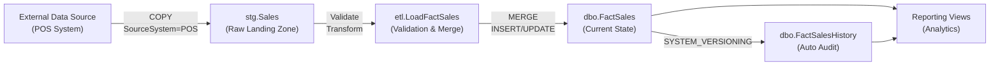
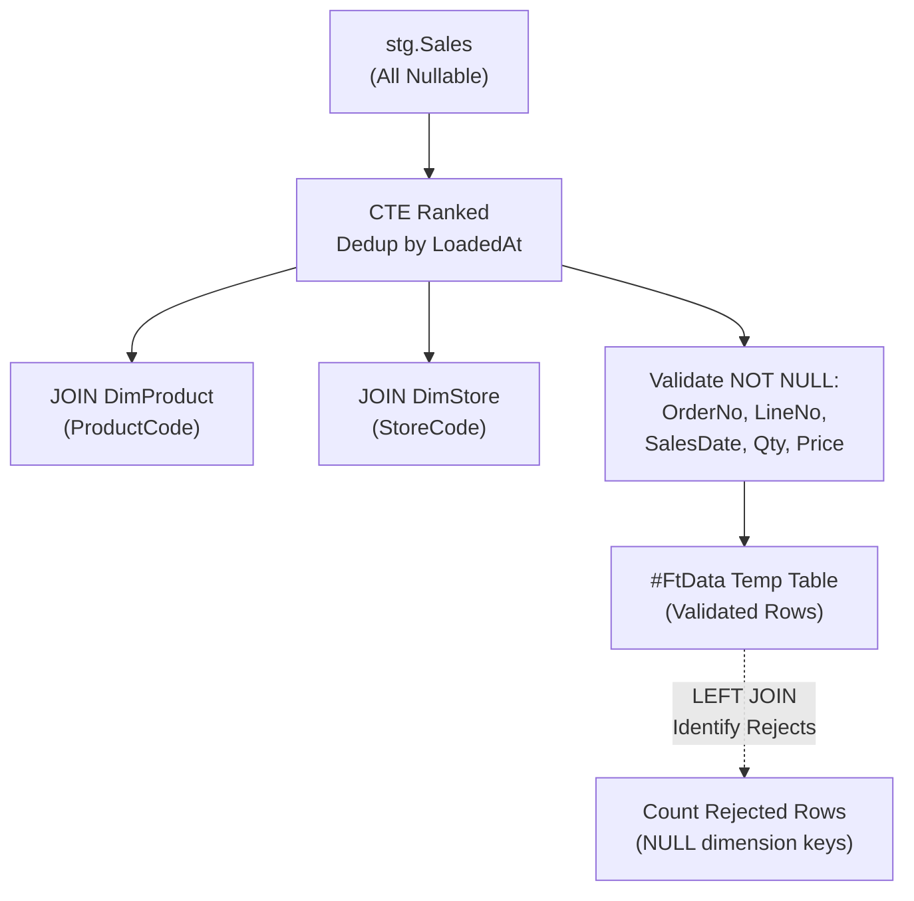
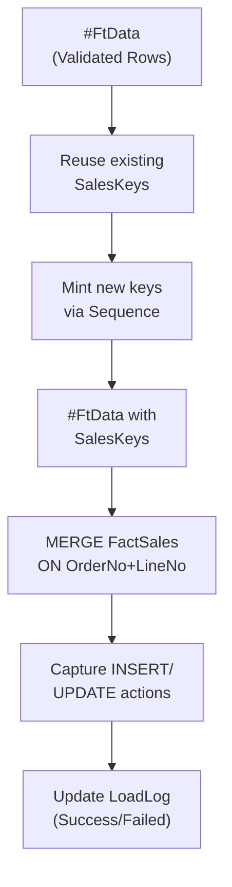

# RetailDW Data Model Analysis

**Analysis Date:** August 20, 2026  
**Scope:** SQL Server Retail Data Warehouse (RetailDW)  
**Focus Level:** Default (summary-level overview with design pattern deep-dive)

---

## Overview

### Purpose and Domain
The RetailDW data warehouse supports **operational retail sales analytics and reporting**. It serves as a centralized repository for point-of-sale (POS) transactions, enabling business teams to analyze sales performance by time period, product category, and store region. The system is designed for fast aggregation queries and maintains a complete audit trail of all data changes through temporal versioning.

### Architecture Pattern
**Star Schema with Temporal Versioning (Hybrid)**

- **Central Fact Table:** `dbo.FactSales` — sales line item transactions with temporal tracking
- **Dimension Tables:** `dbo.DimProduct`, `dbo.DimStore` — slowly-changing product and location hierarchies
- **Staging Layer:** `stg.Sales` — raw landing zone (all columns nullable, no validation)
- **Audit/Metadata:** `dbo.LoadLog`, `dbo.DeploymentHistory` — load outcomes and schema version control

The temporal approach (SQL Server System-Versioned Temporal Table) enables "time-travel" queries on historical fact data while maintaining current state without duplicating columns.

### Scope
| Category | Count | Details |
|----------|-------|---------|
| **Fact Tables** | 1 | `FactSales` (with automatic history tracking via `FactSalesHistory`) |
| **Dimension Tables** | 2 | `DimProduct`, `DimStore` |
| **Staging Tables** | 1 | `stg.Sales` (raw landing zone) |
| **Audit Tables** | 2 | `LoadLog` (load operations), `DeploymentHistory` (schema versions) |
| **ETL Procedures** | 3 | `LoadFactSales` (main load), `PurgeStaging` (retention cleanup), `usp_SalesSummaryByMonth` (reporting) |
| **Reporting Views** | 2 | `vw_DailySales`, `vw_WeeklySales` |
| **Functions** | 1 | `fn_SalesWeek` (ISO-8601 week definition) |
| **Sequences** | 1 | `SalesKeySequence` (surrogate key generator) |
| **Schemas** | 4 | `dbo` (core), `stg` (staging), `etl` (procedures), `reporting` (views) |

### Technology Stack
- **Database Engine:** SQL Server (implied 2016+)
- **Key Features:**
  - System-Versioned Temporal Tables (`PERIOD FOR SYSTEM_TIME`, automatic history maintenance)
  - MERGE statement for upsert operations
  - SQL Sequences for surrogate key generation
  - CTE-based validation and deduplication
  - Schema-based role/permission isolation
  - XACT_ABORT error handling pattern
  - UTC datetime tracking (SYSUTCDATETIME)

---

## Data Flows

### Flow Overview: High-Level Architecture

### ETL Processing: Validation & Transformation

### ETL Execution: Key Assignment & Merge

### Detailed ETL Flow: `etl.LoadFactSales` Procedure

**Input Parameters:**
- `@SourceSystem` (default: `'POS'`) — identifies the data source system
- `@LoadId` (OUTPUT) — unique load identifier for audit trail

**Step 1: Audit Logging (Outside Transaction)**

[See etl.LoadFactSales.sql lines 20–23](../RetailDW/Procedures/etl.LoadFactSales.sql#L20-L23)

*Rationale:* Ensures load attempt is recorded even if subsequent steps fail; auditable history persists.

**Step 2: Validation & Deduplication**

[See etl.LoadFactSales.sql lines 30–95](../RetailDW/Procedures/etl.LoadFactSales.sql#L30-L95)

Key logic:
- Create temporary table `#FtData` with schema matching fact table
- CTE `[Ranked]`: Deduplicates by (SalesOrderNo + SalesLineNo) → latest row wins
- JOINs staging rows to dimensions to resolve `ProductKey` and `StoreKey`
- Validates NOT NULL: SalesOrderNo, SalesLineNo, SalesDate, Quantity, UnitPrice
- Handles missing discount default
- Retrieves dimension `VatRate` for calculation
- Rejects rows with NULL dimension keys or missing required fields

**Step 3: Surrogate Key Assignment**

[See etl.LoadFactSales.sql lines 121–131](../RetailDW/Procedures/etl.LoadFactSales.sql#L121-L131)

*Rationale:* Reuses existing keys for known business keys (maintains historical continuity); mints new keys only for new rows.

**Step 4: Upsert via MERGE (Transactional)**

[See etl.LoadFactSales.sql lines 133–173](../RetailDW/Procedures/etl.LoadFactSales.sql#L133-L173)

Key logic:
- MERGE JOIN condition: `SalesOrderNo + SalesLineNo`

- WHEN NOT MATCHED BY TARGET: Insert new row
- HOLDLOCK hint: Prevents deadlocks in concurrent scenarios
- OUTPUT $action: Captures INSERT/UPDATE actions for auditing

**Step 5: Temporal Auto-Tracking**
- Fact table `dbo.FactSales` is System-Versioned Temporal:
  - `ValidFrom` DATETIME2(7) GENERATED ALWAYS AS ROW START
  - `ValidTo` DATETIME2(7) GENERATED ALWAYS AS ROW END
  - PERIOD FOR SYSTEM_TIME defined
  - SYSTEM_VERSIONING ON → auto-maintains `dbo.FactSalesHistory`
- **No explicit ETL logic needed:** SQL Server automatically:
  - Closes ValidTo of old row (previous version)
  - Opens ValidFrom for new row (current version)
  - Inserts closed row into FactSalesHistory

**Step 6: Load Audit Update**

[See etl.LoadFactSales.sql lines 175–183](../RetailDW/Procedures/etl.LoadFactSales.sql#L175-L183)

**Error Handling:**
- XACT_ABORT ON + TRY/CATCH block ensures:
  - Any runtime error rolls back transactional work
  - LoadLog is updated with FAILED status and error message
  - Original log entry from Step 1 persists (outside transaction)

### Supporting Procedures

**`etl.PurgeStaging` (Data Retention Cleanup)**

[See etl.PurgeStaging.sql](../RetailDW/Procedures/etl.PurgeStaging.sql)

Removes rows from `stg.Sales` older than retention window (default: 24 hours); parameterized by `@SourceSystem` to support multi-source purging. **Purpose:** Prevents staging table bloat; staging is intentionally temporary.

**`reporting.usp_SalesSummaryByMonth` (Monthly Reporting Consumer)**

[See reporting.usp_SalesSummaryByMonth.sql](../RetailDW/Procedures/reporting.usp_SalesSummaryByMonth.sql)

Aggregates `FactSales` by month, region, and product category. Accepts `@YearMonth` parameter (format: 'YYYY-MM'). **Purpose:** Feeds Excel refresh jobs and PowerBI monthly dashboards.

---

## Reporting Views

| View Name | Purpose | Dependencies | Refresh Logic | Use Case |
|-----------|---------|--------------|----------------|----------|
| `reporting.vw_DailySales` | Operational sales dashboard by date, region, product category | `dbo.FactSales`, `dbo.DimProduct`, `dbo.DimStore` | Real-time aggregation; materializes on every query via GROUP BY on SalesDate, Region, CategoryName | Daily operational KPIs: sales volume, gross/discount amounts, transaction counts |
| `reporting.vw_WeeklySales` | Weekly sales rollup by ISO-8601 week, region | `dbo.FactSales`, `dbo.DimStore`, `dbo.fn_SalesWeek` | Real-time aggregation; uses `fn_SalesWeek()` UDF to derive ISO week number; materializes on query | Weekly business reviews, trend analysis, regional performance comparison |

### View Design Notes

**`vw_DailySales`**

[See reporting.vw_DailySales.sql](../RetailDW/Views/reporting.vw_DailySales.sql)

GROUP BY dimensions: `SalesDate`, `Region`, `CategoryName`. Aggregates: Quantity, GrossAmount, DiscountAmount, LineCount. Business question: "How many units of each product category sold by region today?" 

**TODO (DPO-1187):** Missing net amount column (GrossAmount - DiscountAmount - VAT), which reporting team has requested. See **Observations** section.

**`vw_WeeklySales`**

[See reporting.vw_WeeklySales.sql](../RetailDW/Views/reporting.vw_WeeklySales.sql)

GROUP BY dimensions: Sales Year, `fn_SalesWeek()`, Region. Omits product category (higher aggregation level). Aggregates: Quantity, GrossAmount, LineCount. Business question: "What is the weekly sales performance by region for the year?" 

**Note:** Uses `dbo.fn_SalesWeek()` function to centralize week number logic (ensures consistency, ISO-8601 definition).

### Materialization Opportunities
- Both views materialize on demand (no indexed views or scheduled refreshes)
- For high-volume queries (>1M rows), consider:
  - Indexed view (requires unique clustered index)
  - Scheduled materialized view refresh (copy to summary table)
  - Aggregate table with daily/weekly snapshots

---

## Key Decisions & Patterns

| Pattern | Implementation | Rationale |
|---------|----------------|-----------|
| **Star Schema Simplicity** | 1 fact table (FactSales), 2 dimensions (DimProduct, DimStore), denormalized attributes (Region, CategoryName, VatRate in dimensions) | Optimizes query performance for typical business questions; simplified JOIN logic; reduces cardinality of dimension lookups; enables fast GROUP BY aggregations |
| **Temporal Table Versioning** | `dbo.FactSales` configured as System-Versioned Temporal Table with automatic `dbo.FactSalesHistory` maintenance; `ValidFrom`/`ValidTo` DATETIME2(7) auto-tracked by SQL Server | Provides audit trail of all fact changes without ETL logic; supports time-travel queries (e.g., "what was this row on date X?"); meets compliance/audit requirements; no data duplication needed |

| **Staging as Untrusted Landing Zone** | `stg.Sales` schema: all columns nullable (ProductCode, StoreCode, Quantity, etc.); no constraints; raw data copied as-is | Isolates source quality issues from warehouse. ETL procedure validates, not schema. Allows schema flexibility if source changes. Enables full rejection audit (invalid rows tracked, not lost). |
| **Business Key Deduplication** | CTE `[Ranked]` deduplicates by (SalesOrderNo, SalesLineNo) → latest row wins (LoadedAt DESC, StagingRowId DESC) | Sources often send duplicates (retries, network resends). Latest data assumed most correct. Single source of truth for each business key prevents fact table bloat. |
| **Surrogate Key Reuse & Minting** | UPDATE existing rows' SalesKeys from FactSales; INSERT NEXT VALUE FOR sequence only for new business keys | Maintains key stability—same business key always has same SalesKey across loads. Enables reliable historical joins. SEQUENCE with CACHE 100 provides performance (reduces log flushes). |
| **Audit Logging Outside Transaction** | LoadLog INSERT before BEGIN TRANSACTION; catches failed loads (unlike transactional logging) | Operational visibility: load attempts are recorded even if procedure crashes. XACT_ABORT ON + ROLLBACK clears only #FtData and MERGE work; LoadLog entry persists as "FAILED". Critical for SLA monitoring and root-cause analysis. |
| **Computed Gross Amount in ETL** | `(Quantity * UnitPrice) - DiscountAmount` calculated in procedure, stored in FactSales | Centralizes business logic (discount calculation rules) in one place. Derived facts improve query performance (avoids recalculation on every aggregate). Enables consistency checks (GrossAmount vs. source). |
| **Dimension Key Lookup + Validation** | ETL JOINs stg.Sales to DimProduct/DimStore by business codes (ProductCode, StoreCode); NULL dimension keys trigger rejection | Ensures referential integrity before MERGE (prevents orphaned facts). Rejects invalid product/store codes early (no downstream debugging). Enforces slow-change dimension strategy (dimension must exist before fact can reference it). |
| **MERGE HOLDLOCK Hint** | MERGE statement includes WITH (HOLDLOCK) | Prevents lock escalation deadlocks in concurrent scenarios. HOLDLOCK keeps row locks until end of statement, preventing other processes from interfering. |
| **Schema-Based Organization** | Separate schemas for layers: `stg` (landing), `etl` (procedures), `dbo` (warehouse), `reporting` (views) | Organizational clarity: code readers immediately understand data stage. Enables schema-level role-based access control (GRANT/DENY on schema). Supports separate deployments (e.g., staging refreshes without reporting interruption). |
| **Sequence with CACHE 100** | `dbo.SalesKeySequence` configured AS BIGINT START 1 INCREMENT 1 CACHE 100 NO CYCLE | CACHE 100 means SQL Server pre-allocates 100 sequence values in memory, reducing transaction log writes. For high-volume loads (thousands of rows), dramatically improves throughput. NO CYCLE means sequence never wraps (SalesKey always unique and growing). |
| **Dimension Codes as Business Keys** | ProductCode, StoreCode used as unique identifiers in dimensions; ProductKey, StoreKey as surrogate keys in facts | Decouples business semantics (meaningful codes) from database structure (stable numeric keys). Allows ProductCode to change without invalidating FactSales foreign keys. Supports disaster recovery (can rebuild dimension from business codes). |
| **Data Quality: Rejection Audit** | Explicit LEFT JOIN to count rejected rows; includes in LoadLog as RowsRejected | Transparency: business and ops teams see data quality metrics. Enables SLA monitoring (reject rate > 5% triggers alert). Rejected rows are identifiable (LEFT JOIN rows where dimension is NULL or required field is NULL). |
| **Deployment Versioning** | `dbo.DeploymentHistory` tracks schema changes (ScriptName, AppliedAt, AppliedBy, Notes); UNIQUE constraint on ScriptName prevents re-application | Audit trail for disaster recovery (know which scripts were applied, when, by whom). Prevents accidental re-runs of destructive scripts. Supports roll-forward debugging (trace schema state at any point in time). |
| **UTC Datetime Tracking** | All audit timestamps use SYSUTCDATETIME() (UTC) instead of GETDATE() (server local time) | Timezone-agnostic: no ambiguity in multi-region deployments. Consistent with cloud/Azure standards. Simplifies auditing (all times on same reference frame). |
| **Explicit NOT NULL on LoadId** | FactSales.LoadId is NOT NULL; foreign key to LoadLog.LoadId | Links every fact row to its load session. Enables audit queries ("which rows came from load X?"). Supports load lineage and troubleshooting (trace fact anomalies back to specific load). |

---

## Observations & Known Issues

### 1. **TODO: Missing Net Amount Column (DPO-1187)**
**Location:** [RetailDW/Views/reporting.vw_DailySales.sql](../RetailDW/Views/reporting.vw_DailySales.sql#L3)  
**Issue:** Reporting team requested net amount (GrossAmount - DiscountAmount - VAT), but view currently exposes only GrossAmount and DiscountAmount separately.  
**Impact:** Reporting users must manually calculate net amount in Excel, prone to error.  
**Recommendation:** Add computed `[NetAmount]` column to vw_DailySales GROUP BY results (GrossAmount - DiscountAmount - VAT%).

### 2. **Dimension Update Strategy Undefined**
**Location:** [RetailDW/Tables/dbo.DimProduct.sql](../RetailDW/Tables/dbo.DimProduct.sql), [RetailDW/Tables/dbo.DimStore.sql](../RetailDW/Tables/dbo.DimStore.sql)  
**Issue:** No explicit slowly-changing dimension (SCD) strategy defined. Tables include `IsActive` flag but no timestamp columns (EffectiveDate, EndDate) or version numbers.  
**Question:** 
- SCD Type 1 (overwrite)? → ProductName change overwrites old value, no history
- SCD Type 2 (version rows)? → Need Effective/End dates and version tracking
- Current behavior is unclear; ETL procedure rejects sales on non-existent keys, but what if product is renamed?

**Recommendation:** Document SCD strategy (likely Type 1 given absence of temporal columns). If Type 2 needed, add `EffectiveDate`, `EndDate`, `IsCurrent` to dimensions.

### 3. **No Partition or Compression on FactSales**
**Location:** [RetailDW/Tables/dbo.FactSales.sql](../RetailDW/Tables/dbo.FactSales.sql)  
**Issue:** At scale (millions of rows), FactSales could benefit from:
- **Partitioning by SalesDate** (annual or monthly): Improves MERGE performance, enables targeted purges of old data, speeds range queries
- **PAGE/ROW compression:** Temporal tables store redundant ValidFrom/ValidTo; compression saves ~30-50% space

**Current State:** None configured (appropriate for small/medium data volumes; flag for future consideration).

### 4. **View Materialization Not Optimized**
**Location:** [RetailDW/Views/reporting.vw_DailySales.sql](../RetailDW/Views/reporting.vw_DailySales.sql), [vw_WeeklySales.sql](../RetailDW/Views/reporting.vw_WeeklySales.sql)  
**Issue:** Both views aggregate on demand (materializing millions of FactSales rows on every query).  
**Observation:** Acceptable for interactive queries (<1M rows), but for high-concurrency dashboards or batch reports, consider:
- Indexed view (requires UNIQUE clustered index, SET NUMERIC_ROUNDABORT ON, schema binding)
- Materialized summary table (daily/weekly pre-aggregation, refreshed nightly)

### 5. **PurgeStaging Default Retention (24 hours) May Be Tight**
**Location:** [RetailDW/Procedures/etl.PurgeStaging.sql](../RetailDW/Procedures/etl.PurgeStaging.sql) (line 5)  
**Issue:** Default `@RetentionHours = 24` deletes staging rows after 1 day. If load failures occur, reprocessing may be difficult.  
**Recommendation:** 
- Consider 72-hour default (3 days) for complex troubleshooting windows
- Implement separate archive table for rejected rows (don't purge until reviewed)
- Monitor purge logs to ensure no data loss during incident recovery

### 6. **No Explicit Backup/Recovery Strategy**
**Location:** Cross-cutting (not in schema)  
**Observation:** Temporal table design enables point-in-time fact queries (via ValidFrom/ValidTo), but FactSalesHistory itself is not protected by `BACKUP DATABASE` against accidental DELETEs or media failure.  
**Recommendation:** Document database backup/restore strategy; temporal tables increase audit needs (ensure backups retention ≥ legal hold period).

### 7. **Sequence Caching Considerations**
**Location:** [RetailDW/Sequences/dbo.SalesKeySequence.sql](../RetailDW/Sequences/dbo.SalesKeySequence.sql)  
**Observation:** CACHE 100 is reasonable for typical loads, but if server crashes, cached sequence values are lost. Next sequence restart may skip values (e.g., restart at 500 instead of continuing from 550).  
**Impact:** SalesKey is not 100% continuous, but uniqueness is guaranteed (no duplicates).  
**Note:** This is standard SQL Server behavior and acceptable for fact table keys.

---

## Performance & Optimization Summary

### Indexing Strategy
| Table | Index Name | Type | Columns | Purpose | Notes |
|-------|-----------|------|---------|---------|-------|
| FactSales | PK_FactSales | Clustered | SalesKey | Primary key uniqueness, primary sort | BIGINT auto-increment via sequence |
| FactSales | UQ_FactSales_OrderLine | Unique NC | (SalesOrderNo, SalesLineNo) | Prevents duplicate business keys | Enables efficient MERGE join condition |
| FactSales | IX_FactSales_SalesDate | NC (Covering) | SalesDate INCLUDE (ProductKey, StoreKey, GrossAmount) | Date-range queries (views, reporting) | Includes measures to avoid fact table lookup |
| FactSalesHistory | IX_FactSalesHistory_Period | Clustered | (ValidTo DESC, ValidFrom ASC) | Time-travel queries; temporal joins | Optimizes BETWEEN ValidFrom/ValidTo |
| DimProduct | PK_DimProduct | Clustered | ProductKey | Primary key | Fast fact-to-dimension joins |
| DimProduct | UX_DimProduct_ProductCode | Unique NC | ProductCode | Business key uniqueness; dimension lookups in ETL | Supports INSERT-or-IGNORE patterns |
| DimStore | PK_DimStore | Clustered | StoreKey | Primary key | Fast fact-to-dimension joins |
| DimStore | UX_DimStore_StoreCode | Unique NC | StoreCode | Business key uniqueness; dimension lookups in ETL | Supports INSERT-or-IGNORE patterns |
| LoadLog | PK_LoadLog | Clustered | LoadId | Primary key; identity, no cycle | Sequential audit trail |
| LoadLog | IX_LoadLog_StartedAt | NC | StartedAt DESC | Load history queries (recent loads, SLA monitoring) | Descending order for latest-first queries |

### Optimization Opportunities (Future Considerations)

1. **FactSales Partitioning** (High Priority if table > 100M rows)
   - Partition by `DATEPART(YEAR, SalesDate)` or monthly
   - Benefits: Parallel MERGE, faster range scans, archival flexibility

2. **PAGE Compression** (Medium Priority)
   - Apply to FactSales, FactSalesHistory (high repeat: ValidFrom/ValidTo)
   - Estimate 30–50% space saving

3. **Indexed View for Daily Sales** (Medium Priority if view queries > 10K/day)
   - Requires schema binding, UNIQUE clustered index, NUMERIC_ROUNDABORT ON
   - Eliminates need to materialize full GROUP BY on each query

4. **Archive Strategy** (Low Priority, implement at 2–3 year data volume)
   - Move FactSalesHistory rows > 5 years to archive database
   - Retain for compliance, improve main DB query speed

5. **Query Stats & Plan Caching** (Ongoing)
   - Monitor DMVs (sys.dm_exec_query_stats, sys.dm_exec_requests) for slow views
   - Implement hints or statistics updates if cardinality estimation becomes stale

---

## Summary

**RetailDW is a well-designed, production-ready retail analytics data warehouse** with:

✅ **Clean star schema** optimized for reporting queries  
✅ **Comprehensive audit trail** via temporal tables and load logging  
✅ **Robust ETL validation** (dimension lookups, NULL checks, deduplication)  
✅ **Thoughtful error handling** (outside-transaction logging, XACT_ABORT, HOLDLOCK)  
✅ **Organized, layered architecture** (staging → ETL → warehouse → reporting)  
✅ **Scalable key management** (sequence caching, surrogate key reuse)  

⚠️ **Known gaps:**  
- Missing net amount reporting column (DPO-1187)  
- Dimension SCD strategy undefined  
- Materialization optimization deferred  
- Partition/compression for future scaling  

**Recommended Next Steps:**
1. Resolve DPO-1187 (add net amount column to vw_DailySales)
2. Document and formalize SCD strategy for dimensions
3. Monitor FactSales growth; plan partitioning at 100M+ rows
4. Implement materialized summary tables if view query latency becomes SLA issue
5. Formalize data retention and archive strategy
