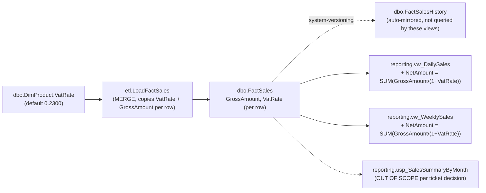

# Impact Analysis: DPO-1187 — NetAmount column on sales reporting views

## Data Flow Touchpoints

`NetAmount` is computed at query time from columns already present on
`FactSales`; no new column is added to any table.

## Impact Matrix

| Object | Required Change | Risk | Validation Method |
| --- | --- | --- | --- |
| [RetailDW/Views/reporting.vw_DailySales.sql](../RetailDW/Views/reporting.vw_DailySales.sql) | Add `SUM(f.[GrossAmount] / (1 + f.[VatRate]))` aggregated per row, cast to `DECIMAL(18,4)`, aliased `[NetAmount]` | Low — additive column, existing `GROUP BY` unchanged | Extend `tests/smoke-test.sql`; re-run `./scripts/dw.sh smoke` |
| [RetailDW/Views/reporting.vw_WeeklySales.sql](../RetailDW/Views/reporting.vw_WeeklySales.sql) | Same formula added | Low — additive column, existing `GROUP BY` unchanged | Same as above |
| [RetailDW/Tables/dbo.FactSales.sql](../RetailDW/Tables/dbo.FactSales.sql) | None — `GrossAmount` and `VatRate` already stored per row | N/A | N/A |
| [RetailDW/Tables/dbo.FactSalesHistory.sql](../RetailDW/Tables/dbo.FactSalesHistory.sql) | None — mirrored automatically by system-versioning, not touched by a view change | N/A | N/A |
| [RetailDW/Procedures/etl.LoadFactSales.sql](../RetailDW/Procedures/etl.LoadFactSales.sql) | None — already loads/MERGEs `GrossAmount` and `VatRate` | N/A | N/A |
| [RetailDW/Tables/dbo.DimProduct.sql](../RetailDW/Tables/dbo.DimProduct.sql) | None — source of `VatRate`, unchanged | N/A | N/A |
| [RetailDW/Procedures/reporting.usp_SalesSummaryByMonth.sql](../RetailDW/Procedures/reporting.usp_SalesSummaryByMonth.sql) | None — explicitly deferred (ticket decision #9) | Flag as follow-up ticket | N/A |
| [tests/smoke-test.sql](../tests/smoke-test.sql) | Add assertion(s) that `NetAmount` exists and matches expected value for seeded data | Low | `./scripts/dw.sh smoke` |

## Temporal / Logging / MERGE Impact

- `dbo.FactSales` / `dbo.FactSalesHistory` are **not** modified. `NetAmount` is
  a computed expression in the view, not a stored column, so there is no
  MERGE change in `etl.LoadFactSales` and no history backfill.
- Both views select only from current `dbo.FactSales` (no
  `FOR SYSTEM_TIME` clause), so `NetAmount` only ever reflects the *current*
  state of a row — it cannot answer a "what was NetAmount as of date X"
  question against `FactSalesHistory`. This directly bears on the ticket's
  open question about `FactSalesHistory` scope (see Open Questions).
- No `LoadLog` / audit impact — this is a read-side change only.

## Type, Nullability, and Source

- Source columns: `dbo.FactSales.GrossAmount` (`DECIMAL(18,4) NOT NULL`) and
  `dbo.FactSales.VatRate` (`DECIMAL(5,4) NOT NULL`, copied from
  `dbo.DimProduct.VatRate` at ETL load time).
- Formula (per ticket decision): `NetAmount = SUM(GrossAmount / (1 + VatRate))`,
  computed per row then aggregated within the view's existing `GROUP BY`.
- SQL Server's decimal division precision/scale rules can produce a result
  wider than `DECIMAL(18,4)` from a `DECIMAL(18,4) / DECIMAL(5,4)` operation.
  The view expression must explicitly `CAST`/`CONVERT` the result to
  `DECIMAL(18,4)` to guarantee the precision the ticket specifies — this is
  an implementation detail the ticket doesn't mention explicitly, called out
  here as a required part of "Required Change" rather than a business
  open question.
- `NetAmount` is not persisted/stored anywhere (query-time only), matching
  ticket decision.
- Nullability: `GrossAmount` and `VatRate` are both `NOT NULL`, so
  `NetAmount` is never `NULL` for any row that exists. A zero-row group
  simply produces no output row (same as today for `GrossAmount`) — no
  distinct "zero" or `NULL` handling is introduced by this change.
- `VatRate = 0` (VAT-exempt): `1 + VatRate = 1`, so there is no division-by-
  zero risk. `NetAmount` would equal `GrossAmount` for that row, which is
  arithmetically consistent — the ticket's remaining open question is
  whether that's the *business-intended* treatment, not a technical risk.

## Schema vs Data Migration

Metadata-only change: two `CREATE VIEW` definitions are updated. No
`ALTER TABLE`, no `Scripts/PostDeployment.sql` backfill, and no re-run of
`etl.LoadFactSales` is required — the formula applies to already-loaded
`FactSales` rows the moment the views are republished.

## Sequencing

No special deploy ordering is required. The view changes are independent of
ETL run cadence and of each other; either view can be published before the
other. Normal `.sqlproj` schema diff / publish flow (`./scripts/dw.sh build`
→ `./scripts/dw.sh publish`) covers this.

## Open Questions

### Decisions applied (defaults proposed and accepted for implementation — 2026-08-24)

1. **`VatRate = 0` (VAT-exempt products):** No special handling.
   `NetAmount = GrossAmount` falls out of the formula naturally
   (`GrossAmount / (1 + 0)`). Rationale: standard VAT accounting treats
   net = gross when no VAT applies; no separate flag/label is introduced.
2. **Zero-row date/region/category groups:** Accepted as-is, no change.
   A group with no matching rows simply doesn't appear in the output — same
   behavior `GrossAmount` already has today. Rationale: consistent with
   existing view semantics; inventing new behavior (e.g. emitting a zero
   row) would be unrequested scope.
3. **`FactSalesHistory` / point-in-time scope:** Treated as out of scope for
   this ticket. Both views continue to report current `FactSales` state
   only, same as `GrossAmount` today. Rationale: no existing reporting
   object in this codebase does point-in-time (`FOR SYSTEM_TIME`) reporting;
   adding it here would be new scope, not "add a column like the other
   one." **This is a business-scope default, not a technical fact — it
   still needs Mateusz Kulesza's explicit sign-off before implementation**,
   since if Finance later needs historical VAT reconciliation this becomes
   a real gap, not just an edge case.
4. **Explicit `DECIMAL(18,4)` cast:** Accepted. The view expression will use
   `CAST(SUM(f.[GrossAmount] / (1 + f.[VatRate])) AS DECIMAL(18,4))` rather
   than relying on SQL Server's implicit decimal-division scale rules.
   Rationale: pins precision to what the ticket specified; pure
   precision-safety measure, no behavior change for in-range values.

### Still requiring explicit sign-off before implementation

- Item 3 above (`FactSalesHistory` / point-in-time scope) — proceeding with
  the "out of scope" default, but flagged here so it is not mistaken for a
  confirmed business decision.
