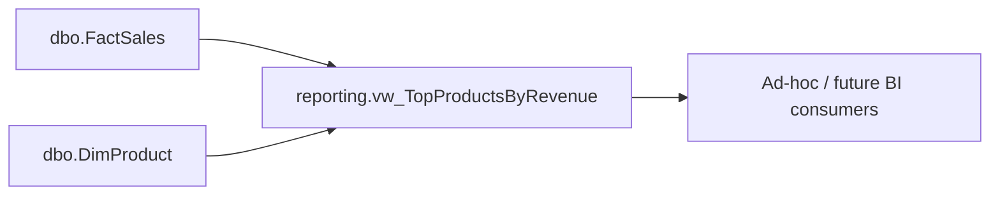

# Impact Analysis: Live reporting view — Top Products by Revenue

No formal ticket exists for this request; treated as an informal ad-hoc ask
per user confirmation. Proposed object: `reporting.vw_TopProductsByRevenue`
(schema/name confirmed with user), returning **all** products ranked by
revenue — no `TOP N` baked into the view, consumers apply their own limit.

## Data Flow Touchpoints

- Reads only from `dbo.FactSales` and `dbo.DimProduct` — same base tables
  already used by [reporting.vw_DailySales.sql](../RetailDW/Views/reporting.vw_DailySales.sql),
  [reporting.vw_WeeklySales.sql](../RetailDW/Views/reporting.vw_WeeklySales.sql), and
  [reporting.usp_SalesSummaryByMonth.sql](../RetailDW/Procedures/reporting.usp_SalesSummaryByMonth.sql).
- No new columns, no writes, no MERGE involvement.

## Impact Matrix

| Object | Required Change | Risk | Validation Method |
| ------ | ---------------- | ---- | ------------------ |
| `RetailDW/Views/reporting.vw_TopProductsByRevenue.sql` (new) | Create view: `GROUP BY ProductCode, ProductName`, `SUM(GrossAmount) AS TotalRevenue`, `SUM(Quantity) AS TotalQuantitySold`, joined to `dbo.FactSales`/`dbo.DimProduct` | Low — additive, read-only | New assertion in `tests/smoke-test.sql`; manual `SELECT TOP 10 ... ORDER BY TotalRevenue DESC` |
| `RetailDW/Tables/dbo.FactSales.sql` | None | None — read-only consumer | n/a |
| `RetailDW/Tables/dbo.DimProduct.sql` | None | None — read-only consumer | n/a |
| `tests/smoke-test.sql` | Add `reporting.vw_TopProductsByRevenue` to the "objects exist" list (section 1) and a queryability check (section 7 pattern) | Low | Re-run `./scripts/dw.sh smoke` |
| `RetailDW/Security/reporting.sql` | None found — file only contains `CREATE SCHEMA [reporting] AUTHORIZATION [dbo]`; no per-object `GRANT` statements exist in this repo for other reporting objects | None (see Open Questions) | n/a |
| `etl.LoadFactSales`, `stg.Sales`, `dbo.FactSalesHistory` | None — not touched, view is read-only downstream | None | n/a |

## Temporal / Logging / MERGE Impact

- The view does not participate in `FactSales` system-versioning and does not
  write to `FactSalesHistory`. Standard views over a temporal table query the
  current (non-history) rows only, same as `vw_DailySales`/`vw_WeeklySales` —
  no special `FOR SYSTEM_TIME` clause needed unless a future requirement asks
  for point-in-time revenue.
- Not referenced by `etl.LoadFactSales`'s `MERGE` — no change to what gets
  versioned into history.

## Type, Nullability, and Source

- `TotalRevenue`: `SUM(FactSales.GrossAmount)`, source column is
  `DECIMAL(18,4) NOT NULL`; `SUM` result type/precision matches existing
  pattern in `vw_DailySales`/`vw_WeeklySales` (no explicit `CAST` needed,
  unlike the `NetAmount` division case).
- `TotalQuantitySold`: `SUM(FactSales.Quantity)`, source `DECIMAL(18,4) NOT NULL`.
- `ProductCode` / `ProductName`: pass-through from `dbo.DimProduct`, both
  `NOT NULL`.
- No VAT/NetAmount logic requested or included — "revenue" is `GrossAmount`,
  consistent with the earlier ad-hoc query in
  [reports/top-10-products-by-revenue.md](../reports/top-10-products-by-revenue.md).
- No new nullability concerns: every source column is `NOT NULL`, and the
  inner joins (`ProductKey` FK is `NOT NULL` and enforced) mean no row loss.

## Schema vs Data Migration

**Change Shape:** `view-only`

## Sequencing

1. Add `RetailDW/Views/reporting.vw_TopProductsByRevenue.sql`.
2. Update `tests/smoke-test.sql` to assert the view exists and is queryable.
3. Publish (`./scripts/dw.sh build` then `./scripts/dw.sh publish`) — no ETL
   re-run needed since no stored data changes.
4. Run `./scripts/dw.sh smoke` to confirm.

No dependency ordering conflicts: the view only requires `dbo.FactSales` and
`dbo.DimProduct`, which already exist and are already deployed.

## Open Questions

- Should `INNER JOIN` (current behavior — products with zero sales excluded)
  or `LEFT JOIN` from `dbo.DimProduct` (include zero-revenue products with
  `TotalRevenue = 0`) be used? The ad-hoc report used `INNER JOIN`.
- Should the view filter to `DimProduct.IsActive = 1` only, or include
  discontinued products that still have historical sales? Existing
  `vw_DailySales`/`vw_WeeklySales`/`usp_SalesSummaryByMonth` do not filter on
  `IsActive`, so the default assumption (pending confirmation) is to match
  that precedent and not filter.
- No `GRANT` statements exist in `RetailDW/Security/reporting.sql` or
  elsewhere in the repo for existing reporting views/procedures — is
  permissioning handled outside this project (e.g. manually, or via a
  separate role-assignment step not tracked in source control)? If so, no
  action needed here; flagging so it isn't silently assumed.
- Confirmed with user: no ticket exists for this request; treated as an
  informal, already-agreed ad-hoc ask rather than running full
  `ticket-clarification`.

## Validation / Testing

- Add the new view name to the "objects exist" check in
  [tests/smoke-test.sql](../tests/smoke-test.sql) (section 1 pattern) and a
  `SELECT COUNT(*) FROM [reporting].[vw_TopProductsByRevenue]` in the
  "reporting layer is queryable" check (section 7 pattern).
- Manually verify `SELECT TOP 10 * FROM reporting.vw_TopProductsByRevenue
  ORDER BY TotalRevenue DESC` reproduces the same 10 rows/values as
  [reports/top-10-products-by-revenue.md](../reports/top-10-products-by-revenue.md).
- Re-run `./scripts/dw.sh smoke` after publish.
