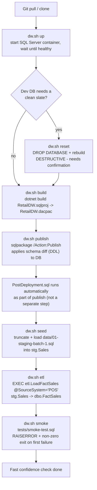
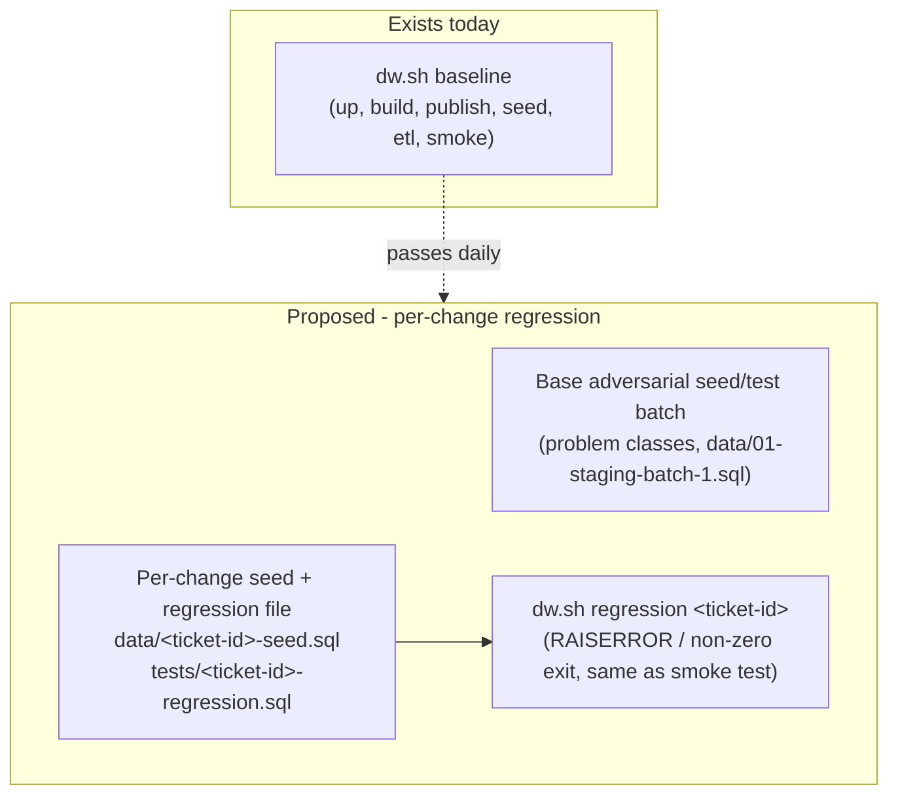

# Schema dev workflow

End-to-end workflow for making a schema/data change in `RetailDW`, from pulling
latest code to opening a pull/merge request. Two tiers of verification are
involved: a fast **baseline** loop you run constantly while developing, and a
slower **regression** tier intended to run less often (e.g. overnight / in CI).

## 1. Baseline (fast, run many times)

Everything in this tier is already automated by
[scripts/dw.sh](../scripts/dw.sh); `./scripts/dw.sh baseline` chains
`up → build → publish → seed → etl → smoke` in one command. See
[docs/deployment-publish-test-steps.md](./deployment-publish-test-steps.md)
for the authoritative step-by-step reference.

| Step | Command | What it does |
|---|---|---|
| Get code | `git pull` / `git clone` | Latest source. |
| Start dev DB | `./scripts/dw.sh up` | Starts the Docker container, polls with `sqlcmd -Q "SELECT 1"` until ready. |
| Reset (optional) | `./scripts/dw.sh reset` | Drops the **whole database** and rebuilds it. Destructive — needs explicit confirmation per [AGENTS.md](../AGENTS.md). |
| Build | `./scripts/dw.sh build` | `dotnet build RetailDW.sqlproj` → produces [RetailDW.dacpac](../RetailDW/bin/Debug/RetailDW.dacpac). `sqlpackage` is not used at this step. |
| Publish (DDL) | `./scripts/dw.sh publish` | `sqlpackage /Action:Publish` applies the schema diff to the database. [Scripts/PostDeployment.sql](../RetailDW/Scripts/PostDeployment.sql) runs automatically as part of this — it is not a separate CLI step, and it must stay idempotent since it runs on every publish. |
| Seed | `./scripts/dw.sh seed` | Truncates and loads [data/01-staging-batch-1.sql](../data/01-staging-batch-1.sql) into `stg.Sales` (raw/dirty staging rows, not yet in the warehouse). |
| ETL | `./scripts/dw.sh etl` | `EXEC etl.LoadFactSales @SourceSystem = N'POS'` moves staged rows into `dbo.FactSales`. Required before the smoke test, since it asserts on fact-table row counts and load status. |
| Smoke test | `./scripts/dw.sh smoke` | Runs [tests/smoke-test.sql](../tests/smoke-test.sql): objects exist, `FactSales` is system-versioned, dimensions are seeded, baseline load counts match, dedup picked the newest row, NULL discounts coerced to 0, reporting layer is queryable. Fails loudly (`RAISERROR`, non-zero exit) on first failure. |

## 2. Per-change regression tests (run after each schema change)

The `dw.sh regression` command and naming convention exist; the per-change
files themselves are created on demand, one pair per ticket, by the
`schema-change-tests-suite` skill. Today the only files that exist are the
base fixture ([data/01-staging-batch-1.sql](../data/01-staging-batch-1.sql))
and [tests/smoke-test.sql](../tests/smoke-test.sql) — no
`data/<ticket-id>-seed.sql` / `tests/<ticket-id>-regression.sql` pair has been
created yet.

Confirmed design decisions:

1. **Problem-class coverage** — the base seed batch
   ([data/01-staging-batch-1.sql](../data/01-staging-batch-1.sql)) stays a
   single larger adversarial dataset covering all problem classes at once
   (duplicate lines, NULL discounts, out-of-range dates, currency
   mismatches, etc.), not one staging batch per case.
2. **Deployment/version regression** — **superseded 2026-08-24 by the
   `schema-change-tests-suite` skill.** Regression cases for validating
   each new schema-version deployment now live in their **own** seed +
   test file per ticket/change (`data/<ticket-id>-seed.sql` +
   `tests/<ticket-id>-regression.sql`), separate from both the base
   problem-class batch and `tests/smoke-test.sql` — not folded into one
   combined dataset as previously decided here. Still not a separate chain
   of historical dacpacs.
3. **Trigger/cadence (CI/CD)** — **out of scope for this repo/doc.** CI/CD
   wiring (e.g. scheduling an overnight run across all per-change
   regression files) is set up elsewhere.
4. **Pass/fail contract** — same convention as
   [tests/smoke-test.sql](../tests/smoke-test.sql): `RAISERROR`, non-zero
   exit, printed diagnostics, per the testing rules in
   [docs/team-conventions.md](./team-conventions.md).
5. **Data volume** — not a bigger seed. Same scale of data, but more test
   cases with deeper checks and special/edge cases beyond the happy path
   per change.

Resolved: naming is `data/<ticket-id>-seed.sql` + a matching
`tests/<ticket-id>-regression.sql`, run together via
`./scripts/dw.sh regression <ticket-id>` (loads the seed file, runs
`etl.LoadFactSales`, then runs the test file). See the
`schema-change-tests-suite` skill for the full procedure — discovering
non-happy-path scenarios, designing the seed rows, and deciding whether the
base batch also needs updating.

## 3. Write / update documentation

- Update any doc affected by the change: object-level comments, entries in
  [docs/team-conventions.md](./team-conventions.md), the relevant
  `analyses/impact-analysis-*.md` file, and this workflow doc if the process
  itself changed.
- If the change affects existing data or is a temporal/MERGE change, confirm
  the rollback/backfill note was captured (per the required plan format in
  [AGENTS.md](../AGENTS.md)).
- Do not create new markdown docs unless the change genuinely needs one —
  prefer updating existing docs in place.

## 4. Prepare pull/merge request

- **Branch**: create a feature branch off the latest `main`/default branch
  before committing (no repo-specific branch-naming convention is documented
  yet — confirm with the team if one exists before inventing a scheme).
- **Commit**: commit schema/project files, tests, and doc updates together so
  the PR is self-contained and reviewable as one unit.
- **Push**: push the branch and open the pull/merge request.
- **PR description** should reference: the ticket, the objects touched, the
  test plan that was run (baseline pass/fail, regression tier if applicable),
  and any rollback/backfill notes — mirroring the required plan format in
  [AGENTS.md](../AGENTS.md).
- No destructive git operations (force-push, history rewrite on shared
  branches) without explicit confirmation, per [AGENTS.md](../AGENTS.md).
